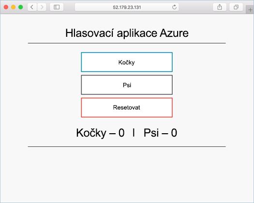

# <a name="tutorial-prepare-an-application-for-azure-kubernetes-service-aks"></a>Kurz: Příprava aplikace pro službu Azure Kubernetes Service (AKS)

V tomto kurzu, který je první částí sedmidílné série, se připraví vícekontejnerová aplikace pro použití v Kubernetes. Pomocí existujících vývojových nástrojů, jako je Docker Compose, se aplikace místně sestaví a otestuje. Získáte informace o těchto tématech:

> [!div class="checklist"]
> * Klonování zdroje ukázkové aplikace z GitHubu
> * Vytvoření image kontejneru ze zdroje ukázkové aplikace
> * Test vícekontejnerové aplikace v místním prostředí Dockeru

Po dokončení bude ve vašem místním vývojovém prostředí spuštěná následující aplikace:



V následujících kurzech se image kontejneru nahraje do služby Azure Container Registry a pak se nasadí do clusteru AKS.

## <a name="before-you-begin"></a>Než začnete

V tomto kurzu se předpokládá základní znalost klíčových konceptů Dockeru, jako jsou kontejnery, image kontejnerů a příkazy `docker`. Základní informace o kontejnerech najdete v článku [Get started with Docker][docker-get-started] (Začínáme s Dockerem).

K dokončení tohoto kurzu potřebujete místní vývojové prostředí pro Docker. Docker nabízí balíčky pro konfiguraci Dockeru v systému [Mac][docker-for-mac], [Windows][docker-for-windows] nebo [Linux][docker-for-linux].

Azure Cloud Shell neobsahuje součásti Dockeru nutné pro dokončení všech kroků v těchto kurzech. Proto doporučujeme použít úplné vývojové prostředí pro Docker.

## <a name="get-application-code"></a>Získání kódu aplikace

Ukázkovou aplikací používanou v tomto kurzu je základní hlasovací aplikace. Aplikace se skládá z front-end webové součásti a back-end instance Redis. Webová součást je zabalená do vlastní image kontejneru. Instance Redis využívá nezměněnou image z Docker Hubu.

Pomocí příkazu [git][] naklonujte ukázkovou aplikaci do svého vývojového prostředí:

```console
git clone https://github.com/Azure-Samples/azure-voting-app-redis.git
```

Změňte adresáře tak, abyste pracovali v naklonovaném adresáři.

```console
cd azure-voting-app-redis
```

Tento adresář obsahuje zdrojový kód aplikace, předem vytvořený soubor Docker Compose a soubor manifestu Kubernetes. Tyto soubory se používají v celé této sérii kurzů.

## <a name="create-container-images"></a>Vytváření imagí kontejneru

[Docker Compose][docker-compose] je možné použít k automatizaci sestavování imagí kontejnerů a nasazování vícekontejnerových aplikací.

Pomocí ukázkového souboru `docker-compose.yaml` vytvořte image kontejneru, stáhněte image Redis a spusťte aplikaci:

```console
docker-compose up -d
```

Po dokončení můžete vytvořené image zobrazit pomocí příkazu [docker images][docker-images]. Stáhly se nebo se vytvořily tři image. Image *azure-vote-front* obsahuje front-end aplikaci a jako základ využívá image `nginx-flask`. Image `redis` slouží ke spuštění instance Redis.

```
$ docker images

REPOSITORY                   TAG        IMAGE ID            CREATED             SIZE
azure-vote-front             latest     9cc914e25834        40 seconds ago      694MB
redis                        latest     a1b99da73d05        7 days ago          106MB
tiangolo/uwsgi-nginx-flask   flask      788ca94b2313        9 months ago        694MB
```

Spuštěním příkazu [docker ps][docker-ps] zobrazte spuštěné kontejnery:

```
$ docker ps

CONTAINER ID        IMAGE             COMMAND                  CREATED             STATUS              PORTS                           NAMES
82411933e8f9        azure-vote-front  "/usr/bin/supervisord"   57 seconds ago      Up 30 seconds       443/tcp, 0.0.0.0:8080->80/tcp   azure-vote-front
b68fed4b66b6        redis             "docker-entrypoint..."   57 seconds ago      Up 30 seconds       0.0.0.0:6379->6379/tcp          azure-vote-back
```

## <a name="test-application-locally"></a>Testování aplikace v místním prostředí

Pokud chcete zobrazit spuštěnou aplikaci, zadejte v místním webovém prohlížeči http://localhost:8080. Načte se ukázková aplikace, jak je znázorněno v následujícím příkladu:


## <a name="clean-up-resources"></a>Vyčištění prostředků

Teď, když jste ověřili funkčnost aplikace, můžete zastavit a odebrat spuštěné kontejnery. Neodstraňujte image kontejnerů – v dalším kurzu se image *azure-vote-front* nahraje do instance služby Azure Container Registry.

Zastavte a odeberte instance kontejnerů a související prostředky pomocí příkazu [docker-compose down][docker-compose-down]:

```console
docker-compose down
```

Po odebrání místní aplikace budete mít image Dockeru obsahující aplikaci Azure Vote *azure-front-front*, kterou můžete použít v dalším kurzu.

## <a name="next-steps"></a>Další kroky

V tomto kurzu se otestovala aplikace a vytvořily se pro ni image kontejnerů. Naučili jste se tyto postupy:

> [!div class="checklist"]
> * Klonování zdroje ukázkové aplikace z GitHubu
> * Vytvoření image kontejneru ze zdroje ukázkové aplikace
> * Test vícekontejnerové aplikace v místním prostředí Dockeru

V dalším kurzu se dozvíte, jak ukládat image do služby Azure Container Registry.

> [!div class="nextstepaction"]
> [Nahrávání imagí do služby Azure Container Registry][aks-tutorial-prepare-acr]

<!-- LINKS - external -->
[docker-compose]: https://docs.docker.com/compose/
[docker-for-linux]: https://docs.docker.com/engine/installation/#supported-platforms
[docker-for-mac]: https://docs.docker.com/docker-for-mac/
[docker-for-windows]: https://docs.docker.com/docker-for-windows/
[docker-get-started]: https://docs.docker.com/get-started/
[docker-images]: https://docs.docker.com/engine/reference/commandline/images/
[docker-ps]: https://docs.docker.com/engine/reference/commandline/ps/
[docker-compose-down]: https://docs.docker.com/compose/reference/down
[git]: https://git-scm.com/downloads

<!-- LINKS - internal -->
[aks-tutorial-prepare-acr]: ./tutorial-kubernetes-prepare-acr.md