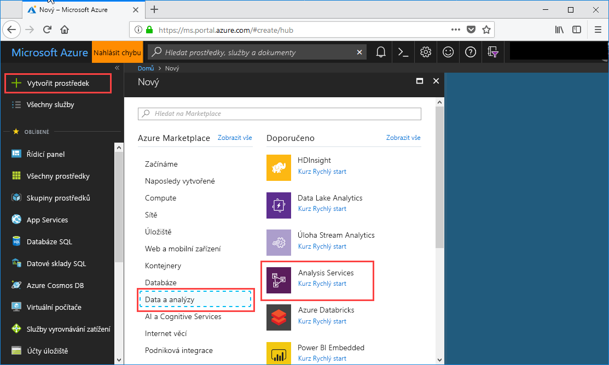
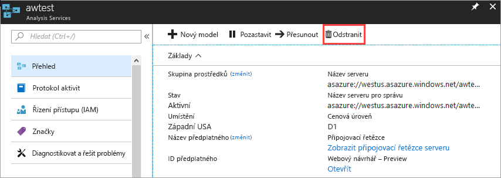

# Rychlý start: Vytvoření serveru – portál

Tento rychlý start popisuje, jak pomocí portálu vytvořit prostředek serveru služby Analysis Services v předplatném Azure.

## Požadavky 

* **Předplatné Azure**: Navštivte [bezplatnou zkušební verzi Azure](https://azure.microsoft.com/offers/ms-azr-0044p/) vytvoření účtu služby.
* **Azure Active Directory**: Předplatné musí být přidružen k tenantovi Azure Active Directory. Zároveň musíte být přihlášeni k Azure pod účtem v této službě Azure Active Directory. Další informace najdete v tématu [Ověřování a uživatelská oprávnění](analysis-services-manage-users.md).

## Přihlášení k webu Azure Portal 

[Přihlaste se k portálu](https://portal.azure.com)

## Vytvoření serveru

1. Klikněte na tlačítko **+ vytvořit prostředek** > **Analytics** > **služby Analysis Services**.

    

2. V části **Analysis Services** vyplňte požadovaná pole a pak stiskněte **Vytvořit**.
   
   * **Název serveru**: Zadejte jedinečný název, který slouží k odkazování na serveru.
   * **Předplatné**: Vyberte předplatné, které budou přidruženy tento server.
   * **Skupina prostředků**: Vytvořte novou skupinu prostředků nebo vyberte ten, který už máte. Skupiny prostředků jsou navržené tak, aby pomáhaly se správou kolekcí prostředků Azure. Další informace najdete v tématu věnovaném [skupinám prostředků](../azure-resource-manager/resource-group-overview.md).
   * **Umístění**: Toto umístění datového centra Azure je hostitelem serveru. Zvolte umístění co nejblíže vaší největší uživatelské základně.
   * **Cenová úroveň**: Vyberte cenovou úroveň. Pokud provádíte testování a chcete nainstalovat ukázkovou modelovou databázi, vyberte bezplatnou úroveň **D1**. Další informace najdete v tématu [Ceny služby Azure Analysis Services](https://azure.microsoft.com/pricing/details/analysis-services/). 
   * **Správce**: Ve výchozím nastavení bude jednat o účet, ke kterému jste přihlášeni s. Můžete zvolit jiný účet z vaší služby Azure Active Directory.
   * **Nastavení úložiště zálohování**: Volitelné. Pokud už máte [účet úložiště](../storage/common/storage-introduction.md), můžete ho zadat jako výchozí účet úložiště pro zálohování modelové databáze. Později můžete zadat také nastavení [zálohování a obnovení](analysis-services-backup.md).
   * **Vypršení platnosti klíče úložiště**: Volitelné. Zadejte dobu platnosti klíče úložiště.

Vytvoření serveru obvykle trvá necelou minutu. Pokud jste vybrali možnost **Přidat na portál**, přejděte na portál a prohlédněte si nový server. Případně přejděte do části **Všechny služby** > **Analysis Services** a zkontrolujte, jestli je server připravený.

## Vyčištění prostředků

Pokud už server nepotřebujete, odstraňte ho. Na stránce **Přehled** vašeho serveru klikněte na **Odstranit**. 

 

## Další postup
V tomto rychlém startu jste zjistili, jak vytvořit server v předplatném Azure. Když teď máte server, můžete ho zabezpečit nakonfigurováním (volitelné) brány firewall serveru. Na server také můžete přímo z portálu přidat základní ukázkový datový model. Na ukázkovém modelu se naučíte konfigurovat role modelové databáze a testovat připojení klientů. Ve výuce pokračujte kurzem, ve kterém přidáte ukázkový model.

> [!div class="nextstepaction"]
> [Rychlý start: Konfigurace brány firewall serveru – portál](analysis-services-qs-firewall.md)   
> [!div class="nextstepaction"]
> [Kurz: Přidání ukázkový model na server](analysis-services-create-sample-model.md)
