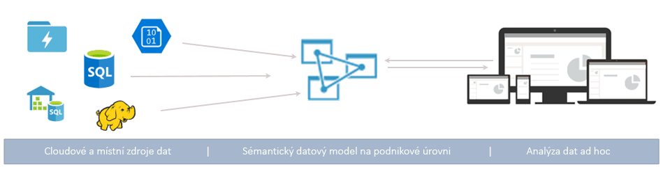
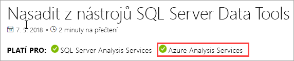
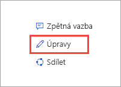

# Co je služba Azure Analysis Services?

Azure Analysis Services je plně spravovaná platforma jako služba (PaaS), která poskytuje datové modely na podnikové úrovni v cloudu. Můžete používat pokročilé funkce mashupu a modelování pro kombinování dat z více zdrojů dat, definovat metriky a zabezpečit svá data v jediném důvěryhodném tabulkovém sémantickém datovém modelu. Datový model poskytuje uživatelům snadnější a rychlejší způsob procházení velkých objemů dat pro analýzu dat ad hoc.

**Video:** Podívejte se na video s [přehledem služby Azure Analysis Services](https://sec.ch9.ms/ch9/d6dd/a1cda46b-ef03-4cea-8f11-68da23c5d6dd/AzureASoverview_high.mp4) a zjistěte, jak služba Azure Analysis Services zapadá do celkových možností BI od Microsoftu.

## Rychlé zprovoznění

Na webu Azure Portal můžete [vytvořit server](analysis-services-create-server.md) během několika minut. A pomocí PowerShellu a [šablon](../azure-resource-manager/resource-manager-create-first-template.md) Azure Resource Manageru můžete vytvářet servery s využitím deklarativní šablony. S jedinou šablonou můžete nasadit prostředky serveru společně s dalšími komponentami Azure, jako jsou účty úložiště nebo služba Azure Functions. 

**Video:** Podívejte se na video o [automatizaci nasazení](https://channel9.msdn.com/series/Azure-Analysis-Services/AzureAnalysisServicesAutomation), ve kterém se dozvíte více o tom, jak můžete urychlit vytvoření serveru pomocí služby Azure Automation.

Azure Analysis Services se integruje s mnoha službami Azure a umožňuje tak sestavovat sofistikovaná analytická řešení. Integrace s [Azure Active Directory](../active-directory/fundamentals/active-directory-whatis.md) poskytuje zabezpečený přístup na základě role k důležitým datům. Můžete provést integraci s kanály [Azure Data Factory](../data-factory/introduction.md) vložením aktivity, která načte data do modelu. Můžete použít služby [Azure Automation](../automation/automation-intro.md) a [Azure Functions](../azure-functions/functions-overview.md) k prosté orchestraci modelů pomocí vlastního kódu. 

## Správná úroveň kdykoli potřebujete

Služba Azure Analysis Services je dostupná v úrovních **Developer**, **Basic** a **Standard**. Ceny plánů na jednotlivých úrovních se liší podle výpočetního výkonu, jednotek QPU a velikosti paměti. Při vytváření serveru si vyberete plán na nějaké úrovni. Plány můžete měnit na vyšší nebo nižší v rámci stejné úrovně nebo upgradovat na vyšší úroveň, není však možné downgradovat z vyšší úrovně na nižší.

### Úroveň Developer

Tato úroveň se doporučuje pro scénáře testování, vývoje a vyhodnocení. Jeden plán zahrnuje stejné funkce jako úroveň Standard, ale s omezením výkonu, jednotek QPU a velikosti paměti. Škálování repliky dotazu na více instancí pro tuto úroveň *není k dispozici*. Tato úroveň nenabízí smlouvu SLA.

|Plánování  |Jednotky QPU  |Paměť (GB)  |
|---------|---------|---------|
|D1    |    20     |    3     |

### Úroveň Basic

Tato úroveň se doporučuje pro produkční řešení s menšími tabulkovými modely, omezenou souběžností uživatelů a jednoduchými požadavky na obnovení dat. Škálování repliky dotazu na více instancí pro tuto úroveň *není k dispozici*. Perspektivy, větší počet oddílů a funkce tabulkového modelu DirectQuery se v této úrovni *nepodporují*.  

|Plánování  |Jednotky QPU  |Paměť (GB)  |
|---------|---------|---------|
|B1    |    40     |    10     |
|B2    |    80     |    20     |

### Úroveň Standard

Tato úroveň je pro důležité produkční aplikace, které vyžadují elastickou uživatelskou souběžnost a využívají datové modely s rychlým růstem. Podporuje pokročilou aktualizaci dat pro aktualizace datových modelů téměř v reálném čase a podporuje veškeré funkce tabulkového modelování.

|Plánování  |Jednotky QPU  |Paměť (GB)  |
|---------|---------|---------|
|S1    |    40     |    10     |
|S2    |    100     |    25     |
|S3    |    200     |    50     |
|S4    |    400     |    100     |
|S8*    |    320     |    200     |
|S9*    |    640    |    400     |

\* Není dostupné ve všech oblastech.  

## Dostupnost podle oblasti

Služba Azure Analysis Services je podporována ve všech zemích/oblastech po celém světě. Dostupnost podporovaných plánů a replik dotazů závisí na vámi zvolené oblasti. Dostupnost plánů a replik dotazů se může měnit v závislosti na požadavcích a dostupných prostředcích v jednotlivých oblastech. 

### Amerika

|Oblast  | Podporované plány | Repliky dotazů (pouze plány Standard) |
|---------|---------|:---------:|
|Brazílie – jih     |    B1, B2, S0, S1, S2, S4, D1     |     1    |
|Kanada – střed    |     B1, B2, S0, S1, S2, S4, D1    |     1    |
|USA – východ     |     B1, B2, S0, S1, S2, S4, D1    |    1     |
|Východní USA 2     |     B1, B2, S0, S1, S2, S4, D1   S8, S9   |    7 1    |
|Střed USA – sever     |     B1, B2, S0, S1, S2, S4, D1     |    1     |
|USA – střed     |    B1, B2, S0, S1, S2, S4, D1     |    1     |
|Střed USA – jih     |    B1, B2, S0, S1, S2, S4, D1     |    1     |
|Západní střed USA   |     B1, B2, S0, S1, S2, S4, D1    |    3     |
|USA – západ     |    B1, B2, S0, S1, S2, S4, D1   S8, S9   |    7 2  |
|Západní USA 2    |    B1, B2, S0, S1, S2, S4, D1    S8, S9  |    3 1     |

### Evropa

|Oblast  | Podporované plány | Repliky dotazů (pouze plány Standard) |
|---------|---------|:---------:|
|Severní Evropa     |    B1, B2, S0, S1, S2, S4, D1      |    7     |
|Velká Británie – jih   |    B1, B2, S0, S1, S2, S4, D1      |     1    |
|Západní Evropa     |    B1, B2, S0, S1, S2, S4, D1    S8, S9    |    7 1     |

### Asie a Tichomoří 

|Oblast  | Podporované plány | Repliky dotazů (pouze plány Standard) |
|---------|---------|:---------:|
|Austrálie – jihovýchod     | B1, B2, S0, S1, S2, S4, D1       |    1     |
|Austrálie – východ     |    B1, B2, S0, S1, S2, S4     S8, S9    |    3 1     |
|Japonsko – východ  |   B1, B2, S0, S1, S2, S4, D1       |    1     |
|Jihovýchodní Asie     |     B1, B2, S0, S1, S2, S4, S8, S9, D1     |   1      |
|Indie – západ     |    B1, B2, S0, S1, S2, S4, D1     |    1     |

## Škálování podle vašich potřeb

### Vertikální navýšení/snížení kapacity, pozastavení a obnovení

Zvětšete, zmenšete nebo pozastavte svůj server. Použijte web Azure Portal nebo mějte úplnou kontrolu za běhu pomocí PowerShellu. Platíte jenom za to, co používáte.  

### Škálování prostředků na více instancí pro zajištění rychlých odpovědí na dotazy

Díky škálování na více instancí se dotazy klientů distribuují napříč několika *replikami dotazů* ve fondu dotazů. Repliky dotazů obsahují synchronizované kopie vašich tabulkových modelů. Rozprostřením zátěže dotazů je možné snížit dobu odezvy u dotazů s vysokou zátěží. Operace zpracování modelů je možné oddělit od fondu dotazů a zajistit tím, aby neměly nepříznivý vliv na dotazy klientů. 

Můžete vytvořit fond dotazů s až sedmi dalšími replikami dotazů (celkově osmi, včetně vašeho serveru). Počet replik dotazů, které můžete mít ve fondu, závisí na vámi zvoleném plánu a oblasti. Repliky dotazů se nemůžou šířit mimo oblast serveru. Repliky dotazů se účtují stejně jako server.

Stejně jako u změny úrovně můžete repliky dotazů škálovat na více instancí podle vašich potřeb. Škálování na více instancí můžete nakonfigurovat na portálu nebo pomocí rozhraní REST API. Další informace najdete v článku o [škálování služby Azure Analysis Services na více instancí](analysis-services-scale-out.md).

## Ceny

Celková cena závisí na několika faktorech, například na zvolené oblasti, úrovni, replikách dotazů a pozastavení/obnovení. Ke zjištění ceny obvyklé pro vaši oblast použijte kalkulačku [cen služby Azure Analysis Services](https://azure.microsoft.com/pricing/details/analysis-services/). Tento nástroj vypočítá cenu pro instanci jednoho serveru pro jednu oblast. Mějte na paměti, že repliky dotazů se účtují stejně jako server. 

## Vytvořeno na základě SQL Server Analysis Services

Služba Azure Analysis Services je kompatibilní s mnoha skvělými funkcemi, které už jsou ve službě SQL Server Analysis Services Enterprise Edition. Azure Analysis Services podporuje tabulkové modely na [úrovni kompatibility](analysis-services-compat-level.md) 1200 nebo vyšší. Tabulkové modely jsou relační konstrukce modelování (model, tabulky, sloupce) vyjádřené v definicích objektů tabulkových metadat v jazyce TMSL (Tabular Model Scripting Language) a kódu tabulkového objektového modelu (TOM). Podporují se oddíly, perspektivy, zabezpečení na úrovni řádku, obousměrné relace i překlady*. Multidimenzionální modely a doplněk PowerPivot pro SharePoint se ve službě Azure Analysis Services *nepodporují*.

Podporují se tabulkové modely v režimu DirectQuery i režimu v paměti. Tabulkové modely režimu v paměti (výchozí) podporují více zdrojů dat. Vzhledem k tomu, že data modelu jsou v režimu v paměti hodně komprimovaná a uložená v mezipaměti, poskytuje tento model nejrychlejší odezvu na dotazy ve velkých objemech dat. Poskytuje také největší flexibilitu pro složité datové sady a dotazy. Vytváření oddílů umožňuje přírůstkové načítání, zvyšuje paralelizaci a snižuje využití paměti. Podporují se i další pokročilé funkce modelování dat, jako jsou počítané tabulky a všechny funkce DAX. Modely v paměti se musí aktualizovat (zpracovávat) za účelem aktualizace dat v mezipaměti ze zdrojů dat. Díky podpoře instančních objektů Azure nabízí bezobslužné operace aktualizace pomocí PowerShellu, TOM, TMSL a REST flexibilitu při zajišťování toho, aby byla data modelu vždy aktuální. 

Režim DirectQuery* využívá relační databáze back-endu pro ukládání a spouštění dotazů. Extrémně velké datové sady ve zdrojích dat, jako je jeden SQL Server, SQL Server Data Warehouse, Azure SQL Database, Azure SQL Data Warehouse, Oracle a Teradata, se podporují. Datové sady back-endu mohou být větší než dostupná paměť prostředku serveru. Složité scénáře aktualizace datového modelu nejsou potřeba. Existují také určitá omezení, například omezené typy zdrojů dat, omezení vzorců DAX, a nepodporují se některé pokročilé funkce modelování dat. Než se rozhodnete, co je pro vás nejvhodnější, podívejte se na článek o [režimu DirectQuery](https://docs.microsoft.com/sql/analysis-services/tabular-models/directquery-mode-ssas-tabular).

\* Dostupnost funkcí závisí na úrovni.

## Podporované zdroje dat

Tabulkové modely ve službě Azure Analysis Services podporují celou řadu zdrojů dat, od jednoduchých textových souborů po velké objemy dat ve službě Azure Data Lake Store. Další informace najdete v tématu [Podporované zdroje dat ve službě Azure Analysis Services](analysis-services-datasource.md).

## Vaše data jsou v bezpečí

Služba Azure Analysis Services poskytuje zabezpečení citlivých dat na více úrovních. Na úrovni serveru poskytuje bránu firewall, ověřování Azure, role správce serveru a šifrování na straně serveru. A na úrovni datového modelu zajišťují bezpečnost vašich dat a to, že je vidí pouze uživatelé, pro které jsou určena, role uživatele, zabezpečení na úrovni řádků a zabezpečení na úrovni objektů.

### Brána firewall

Brána firewall služby Azure Analysis Services blokuje všechna připojení klientů kromě IP adres zadaných v pravidlech. Pravidla můžete konfigurovat zadáním povolených IP adres jednotlivých klientů nebo jejich rozsahu. Povolit nebo blokovat je možné také připojení (služby) Power BI. Pravidla a bránu firewall můžete konfigurovat na portálu nebo pomocí PowerShellu. Další informace najdete v článku o [konfiguraci brány firewall serveru](analysis-services-qs-firewall.md).

### Authentication

Ověřování uživatelů zařizuje služba [Azure Active Directory (AAD)](../active-directory/fundamentals/active-directory-whatis.md). Uživatelé používají při přihlašování identitu účtu organizace s přístupem k databázi založeným na roli. Identity uživatelů musí být členy výchozí služby Azure Active Directory pro předplatné, ve kterém se server nachází. Další informace najdete v tématu [Ověřování a uživatelská oprávnění](analysis-services-manage-users.md).

### Zabezpečení dat

Služba Azure Analysis Services využívá úložiště Azure Blob Storage k zachování úložiště a metadat pro databáze služby Analysis Services. Datové soubory jsou v rámci objektu Blob šifrované pomocí [šifrování na straně serveru (SSE) Azure Blob](../storage/common/storage-service-encryption.md). Při použití režimu přímých dotazů se ukládají jenom metada. Ke skutečným datům se přistupuje ze zdroje dat v době dotazu prostřednictvím šifrovaného protokolu.

Zabezpečeného přístupu ke zdrojům dat nacházejícím se místně ve vaší organizaci se dosahuje instalací a konfigurací [místní brány dat](analysis-services-gateway.md). Brány poskytují přístup k datům pro režim DirectQuery a režim v paměti.

### Role

Služba Analysis Services používá [autorizaci na základě rolí](https://docs.microsoft.com/sql/analysis-services/tabular-models/roles-ssas-tabular), která uděluje přístup k serveru operacím, objektům a datům modelové databáze. Všichni uživatelé, kteří přistupují k serveru nebo databázi, tak činí prostřednictvím svého uživatelského účtu Azure AD v rámci přiřazené role. Role správce serveru je na úrovni prostředků serveru. Ve výchozím nastavení se účet použitý při vytváření serveru automaticky zahrne do role správce serveru. Další uživatelské a skupinové účty se přidají pomocí portálu, SSMS nebo PowerShellu.
  
Koncovým uživatelům (jiným než správcům), kteří se dotazují na data, se udělí přístup prostřednictvím databázových rolí. Databázová role se vytvoří jako samostatný objekt v databázi a použije se pouze na databázi, ve které byla vytvořena. Databázové role jsou definované oprávněními správce, ke čtení a ke čtení a zpracování (v databázi). Uživatelské a skupinové účty se přidají pomocí SSMS nebo PowerShellu.

### Zabezpečení na úrovni řádku

Tabulkové modely na všech úrovních kompatibility podporují zabezpečení na úrovni řádků. Zabezpečení na úrovni řádků se konfiguruje v modelu pomocí výrazů DAX, které definují řádky v tabulce a jakékoli řádky v mnoha směrech související tabulky, na které se uživatel může dotazovat. Pro oprávnění pro čtení a pro čtení a zpracování jsou pomocí výrazů DAX definovány filtry řádků. 

### Zabezpečení na úrovni objektů 

Tabulkové modely na úrovni kompatibility 1400 podporují zabezpečení na úrovni objektů, které zahrnuje zabezpečení na úrovni tabulek a sloupců. Zabezpečení na úrovni objektů je nastaveno v metadatech založených na formátu JSON v souboru Model.bim pomocí TMSL nebo TOM. Další informace najdete v článku o [zabezpečení na úrovni objektů](https://docs.microsoft.com/sql/analysis-services/tabular-models/object-level-security).

### Automatizace prostřednictvím instančních objektů

Instanční objekty jsou prostředky aplikací služby Azure Active Directory, které vytvoříte v tenantovi za účelem provedení bezobslužných operací na úrovni prostředků a služeb. Instanční objekty se používají společně se službou Azure Automation, bezobslužným režimem PowerShellu, vlastními klientskými aplikacemi a webovými aplikacemi pro automatizaci běžných úloh, jako je aktualizace dat, vertikální navýšení a snížení kapacity a pozastavení a obnovení. Oprávnění se instančním objektům přiřazují prostřednictvím členství v roli. Pokud se chcete dozvědět více, podívejte se na článek o [automatizaci s využitím instančních objektů](analysis-services-service-principal.md).

### Zásady správného řízení služby Azure

Služba Azure Analysis Services se řídí [podmínkami služeb Microsoft Online Services](http://www.microsoftvolumelicensing.com/DocumentSearch.aspx?Mode=3&DocumentTypeId=31) a [prohlášením o zásadách ochrany osobních údajů společnosti Microsoft](https://privacy.microsoft.com/privacystatement).
Pokud se o službě Azure Security chcete dozvědět víc, podívejte se na [Microsoft Trust Center](https://www.microsoft.com/trustcenter).

## Používejte známé nástroje.

### SQL Server Data Tools (SSDT) pro Visual Studio

Vyvíjejte a nasazujte modely pomocí bezplatného rozšíření [SQL Server Data Tools (SSDT) pro Visual Studio](https://msdn.microsoft.com/library/mt204009.aspx). Rozšíření SSDT zahrnuje šablony projektů Analysis Services, které vám pomůžou s rychlým zprovozněním. Rozšíření SSDT teď pro tabulkové modely 1400 zahrnuje moderní funkci Získání dat pro dotazování a mashup zdrojů dat. Pokud už znáte funkci Získání dat v aplikacích Power BI Desktop a Excel 2016, tak už víte, jak snadné je vytvářet vysoce přizpůsobené dotazy na zdroj dat. Projekty služby Microsoft Analysis Services jsou k dispozici také pro sadu Visual Studio jako instalovatelný balíček VSIX. [Můžete si je stáhnout z webu Marketplace](https://marketplace.visualstudio.com/items?itemName=ProBITools.MicrosoftAnalysisServicesModelingProjects).

### SQL Server Management Studio

Spravujte servery a modelové databáze pomocí aplikace [SQL Server Management Studio (SSMS)](https://docs.microsoft.com/sql/ssms/download-sql-server-management-studio-ssms). Připojte se k vašim serverům v cloudu. Spouštějte skripty jazyka TMSL přímo z okna dotazu XMLA a automatizujte úlohy pomocí skriptů TMSL a PowerShellu. Nové funkce se přidávají rychle – aplikace SSMS se aktualizuje každý měsíc.

### PowerShell

Úlohy správy prostředků serveru, jako je například vytváření prostředků serveru, pozastavení nebo obnovení operací serveru nebo změna úrovně služby, používají rutiny Azure Resource Manageru (AzureRM). Ostatní úlohy správy databází, jako je například přidávání nebo odebírání členů rolí, zpracování nebo spouštění skriptů jazyka TMSL, používají rutiny v modulu SqlServer. Další informace najdete v článku o [správě služby Azure Analysis Services pomocí PowerShellu](analysis-services-powershell.md).

### Objektový model a skriptování

Tabulkové modely nabízejí rychlý vývoj a jsou vysoce přizpůsobitelné. Tabulkové modely zahrnují [tabulkový objektový model](https://docs.microsoft.com/sql/analysis-services/tabular-model-programming-compatibility-level-1200/introduction-to-the-tabular-object-model-tom-in-analysis-services-amo) (TOM) pro popis objektů modelu. Tabulkový objektový model (TOM) je přístupný ve formátu JSON prostřednictvím [jazyka TMSL (Tabular Model Scripting Language)](https://docs.microsoft.com/sql/analysis-services/tabular-model-scripting-language-tmsl-reference) a jazyka DDL AMO v oboru názvů [Microsoft.AnalysisServices.Tabular](https://msdn.microsoft.com/library/microsoft.analysisservices.tabular.aspx). 

## Podporuje nejnovější nástroje klienta

Podporují se všechny moderní nástroje pro zkoumání a vizualizaci dat, jako jsou Power BI, Excel, Reporting Services a nástroje třetích stran, které poskytují uživatelům vysoce interaktivní a vizuálně bohaté přehledy dat modelu. 

## Monitorování a diagnostika

Služba Azure Analysis Services je integrovaná do metriky Azure. Poskytuje velký počet metrik pro konkrétní prostředky, které vám pomůžou s monitorováním výkonu a stavu serverů. Další informace najdete v tématu [Monitorování metrik serveru](analysis-services-monitor.md). Metriky zaznamenávejte pomocí [diagnostických protokolů prostředků Azure](../monitoring-and-diagnostics/monitoring-overview-of-diagnostic-logs.md). Monitorujte a odesílejte protokoly do služby [Azure Storage](https://azure.microsoft.com/services/storage/), streamujte je do služby [Azure Event Hubs](https://azure.microsoft.com/services/event-hubs/) a exportujte je do [Log Analytics](https://azure.microsoft.com/services/log-analytics/), což je služba [Azure](https://www.microsoft.com/cloud-platform/operations-management-suite). Další informace najdete v článku o [nastavení protokolování diagnostiky](analysis-services-logging.md).

Služba Azure Analysis Services také podporuje používání [zobrazení dynamické správy](https://docs.microsoft.com/sql/analysis-services/instances/use-dynamic-management-views-dmvs-to-monitor-analysis-services). Zobrazení dynamické správy koordinují na základě syntaxe SQL sady řádků schématu, které vracejí metadata a informace monitorování týkající se instance serveru.

## Dokumentace

Konkrétní dokumentace pro službu Azure Analysis Services je uvedená zde. K vyhledání článků použijte obsah na levé straně obrazovky prohlížeče. 

Vzhledem k tomu, že tabulkové modely služby Azure Analysis Services jsou skoro stejné jako tabulkové modely ve službě SQL Server Analysis Services, existuje rozsáhlá knihovna sdílených článků s koncepty, postupy, článků pro vývojáře a referenčních článků, které najdete v [dokumentaci ke službě SQL Server Analysis Services](https://docs.microsoft.com/sql/analysis-services/analysis-services). Články v dokumentaci ke službě SQL Server Analysis Services zobrazují také informaci, jestli je možné je použít pro službu Azure Analysis Services. Tuto informaci najdete v banneru PLATÍ PRO pod názvem článku.

### Přispějte!

Dokumentace ke službě Analysis Services, je stejně jako tento článek Open Source. Pokud máte účet GitHub, můžete článek upravovat kliknutím na Upravit (tužka) v pravém horním rohu obrazovky prohlížeče. Použijte editor v prohlížeči a pak klikněte na Propose file change (Navrhnout změnu souboru). 

Váš příspěvek bude zkontrolován týmem dokumentace a v případě jeho schválení bude váš název účtu GitHub uveden jako přispěvatel. Další informace najdete v tématu [Průvodce pro přispěvatele na web Microsoft Docs](https://docs.microsoft.com/contribute/).

Dokumentace ke službě Azure Analysis Services používá také [GitHub Issues](https://docs.microsoft.com/teamblog/a-new-feedback-system-is-coming-to-docs) (Potíže GitHubu). Můžete poskytnout zpětnou vazbu týkající se produktu nebo dokumentace. Použijte část **Váš názor** v dolní části článku. GitHub Issues ještě nejsou povoleny pro dokumentaci k SQL Server Analysis Services. 

## Blogy

Všechno se rychle mění. Nejnovější informace najdete na [blogu týmu Analysis Services](https://blogs.msdn.microsoft.com/analysisservices/) a [blogu o Azure](https://azure.microsoft.com/blog/).

## Komunita

Služba Analysis Services má velmi aktivní komunitu uživatelů. Připojte se ke konverzaci na [fóru Azure Analysis Services](https://aka.ms/azureanalysisservicesforum).

## Další kroky

> [!div class="nextstepaction"]
> [Registrace bezplatné zkušební verze Azure](https://azure.microsoft.com/offers/ms-azr-0044p/)   

> [!div class="nextstepaction"]
> [Rychlý start: Vytvoření serveru – portál](analysis-services-create-server.md)   

> [!div class="nextstepaction"]
> [Rychlý start: Vytvoření serveru – PowerShell](analysis-services-create-powershell.md)  
