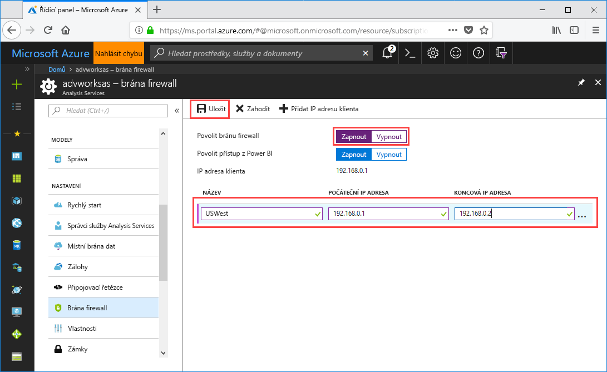

# Rychlý start: Konfigurace brány firewall serveru – portál

V tomto rychlém startu se dozvíte, jak nakonfigurovat firewall pro server služby Azure Analysis Services. Důležitou součástí zabezpečení serveru a jeho dat je zapnutí brány firewall a konfigurace rozsahů IP adres pro počítače, které mají přístup k serveru.

## Požadavky

- Server služby Analysis Services v předplatném. Další informace najdete v tématu [rychlý start: Vytvoření serveru – portál](analysis-services-create-server.md) nebo [rychlý start: Vytvoření serveru – PowerShell](analysis-services-create-powershell.md)
- Jeden nebo více rozsahů IP adres pro klientské počítače (pokud jsou potřeba).

## Přihlášení k webu Azure Portal 

[Přihlaste se k portálu](https://portal.azure.com)

## Konfigurace brány firewall

1. Když kliknete na server, otevře se stránka Přehled. 
2. V nabídce **NASTAVENÍ** > **Brána firewall** > **Povolit firewall** klikněte na **Zapnuto**.
3. Pokud chcete povolit přístup DirectQuery ze služby Power BI, u položky **Povolit přístup ze služby Power BI** klikněte na **Zapnuto**.  
4. (Volitelné) Zadejte jeden nebo více rozsahů IP adres. V každém rozsahu zadejte název a počáteční a koncovou IP adresu. 
5. Klikněte na **Uložit**.

     

## Vyčištění prostředků

Až nebudete nastavení potřebovat, odstraňte rozsahy IP adres nebo vypněte bránu firewall.

## Další postup
V tomto rychlém startu jste se naučili konfigurovat serverovou bránu firewall. Teď, když máte server, který je zabezpečený branou firewall, na něj můžete z portálu přidat ukázkový základní datový model. Na ukázkovém modelu se naučíte konfigurovat databázové role modelu a testovat připojení klientů. Ve výuce pokračujte kurzem, ve kterém přidáte ukázkový model.

> [!div class="nextstepaction"]
> [Kurz: Přidání ukázkový model na server](analysis-services-create-sample-model.md)
