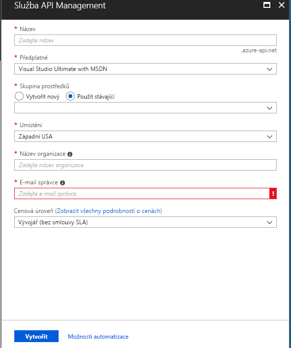

# Vytvoření nové instance služby Azure API Management

Azure API Management (APIM) pomáhá organizacím při publikování rozhraní API pro externí, partnerské a interní vývojáře, aby tak uvolnila potenciál jejich dat a služeb. Služba API Management nabízí základní možnosti pro zajištění úspěšného programu s rozhraním API prostřednictvím zapojení vývojářů, informací o podniku, analýz, zabezpečení a ochrany. APIM umožňuje vytvářet a spravovat moderní brány API pro existující backendové služby hostované kdekoli. Další informace najdete v tématu [Přehled](api-management-key-concepts.md).

Tento rychlý start popisuje kroky pro vytvoření nové instance API Managementu pomocí webu Azure Portal.

[!INCLUDE [quickstarts-free-trial-note](../../includes/quickstarts-free-trial-note.md)]

## Přihlášení k Azure

Přihlaste se k webu [Azure Portal](https://portal.azure.com).

## Vytvoření nové služby

1. V nabídce webu Azure Portal vyberte **Vytvořit prostředek**. Na **domovské** stránce Azure můžete také vybrat **vytvořit prostředek** . 
   
   
   
1. Na **nové** obrazovce vyberte **integrace** a pak vyberte **API Management**.
   
   
   
1. Na obrazovce **API Management služby** zadejte nastavení.
   
   
   
   | Nastavení                 | Navrhovaná hodnota                               | Popis                                                                                                                                                                                                                                                                                                                         |
|-------------------------|-----------------------------------------------|-------------------------------------------------------------------------------------------------------------------------------------------------------------------------------------------------------------------------------------------------------------------------------------------------------------------------------------|
| **Název**                | Jedinečný název pro vaši službu API Management | Tento název není možné později změnit. Název služby se používá k vygenerování výchozího názvu domény ve tvaru *{název}.azure-api.net*. Pokud chcete použít vlastní název domény, přečtěte si téma [Konfigurace vlastní domény](configure-custom-domain.md).   Název služby se používá k odkazování na službu a odpovídající prostředek Azure. |
| **Předplatné**        | Vaše předplatné                             | Předplatné, v jehož rámci se tato nová instance služby vytvoří. Můžete si vybrat jedno z různých předplatných Azure, ke kterým máte přístup.                                                                                                                                                            |
| **Skupina prostředků**      | *apimResourceGroup*                           | Můžete vybrat nový nebo existující prostředek. Skupina prostředků je kolekce prostředků, které sdílejí životní cyklus, oprávnění a zásady. Další informace najdete [tady](../azure-resource-manager/management/overview.md#resource-groups).                                                                                                  |
| **Umístění**            | *USA – západ*                                    | Vyberte geografickou oblast blízko vás. V rozevíracím seznamu se zobrazí jenom dostupné oblasti služby API Management.                                                                                                                                                                                                          |
| **Název organizace**   | Název vaší organizace                 | Tento název se používá na řadě míst, včetně názvu portálu pro vývojáře a odesilatele e-mailů s oznámeními.                                                                                                                                                                                                             |
| **E-mail správce** | *org.com\@správce*                               | Nastavte e-mailovou adresu, na kterou se budou posílat všechna oznámení z **API Managementu**.                                                                                                                                                                                                                                              |
| **Cenová úroveň**        | *Vývojář*                                   | Pro vyhodnocení služby nastavte úroveň **Developer**. Tato úroveň není určená pro použití v produkčním prostředí. Další informace o škálování úrovní služby API Management najdete v tématu věnovaném [upgradu a škálování](upgrade-and-scale.md).                                                                                                                                    |

3. Zvolte **Vytvořit**.

    > [!TIP]
    > Vytvoření služby API Management obvykle trvá 20 až 30 minut. Výběr možnosti **Připnout na řídicí panel** usnadňuje pozdější vyhledání nově vytvořené služby.

[!INCLUDE [api-management-navigate-to-instance](../../includes/api-management-navigate-to-instance.md)]

## Vyčištění prostředků

Pokud už je nepotřebujete, můžete k odebrání skupiny prostředků a všech souvisejících prostředků použít následující postup:

1. V Azure Portal vyhledejte a vyberte **skupiny prostředků**. **Skupiny prostředků** můžete také vybrat na **domovské** stránce. 

   

1. Na stránce **skupiny prostředků** vyberte skupinu prostředků.

   

1. Na stránce skupina prostředků vyberte **Odstranit skupinu prostředků**. 
   
1. Zadejte název vaší skupiny prostředků a pak vyberte **Odstranit**.

   

## Další kroky

> [!div class="nextstepaction"]
> [Import a publikování vašeho prvního rozhraní API](import-and-publish.md)
