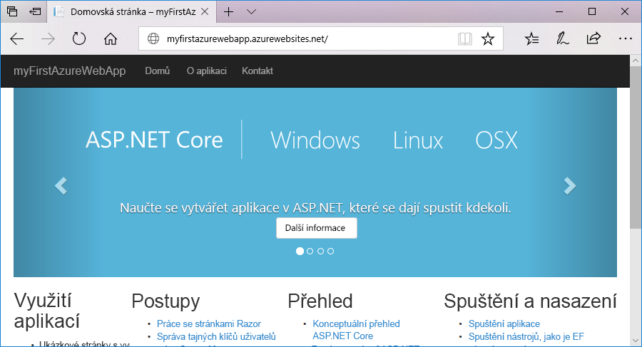
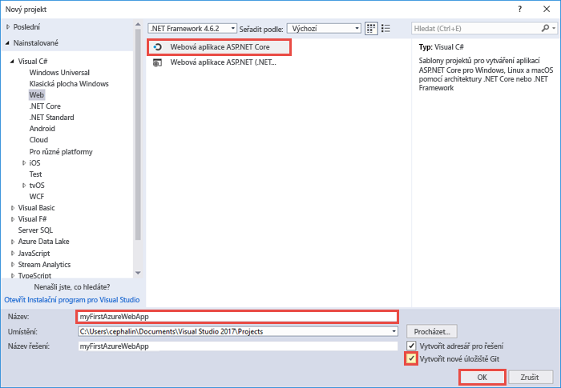
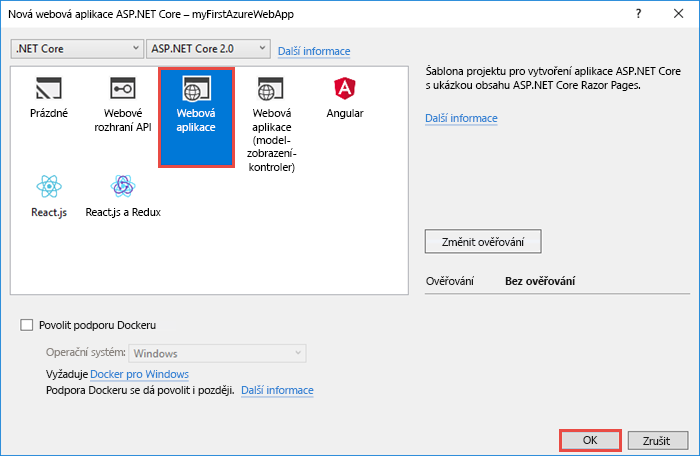
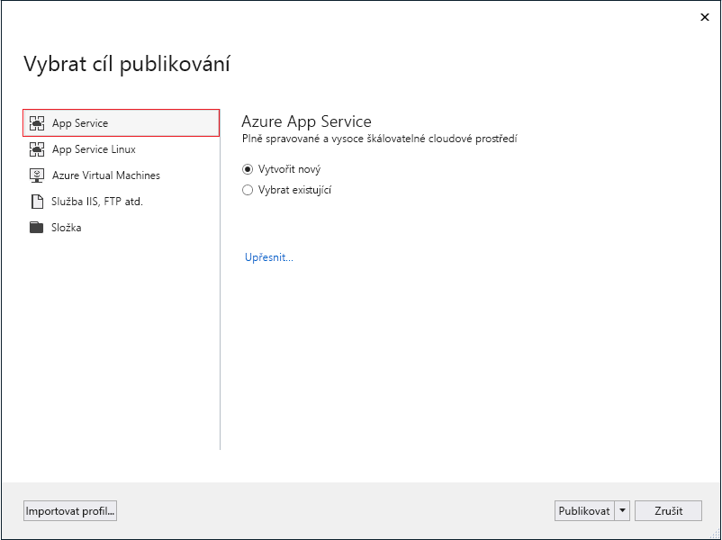
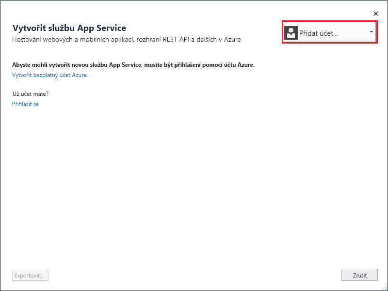
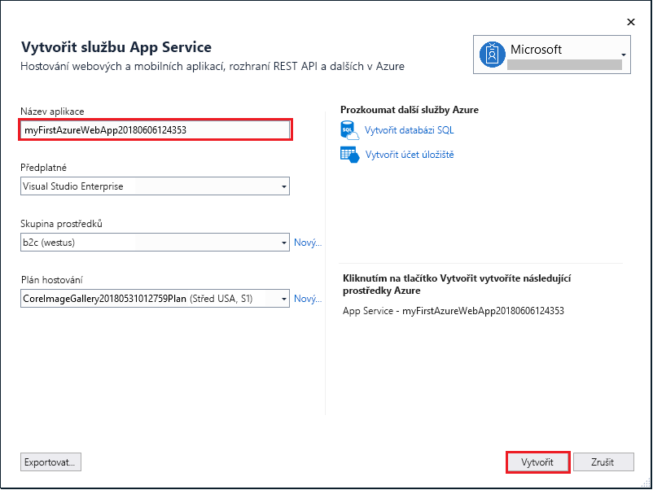
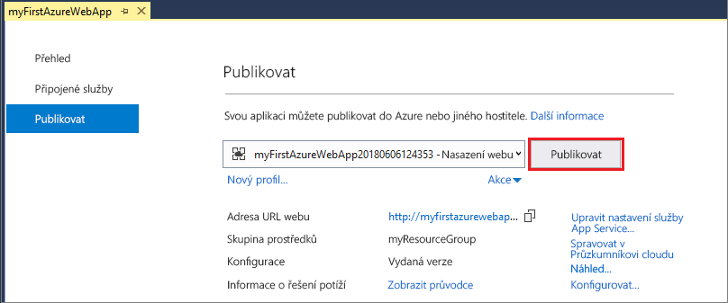

# <a name="create-an-aspnet-core-web-app-in-azure"></a>Vytvoření webové aplikace ASP.NET Core v Azure

> [!NOTE]
> Tento článek nasadí aplikaci do služby App Service ve Windows. Nasazení do služby App Service v _Linuxu_ je popsané v tématu [Vytvoření webové aplikace v .NET Core ve službě App Service v Linuxu](./containers/quickstart-dotnetcore.md). 
>

[Azure Web Apps](app-service-web-overview.md) je vysoce škálovatelná služba s automatickými opravami pro hostování webů.  V tomto kurzu Rychlý start se dozvíte, jak nasadit svoji první webovou aplikaci ASP.NET Core do služby Azure Web Apps. Po dokončení kurzu budete mít skupinu prostředků, která se bude skládat z plánu služby App Service a webové aplikace Azure s nasazenou webovou aplikací.



[!INCLUDE [quickstarts-free-trial-note](../../includes/quickstarts-free-trial-note.md)]

## <a name="prerequisites"></a>Požadavky

Pro dokončení tohoto kurzu nainstalujte sadu <a href="https://www.visualstudio.com/downloads/" target="_blank">Visual Studio 2017</a> se sadou funkcí **Vývoj pro ASP.NET a web**.

Pokud už máte sadu Visual Studio 2017 nainstalovanou:

- Nainstalujte nejnovější aktualizace v sadě Visual Studio kliknutím na **Nápověda** > **Vyhledat aktualizace**.
- Klikněte na **Nástroje** > **Získat nástroje a funkce** a přidejte příslušnou sadu funkcí.

## <a name="create-an-aspnet-core-web-app"></a>Vytvoření webové aplikace ASP.NET Core

Ve Visual Studiu vytvořte projekt tak, že vyberete **Soubor > Nový > Projekt**. 

V dialogovém okně **Nový projekt** vyberte **Visual C# > Web > Webová aplikace ASP.NET Core**.

Aplikaci pojmenujte _myFirstAzureWebApp_ a pak vyberte **OK**.
   


Do Azure můžete nasadit jakýkoli typ webové aplikace ASP.NET Core. V tomto kurzu Rychlý start vyberte šablonu **Webová aplikace** a ujistěte se, že u ověřování je nastavena možnost **Bez ověření** a že žádná jiná možnost není vybraná.
      
Vyberte **OK**.



V nabídce vyberte **Ladit > Spustit bez ladění** a spusťte tak webovou aplikaci místně.


## <a name="launch-the-publish-wizard"></a>Spuštění průvodce publikováním

V **Průzkumníku řešení** klikněte pravým tlačítkem na projekt **myFirstAzureWebApp** a vyberte možnost **Publikovat**.


Průvodce publikováním se spustí automaticky. Výběrem **App Service** > **Publikovat** otevřete dialogové okno **Vytvořit plán App Service**.



## <a name="sign-in-to-azure"></a>Přihlášení k Azure

V dialogovém okně **Vytvoření služby App Service** klikněte na **Přidat účet** a přihlaste se ke svému předplatnému Azure. Pokud už jste přihlášení, vyberte z rozevíracího seznamu požadovaný účet.

> [!NOTE]
> Pokud už jste přihlášení, nevybírejte zatím možnost **Vytvořit**.
>
   


## <a name="create-a-resource-group"></a>Vytvoření skupiny prostředků

[!INCLUDE [resource group intro text](../../includes/resource-group.md)]

Vedle pole **Skupina prostředků** vyberte **Nová**.

Skupinu prostředků pojmenujte **myResourceGroup** a vyberte **OK**.

## <a name="create-an-app-service-plan"></a>Vytvoření plánu služby App Service

[!INCLUDE [app-service-plan](../../includes/app-service-plan.md)]

Vedle položky **Plán hostování** vyberte **Nový**. 

V dialogovém okně **Konfigurovat plán hostování** použijte nastavení podle tabulky následující po snímku obrazovky.


| Nastavení | Navrhovaná hodnota | Popis |
|-|-|-|
|Plán služby App Service| myAppServicePlan | Název plánu služby App Service. |
| Umístění | Západní Evropa | Datacentrum, které je hostitelem webové aplikace. |
| Velikost | Free | [Cenová úroveň](https://azure.microsoft.com/pricing/details/app-service/?ref=microsoft.com&utm_source=microsoft.com&utm_medium=docs&utm_campaign=visualstudio) určuje funkce hostování. |

Vyberte **OK**.

## <a name="create-and-publish-the-web-app"></a>Vytvoření a publikování webové aplikace

V části **Název aplikace** zadejte jedinečný název aplikace (platné znaky jsou `a-z`, `0-9` a `-`) nebo přijměte automaticky vygenerovaný jedinečný název. Adresa URL webové aplikace je `http://<app_name>.azurewebsites.net`, kde `<app_name>` je název vaší aplikace.

Výběrem možnosti **Vytvořit** spustíte vytváření prostředků Azure.



Průvodce po dokončení publikuje webovou aplikaci ASP.NET Core do Azure a potom tuto aplikaci spustí ve výchozím prohlížeči.


Název aplikace zadaný v [kroku vytvoření a publikování](#create-and-publish-the-web-app) se použije jako předpona adresy URL ve formátu `http://<app_name>.azurewebsites.net`.

Blahopřejeme, vaše webová aplikace ASP.NET Core je spuštěná ve službě Azure App Service.

## <a name="update-the-app-and-redeploy"></a>Aktualizace a opětovné nasazení aplikace

Z **Průzkumníku řešení** otevřete _Pages/Index.cshtml_.

Dvě značky `<div>` nahraďte následujícím kódem:

```HTML
<div class="jumbotron">
    <h1>ASP.NET in Azure!</h1>
    <p class="lead">This is a simple app that we’ve built that demonstrates how to deploy a .NET app to Azure App Service.</p>
</div>
```

Opětovné nasazení do služby Azure provedete tak, že v **Průzkumníku řešení** kliknete pravým tlačítkem na projekt **myFirstAzureWebApp** a vyberete **Publikovat**.

Na stránce souhrnu publikování vyberte **Publikovat**.


Po dokončení publikování spustí Visual Studio prohlížeč na adrese URL webové aplikace.


## <a name="manage-the-azure-web-app"></a>Správa webové aplikace Azure

Pokud chcete webovou aplikaci spravovat, přejděte na web <a href="https://portal.azure.com" target="_blank">Azure Portal</a>.

V levé nabídce klikněte na **App Services** a potom vyberte název své webové aplikace Azure.


Zobrazí se stránka s přehledem vaší webové aplikace. Tady můžete provádět základní úlohy správy, jako je procházení, zastavení, spuštění, restartování a odstranění. 


Levá nabídka obsahuje odkazy na různé stránky pro konfiguraci vaší aplikace. 

[!INCLUDE [Clean-up section](../../includes/clean-up-section-portal.md)]

## <a name="next-steps"></a>Další postup

> [!div class="nextstepaction"]
> [ASP.NET Core s SQL Database](app-service-web-tutorial-dotnetcore-sqldb.md)
