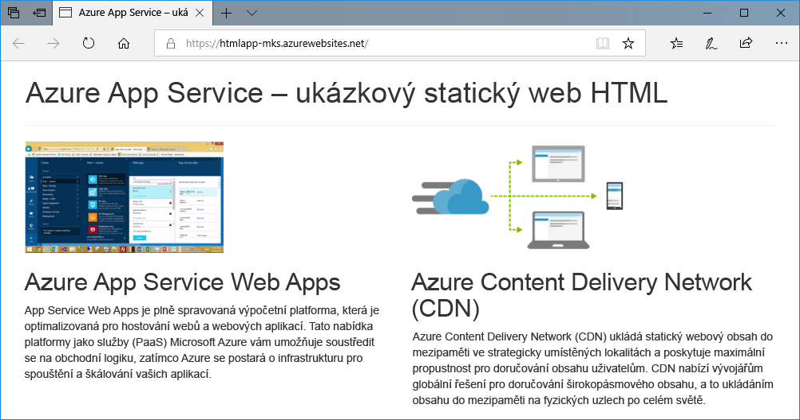
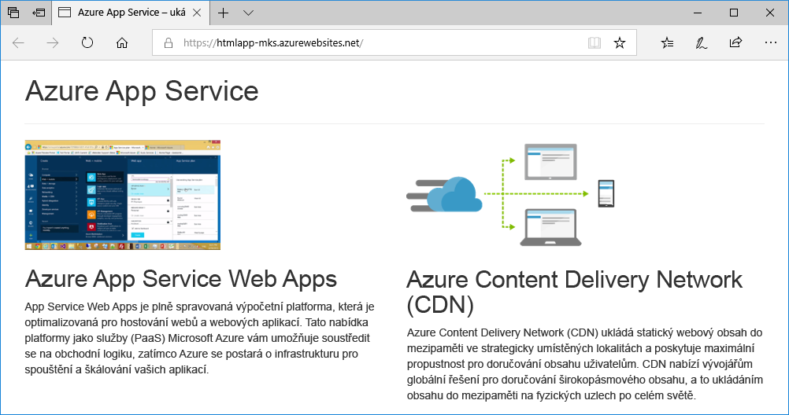
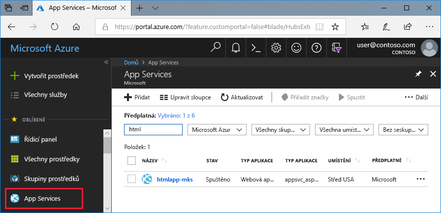
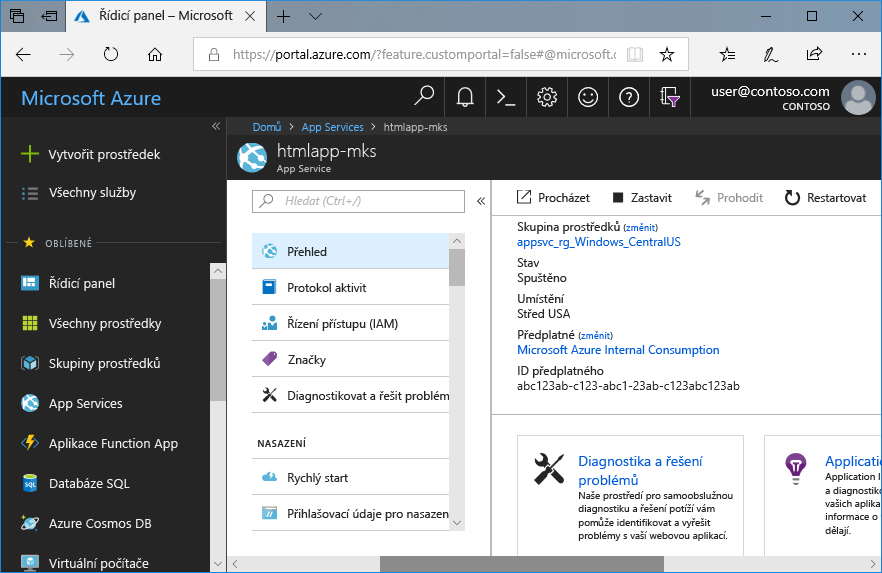

# <a name="create-a-static-html-web-app-in-azure"></a>Vytvoření webové aplikace ve statickém HTML ve službě Azure

[Azure Web Apps](app-service-web-overview.md) je vysoce škálovatelná služba s automatickými opravami pro hostování webů. Tento kurz Rychlý start vás provede postupem nasazení základního webu v HTML se styly CSS do služby Azure Web Apps. Absolvujete ho ve službě [Cloud Shell](https://docs.microsoft.com/azure/cloud-shell/overview), ale příkazy můžete také spouštět místně pomocí [Azure CLI](/cli/azure/install-azure-cli).



[!INCLUDE [quickstarts-free-trial-note](../../includes/quickstarts-free-trial-note.md)]

[!INCLUDE [cloud-shell-try-it.md](../../includes/cloud-shell-try-it.md)]

## <a name="install-web-app-extension-for-cloud-shell"></a>Instalace rozšíření webové aplikace pro Cloud Shell

Pro absolvování tohoto rychlého startu je potřeba přidat [rozšíření webové aplikace az](https://docs.microsoft.com/cli/azure/extension?view=azure-cli-latest#az-extension-add). Pokud už máte rozšíření nainstalované, aktualizujte je na nejnovější verzi. To provedete zadáním `az extension update -n webapp`.

Rozšíření webové aplikace nainstalujete spuštěním tohoto příkazu:

```bash
az extension add --name webapp
```

Jakmile se rozšíření nainstaluje, zobrazí se ve službě Cloud Shell informace podobná tomuto příkladu:

```bash
The installed extension 'webapp' is in preview.
```

## <a name="download-the-sample"></a>Stažení ukázky

Ve službě Cloud Shell vytvořte adresář rychlého startu a přejděte do něj.

```bash
mkdir quickstart

cd quickstart
```

Potom spusťte následující příkaz, pomocí kterého do tohoto adresáře naklonujete úložiště ukázkové aplikace.

```bash
git clone https://github.com/Azure-Samples/html-docs-hello-world.git
```

## <a name="create-a-web-app"></a>Vytvoření webové aplikace

Přejděte do adresáře, který obsahuje vzorový kód a spusťte příkaz `az webapp up`.

V následujícím příkladu nahraďte <app_name > jedinečným názvem aplikace.

```bash
cd html-docs-hello-world

az webapp up --location westeurope --name <app_name>
```

Příkaz `az webapp up` provádí tyto akce:

- Vytvoření výchozí skupiny prostředků

- Vytvoření výchozího plánu služby App Service

- Vytvoření aplikace se zadaným názvem

- [Nasazení souborů ZIP](https://docs.microsoft.com/azure/app-service/deploy-zip) z aktuálního pracovního adresáře do webové aplikace

Spuštění tohoto příkazu může trvat několik minut. Při spuštění příkaz zobrazí podobné informace jako v následujícím příkladu:

```json
{
  "app_url": "https://<app_name>.azurewebsites.net",
  "location": "westeurope",
  "name": "<app_name>",
  "os": "Windows",
  "resourcegroup": "appsvc_rg_Windows_westeurope",
  "serverfarm": "appsvc_asp_Windows_westeurope",
  "sku": "FREE",
  "src_path": "/home/<username>/quickstart/html-docs-hello-world ",
  < JSON data removed for brevity. >
}
```

Poznamenejte si hodnotu `resourceGroup`. Budete ji potřebovat v části [Vyčištění prostředků](#clean-up-resources).

## <a name="browse-to-the-app"></a>Přechod do aplikace

V prohlížeči přejděte na adresu URL webové aplikace Azure: `http://<app_name>.azurewebsites.net`.

Stránka je spuštěná jako webová aplikace služby Azure App Service.


**Blahopřejeme!** Nasadili jste svoji první aplikaci v HTML do služby App Service.

## <a name="update-and-redeploy-the-app"></a>Aktualizace a opětovné nasazení aplikace

Ve službě Cloud Shell otevřete textový editor nano zadáním příkazu `nano index.html`. Ve značce nadpisu `<h1>` změňte text z „Azure App Service - Sample Static HTML Site“ na „Azure App Service“, jak je znázorněno níže.


Uložte změny a editor nano zavřete. K uložení použijte příkaz `^O` a k zavření příkaz `^X`.

Teď aplikaci znovu nasadíte pomocí stejného příkazu `az webapp up`.

```bash
az webapp up --location westeurope --name <app_name>
```

Po dokončení nasazení se vraťte do okna prohlížeče, které se otevřelo v kroku **Přechod do aplikace**, a aktualizujte zobrazení stránky.



## <a name="manage-your-new-azure-web-app"></a>Správa vaší nové webové aplikace Azure

Pokud chcete spravovat webovou aplikaci, kterou jste vytvořili, přejděte na web <a href="https://portal.azure.com" target="_blank">Azure Portal</a>.

V levé nabídce klikněte na **App Services** a pak klikněte na název vaší webové aplikace Azure.



Zobrazí se stránka s přehledem vaší webové aplikace. Tady můžete provádět základní úlohy správy, jako je procházení, zastavení, spuštění, restartování a odstranění.



Levá nabídka obsahuje odkazy na různé stránky pro konfiguraci vaší aplikace.

## <a name="clean-up-resources"></a>Vyčištění prostředků

V předchozích krocích jste vytvořili prostředky Azure ve skupině prostředků. Pokud předpokládáte, že už tyto prostředky nebudete potřebovat, odstraňte skupinu prostředků spuštěním následujícího příkazu ve službě Cloud Shell: Mějte na paměti, že název skupiny prostředků se pro vás automaticky vygeneroval v kroku [Vytvoření webové aplikace](#create-a-web-app).

```bash
az group delete --name appsvc_rg_Windows_westeurope
```

Spuštění tohoto příkazu může trvat přibližně minut.

## <a name="next-steps"></a>Další postup

> [!div class="nextstepaction"]
> [Mapování vlastní domény](app-service-web-tutorial-custom-domain.md)
