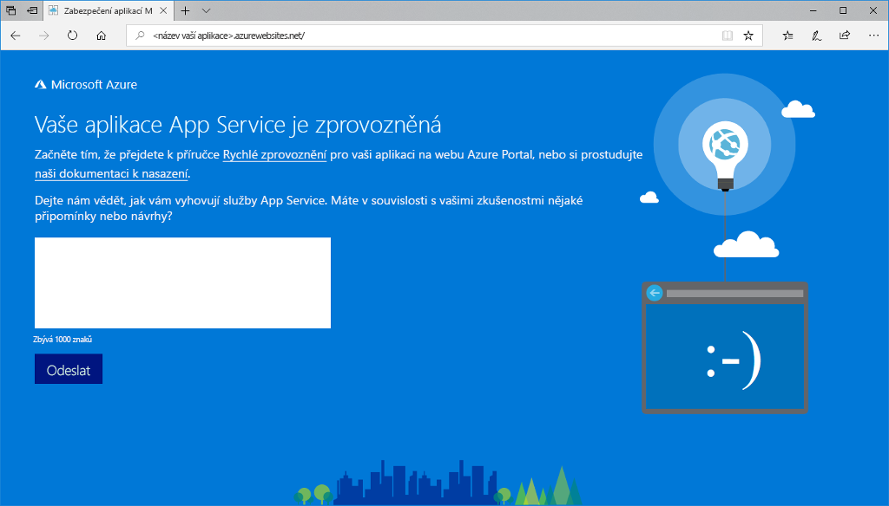

# <a name="create-a-nodejs-web-app-in-azure"></a>Vytvoření webové aplikace Node.js ve službě Azure

> [!NOTE]
> Tento článek nasadí aplikaci do služby App Service ve Windows. Nasazení do služby App Service v _Linuxu_ je popsané v tématu [Vytvoření webové aplikace v Node.js ve službě Azure App Service v Linuxu](./containers/quickstart-nodejs.md).
>

[Azure Web Apps](app-service-web-overview.md) je vysoce škálovatelná služba s automatickými opravami pro hostování webů.  V tomto kurzu Rychlý start se dozvíte, jak nasadit aplikaci Node.js pomocí služby Azure Web Apps. K vytvoření webové aplikace použijete [Azure CLI](https://docs.microsoft.com/cli/azure/get-started-with-azure-cli) a pak použijete ZipDeploy k nasazení ukázkového kódu Node.js do webové aplikace.


Tento postup můžete použít v případě počítačů se systémem Mac, Windows nebo Linux. Pokud máte nainstalované všechny požadované prostředky, zabere vám tento postup zhruba pět minut.   

[!INCLUDE [quickstarts-free-trial-note](../../includes/quickstarts-free-trial-note.md)]

## <a name="prerequisites"></a>Požadavky

K provedení kroků v tomto kurzu Rychlý start je potřeba:

* <a href="https://nodejs.org/" target="_blank">Nainstalovat Node.js a NPM</a>.

## <a name="download-the-sample"></a>Stažení ukázky

Stáhněte si ukázkový projekt Node.js z [https://github.com/Azure-Samples/nodejs-docs-hello-world/archive/master.zip](https://github.com/Azure-Samples/nodejs-docs-hello-world/archive/master.zip) a extrahujte archiv ZIP.

Otevřete soubor _index.js_ a vyhledejte následující řádek:

```javascript
var port = process.env.PORT || 1337;
```

Služba App Service vloží do vaší aplikace process.env.PORT, takže kód bude díky této proměnné vědět, na kterém portu se má naslouchat. 

V okně terminálu přejděte do kořenového adresáře ukázkového projektu Node.js (projekt obsahující _index.js_).

## <a name="run-the-app-locally"></a>Místní spuštění aplikace

Spusťte aplikaci místně, abyste viděli, jak by měla vypadat po nasazení do Azure. Otevřete okno terminálu a pomocí skriptu `npm start` spusťte integrovaný server HTTP Node.js.

```bash
npm start
```

Otevřete webový prohlížeč a přejděte do ukázkové aplikace na adrese `http://localhost:1337`.

Na stránce se zobrazí zpráva **Hello World** z ukázkové aplikace.


V okně terminálu ukončete webový server stisknutím **Ctrl + C**.

> [!NOTE]
> V Azure App Service se aplikace spouští ve službě IIS pomocí modulu [iisnode](https://github.com/Azure/iisnode). Kvůli povolení spuštění aplikace pomocí modulu iisnode obsahuje kořenový adresář aplikace soubor web.config. Tento soubor může číst služba IIS a dokumentaci k nastavením souvisejícím s modulem iisnode najdete v [úložišti iisnode na GitHubu](https://github.com/Azure/iisnode/blob/master/src/samples/configuration/web.config).

[!INCLUDE [Create ZIP file](../../includes/app-service-web-create-zip.md)]

[!INCLUDE [cloud-shell-try-it.md](../../includes/cloud-shell-try-it.md)]

[!INCLUDE [Create resource group](../../includes/app-service-web-create-resource-group-scus.md)] 

[!INCLUDE [Create app service plan](../../includes/app-service-web-create-app-service-plan-scus.md)] 

## <a name="create-a-web-app"></a>Vytvoření webové aplikace

Ve službě Cloud Shell pomocí příkazu [`az webapp create`](/cli/azure/webapp?view=azure-cli-latest#az-webapp-create) vytvořte v plánu služby App Service `myAppServicePlan` webovou aplikaci. 

V následujícím příkladu nahraďte `<app_name>` globálně jedinečným názvem aplikace (platné znaky jsou `a-z`, `0-9` a `-`).

```azurecli-interactive
# Bash and Powershell
az webapp create --resource-group myResourceGroup --plan myAppServicePlan --name <app_name>
```

Po vytvoření webové aplikace Azure CLI zobrazí výstup podobný následujícímu příkladu:

```json
{
  "availabilityState": "Normal",
  "clientAffinityEnabled": true,
  "clientCertEnabled": false,
  "cloningInfo": null,
  "containerSize": 0,
  "dailyMemoryTimeQuota": 0,
  "defaultHostName": "<app_name>.azurewebsites.net",
  "enabled": true,
  < JSON data removed for brevity. >
}
```

### <a name="set-nodejs-runtime"></a>Nastavení modulu runtime Node.js

Nastavte modul runtime Node na 8.11.1. Pokud chcete zobrazit všechny podporované moduly runtime, spusťte příkaz [`az webapp list-runtimes`](/cli/azure/webapp?view=azure-cli-latest#az-webapp-list-runtimes).

```azurecli-interactive
# Bash and Powershell
az webapp config appsettings set --resource-group myResourceGroup --name <app_name> --settings WEBSITE_NODE_DEFAULT_VERSION=8.11.1
```

Přejděte do vaší nově vytvořené webové aplikace. Nahraďte `<app_name>` s jedinečným názvem aplikace.

```bash
http://<app_name>.azurewebsites.net
```

Vaše nová webová aplikace by měla vypadat takto:



[!INCLUDE [Deploy ZIP file](../../includes/app-service-web-deploy-zip.md)]

## <a name="browse-to-the-app"></a>Přechod do aplikace

V prohlížeči zadejte adresu nasazené aplikace.

```
http://<app_name>.azurewebsites.net
```

Vzorový kód Node.js je spuštěný ve webové aplikaci služby Azure App Service.


**Blahopřejeme!** Nasadili jste svoji první aplikaci Node.js do služby App Service.

## <a name="update-and-redeploy-the-code"></a>Aktualizace a opětovné nasazení kódu

V textovém editoru otevřete soubor `index.js`, který je součástí aplikace Node.js, a proveďte malou změnu textu u volání `response.end`:

```nodejs
response.end("Hello Azure!");
```

V místním okně terminálu přejděte do kořenového adresáře vaší aplikace a vytvořte nový soubor ZIP pro váš aktualizovaný projekt.

```
# Bash
zip -r myUpdatedAppFiles.zip .

# PowerShell
Compress-Archive -Path * -DestinationPath myUpdatedAppFiles.zip
```

K nasazení tohoto nového souboru ZIP do služby App Service použijte stejný postup jako při [nasazení souboru ZIP](#deploy-zip-file).

Vraťte se do okna prohlížeče, které se otevřelo v kroku **Přechod do aplikace**, a aktualizujte zobrazení stránky.


## <a name="manage-your-new-azure-web-app"></a>Správa vaší nové webové aplikace Azure

Pokud chcete spravovat webovou aplikaci, kterou jste vytvořili, přejděte na web <a href="https://portal.azure.com" target="_blank">Azure Portal</a>.

V levé nabídce klikněte na **App Services** a pak klikněte na název vaší webové aplikace Azure.


Zobrazí se stránka s přehledem vaší webové aplikace. Tady můžete provádět základní úlohy správy, jako je procházení, zastavení, spuštění, restartování a odstranění. 


Levá nabídka obsahuje odkazy na různé stránky pro konfiguraci vaší aplikace. 

## <a name="video"></a>Video

Podívejte se na video s tímto rychlým startem v akci a potom sami proveďte příslušné kroky a publikujte svou první aplikaci Node.js v Azure.

> [!VIDEO https://channel9.msdn.com/Shows/Azure-for-Node-Developers/Create-a-Nodejs-app-in-Azure-Quickstart/player]   

[!INCLUDE [cli-samples-clean-up](../../includes/cli-samples-clean-up.md)]

## <a name="next-steps"></a>Další postup

> [!div class="nextstepaction"]
> [Node.js s databází MongoDB](app-service-web-tutorial-nodejs-mongodb-app.md)
