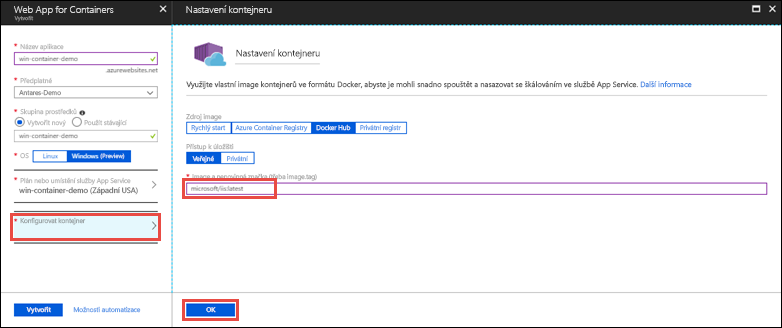

# <a name="run-a-custom-windows-container-in-azure-preview"></a>Spuštění vlastního kontejneru s Windows v Azure (Preview)

[Azure App Service](app-service-web-overview.md) poskytuje předdefinované zásobníky aplikací ve Windows, jako je ASP.NET nebo Node.js, které běží ve službě IIS. Předkonfigurované prostředí Windows uzamkne přístup k operačnímu systému pro správu a zamezí instalaci softwaru, změnám globální mezipaměti sestavení (GAC) atd. (viz [Funkce operačního systému ve službě Azure App Service](web-sites-available-operating-system-functionality.md)). Pokud vaše aplikace vyžaduje vyšší úroveň přístupu, než předkonfigurované prostředí umožňuje, můžete místo toho nasadit vlastní kontejner s Windows. V tomto rychlém startu se dozvíte, jak do služby Azure App Service nasadit vlastní image služby IIS z [Docker Hubu](https://hub.docker.com/).


## <a name="sign-in-to-azure"></a>Přihlášení k Azure

Přihlaste se k webu Azure Portal na adrese https://portal.azure.com.

## <a name="create-a-windows-container-app"></a>Vytvoření aplikace typu kontejner pro Windows

1. V levém horním rohu webu Azure Portal zvolte **Vytvořit prostředek**.

2. Ve vyhledávacím poli nad seznamem prostředků Azure Marketplace vyhledejte a vyberte **Web App for Containers**.

3. Zadejte název aplikace, například *mywebapp*, přijměte výchozí nastavení, aby se vytvořila nová skupina prostředků, a v poli **OS** klikněte na **Windows (Preview)**.

    

4. Vytvořte plán služby App Service kliknutím na **Plán služby App Service / umístění** > **Vytvořit nový**. Zadejte název nového plánu, přijměte výchozí hodnoty a klikněte na **OK**.

    

5. Klikněte na **Konfigurovat kontejner**, do pole **Image a volitelná značka** zadejte _microsoft/iis:latest_ a klikněte na **OK**.

    

    V tomto článku použijete veřejnou image [microsoft/iis:latest](https://hub.docker.com/r/microsoft/iis/) z Docker Hubu. Pokud máte vlastní image pro svou webovou aplikaci někde jinde, například ve službě [Azure Container Registry](/azure/container-registry/) nebo v jakémkoli jiném soukromém úložišti, tady ji můžete nakonfigurovat.

6. Klikněte na **Vytvořit** a počkejte, až Azure vytvoří požadované prostředky.

## <a name="browse-to-the-container-app"></a>Přechod do aplikace typu kontejner

Po dokončení operace Azure se zobrazí okno s oznámením.


1. Klikněte na **Přejít k prostředku**.

2. Na stránce aplikace klikněte na odkaz v části **Adresa URL**.

Na nové stránce prohlížeče se otevře následující stránka:


Počkejte několik minut a zkuste to znovu, dokud se nezobrazí úvodní stránka služby IIS:


**Blahopřejeme!** Spustili jste svůj první vlastní kontejner s Windows ve službě Azure App Service.

## <a name="see-container-start-up-logs"></a>Zobrazení protokolů spuštění kontejneru

Načtení kontejneru s Windows může nějakou dobu trvat. Pokud chcete zobrazit průběh, přejděte na následující adresu URL a nahraďte *\<app_name>* názvem vaší aplikace.
```
https://<app_name>.scm.azurewebsites.net/api/logstream
```

Streamované protokoly vypadají přibližně takto:

```
2018-07-27T12:03:11  Welcome, you are now connected to log-streaming service.
27/07/2018 12:04:10.978 INFO - Site: win-container-demo - Start container succeeded. Container: facbf6cb214de86e58557a6d073396f640bbe2fdec88f8368695c8d1331fc94b
27/07/2018 12:04:16.767 INFO - Site: win-container-demo - Container start complete
27/07/2018 12:05:05.017 INFO - Site: win-container-demo - Container start complete
27/07/2018 12:05:05.020 INFO - Site: win-container-demo - Container started successfully
```

## <a name="use-a-different-docker-image"></a>Použití jiné image Dockeru

Ke spuštění vaší aplikace můžete použít i jinou vlastní image Dockeru. Musíte však zvolit správnou [nadřazenou image](https://docs.docker.com/develop/develop-images/baseimages/) pro požadovanou architekturu: 

- Při nasazování aplikací .NET Framework použijte nadřazenou image založenou na Windows Serveru Core 2016 ve verzi s [kanálem pro dlouhodobou údržbu](https://docs.microsoft.com/windows-server/get-started/semi-annual-channel-overview#long-term-servicing-channel-ltsc). 
- Při nasazování aplikací .NET Core použijte nadřazenou image založenou na Windows Serveru Nano 2016 ve verzi s [kanálem pro dlouhodobou údržbu](https://docs.microsoft.com/windows-server/get-started/semi-annual-channel-overview#long-term-servicing-channel-ltsc). 

Stažení nadřazené image při spuštění aplikace nějakou dobu trvá. Čas spuštění však můžete zkrátit použitím některé z následujících nadřazených imagí, které jsou již uložené v mezipaměti ve službě Azure App Service:

- [microsoft/iis](https://hub.docker.com/r/microsoft/iis/):windowsservercore-ltsc2016, latest
- [microsoft/iis](https://hub.docker.com/r/microsoft/iis/):nanoserver-sac2016
- [microsoft/aspnet](https://hub.docker.com/r/microsoft/aspnet/):4.7.2-windowsservercore-ltsc2016, 4.7.2, latest
- [microsoft/dotnet](https://hub.docker.com/r/microsoft/dotnet/):2.1-aspnetcore-runtime
- [microsoft/dotnet](https://hub.docker.com/r/microsoft/dotnet/):2.1-sdk
