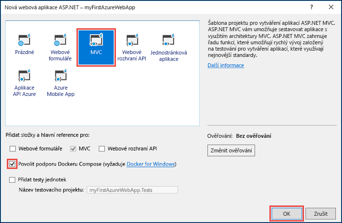
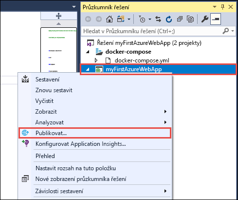
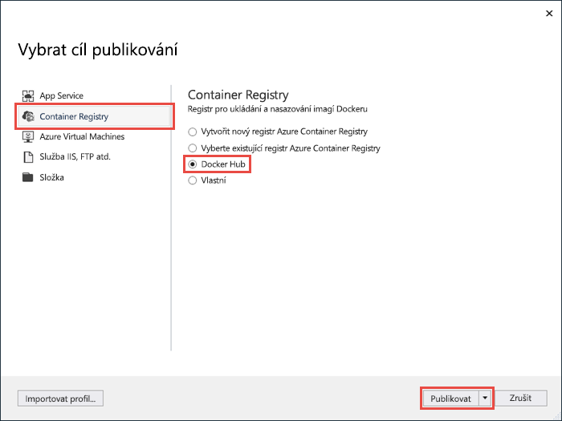
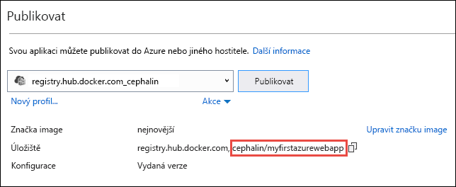
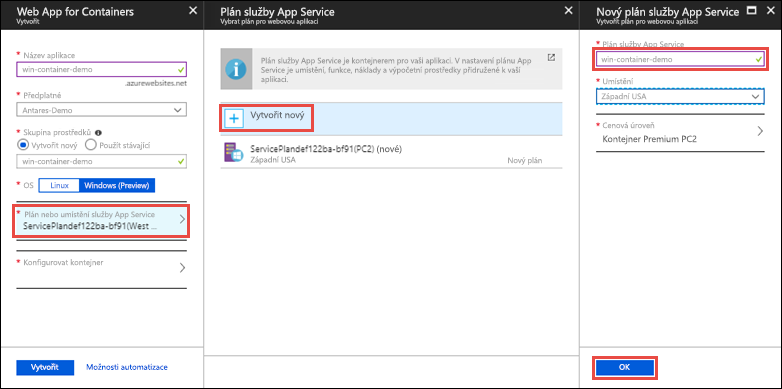
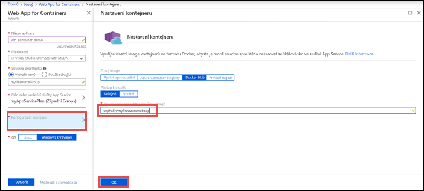
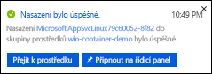
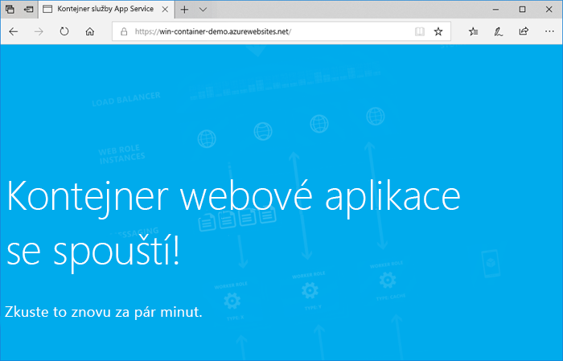
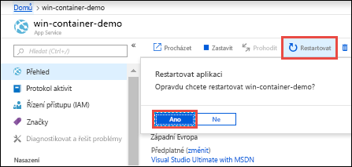

# <a name="run-a-custom-windows-container-in-azure-preview"></a>Spuštění vlastního kontejneru s Windows v Azure (Preview)

[Azure App Service](app-service-web-overview.md) poskytuje předdefinované zásobníky aplikací ve Windows, jako je ASP.NET nebo Node.js, které běží ve službě IIS. Předkonfigurované prostředí Windows uzamkne přístup k operačnímu systému pro správu a zamezí instalaci softwaru, změnám globální mezipaměti sestavení (GAC) atd. (viz [Funkce operačního systému ve službě Azure App Service](operating-system-functionality.md)). Pokud vaše aplikace vyžaduje vyšší úroveň přístupu, než předkonfigurované prostředí umožňuje, můžete místo toho nasadit vlastní kontejner s Windows. Tento rychlý start ukazuje, jak nasadit aplikaci ASP.NET v imagi s Windows do [Centra Dockeru](https://hub.docker.com/) ze sady Visual Studio a spustit ji ve vlastním kontejneru v Azure App Service.


## <a name="prerequisites"></a>Požadavky

Pro absolvování tohoto kurzu potřebujete:

- <a href="https://hub.docker.com/" target="_blank">Zaregistrovat si účet Centra Dockeru</a>
- <a href="https://docs.docker.com/docker-for-windows/install/" target="_blank">Nainstalovat Docker for Windows</a>.
- <a href="https://docs.microsoft.com/virtualization/windowscontainers/quick-start/quick-start-windows-10#2-switch-to-windows-containers" target="_blank">Přepnout Docker na spouštění kontejnerů Windows</a>.
- <a href="https://www.visualstudio.com/downloads/" target="_blank">Nainstalovat Visual Studio 2017</a> se sadami funkcí **Vývoj pro ASP.NET a web** a **Vývoj pro Azure**. Pokud už máte sadu Visual Studio 2017 nainstalovanou:
    - Nainstalujte nejnovější aktualizace sady Visual Studio kliknutím na **Nápověda** > **Vyhledat aktualizace**.
    - Kliknutím na **Nástroje** > **Získat nástroje a funkce** přidejte do sady Visual Studio tyto sady funkcí.

## <a name="create-an-aspnet-web-app"></a>Vytvoření webové aplikace ASP.NET

Ve Visual Studiu vytvořte projekt tak, že vyberete **Soubor > Nový > Projekt**. 

V dialogovém okně **Nový projekt** vyberte **Visual C# > Web > Webová aplikace ASP.NET (.NET Framework)**.

Aplikaci pojmenujte _myFirstAzureWebApp_ a pak vyberte **OK**.
   


Do Azure můžete nasadit jakýkoli typ webové aplikace ASP.NET. V tomto kurzu Rychlý start vyberte šablonu **MVC** a ujistěte se, že u ověřování je nastavena možnost **Bez ověření**.

Vyberte **Povolit podporu pro Docker Compose**.

Vyberte **OK**.



Pokud se soubor _Dockerfile_ neotevře automaticky, otevřete ho z **Průzkumníka řešení**.

Je nutné použít [podporovanou nadřazenou image](#use-a-different-parent-image). Nadřazenou image změníte tak, že řádek `FROM` nahradíte následujícím kódem a soubor uložíte:

```Dockerfile
FROM microsoft/aspnet:4.7.1
```

V nabídce vyberte **Ladit > Spustit bez ladění** a spusťte tak webovou aplikaci místně.


## <a name="publish-to-docker-hub"></a>Publikování do Centra Dockeru

V **Průzkumníku řešení** klikněte pravým tlačítkem na projekt **myFirstAzureWebApp** a vyberte možnost **Publikovat**.



Průvodce publikováním se spustí automaticky. Vyberte **Container Registry** > **Centrum Dockeru** > **Publikovat**.



Zadejte přihlašovací údaje účtu Centra Dockeru a klikněte na **Uložit**. 

Počkejte, než se nasazení dokončí. Na stránce **Publikovat** se teď zobrazuje název úložiště, který použijete později v App Service.



Zkopírujte si tento název úložiště pro pozdější použití.

## <a name="sign-in-to-azure"></a>Přihlášení k Azure

Přihlaste se k webu Azure Portal na adrese https://portal.azure.com.

## <a name="create-a-windows-container-app"></a>Vytvoření aplikace typu kontejner pro Windows

1. V levém horním rohu webu Azure Portal zvolte **Vytvořit prostředek**.

2. Ve vyhledávacím poli nad seznamem prostředků Azure Marketplace vyhledejte a vyberte **Web App for Containers**.

3. Zadejte název aplikace, například *win-container-demo*, přijměte výchozí nastavení, aby se vytvořila nová skupina prostředků, a v poli **OS** klikněte na **Windows (Preview)**.

    

4. Vytvořte plán služby App Service kliknutím na **Plán služby App Service / umístění** > **Vytvořit nový**. Zadejte název nového plánu, přijměte výchozí hodnoty a klikněte na **OK**.

    

5. Klikněte na **Konfigurovat kontejner**. V poli **Image a nepovinná značka** použijte název úložiště, který jste si zkopírovali v postupu [Publikování do Centra Dockeru](#publish-to-docker-hub), a klikněte na **OK**.

    

    Pokud máte vlastní image pro svou webovou aplikaci někde jinde, například ve službě [Azure Container Registry](/azure/container-registry/) nebo v jakémkoli jiném soukromém úložišti, tady ji můžete nakonfigurovat.

6. Klikněte na **Vytvořit** a počkejte, až Azure vytvoří požadované prostředky.

## <a name="browse-to-the-container-app"></a>Přechod do aplikace typu kontejner

Po dokončení operace Azure se zobrazí okno s oznámením.



1. Klikněte na **Přejít k prostředku**.

2. Na stránce aplikace klikněte na odkaz v části **Adresa URL**.

Na nové stránce prohlížeče se otevře následující stránka:



Počkejte několik minut a zkuste to znovu, dokud se nezobrazí úvodní stránka ASP.NET:


**Blahopřejeme!** Spustili jste svůj první vlastní kontejner s Windows ve službě Azure App Service.

## <a name="see-container-start-up-logs"></a>Zobrazení protokolů spuštění kontejneru

Načtení kontejneru s Windows může nějakou dobu trvat. Pokud chcete zobrazit průběh, přejděte na následující adresu URL a nahraďte *\<app_name>* názvem vaší aplikace.
```
https://<app_name>.scm.azurewebsites.net/api/logstream
```

Streamované protokoly vypadají přibližně takto:

```
2018-07-27T12:03:11  Welcome, you are now connected to log-streaming service.
27/07/2018 12:04:10.978 INFO - Site: win-container-demo - Start container succeeded. Container: facbf6cb214de86e58557a6d073396f640bbe2fdec88f8368695c8d1331fc94b
27/07/2018 12:04:16.767 INFO - Site: win-container-demo - Container start complete
27/07/2018 12:05:05.017 INFO - Site: win-container-demo - Container start complete
27/07/2018 12:05:05.020 INFO - Site: win-container-demo - Container started successfully
```

## <a name="update-locally-and-redeploy"></a>Místní aktualizace a opětovné nasazení

Z **Průzkumníku řešení** otevřete _Views\Home\Index.cshtml_.

Najděte HTML značku `<div class="jumbotron">` poblíž začátku a nahraďte celý element následujícím kódem:

```HTML
<div class="jumbotron">
    <h1>ASP.NET in Azure!</h1>
    <p class="lead">This is a simple app that we’ve built that demonstrates how to deploy a .NET app to Azure App Service.</p>
</div>
```

Opětovné nasazení do služby Azure provedete tak, že v **Průzkumníku řešení** kliknete pravým tlačítkem na projekt **myFirstAzureWebApp** a vyberete **Publikovat**.

Na stránce Publikovat vyberte **Publikovat** a počkejte, než se publikování dokončí.

Restartujte aplikaci, aby služba App Service dostala informaci, že má z Centra Dockeru načíst novou image. Zpátky na portálu na stránce aplikace klikněte na **Restartovat** > **Ano**.



Znovu [přejděte do aplikace typu kontejner](#browse-to-the-container-app). Po aktualizaci webové stránky by se aplikace měla napřed vrátit na stránku Spouštění a pak za pár minut by měla znovu zobrazit aktualizovanou webovou stránku.


## <a name="use-a-different-parent-image"></a>Použití jiné nadřazené image

Ke spuštění vaší aplikace můžete použít i jinou vlastní image Dockeru. Musíte však zvolit správnou [nadřazenou image](https://docs.docker.com/develop/develop-images/baseimages/) pro požadovanou architekturu: 

- Při nasazování aplikací .NET Framework použijte nadřazenou image založenou na Windows Serveru Core 2016 ve verzi s [kanálem pro dlouhodobou údržbu](https://docs.microsoft.com/windows-server/get-started/semi-annual-channel-overview#long-term-servicing-channel-ltsc). 
- Při nasazování aplikací .NET Core použijte nadřazenou image založenou na Windows Serveru Nano 2016 ve verzi s [kanálem pro dlouhodobou údržbu](https://docs.microsoft.com/windows-server/get-started/semi-annual-channel-overview#long-term-servicing-channel-ltsc). 

Stažení nadřazené image při spuštění aplikace nějakou dobu trvá. Čas spuštění však můžete zkrátit použitím některé z následujících nadřazených imagí, které jsou již uložené v mezipaměti ve službě Azure App Service:

- [microsoft/iis](https://hub.docker.com/r/microsoft/iis/):windowsservercore-ltsc2016, latest
- [microsoft/iis](https://hub.docker.com/r/microsoft/iis/):nanoserver-sac2016
- [microsoft/aspnet](https://hub.docker.com/r/microsoft/aspnet/):4.7.2-windowsservercore-ltsc2016, 4.7.2, latest
- [microsoft/dotnet](https://hub.docker.com/r/microsoft/dotnet/):2.1-aspnetcore-runtime
- [microsoft/dotnet](https://hub.docker.com/r/microsoft/dotnet/):2.1-sdk

## <a name="next-steps"></a>Další postup

> [!div class="nextstepaction"]
> [Migrace na kontejner Windows v Azure](app-service-web-tutorial-windows-containers-custom-fonts.md)
