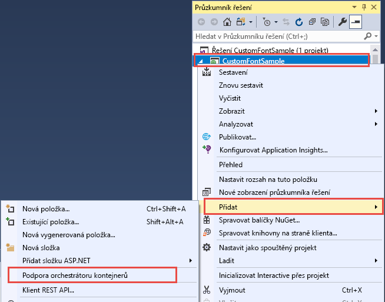
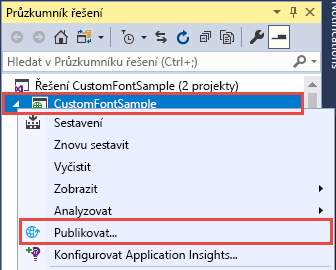
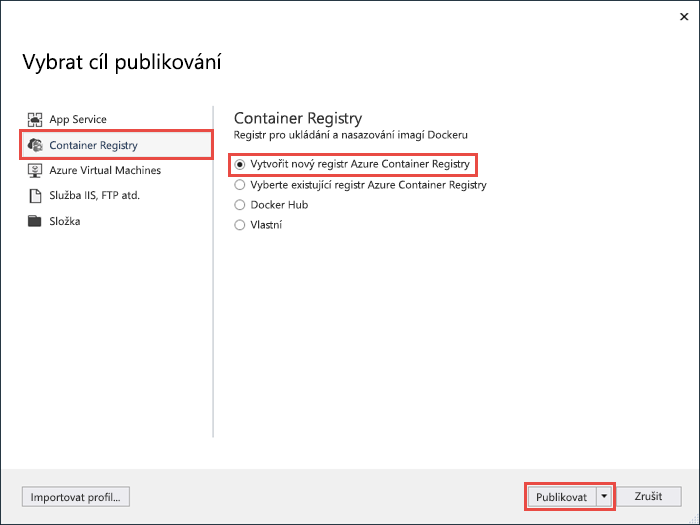
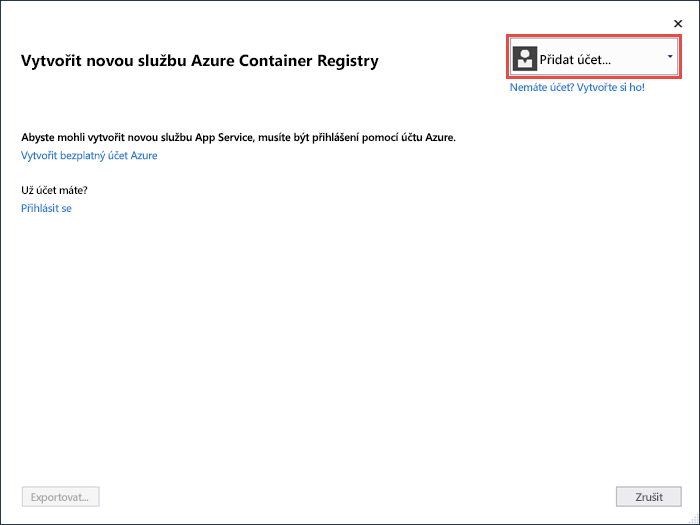
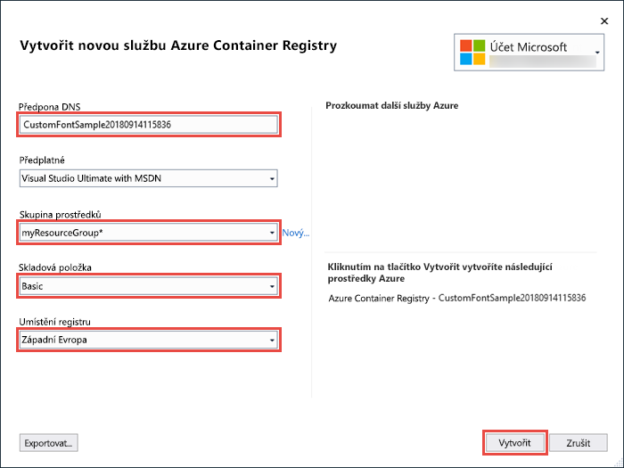
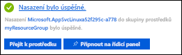

# <a name="migrate-an-aspnet-app-to-azure-app-service-using-a-windows-container-preview"></a>Migrace aplikace ASP.NET do služby Azure App Service pomocí kontejneru Windows (verze Preview)

[Azure App Service](overview.md) poskytuje předdefinované zásobníky aplikací ve Windows, jako je ASP.NET nebo Node.js, které běží ve službě IIS. Předkonfigurované prostředí Windows uzamkne přístup k operačnímu systému pro správu a zamezí instalaci softwaru, změnám globální mezipaměti sestavení (GAC) atd. (viz [Funkce operačního systému ve službě Azure App Service](operating-system-functionality.md)). Použití vlastního kontejneru Windows ve službě App Service vám ale umožňuje udělat změny operačního systému, které vaše aplikace potřebuje, takže migrace místní aplikace, která vyžaduje vlastní konfiguraci operačního systému a softwaru, je snadná. Tento kurz ukazuje, jak do služby App Service migrovat aplikaci ASP.NET, která využívá vlastní písma nainstalovaná v knihovně písem Windows. Do služby [Azure Container Registry](https://docs.microsoft.com/azure/container-registry/) nasadíte vlastní nakonfigurovanou image Windows ze sady Visual Studio a pak ji spustíte ve službě App Service.


## <a name="prerequisites"></a>Požadavky

Pro absolvování tohoto kurzu potřebujete:

- <a href="https://hub.docker.com/" target="_blank">Zaregistrovat si účet Centra Dockeru</a>
- <a href="https://docs.docker.com/docker-for-windows/install/" target="_blank">Nainstalujte Docker for Windows</a>.
- <a href="https://docs.microsoft.com/virtualization/windowscontainers/quick-start/quick-start-windows-10" target="_blank">Přepnout Docker na spouštění kontejnerů Windows</a>.
- <a href="https://www.visualstudio.com/downloads/" target="_blank">Nainstalujte Visual Studio 2019</a> s pracovními procesy pro **vývoj ASP.NET a web** a **vývoj pro Azure** . Pokud jste již nainstalovali Visual Studio 2019:
    - Po **kliknutí na**tlačítko  >  **Vyhledat aktualizace**nainstalujte nejnovější aktualizace v aplikaci Visual Studio.
    - Přidejte úlohy do sady Visual Studio tak, že kliknete na **nástroje**  >  **získat nástroje a funkce**.

## <a name="set-up-the-app-locally"></a>Místní nastavení aplikace

### <a name="download-the-sample"></a>Stažení ukázky

V tomto kroku nastavíte místní projekt .NET.

- [Stáhněte si ukázkový projekt](https://github.com/Azure-Samples/custom-font-win-container/archive/master.zip).
- Rozbalte (rozzipujte) soubor *custom-font-win-container.zip*.

Tento ukázkový projekt obsahuje jednoduchou aplikaci ASP.NET, která využívá vlastní písmo nainstalované do knihovny písem Windows. Písma není potřeba instalovat, jde ale o příklad aplikace, která je integrovaná s podkladovým operačním systémem. Pokud chcete takovou aplikaci migrovat do služby App Service, buď úpravou kódu odeberete tuto integraci, nebo ji migrujete tak jak je ve vlastním kontejneru Windows.

### <a name="install-the-font"></a>Instalace písma

V Průzkumníku Windows přejděte na _custom-font-win-container-master/CustomFontSample_, klikněte pravým tlačítkem na _FrederickatheGreat-Regular.ttf_ a vyberte **Nainstalovat**.

Toto písmo je veřejně dostupné na webu [Google Fonts](https://fonts.google.com/specimen/Fredericka+the+Great).

### <a name="run-the-app"></a>Spuštění aplikace

Otevřete soubor *custom-font-win-container/CustomFontSample.sln* v sadě Visual Studio. 

Zadáním `Ctrl+F5` spusťte aplikaci bez zapnutého ladění. Aplikace se zobrazí ve vašem výchozím prohlížeči. 


Protože tato aplikace používá nainstalované písmo, nemůže běžet v sandboxu služby App Service. Můžete ji ale místo toho nasadit pomocí kontejneru Windows, protože písmo můžete nainstalovat do tohoto kontejneru Windows.

### <a name="configure-windows-container"></a>Konfigurace kontejneru Windows

V Průzkumníku řešení klikněte pravým tlačítkem na projekt **CustomFontSample** a vyberte **Přidat** > **Podpora orchestrace kontejnerů**.



Vyberte **Docker Compose**  >  **OK**.

Projekt je teď nastavený tak, aby běžel v kontejneru Windows. Do projektu **CustomFontSample** se přidá soubor _Dockerfile_ a projekt **docker-compose** se přidá do řešení. 

V Průzkumníku řešení otevřete soubor **Dockerfile**.

Musíte použít [podporovanou nadřazenou image](app-service-web-get-started-windows-container.md#use-a-different-parent-image). Nadřazenou image změníte tak, že řádek `FROM` nahradíte následujícím kódem:

```dockerfile
FROM mcr.microsoft.com/dotnet/framework/aspnet:4.7.2-windowsservercore-ltsc2019
```

Na konec souboru přidejte následující řádek a pak tento soubor uložte:

```dockerfile
RUN ${source:-obj/Docker/publish/InstallFont.ps1}
```

_InstallFont.ps1_ najdete v projektu **CustomFontSample**. Jde o jednoduchý skript, který nainstaluje toto písmo. Složitější verzi tohoto skriptu najdete v [centru skriptů](https://gallery.technet.microsoft.com/scriptcenter/fb742f92-e594-4d0c-8b79-27564c575133).

> [!NOTE]
> Pokud chcete místně testovat kontejner Windows, ujistěte se, že je v místním počítači spuštěný Docker.
>

## <a name="publish-to-azure-container-registry"></a>Publikování do služby Azure Container Registry

Služba [Azure Container Registry](https://docs.microsoft.com/azure/container-registry/) uchovává vaše image pro nasazení kontejnerů. Službu App Service můžete nakonfigurovat tak, aby používala image hostované ve službě Azure Container Registry.

### <a name="open-publish-wizard"></a>Otevření průvodce publikováním

V Průzkumníku řešení klikněte pravým tlačítkem na projekt **CustomFontSample** a vyberte **Publikovat**.



### <a name="create-registry-and-publish"></a>Vytvoření registru a publikování

V Průvodci publikováním vyberte **Container Registry**  >  **vytvořit nové Azure Container Registry**  >  **publikovat**.



### <a name="sign-in-with-azure-account"></a>Přihlášení pomocí účtu Azure

V dialogu **Vytvořit nový Azure Container Registry** vyberte **Přidat účet** a přihlaste se ke svému předplatnému Azure. Pokud už jste přihlášeni, vyberte z rozevíracího seznamu účet, který obsahuje požadované předplatné.



### <a name="configure-the-registry"></a>Konfigurace registru

Nakonfigurujte nový registr kontejneru podle navržených hodnot v následující tabulce. Jakmile budete hotovi, klikněte na **Vytvořit**.

| Nastavení  | Navrhovaná hodnota | Další informace |
| ----------------- | ------------ | ----|
|**Předpona DNS**| Ponechejte vygenerovaný název registru nebo ho změňte na jiný jedinečný název. |  |
|**Skupina prostředků**| Klikněte na **Nový**, zadejte **myResourceGroup** a klikněte na **OK**. |  |
|**SKU**| Základní | [Cenové úrovně](https://azure.microsoft.com/pricing/details/container-registry/)|
|**Umístění registru**| West Europe | |



Otevře se okno terminálu s průběhem nasazování image. Počkejte, než se nasazení dokončí.

## <a name="sign-in-to-azure"></a>Přihlášení k Azure

Přihlaste se k webu Azure Portal na adrese https://portal.azure.com.

## <a name="create-a-web-app"></a>Vytvoření webové aplikace

V nabídce vlevo vyberte **vytvořit prostředek**  >  **Web**  >  **Web App for Containers**.

### <a name="configure-app-basics"></a>Konfigurace základních informací o aplikaci

Na kartě **základy** nakonfigurujte nastavení podle následující tabulky a pak klikněte na **Další: Docker**.

| Nastavení  | Navrhovaná hodnota | Další informace |
| ----------------- | ------------ | ----|
|**Předplatné**| Ujistěte se, že je vybráno správné předplatné. |  |
|**Skupina prostředků**| Vyberte **vytvořit nový**, zadejte **myResourceGroup**a klikněte na **OK**. |  |
|**Název**| Zadejte jedinečný název. | Adresa URL webové aplikace je `http://<app-name>.azurewebsites.net`, kde `<app-name>` je název vaší aplikace. |
|**Publikování**| Kontejner Docker | |
|**Operační systém**| Windows | |
|**Region (Oblast)**| West Europe | |
|**Plán Windows**| Vyberte **vytvořit nový**, zadejte **myAppServicePlan**a klikněte na **OK**. | |

Karta **základy** by měla vypadat takto:


### <a name="configure-windows-container"></a>Konfigurace kontejneru Windows

Na kartě **Docker** nakonfigurujte vlastní kontejner Windows, jak je znázorněno v následující tabulce, a vyberte **zkontrolovat + vytvořit**.

| Nastavení  | Navrhovaná hodnota |
| ----------------- | ------------ |
|**Zdroj image**| Azure Container Registry |
|**Rejstříku**| Vyberte [registr, který jste vytvořili dříve](#publish-to-azure-container-registry). |
|**Image**| customfontsample |
|**Tag**| nejnovější |

### <a name="complete-app-creation"></a>Dokončení vytvoření aplikace

Klikněte na **Vytvořit** a počkejte, až Azure vytvoří požadované prostředky.

## <a name="browse-to-the-web-app"></a>Přechod na webovou aplikaci

Po dokončení operace Azure se zobrazí okno s oznámením.



1. Klikněte na **Přejít k prostředku**.

2. Na stránce aplikace klikněte na odkaz v části **Adresa URL**.

Na nové stránce prohlížeče se otevře následující stránka:


Počkejte pár minut a zkuste to znovu, dokud se nedostanete na domovskou stránku s písmem, které očekáváte:


**Blahopřejeme!** Migrovali jste aplikaci ASP.NET do služby Azure App Service v kontejneru Windows.

## <a name="see-container-start-up-logs"></a>Zobrazení protokolů spuštění kontejneru

Načtení kontejneru s Windows může nějakou dobu trvat. Pokud chcete zobrazit průběh, přejděte na následující adresu URL nahrazením *\<app-name>* názvem vaší aplikace.
```
https://<app-name>.scm.azurewebsites.net/api/logstream
```

Streamované protokoly vypadají přibližně takto:

```
14/09/2018 23:16:19.889 INFO - Site: fonts-win-container - Creating container for image: customfontsample20180914115836.azurecr.io/customfontsample:latest.
14/09/2018 23:16:19.928 INFO - Site: fonts-win-container - Create container for image: customfontsample20180914115836.azurecr.io/customfontsample:latest succeeded. Container Id 329ecfedbe370f1d99857da7352a7633366b878607994ff1334461e44e6f5418
14/09/2018 23:17:23.405 INFO - Site: fonts-win-container - Start container succeeded. Container: 329ecfedbe370f1d99857da7352a7633366b878607994ff1334461e44e6f5418
14/09/2018 23:17:28.637 INFO - Site: fonts-win-container - Container ready
14/09/2018 23:17:28.637 INFO - Site: fonts-win-container - Configuring container
14/09/2018 23:18:03.823 INFO - Site: fonts-win-container - Container ready
14/09/2018 23:18:03.823 INFO - Site: fonts-win-container - Container start-up and configuration completed successfully
```
