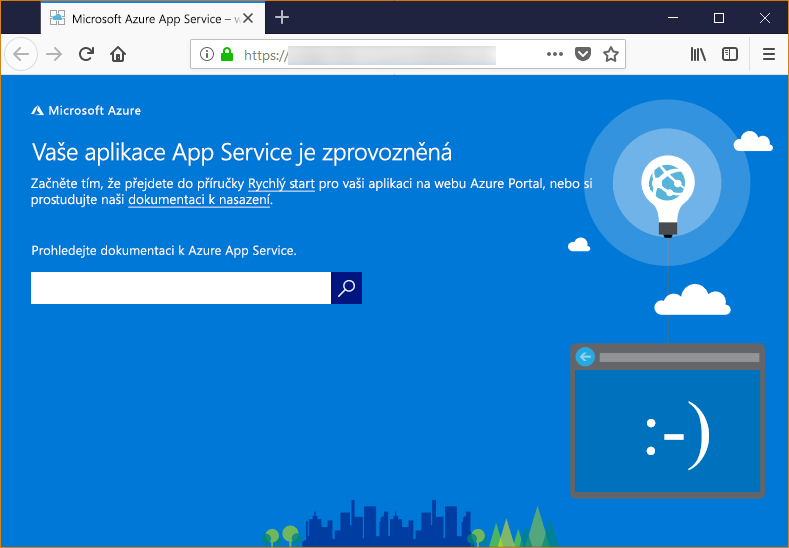

# <a name="configure-your-python-app-for-the-azure-app-service-on-linux"></a>Konfigurace aplikací Pythonu pro službu Azure App Service v Linuxu

Tento článek popisuje, jak [služba Azure App Service v Linuxu](app-service-linux-intro.md) spouští aplikace Pythonu a jak můžete podle potřeby přizpůsobit chování služby App Service.

## <a name="set-python-version"></a>Nastavení verze Pythonu

Jsou k dispozici dva základní Image: Python 3.6 a Python 3.7. Vytvoření aplikace s požadovanou image na základě Python. Například pokud chcete vytvořit aplikaci pomocí Pythonu 3.7, spusťte následující příkaz ve službě Cloud Shell:

```azurecli-interactive
az webapp create --resource-group <group_name> --plan <plan_name> --name <app_name> --runtime "PYTHON|3.7"
```

Chcete-li změnit verzi Pythonu (na základě image) pro Python 3.6, například ve službě Cloud Shell spusťte následující příkaz:

```azurecli-interactive
az webapp config set --resource-group <group_name> --name <app_name> --linux-fx-version "PYTHON|3.6"
```

Pokud potřebujete jinou verzi Pythonu, musíte sestavit a nasadit svoji vlastní image kontejneru. Další informace najdete v [Použití vlastní image dockeru pro Web App for Containers](tutorial-custom-docker-image.md).

## <a name="container-characteristics"></a>Vlastnosti kontejneru

Aplikace v Pythonu nasadily do App Service v Linuxu spusťte v kontejneru Dockeru, který je definován v úložišti GitHub [Python 3.6](https://github.com/Azure-App-Service/python/tree/master/3.6.6) nebo [Python 3.7](https://github.com/Azure-App-Service/python/tree/master/3.7.0).

Tento kontejner má následující vlastnosti:

- Aplikace se spouštějí pomocí [Gunicorn WSGI HTTP Server](http://gunicorn.org/) za použití dalších argumentů `--bind=0.0.0.0 --timeout 600`.

- Základní image zahrnuje ve výchozím nastavení webovou architekturu Flask, ale kontejner podporuje další formáty, které odpovídají WSGI a jsou kompatibilní s Pythonem 3.7, například Django.

- Pokud chcete instalovat doplňkové balíčky, jako třeba Django, vytvořte soubor [*requirements.txt*](https://pip.pypa.io/en/stable/user_guide/#requirements-files) v kořenové složce projektu pomocí `pip freeze > requirements.txt`. Pak publikujte projekt na službu App Service nasazením z Gitu. Tím se automaticky spustí `pip install -r requirements.txt` v kontejneru pro instalaci závislostí aplikace.

## <a name="container-startup-process-and-customizations"></a>Proces spuštění kontejneru a přizpůsobení

V průběhu spuštění služba App Service v kontejneru Linuxu spustí následující kroky:

1. Kontrola a použití vlastního spouštěcího příkazu, pokud byl zadaný.
1. Kontrola existence souboru *wsgi.py* aplikace Django. Když existuje, spuštění serveru Gunicorn za použití tohoto souboru.
1. Kontrola existence souboru *application.py*. Když existuje, spuštění serveru Gunicorn za použití `application:app`. Předpokládá se, že jde o aplikaci Flask.
1. Pokud se žádná další aplikace nenajde, následuje spuštění výchozí aplikace sestavené do kontejneru.

Podrobnosti ke každému bodu poskytnou následující oddíly.

### <a name="django-app"></a>Aplikace Django

Služba App Service hledá pro aplikace Django soubory se jménem `wsgi.py` v kódu aplikace. Pak spustí server Gunicorn s použitím následujícího příkazu:

```bash
# <module> is the path to the folder containing wsgi.py
gunicorn --bind=0.0.0.0 --timeout 600 <module>.wsgi
```

Pokud chcete mít přesnější kontrolu nad spouštěcími příkazy, použijte [vlastní spouštěcí příkaz](#custom-startup-command) a nahraďte `<module>` názvem modulu obsahujícího *wsgi.py*.

### <a name="flask-app"></a>Aplikace Flask

Služba App Service hledá pro aplikace Flask soubor se jménem *application.py* a spustí server Gunicorn následujícím způsobem:

```bash
gunicorn --bind=0.0.0.0 --timeout 600 application:app
```

Pokud je hlavní modul aplikace v jiném souboru, použijte jiný název objektu aplikace. Když chcete zadat další argumenty serveru Gunicorn, použijte [vlastní spouštěcí příkaz](#custom-startup-command). Tenhle oddíl poskytuje příklad použití vstupního kódu v *hello.py* a objektu aplikace Flask s názvem `myapp`.

### <a name="custom-startup-command"></a>Vlastní spouštěcí příkaz

Zadáním vlastního spouštěcího příkazu serveru Gunicorn můžete řídit chování spuštění kontejneru. Například pokud je hlavní modul aplikace Flask *hello.py* a objekt aplikace Flask v tomto souboru se jmenuje `myapp`, vypadá příkaz takto:

```bash
gunicorn --bind=0.0.0.0 --timeout 600 hello:myapp
```

Pokud je hlavní modul v podsložce, například `website`, zadejte tuto složku pomocí argumentu `--chdir`:

```bash
gunicorn --bind=0.0.0.0 --timeout 600 --chdir website hello:myapp
```

Můžete také k příkazu přidat libovolné další argumenty serveru Gunicorn, jako například `--workers=4`. Další informace najdete v [Running Gunicorn (Spuštění serveru Gunicorn)](http://docs.gunicorn.org/en/stable/run.html) (docs.gunicorn.org).

Pokud chcete zadat vlastní příkaz, proveďte následující kroky:

1. Přejděte na stránku [Nastavení aplikace](../web-sites-configure.md?toc=%2fazure%2fapp-service%2fcontainers%2ftoc.json) na webu Azure Portal.

1. V nastavení **Runtime** nastavte volbu **Stack** na **Python 3.7** a zadejte příkaz přímo do pole **Spouštěcí soubor**.

    Jako alternativní způsob můžete uložit příkaz do textového souboru v kořenové složce projektu pod názvem *startup.txt* (nebo libovolným). Pak tento soubor nasaďte do služby App Service a zadejte tento název souboru místo **Spouštěcí soubor**. Tato volba vám umožní spravovat příkaz v úložišti zdrojového kódu, nikoli prostřednictvím webu Azure Portal.

1. Vyberte **Uložit**. Služba App Service se automaticky restartuje. Za několik sekund si ověříte, jestli se vlastní spouštěcí příkaz provedl.

> [!Note]
> Služba App Service ignoruje všechny chyby, ke kterým dojde při zpracování souboru vlastního příkazu. Pak proces spuštění pokračuje hledáním aplikací Flask a Django. Pokud neuvidíte očekávané chování, zkontrolujte, že je spouštěcí soubor nasazený do služby App Service a neobsahuje žádné chyby.

### <a name="default-behavior"></a>Výchozí chování

Pokud služba App Service nenajde vlastní příkaz, aplikaci Django nebo aplikaci Flask, spustí výchozí aplikaci jen pro čtení umístěnou ve složce _opt/defaultsite_. Výchozí aplikace se zobrazí takto:



## <a name="troubleshooting"></a>Řešení potíží

- **Výchozí aplikaci uvidíte po nasazení kódu vlastní aplikace.**  Výchozí aplikace se zobrazí, protože jste buď opravdu nenasadili kód aplikace na službu App Service, nebo se službě App Service nepovedlo najít kód vaší aplikace a spustila místo ní výchozí aplikaci.
  - Restartujte službu App Service, počkejte 15-20 sekund a znovu zkontrolujte aplikaci.
  - Ujistěte se, že používáte App Service pro Linux, a ne instanci založenou na Windows. V Azure CLI spusťte příkaz `az webapp show --resource-group <resource_group_name> --name <app_service_name> --query kind` a hodnoty `<resource_group_name>` a `<app_service_name>` nahraďte odpovídajícím způsobem. Jako výstup by se mělo zobrazit `app,linux`. Pokud ne, vytvořte službu App Service znovu a zvolte Linux.
    - Připojte se přímo ke službě App Service pomocí SSH nebo konzoly Kudu a ověřte, že vaše soubory v *site/wwwroot* existují. Pokud soubory neexistují, zopakujte proces nasazení a aplikaci znovu nasaďte.
  - Pokud soubory existují, neidentifikovala služba App Service konkrétní spouštěcí soubor. Zkontrolujte, že má aplikace strukturu, kterou služba App Service očekává u aplikací [Django](#django-app) nebo [Flask](#flask-app), nebo použijte [vlastní spouštěcí příkaz](#custom-startup-command).
  
- **V prohlížeči se zobrazí zpráva „Služba není dostupná“.** Vypršel časový limit čekání prohlížeče na odpověď služby App Service. To naznačuje, že služba App Service sice spustila server Gunicorn, ale argumenty, které specifikuje kód aplikace, jsou nesprávné.
  - Aktualizujte okno prohlížeče, zejména v případě, že používáte nejnižší cenové úrovně v Plánu služby App Service. Aplikace se může spouštět pomaleji (když používáte například úrovně free) a po aktualizaci okna prohlížeče začne znovu odpovídat.
  - Zkontrolujte, že má aplikace strukturu, kterou služba App Service očekává u aplikací [Django](#django-app) nebo [Flask](#flask-app), nebo použijte [vlastní spouštěcí příkaz](#custom-startup-command).
  - Připojte se ke službě App Service pomocí SSH nebo konzoly Kudu. Zkontrolujte diagnostické protokoly uložené ve složce *LogFiles*. Další informace o protokolování naleznete v [Povolení protokolování diagnostiky pro webové aplikace služby Azure App Service](../web-sites-enable-diagnostic-log.md).
