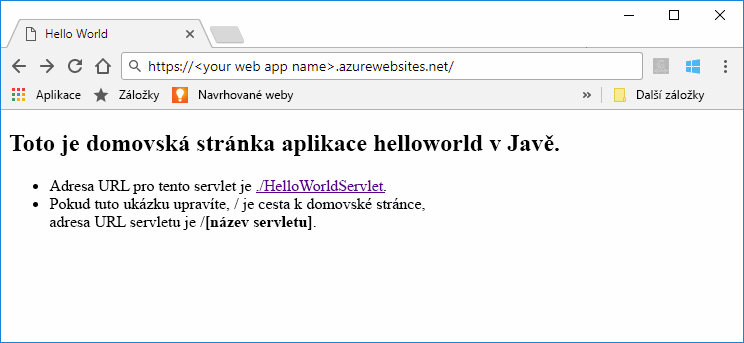
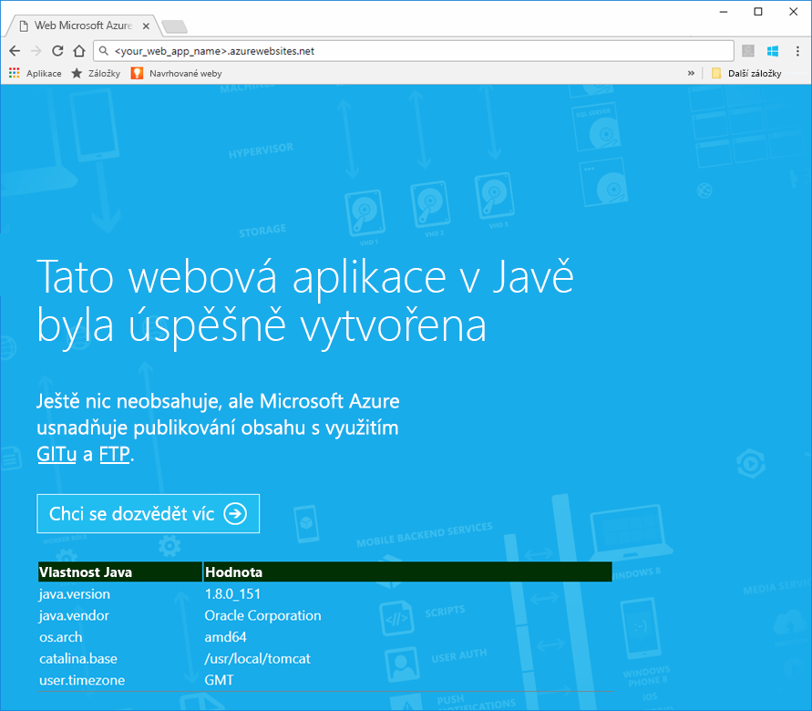
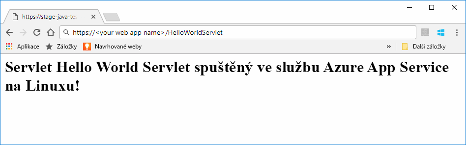
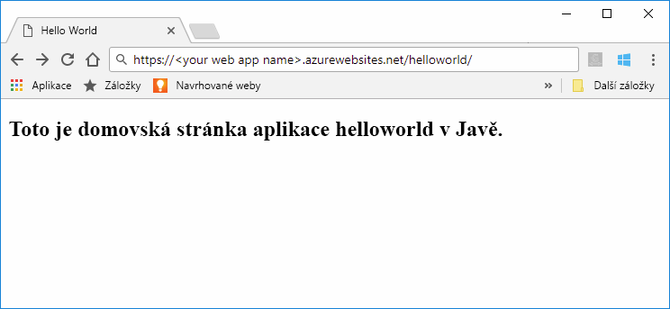
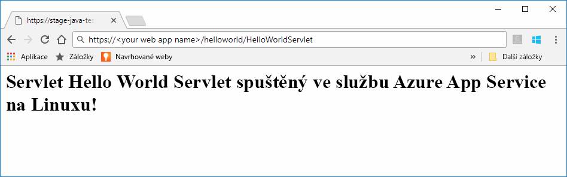

# <a name="preview-create-a-java-web-app-in-app-service-on-linux"></a>Preview: Vytvoření webové aplikace v Javě ve službě App Service v Linuxu

App Service v Linuxu v současné době poskytuje funkci Preview pro podporu webových aplikací v Javě. Další informace o verzích Preview najdete v [dodatečných podmínkách používání verzí Microsoft Azure Preview](https://azure.microsoft.com/support/legal/preview-supplemental-terms/). Alternativním způsobem nasazení aplikace v Javě do vlastního kontejneru je [nasazování webových aplikací v Javě do kontejneru Linuxu v cloudu pomocí sady Azure Toolkit pro IntelliJ](https://docs.microsoft.com/java/azure/intellij/azure-toolkit-for-intellij-hello-world-web-app-linux).

> [!NOTE]
> V tomto článku se nasadí webová aplikace v Javě do služby App Service v Linuxu.
>

[App Service v Linuxu](app-service-linux-intro.md) je vysoce škálovatelná služba s automatickými opravami pro hostování webů s využitím operačního systému Linux. Tento rychlý start ukazuje, jak nasadit aplikaci v Javě do služby App Service v Linuxu s použitím integrované image. Pomocí [Azure CLI](https://docs.microsoft.com/cli/azure/get-started-with-azure-cli) vytvoříte webovou aplikaci s použitím integrované image a do této webové aplikace nasadíte aplikaci v Javě.



[!INCLUDE [quickstarts-free-trial-note](../../../includes/quickstarts-free-trial-note.md)]


## <a name="prerequisites"></a>Požadavky

K provedení kroků v tomto kurzu Rychlý start je potřeba: 

* Mít předplatné Azure. Pokud ještě nemáte předplatné Azure, vytvořte si [bezplatný účet](https://azure.microsoft.com/free/?ref=microsoft.com&utm_source=microsoft.com&utm_medium=docs&utm_campaign=visualstudio) před tím, než začnete.
* [Nainstalovat Git](https://git-scm.com/).
* Nainstalovat [Eclipse](https://www.eclipse.org/downloads/).


[!INCLUDE [cloud-shell-try-it.md](../../../includes/cloud-shell-try-it.md)]

[!INCLUDE [Configure deployment user](../../../includes/configure-deployment-user.md)]


## <a name="create-a-resource-group"></a>Vytvoření skupiny prostředků

Ve službě Cloud Shell vytvořte skupinu prostředků pomocí příkazu [`az group create`](/cli/azure/group?view=azure-cli-latest#az_group_create). Následující příklad vytvoří skupinu prostředků *myResourceGroup* v umístění *Západní Evropa*. Pokud chcete zobrazit všechna podporovaná umístění pro službu App Service, spusťte příkaz [`az appservice list-locations`](/cli/azure/appservice?view=azure-cli-latest#az_appservice_list_locations).

```azurecli-interactive
az group create --name myResourceGroup --location "West US"
```

Obvykle budete svoji skupinu prostředků a prostředky vytvářet v oblasti, kterou máte blízko. 

Po dokončení příkazu se ve výstupu JSON zobrazí vlastnosti skupiny prostředků.


[!INCLUDE [Create app service plan](../../../includes/app-service-web-create-app-service-plan-linux.md)]


## <a name="create-a-web-app"></a>Vytvoření webové aplikace

Ve službě Cloud Shell vytvořte [webovou aplikaci](../app-service-web-overview.md) v plánu služby `myAppServicePlan` App Service. Můžete to udělat pomocí příkazu [`az webapp create`](/cli/azure/webapp?view=azure-cli-latest#az_webapp_create). V následujícím příkladu nahraďte *\<app_name>* globálně jedinečným názvem aplikace (platné znaky jsou `a-z`, `0-9` a `-`). 

```azurecli-interactive
az webapp create --name <app_name> --resource-group myResourceGroup --plan myAppServicePlan --runtime "TOMCAT|8.5-jre8"
```

V parametru **runtime** použijte jeden z následujících modulů runtime:
 * TOMCAT|8.5-jre8
 * TOMCAT|9.0-jre8


Po vytvoření webové aplikace se v rozhraní příkazového řádku Azure CLI zobrazí podobné informace jako v následujícím příkladu:

```json
{
  "additionalProperties": {},
  "availabilityState": "Normal",
  "clientAffinityEnabled": true,
  "clientCertEnabled": false,
  "cloningInfo": null,
  "containerSize": 0,
  "dailyMemoryTimeQuota": 0,
  "defaultHostName": "<your web app name>.azurewebsites.net",
  "enabled": true,
  "enabledHostNames": [
    "<your web app name>.azurewebsites.net",
    "<your web app name>.scm.azurewebsites.net"
  ],
  "ftpPublishingUrl": "ftp://<your ftp URL>",  
  < JSON data removed for brevity. >
}
```

Zkopírujte hodnotu **ftpPublishingUrl**. Použijete ji později, pokud zvolíte nasazení přes protokol FTP.

Přejděte do nově vytvořené webové aplikace.

```
http://<app_name>.azurewebsites.net
```

Pokud je webová aplikace spuštěná, měla by se zobrazit výchozí obrazovka podobně jako na následujícím obrázku:




## <a name="download-the-sample-java-app"></a>Stažení ukázkové aplikace v Javě

V okně terminálu na svém počítači naklonujte spuštěním následujícího příkazu úložiště ukázkové aplikace do místního počítače. Tuto ukázkovou aplikaci nasadíte v pozdějším kroku.

```bash
git clone https://github.com/Azure-Samples/java-docs-hello-world
```


## <a name="deploying-the-java-app-to-app-service-on-linux"></a>Nasazení aplikace v Javě do služby App Service v Linuxu

Otevřete ukázkový projekt v [Eclipse](https://www.eclipse.org/downloads/) a [exportujte aplikaci v Javě do souboru webového archivu (WAR)](http://help.eclipse.org/kepler/index.jsp?topic=%2Forg.eclipse.wst.webtools.doc.user%2Ftopics%2Ftwcrewar.html) s názvem `helloworld.war`.

K nasazení souboru WAR aplikace v Javě můžete použít WarDeploy (aktuálně ve verzi [Preview](https://azure.microsoft.com/support/legal/preview-supplemental-terms/)) nebo protokol FTP.

V závislosti na použité metodě nasazení se relativní cesta k vaší webové aplikaci v Javě bude mírně lišit.

### <a name="deploy-with-wardeploy"></a>Nasazení pomocí WarDeploy 

Pokud chcete svůj soubor WAR nasadit pomocí WarDeploy, pomocí následujícího příkladu příkazového řádku cURL odešlete požadavek POST na adresu *https://<your app name>.scm.azurewebsites.net/api/wardeploy*. Požadavek POST musí obsahovat soubor .war v textu zprávy. Přihlašovací údaje pro nasazení vaší aplikace jsou zahrnuté v požadavku s použitím HTTP BASIC Authentication. Další informace o WarDeploy najdete v tématu [Nasazení aplikace do služby Azure App Service pomocí souboru ZIP nebo WAR](../app-service-deploy-zip.md).

```bash
curl -X POST -u <username> --data-binary @"<war_file_path>" https://<app_name>.scm.azurewebsites.net/api/wardeploy
```

Aktualizujte následující položky:

* `username` – Použijte uživatelské jméno přihlašovacích údajů pro nasazení, které jste vytvořili dříve.
* `war_file_path` – Použijte cestu k místnímu souboru WAR.
* `app_name` – Použijte název aplikace, který jste vytvořili dříve.

Spusťte příkaz. Po zobrazení výzvy cURL zadejte heslo přihlašovacích údajů pro nasazení.

Ve webovém prohlížeči pomocí následující adresy URL přejděte do nasazené aplikace.

```bash
http://<app_name>.azurewebsites.net
```

Vzorový kód v Javě je spuštěný ve webové aplikaci s použitím integrované image.


Ve webovém prohlížeči přejděte na servlet.

```bash
http://<app_name>.azurewebsites.net/HelloWorldServlet
```

Servlet je spuštěný ve webové aplikaci s použitím integrované image.




**Blahopřejeme!** Nasadili jste svou první aplikaci v Javě do služby App Service v Linuxu.


### <a name="ftp-deployment"></a>Nasazení přes protokol FTP

Alternativně můžete k nasazení souboru WAR použít také protokol FTP. 

Nahrajte soubor přes protokol FTP do adresáře */home/site/wwwroot/webapps* vaší webové aplikace. Následující příklad příkazového řádku používá cURL:

```bash
curl -T war_file_path -u "app_name\username" ftp://webappFTPURL/site/wwwroot/webapps/
```

Aktualizujte následující položky:

* `war_file_path` – Použijte cestu k místnímu souboru WAR.
* `app_name` – Použijte název aplikace, který jste vytvořili dříve.
* `username` – Použijte uživatelské jméno přihlašovacích údajů pro nasazení, které jste vytvořili dříve.
* `webappFTPURL` – Použijte dříve zkopírovanou hodnotu **Název hostitele FTP** pro vaši webovou aplikaci. Název hostitele FTP je uvedený také v okně **Přehled** pro vaši webovou aplikaci na webu [Azure Portal](https://portal.azure.com/).

Spusťte příkaz. Po zobrazení výzvy cURL zadejte heslo přihlašovacích údajů pro nasazení.


Ve webovém prohlížeči pomocí následující adresy URL přejděte do nasazené aplikace.

```bash
http://<app_name>.azurewebsites.net/helloworld
```

Vzorový kód v Javě je spuštěný ve webové aplikaci s použitím integrované image.



Ve webovém prohlížeči přejděte na servlet.

```bash
http://<app_name>.azurewebsites.net/helloworld/HelloWorldServlet
```

Vzorový kód v Javě je spuštěný ve webové aplikaci s použitím integrované image.




**Blahopřejeme!** Nasadili jste svou první aplikaci v Javě do služby App Service v Linuxu.


[!INCLUDE [cli-samples-clean-up](../../../includes/cli-samples-clean-up.md)]


## <a name="next-steps"></a>Další kroky

Další informace o použití Javy v Azure najdete na následujících odkazech:

* [Azure pro vývojáře v Javě](https://docs.microsoft.com/java/azure/)
* [Nasazení webové aplikace Hello World do kontejneru pro Linux v cloudu s využitím sady Azure Toolkit pro IntelliJ](https://docs.microsoft.com/java/azure/intellij/azure-toolkit-for-intellij-hello-world-web-app-linux)
* [Nástroje Java pro Visual Studio Team Services](https://java.visualstudio.com/)
