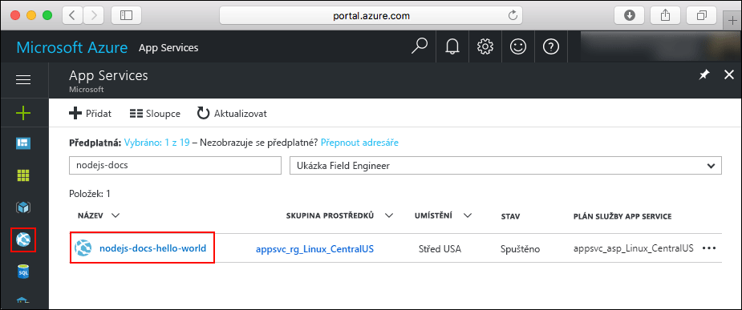
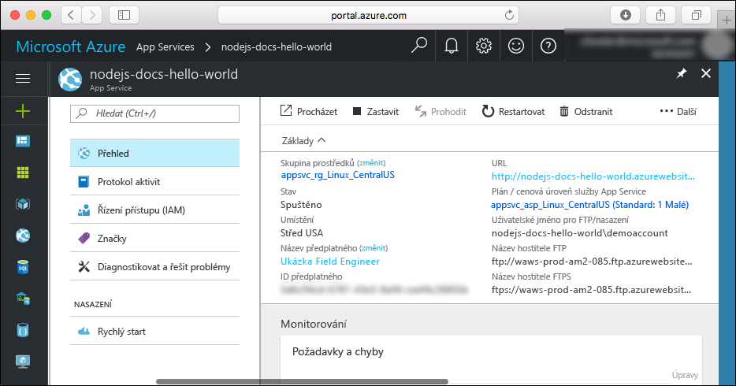

# <a name="create-a-nodejs-app-in-azure-app-service-on-linux"></a>Vytvoření aplikace Node.js ve službě Azure App Service v Linuxu

> [!NOTE]
> Tento článek nasadí aplikaci do služby App Service v Linuxu. Nasazení do služby App Service v _Windows_, naleznete v tématu [vytvoření aplikace Node.js v Azure](../app-service-web-get-started-nodejs.md).
>

[App Service v Linuxu](app-service-linux-intro.md) je vysoce škálovatelná služba s automatickými opravami pro hostování webů s využitím operačního systému Linux. Tento rychlý start ukazuje, jak nasadit aplikaci Node.js do služby App Service v Linuxu s použitím služby [Cloud Shell](https://docs.microsoft.com/azure/cloud-shell/overview).

Absolvujete ho ve službě Cloud Shell, ale příkazy můžete také spouštět místně pomocí [Azure CLI](/cli/azure/install-azure-cli).


[!INCLUDE [quickstarts-free-trial-note](../../../includes/quickstarts-free-trial-note.md)]

[!INCLUDE [cloud-shell-try-it.md](../../../includes/cloud-shell-try-it.md)]

## <a name="download-the-sample"></a>Stažení ukázky

Ve službě Cloud Shell vytvořte adresář rychlého startu a přejděte do něj.

```bash
mkdir quickstart

cd quickstart
```

Potom spusťte následující příkaz, pomocí kterého do tohoto adresáře naklonujete úložiště ukázkové aplikace.

```bash
git clone https://github.com/Azure-Samples/nodejs-docs-hello-world
```

Při spuštění příkaz zobrazí podobné informace jako v následujícím příkladu:

```bash
Cloning into 'nodejs-docs-hello-world'...
remote: Counting objects: 40, done.
remote: Total 40 (delta 0), reused 0 (delta 0), pack-reused 40
Unpacking objects: 100% (40/40), done.
Checking connectivity... done.
```

## <a name="create-a-web-app"></a>Vytvoření webové aplikace

Přejděte do adresáře, který obsahuje vzorový kód a spusťte příkaz `az webapp up`.

V následujícím příkladu nahraďte <app_name > jedinečným názvem aplikace.

```bash
cd nodejs-docs-hello-world

az webapp up -n <app_name>
```

Spuštění tohoto příkazu může trvat několik minut. Při spuštění příkaz zobrazí podobné informace jako v následujícím příkladu:

```json
Creating Resource group 'appsvc_rg_Linux_CentralUS' ...
Resource group creation complete
Creating App service plan 'appsvc_asp_Linux_CentralUS' ...
App service plan creation complete
Creating app '<app_name>' ....
Webapp creation complete
Updating app settings to enable build after deployment
Creating zip with contents of dir /home/username/quickstart/nodejs-docs-hello-world ...
Preparing to deploy and build contents to app.
Fetching changes.

Generating deployment script.
Generating deployment script.
Generating deployment script.
Running deployment command...
Running deployment command...
Running deployment command...
Deployment successful.
All done.
{
  "app_url": "https://<app_name>.azurewebsites.net",
  "location": "Central US",
  "name": "<app_name>",
  "os": "Linux",
  "resourcegroup": "appsvc_rg_Linux_CentralUS ",
  "serverfarm": "appsvc_asp_Linux_CentralUS",
  "sku": "STANDARD",
  "src_path": "/home/username/quickstart/nodejs-docs-hello-world ",
  "version_detected": "6.9",
  "version_to_create": "node|6.9"
}
```

Příkaz `az webapp up` provádí tyto akce:

- Vytvoření výchozí skupiny prostředků

- Vytvoření výchozího plánu služby App Service

- Vytvoření aplikace se zadaným názvem

- [Nasazení ZIP](https://docs.microsoft.com/azure/app-service/deploy-zip) soubory z aktuálního pracovního adresáře do aplikace.

## <a name="browse-to-the-app"></a>Přechod do aplikace

V prohlížeči zadejte adresu nasazené aplikace. Nahraďte název vaší aplikace < název_aplikace >.

```bash
http://<app_name>.azurewebsites.net
```

Vzorový kód Node.js je spuštěný ve službě App Service v Linuxu s použitím integrované image.


**Blahopřejeme!** Nasadili jste svoji první aplikaci Node.js do služby App Service v Linuxu.

## <a name="update-and-redeploy-the-code"></a>Aktualizace a opětovné nasazení kódu

Ve službě Cloud Shell otevřete textový editor nano zadáním příkazu `nano index.js`.


 Proveďte malou změnu textu ve volání na `response.end`:

```nodejs
response.end("Hello Azure!");
```

Uložte změny a editor nano zavřete. K uložení použijte příkaz `^O` a k zavření příkaz `^X`.

Teď můžete aplikaci opětovně nasadit. Náhradní `<app_name>` s vaší aplikací.

```bash
az webapp up -n <app_name>
```

Po dokončení nasazení se vraťte do okna prohlížeče, které se otevřelo v kroku **Přechod do aplikace**, a aktualizujte zobrazení stránky.


## <a name="manage-your-new-azure-app"></a>Správa nové aplikace Azure

Přejděte <a href="https://portal.azure.com" target="_blank">webu Azure portal</a> ke správě aplikace, které jste vytvořili.

V levé nabídce klikněte na tlačítko **App Services**a pak klikněte na název aplikace Azure.



Se zobrazí stránka s přehledem vaší aplikace. Tady můžete provádět základní úkoly správy, jako je procházení, zastavení, spuštění, restartování a odstranění.



Levá nabídka obsahuje odkazy na různé stránky pro konfiguraci vaší aplikace.

## <a name="clean-up-resources"></a>Vyčištění prostředků

V předchozích krocích jste vytvořili prostředky Azure ve skupině prostředků. Pokud předpokládáte, že už tyto prostředky nebudete potřebovat, odstraňte skupinu prostředků ze služby Cloud Shell. Pokud jste upravili oblast, aktualizujte název skupiny prostředků `appsvc_rg_Linux_CentralUS` na skupinu prostředků specifickou pro vaši aplikaci.

```azurecli-interactive
az group delete --name appsvc_rg_Linux_CentralUS
```

Spuštění tohoto příkazu může trvat přibližně minut.

## <a name="next-steps"></a>Další postup

> [!div class="nextstepaction"]
> [Node.js s databází MongoDB](tutorial-nodejs-mongodb-app.md)
