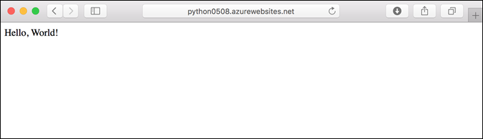
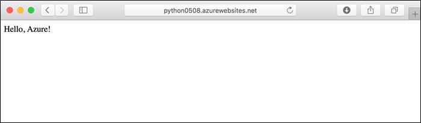
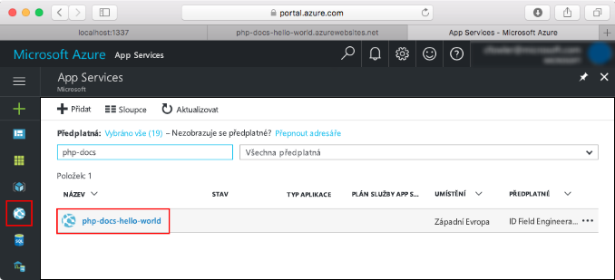
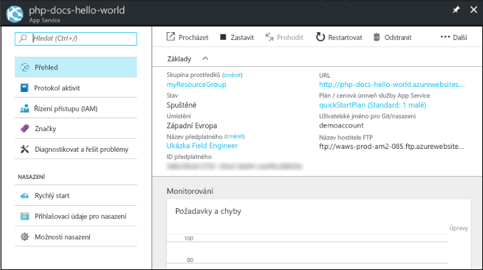

# <a name="create-a-python-app-in-azure-app-service-on-linux-preview"></a>Vytvoření aplikace v Pythonu v Azure App Service v Linuxu (Preview)

[App Service v Linuxu](app-service-linux-intro.md) je vysoce škálovatelná služba s automatickými opravami pro hostování webů s využitím operačního systému Linux. Tento rychlý start ukazuje, jak nasadit aplikaci v Pythonu na integrovanou image Pythonu (verze Preview) ve službě App Service v Linuxu pomocí [Azure CLI](/cli/azure/install-azure-cli).

Postup v tomto článku můžete použít v případě počítačů se systémem Mac, Windows nebo Linux.



[!INCLUDE [quickstarts-free-trial-note](../../../includes/quickstarts-free-trial-note.md)]

## <a name="prerequisites"></a>Požadavky

K provedení kroků v tomto kurzu Rychlý start je potřeba:

* <a href="https://www.python.org/downloads/" target="_blank">Nainstalovat Python 3.7</a>
* <a href="https://git-scm.com/" target="_blank">Nainstalovat Git</a>.

## <a name="download-the-sample-locally"></a>Místní stažení ukázky

V okně terminálu naklonujte spuštěním následujících příkazů ukázkovou aplikaci do místního počítače a přejděte do adresáře s ukázkovým kódem.

```bash
git clone https://github.com/Azure-Samples/python-docs-hello-world
cd python-docs-hello-world
```

Obsahuje úložiště *application.py*, která informuje službu App Service, že úložiště obsahuje aplikaci Flask. Další informace najdete v tématu [proces spuštění kontejneru a přizpůsobení](how-to-configure-python.md).

## <a name="run-the-app-locally"></a>Místní spuštění aplikace

Spusťte aplikaci místně, abyste viděli, jak by měla vypadat po nasazení do Azure. Otevřete okno terminálu a pomocí následujících příkazů nainstalujte požadované závislosti a spusťte integrovaný vývojový server. 

```bash
# In Bash
python3 -m venv venv
source venv/bin/activate
pip install -r requirements.txt
FLASK_APP=application.py flask run

# In PowerShell
py -3 -m venv env
env\scripts\activate
pip install -r requirements.txt
Set-Item Env:FLASK_APP ".\application.py"
flask run
```

Otevřete webový prohlížeč a přejděte do ukázkové aplikace na adrese `http://localhost:5000/`.

Na stránce se zobrazí zpráva **Hello World!** z ukázkové aplikace.


V okně terminálu ukončete webový server stisknutím **Ctrl + C**.

[!INCLUDE [cloud-shell-try-it.md](../../../includes/cloud-shell-try-it.md)]

## <a name="download-the-sample"></a>Stažení ukázky

Ve službě Cloud Shell vytvořte adresář rychlého startu a přejděte do něj.

```bash
mkdir quickstart

cd quickstart
```

Potom spusťte následující příkaz, pomocí kterého do tohoto adresáře naklonujete úložiště ukázkové aplikace.

```bash
git clone https://github.com/Azure-Samples/python-docs-hello-world
```

Při spuštění příkaz zobrazí podobné informace jako v následujícím příkladu:

```bash
Cloning into 'python-docs-hello-world'...
remote: Enumerating objects: 43, done.
remote: Total 43 (delta 0), reused 0 (delta 0), pack-reused 43
Unpacking objects: 100% (43/43), done.
Checking connectivity... done.
```

## <a name="create-a-web-app"></a>Vytvoření webové aplikace

Přejděte do adresáře, který obsahuje vzorový kód a spusťte příkaz `az webapp up`.

V následujícím příkladu nahraďte <app_name > jedinečným názvem aplikace.

```bash
cd python-docs-hello-world

az webapp up -n <app_name>
```

Spuštění tohoto příkazu může trvat několik minut. Při spuštění příkaz zobrazí podobné informace jako v následujícím příkladu:

```json
The behavior of this command has been altered by the following extension: webapp
Creating Resource group 'appsvc_rg_Linux_CentralUS' ...
Resource group creation complete
Creating App service plan 'appsvc_asp_Linux_CentralUS' ...
App service plan creation complete
Creating app '<app_name>' ....
Webapp creation complete
Creating zip with contents of dir /home/username/quickstart/python-docs-hello-world ...
Preparing to deploy contents to app.
All done.
{
  "app_url": "https:/<app_name>.azurewebsites.net",
  "location": "Central US",
  "name": "<app_name>",
  "os": "Linux",
  "resourcegroup": "appsvc_rg_Linux_CentralUS ",
  "serverfarm": "appsvc_asp_Linux_CentralUS",
  "sku": "BASIC",
  "src_path": "/home/username/quickstart/python-docs-hello-world ",
  "version_detected": "-",
  "version_to_create": "python|3.7"
}
```

Příkaz `az webapp up` provádí tyto akce:

- Vytvoření výchozí skupiny prostředků

- Vytvoření výchozího plánu služby App Service

- Vytvoření aplikace se zadaným názvem

- [Nasazení ZIP](https://docs.microsoft.com/azure/app-service/deploy-zip) soubory z aktuálního pracovního adresáře do aplikace.

## <a name="browse-to-the-app"></a>Přechod do aplikace

V prohlížeči zadejte adresu nasazené aplikace.

```bash
http://<app_name>.azurewebsites.net
```

Vzorový kód Pythonu je spuštěný ve službě App Service v Linuxu s použitím integrované image.


**Blahopřejeme!** Nasadili jste svoji první aplikaci v Pythonu do služby App Service v Linuxu.

## <a name="update-locally-and-redeploy-the-code"></a>Místní aktualizace a opětovné nasazení kódu

Ve službě Cloud Shell zadejte `code application.py` otevřete editor pro Cloud Shell.


 Proveďte malou změnu textu ve volání na `return`:

```python
return "Hello Azure!"
```

Uložte změny a zavřete editor. K uložení použijte příkaz `^S` a k zavření příkaz `^Q`.

Teď můžete aplikaci opětovně nasadit. Náhradní `<app_name>` s vaší aplikací.

```bash
az webapp up -n <app_name>
```

Po dokončení nasazení se vraťte do okna prohlížeče, které se otevřelo v kroku **Přechod do aplikace**, a aktualizujte zobrazení stránky.



## <a name="manage-your-new-azure-app"></a>Správa nové aplikace Azure

Přejděte <a href="https://portal.azure.com" target="_blank">webu Azure portal</a> ke správě aplikace, které jste vytvořili.

V levé nabídce klikněte na tlačítko **App Services**a pak klikněte na název aplikace Azure.



Se zobrazí stránka s přehledem vaší aplikace. Tady můžete provádět základní úlohy správy, jako je procházení, zastavení, spuštění, restartování a odstranění.



Levá nabídka obsahuje odkazy na různé stránky pro konfiguraci vaší aplikace. 

[!INCLUDE [cli-samples-clean-up](../../../includes/cli-samples-clean-up.md)]

## <a name="next-steps"></a>Další postup

Integrovaná image v Pythonu v rámci služby App Service v Linuxu je aktuálně ve verzi Preview a je možné přizpůsobit příkaz sloužící ke spuštění vaší aplikace. Produkční aplikace v Pythonu můžete místo toho vytvářet taky s využitím vlastního kontejneru.

> [!div class="nextstepaction"]
> [Python sh PostgreSQL](tutorial-python-postgresql-app.md)

> [!div class="nextstepaction"]
> [Konfigurace vlastního spouštěcího příkazu](how-to-configure-python.md#customize-startup-command)

> [!div class="nextstepaction"]
> [Řešení potíží](how-to-configure-python.md#troubleshooting)

> [!div class="nextstepaction"]
> [Použití vlastní image](tutorial-custom-docker-image.md)
