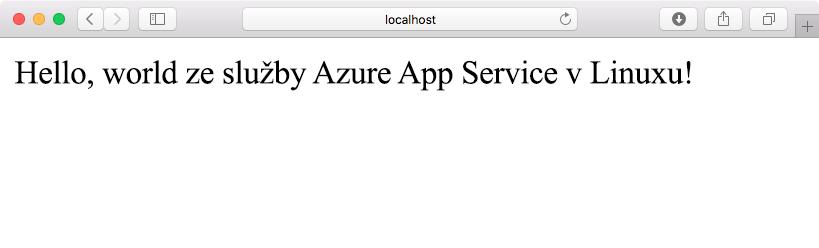
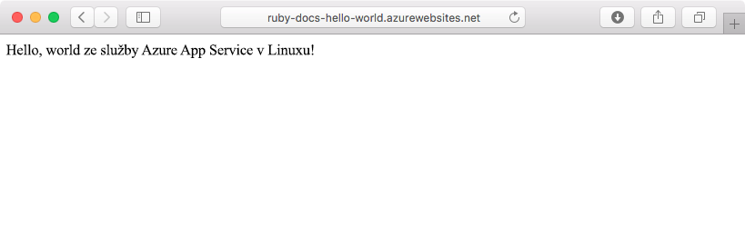
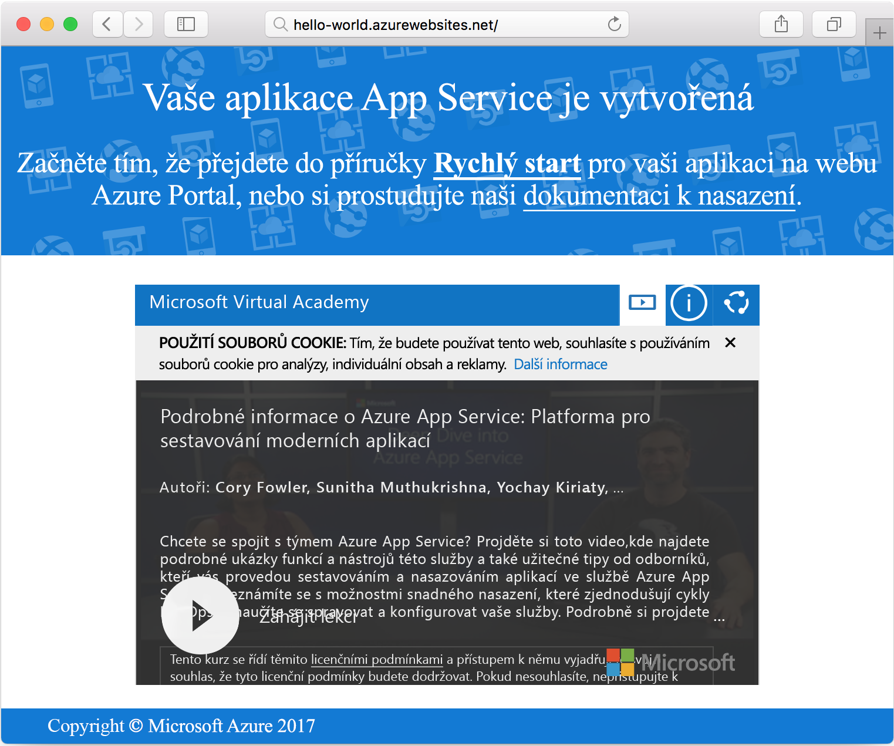

# <a name="create-a-ruby-app-in-app-service-on-linux"></a>Vytvoření aplikace v Ruby ve službě App Service v Linuxu

[Azure App Service v Linuxu](app-service-linux-intro.md) je vysoce škálovatelná služba s automatickými opravami pro hostování webů. V tomto rychlém startu se dozvíte, jak vytvořit základní aplikaci v [Ruby on Rails](https://rubyonrails.org/), kterou pak můžete nasadit do Azure jako webovou aplikaci v Linuxu.



[!INCLUDE [quickstarts-free-trial-note](../../../includes/quickstarts-free-trial-note.md)]

## <a name="prerequisites"></a>Požadavky

* <a href="https://www.ruby-lang.org/en/documentation/installation/#rubyinstaller" target="_blank">Nainstalovat Ruby 2.3 nebo novější</a>.
* <a href="https://git-scm.com/" target="_blank">Nainstalovat Git</a>.

## <a name="download-the-sample"></a>Stažení ukázky

V okně terminálu naklonujte spuštěním následujícího příkazu úložiště ukázkové aplikace do místního počítače:

```bash
git clone https://github.com/Azure-Samples/ruby-docs-hello-world
```

## <a name="run-the-application-locally"></a>Místní spuštění aplikace

Aby aplikace fungovala, musí běžet server Rails. Přejděte do adresáře `hello-world` a spusťte server pomocí příkazu `rails server`.

```bash
cd hello-world\bin
rails server
```

Ve webovém prohlížeči přejděte na adresu `http://localhost:3000` a místně otestujte aplikaci.



[!INCLUDE [Try Cloud Shell](../../../includes/cloud-shell-try-it.md)]

[!INCLUDE [Configure deployment user](../../../includes/configure-deployment-user.md)]

[!INCLUDE [Create resource group](../../../includes/app-service-web-create-resource-group-linux.md)]

[!INCLUDE [Create app service plan](../../../includes/app-service-web-create-app-service-plan-linux.md)]

## <a name="create-a-web-app"></a>Vytvoření webové aplikace

[!INCLUDE [Create web app](../../../includes/app-service-web-create-web-app-ruby-linux-no-h.md)] 

Přejděte na web a zobrazte nově vytvořenou webovou aplikaci s použitím integrované image. Nahraďte _&lt;app name>_ názvem vaší webové aplikace.

```bash
http://<app_name>.azurewebsites.net
```

Vaše nová webová aplikace by měla vypadat takto:



## <a name="deploy-your-application"></a>Nasazení aplikace

Spuštěním následujících příkazů nasaďte místní aplikaci do webu Azure:

```bash
git remote add azure <Git deployment URL from above>
git add -A
git commit -m "Initial deployment commit"
git push azure master
```

Zkontrolujte, že operace vzdáleného nasazení hlásí úspěch. Příkazy vygenerují výstup podobný následujícímu textu:

```bash
remote: Using sass-rails 5.0.6
remote: Updating files in vendor/cache
remote: Bundle gems are installed into ./vendor/bundle
remote: Updating files in vendor/cache
remote: ~site/repository
remote: Finished successfully.
remote: Running post deployment command(s)...
remote: Deployment successful.
To https://<your web app name>.scm.azurewebsites.net/<your web app name>.git
  579ccb....2ca5f31  master -> master
myuser@ubuntu1234:~workspace/<app name>$
```

Po dokončení nasazení pomocí příkazu [`az webapp restart`](/cli/azure/webapp?view=azure-cli-latest#az_webapp_restart) restartujte webovou aplikaci, aby se nasazení projevilo. Tady je příklad příkazu:

```azurecli-interactive
az webapp restart --name <app name> --resource-group myResourceGroup
```

Přejděte na váš web a ověřte výsledky.

```bash
http://<app name>.azurewebsites.net
```


> [!NOTE]
> Pokud se pokusíte o procházení webu v průběhu restartování aplikace, výsledkem bude stavový kód HTTP `Error 503 Server unavailable`. Úplné restartování může trvat několik minut.
>

[!INCLUDE [Clean-up section](../../../includes/cli-script-clean-up.md)]

## <a name="next-steps"></a>Další kroky

> [!div class="nextstepaction"]
> [Ruby on Rails s MySQL](tutorial-ruby-mysql-app.md)
