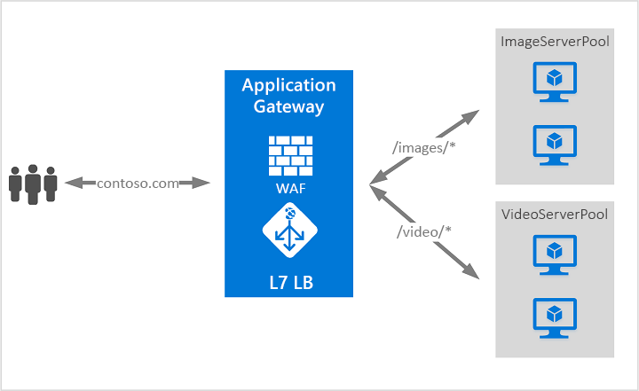

# Co je Azure Application Gateway?

Azure Application Gateway je nástroj pro vyrovnávání zatížení webových přenosů, který vám umožní spravovat provoz do webových aplikací. Nástroje pro vyrovnávání zatížení obvykle fungují na přenosové vrstvě (vrstva OSI 4 – TCP a UDP) a směrují provoz na základě zdrojové IP adresy a portu do cílové IP adresy a portu.

Ale pomocí Application Gateway to může být ještě konkrétnější. Můžete například směrovat provoz na základě příchozí adresy URL. Pokud tedy příchozí adresa URL obsahuje `/images`, můžete směrovat provoz na konkrétní sadu serverů (označovanou jako fond), která je nakonfigurovaná pro obrázky. Pokud je v adrese URL `/video`, bude se takový provoz směrovat na jiný fond optimalizovaný pro videa.

Tento typ směrování se označuje jako vyrovnávání zatížení aplikační vrstvy (vrstva OSI 7). Azure Application Gateway umí směrování na základě adresy URL, ale to není vše. 

Součástí Azure Application Gateway jsou následující funkce:

## Automatické škálování ve veřejné verzi Preview

Kromě funkcí popsaných v tomto článku Služba Application Gateway také nabízí verze public preview nové SKU [Standard_V2], která nabízí automatické škálování a další vylepšení výkonu kritické.

- **Automatické škálování** – nasazení služby Application Gateway nebo WAF na základě automatického škálování skladové položky můžete vertikálně navyšovat nebo snižovat podle změn vzorců provozní zátěže. Automatické škálování také eliminuje nutnost zvolit během zřizování velikost nasazení nebo počet instancí. 

- **Redundance zón** – nasazení služby Application Gateway nebo WAF může zahrnovat více zón dostupnosti Azure, není potřeba zřizovat a otáčet samostatné instance služby Application Gateway v každé zóně pomocí Microsoft Azure Traffic Manageru.

- **Virtuální IP adresy statické** – virtuální IP adresa služby Application Gateway nyní podporuje výhradně statický typ VIP. Tím se zajistí, že se virtuální IP adresy přidružené k službě Application Gateway nezmění ani po restartování počítače.

- **Rychlejší nasazení a aktualizace** v porovnání s obecně dostupnými skladovými položkami. 

- **5 x vyšší výkon přesměrování zpracování SSL** v porovnání s obecně dostupnými skladovými položkami.

Další informace o funkcích Public Preview služby Application Gateway najdete v článku [Automaticky škálovaná a zónově redundantní služba Application Gateway (Public Preview)](application-gateway-autoscaling-zone-redundant.md).

## Ukončení protokolu SSL (Secure Sockets Layer)

Služba Application Gateway podporuje ukončení protokolu SSL na bráně, po čemž provoz typicky teče nešifrován na back-endové servery. Tato funkce webovým serverům umožňuje snížení nákladné režie spojené s šifrováním a dešifrováním. Ale někdy nešifrovaná komunikace s servery nepřijatelnou možností. Může to být z důvodu požadavků na zabezpečení, požadavky na dodržování předpisů, nebo aplikace může přijímat pouze zabezpečená připojení. Pro tyto aplikace služba application gateway podporuje koncové šifrování protokolu SSL.

## Preview řadiče příchozího přenosu dat služby Azure Kubernetes Service (AKS) 

Řadič příchozího přenosu dat služby Application Gateway běží jako pod v rámci clusteru AKS a umožňuje službě Application Gateway fungovat jako příchozí přenos dat pro cluster AKS. 

Další informace najdete v tématu [Řadič příchozího přenosu dat služby Azure Application Gateway](https://azure.github.io/application-gateway-kubernetes-ingress/).

## Vyprázdnění připojení

Vyprázdnění připojení vám pomůže provést řádné odebrání členů back-endového fondu při plánovaných servisních aktualizacích. Toto nastavení je povoleno prostřednictvím nastavení HTTP back-endu a lze je použít při vytváření pravidla u všech členů back-endového fondu. Je-li služba Application Gateway povolena, zajistí, aby instance back-endového fondu, u nichž se ruší registrace, nedostávaly žádné nové žádosti, a zároveň umožní dokončit stávající žádosti v nakonfigurovaném časovém limitu. To platí jak pro instance back-endu, které jsou výslovně odebrány z back-endového fondu na základě volání rozhraní API, tak pro takové, které jsou podle sond stavu hlášeny jako poškozené.

## Vlastní chybové stránky
Služba Application Gateway vám umožní vytvořit vlastní chybové stránky místo zobrazení výchozích chybových stránek. U vlastní chybové stránky můžete použít vlastní značky a rozložení.

Další informace najdete v tématu [Vytvoření vlastních chybových stránek služby Application Gateway](custom-error.md).

## Brána firewall webových aplikací

Firewall webových aplikací (WAF) je funkce služby Application Gateway poskytující centralizovanou ochranu webových aplikací před běžným zneužitím a ohrožením zabezpečení. Firewall webových aplikací (WAF) je založený na [základní sadě pravidel OWASP (Open Web Application Security Project)](https://www.owasp.org/index.php/Category:OWASP_ModSecurity_Core_Rule_Set_Project) 3.0 nebo 2.2.9. 

Webové aplikace se čím dál častěji stávají cílem škodlivých útoků, které zneužívají běžně známé chyby zabezpečení. Mezi tyto běžné typy zneužití patří mimo jiné například útoky prostřednictvím injektáže SQL nebo skriptování mezi weby. Předcházet takovým útokům v kódu aplikace může být náročné a může vyžadovat pečlivou údržbu, opravy a monitorování mnoha vrstev topologie aplikace. Centralizovaný firewall webových aplikací značně zjednodušuje správu zabezpečení a nabízí správcům lepší ochranu aplikací před hrozbami neoprávněného vniknutí. Řešení Firewall webových aplikací (WAF) může také rychleji reagovat na ohrožení zabezpečení, protože opravuje známé chyby zabezpečení v centrálním umístění, namísto zabezpečování jednotlivých webových aplikací. Stávající aplikační brány je možné jednoduše převést na aplikační brány doplněné webovým aplikačním firewallem.

## Směrování na základě adresy URL

Směrování na základě cesty URL umožňuje směrovat provoz do fondů back-end serveru na základě cest URL požadavku. Jedním ze scénářů je směrování žádostí na různé typy obsahu do různých fondů.

Například žádosti na adresu `http://contoso.com/video/*` se směrují na VideoServerPool a žádosti na adresu `http://contoso.com/images/*` na ImageServerPool. Pokud nevyhovuje žádný vzor cesty, vybere se VychoziFondServeru.

## Hostování několika webů

Hostování několika webů umožňuje konfigurovat více než jeden web ve stejné instanci aplikační brány. Tato funkce umožňuje nakonfigurovat efektivnější topologii vašich nasazení tak, že přidáte až 100 webů do jedné služby application gateway. Každý web se dá přesměrovat na vlastní fond. Aplikační brána může například obsluhovat provoz pro `contoso.com` a `fabrikam.com` ze dvou fondů serverů s názvem ContosoServerPool a FabrikamServerPool.

Žádosti na adresu `http://contoso.com` se směrují na ContosoServerPool a žádosti na adresu `http://fabrikam.com` na FabrikamServerPool.

Podobně je možné ve stejném nasazení aplikační brány hostovat dvě poddomény stejné nadřazené domény. Příklady použití subdomén můžou zahrnovat adresy `http://blog.contoso.com` a `http://app.contoso.com` hostované v jednom nasazení aplikační brány.

## Přesměrování

Běžným scénářem pro mnoho webových aplikací je podpora automatického přesměrování HTTP na HTTPS, aby se zajistilo, že veškerá komunikace mezi aplikací a jejími uživateli probíhá přes šifrovanou cestu. 

V minulosti jste možná používali techniku, jako je například vytváření vyhrazeného fondu, jehož jediným účelem je přesměrovat žádosti, které obdrží na HTTP, na protokol HTTPS. Aplikační brána podporuje možnost přesměrovat provoz na Application Gateway. To zjednodušuje konfiguraci aplikací, optimalizuje využití prostředků a podporuje nové scénáře přesměrování, včetně globálního přesměrování a přesměrování na základě cesty. Podpora přesměrování Application Gateway se neomezuje jenom na přesměrování z HTTP na HTTPS. Jde o obecný mechanismus přesměrování, takže můžete provoz přesměrovat z kteréhokoliv portu a na kterýkoliv port, který definujete pomocí pravidel. Také podporuje přesměrování na externí web.

Podpora přesměrování Application Gateway nabízí následující možnosti:

- Globální přesměrování z jednoho portu na jiný port ve službě Application Gateway. To umožňuje přesměrování z HTTP na HTTPS na webu.
- Přesměrování na základě cesty. Tento typ přesměrování umožňuje přesměrování z HTTP na HTTPS jenom v konkrétní oblasti webu, například v oblasti nákupního košíku označené jako `/cart/*`.
- Přesměrování na externí web.

## Spřažení relací

Funkce spřažení relací na základě souborů cookie je užitečná v případě, že chcete zachovat uživatelskou relaci na stejném serveru. Pomocí souborů cookie spravovaných bránou umí služba Application Gateway směrovat následný provoz z uživatelské relace ke zpracování na stejný server. To je důležité v případech, kdy se stav jednotlivých uživatelských relací ukládá místně na serveru.

## Provoz přes protokoly Websocket a HTTP/2

Application Gateway poskytuje nativní podporu pro protokoly WebSocket a HTTP/2. Neexistuje žádné uživatelsky konfigurovatelné nastavení pro selektivní povolení nebo zakázání podpory protokolu WebSocket. Podpora protokolu HTTP/2 se dá povolit pomocí Azure PowerShellu.

Protokoly WebSocket a HTTP/2 umožňují plně duplexní komunikaci mezi serverem a klientem přes dlouhotrvající připojení TCP. To umožňuje interaktivnější komunikaci mezi webovým serverem a klientem, která může být obousměrná, aniž by bylo nutné dotazování, jak se to vyžaduje v implementacích založených na protokolu HTTP. Tyto protokoly mají malou režii, na rozdíl od protokolu HTTP, a můžou znovu použít stejné připojení protokolu TCP pro více žádostí nebo odpovědí. Díky tomu je využití prostředků efektivnější. Tyto protokoly jsou navrženy pro práci přes tradiční porty HTTP 80 a 443.

## Přepsání hlavičky protokolu HTTP (public preview)

Hlavičky protokolu HTTP umožňují klienta a serveru předat další informace o požadavku nebo odpovědi. Přepsání těchto HTTP záhlaví vám pomáhá s několik důležitých scénářů, jako je například přidávání bezpečnostních záhlaví pole jako HSTS / X-XSS ochrany nebo odebírá hlavičku odpovědi pole, která může odhalit citlivé informace, jako je název serveru back-endu. 

Služba Application Gateway nyní podporuje schopnosti přepsat záhlaví příchozí HTTP požadavky i odchozí odpovědi protokolu HTTP. Budete moct přidat, odebrat nebo aktualizovat hlavičky požadavku a odpovědi protokolu HTTP požadavku nebo odpovědi pakety přesunout mezi klientem a back-endové fondy. Je možné přepsat standardní (definované v [dokumentu RFC 2616](https://www.ietf.org/rfc/rfc2616.txt)) a také pole nestandardní hlavičky.  

Další informace o této funkci ve verzi public preview, najdete v části [hlavičky protokolu HTTP přepsat](rewrite-http-headers.md).

## Velikost

Služba Application Gateway je teď nabízíme ve třech velikostech: **Malé**, **střední**, a **velké**. Instance krátkodobého používání jsou určené pro scénáře vývoje a testování.

Úplný seznam omezení služby Application Gateway najdete na stránce [Omezení služby Application Gateway](../azure-subscription-service-limits.md?toc=%2fazure%2fapplication-gateway%2ftoc.json#application-gateway-limits).

Následující tabulka ukazuje průměrnou propustnost výkonu pro jednotlivé instance služby Application Gateway s povoleným přesměrováním zpracování SSL:

| Průměrná velikost odpovědi back endové stránky | Krátkodobé používání | Střednědobé používání | Dlouhodobé používání |
| --- | --- | --- | --- |
| 6 KB |7,5 Mb/s |13 Mb/s |50 Mb/s |
| 100 KB |35 Mb/s |100 Mb/s |200 Mb/s |

> [!NOTE]
> Tyto hodnoty jsou přibližné hodnoty propustnosti služby Application Gateway. Skutečná propustnost závisí na různých podrobnostech o prostředí, jako jsou například průměrná velikost stránky, umístění back-endových instancí a doba zpracování potřebná k doručení stránky. Přesné údaje o výkonu získáte, když spustíte vlastní testy. Tyto hodnoty slouží jenom jako vodítko při plánování kapacity.

## Další postup

V závislosti na vašich požadavcích a prostředí můžete vytvořit testovací Application Gateway pomocí portálu Azure Portal, Azure PowerShellu nebo rozhraní Azure CLI:

- [Rychlé zprovoznění: Směrování webového provozu s využitím Azure Application Gateway – Azure portal](quick-create-portal.md).
- [Rychlé zprovoznění: Přímé webového provozu s využitím Azure Application Gateway – Azure PowerShell](quick-create-powershell.md)
- [Rychlé zprovoznění: Přímé webového provozu s využitím Azure Application Gateway – rozhraní příkazového řádku Azure](quick-create-cli.md)
