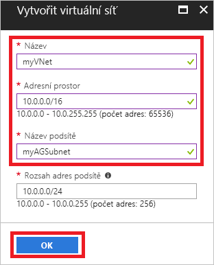
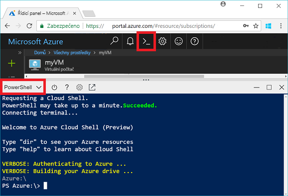
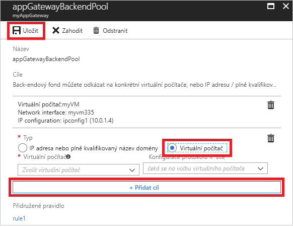
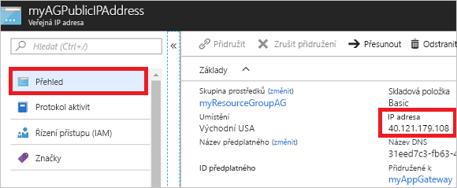

# <a name="quickstart-direct-web-traffic-with-azure-application-gateway---azure-portal"></a>Rychlý start: Směrování webového provozu pomocí služby Azure Application Gateway – Azure Portal

Pomocí služby Azure Application Gateway můžete směrovat webový provoz aplikací na konkrétní prostředky tak, že přiřadíte naslouchací procesy portům, vytvoříte pravidla a přidáte prostředky do back-endového fondu.

V tomto rychlém startu se dozvíte, jak pomocí portálu Azure Portal rychle vytvořit aplikační bránu se dvěma virtuálními počítači v back-endovém fondu. Také se naučíte bránu otestovat, abyste si mohli ověřit, že správně funguje.

Pokud ještě nemáte předplatné Azure, vytvořte si [bezplatný účet](https://azure.microsoft.com/free/?WT.mc_id=A261C142F) před tím, než začnete.

## <a name="log-in-to-azure"></a>Přihlášení k Azure

Přihlaste se k portálu Azure Portal na adrese [http://portal.azure.com](http://portal.azure.com)

## <a name="create-an-application-gateway"></a>Vytvoření aplikační brány

Aby mohla aplikační brána komunikovat s jinými prostředky, musíte vytvořit virtuální síť. Virtuální síť můžete vytvořit současně s aplikační bránou. V tomto příkladu jsou vytvořeny dvě podsítě: jedna pro aplikační bránu a druhá pro virtuální počítače. 

1. Klikněte na **Vytvořit prostředek** v levém horním rohu portálu Azure Portal.
2. Vyberte **Sítě** a potom v seznamu Doporučené vyberte **Application Gateway**.
3. Pro aplikační bránu zadejte tyto hodnoty:

    - *myAppGateway* – tuto hodnotu zadejte jako název aplikační brány.
    - *myResourceGroupAG* – tuto hodnotu zadejte jako skupinu prostředků.

    

4. U ostatních nastavení ponechejte výchozí hodnoty a potom klikněte na **OK**.
5. Klikněte na **Zvolit virtuální síť** > **Vytvořit novou** a potom zadejte tyto hodnoty virtuální sítě:

    - *myVNet* – tuto hodnotu zadejte jako název virtuální sítě.
    - *10.0.0.0/16* – tuto hodnotu zadejte jako adresní prostor virtuální sítě.
    - *myBackendSubnet* – tuto hodnotu zadejte jako název podsítě.
    - *10.0.0.0/24* – tuto hodnotu zadejte jako adresní prostor podsítě.

    

6. Kliknutím na **OK** vytvořte virtuální síť a podsíť.
6. Klikněte na **Vybrat veřejnou IP adresu** > **Vytvořit novou** a potom zadejte název veřejné IP adresy. V tomto příkladu se veřejná IP adresa nazývá *myAGPublicIPAddress*. U ostatních nastavení ponechejte výchozí hodnoty a potom klikněte na **OK**.
8. Ponechte výchozí hodnoty konfigurace naslouchacího procesu beze změny, Firewall webových aplikací nechte zakázaný a potom klikněte na **OK**.
9. Projděte si nastavení na stránce souhrnu a potom kliknutím na **OK** vytvořte virtuální síť, veřejnou IP adresu a aplikační bránu. Může trvat až 30 minut, než se aplikační brána vytvoří. Na další oddíl přejděte, až se nasazení úspěšně dokončí.

### <a name="add-a-subnet"></a>Přidání podsítě

1. V nabídce nalevo klikněte na **Všechny prostředky** a potom v seznamu prostředků klikněte na **myVNet**.
2. Klikněte na **Podsítě** > **Podsíť**.

    

3. Jako název podsítě zadejte *myBackendSubnet* a potom klikněte na **OK**.

## <a name="create-backend-servers"></a>Vytvoření serverů back-end

V tomto příkladu vytvoříte dva virtuální počítače, které se použijí jako servery back-end pro aplikační bránu. 

### <a name="create-a-virtual-machine"></a>Vytvoření virtuálního počítače

1. Klikněte na možnost **Nové**.
2. Vyberte **Výpočty** a potom v seznamu Doporučené vyberte **Windows Server 2016 Datacenter**.
3. Zadejte pro virtuální počítač tyto hodnoty:

    - *myVM1* – název virtuálního počítače.
    - *azureuser* – uživatelské jméno správce.
    - *Azure123456!* – heslo.
    - Vyberte **Použít existující** a pak vyberte *myResourceGroupAG*.

4. Klikněte na **OK**.
5. Jako velikost virtuálního počítače vyberte **DS1_V2** a klikněte na **Vybrat**.
6. Zkontrolujte, že u virtuální sítě je vybrána možnost **myVNet** a u podsítě **myBackendSubnet**. 
7. Kliknutím na **Zakázáno** zakažte diagnostiku spouštění.
8. Klikněte na **OK**, na stránce souhrnu zkontrolujte nastavení a pak klikněte na **Vytvořit**.

### <a name="install-iis"></a>Instalace služby IIS

Na virtuální počítače nainstalujete službu IIS, abyste ověřili, že se aplikační brána úspěšně vytvořila.

1. Otevřete interaktivní prostředí a zkontrolujte, že je nastaveno na **PowerShell**.

    

2. Spuštěním následujícího příkazu nainstalujte službu IIS na virtuální počítač: 

    ```azurepowershell-interactive
    Set-AzureRmVMExtension `
      -ResourceGroupName myResourceGroupAG `
      -ExtensionName IIS `
      -VMName myVM `
      -Publisher Microsoft.Compute `
      -ExtensionType CustomScriptExtension `
      -TypeHandlerVersion 1.4 `
      -SettingString '{"commandToExecute":"powershell Add-WindowsFeature Web-Server; powershell Add-Content -Path \"C:\\inetpub\\wwwroot\\Default.htm\" -Value $($env:computername)"}' `
      -Location EastUS
    ```

3. Vytvořte druhý virtuální počítač a stejným postupem na něj nainstalujte službu IIS. Jako název a VMName v Set-AzureRmVMExtension zadejte *myVM2*.

### <a name="add-backend-servers"></a>Přidání back-endových serverů

Vytvořené virtuální počítače musíte přidat do back-endového fondu v aplikační bráně.

1. Klikněte na **Všechny prostředky** > **myAppGateway**.
2. Klikněte na **Back-endové fondy**. V aplikační bráně je automaticky vytvořen výchozí fond. Klikněte na **appGatewayBackendPool**.
3. Klikněte na **Přidat cíl** > **Virtuální počítač** a potom vyberte *myVM*. Vyberte **Přidat cíl** > **Virtuální počítač** a potom vyberte *myVM2*.

    

4. Klikněte na **Uložit**.

## <a name="test-the-application-gateway"></a>Otestování aplikační brány

Instalace služby IIS není pro vytvoření aplikační brány nutná, v tomto rychlém startu jste ji ale provedli, abyste mohli ověřit, jestli se aplikační brána úspěšně vytvořila.

1. Na obrazovce Přehled vyhledejte veřejnou IP adresu aplikační brány. Klikněte na **Všechny prostředky** > **myAGPublicIPAddress**.

    

2. Zkopírujte veřejnou IP adresu a pak ji vložte do adresního řádku svého prohlížeče.

    

Po aktualizaci prohlížeče by se měl zobrazit název druhého virtuálního počítače.

## <a name="clean-up-resources"></a>Vyčištění prostředků

Nejprve prozkoumejte prostředky vytvořené pomocí aplikační brány, a až je už nebudete potřebovat, můžete odstranit skupinu prostředků, aplikační bránu a všechny související prostředky. Provedete to výběrem skupiny prostředků, která obsahuje aplikační bránu, a kliknutím na **Odstranit**.

## <a name="next-steps"></a>Další kroky

> [!div class="nextstepaction"]
> [Správa webového provozu pomocí aplikační brány a Azure CLI](./tutorial-manage-web-traffic-cli.md)
