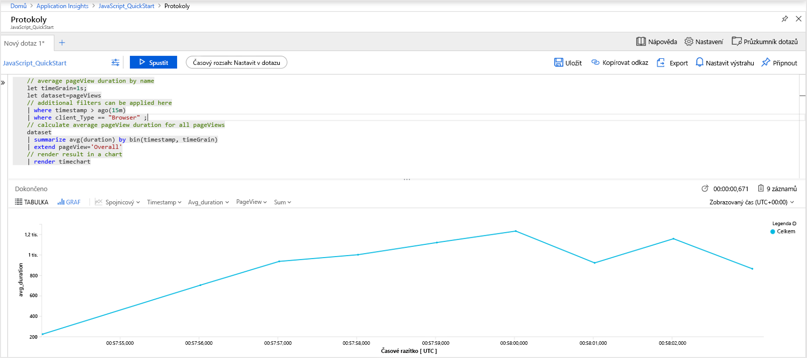
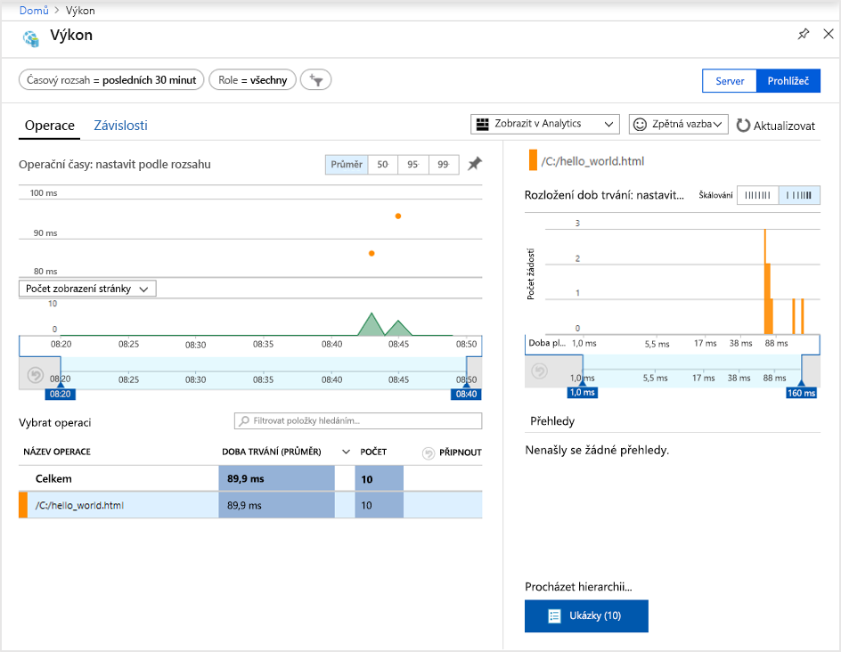
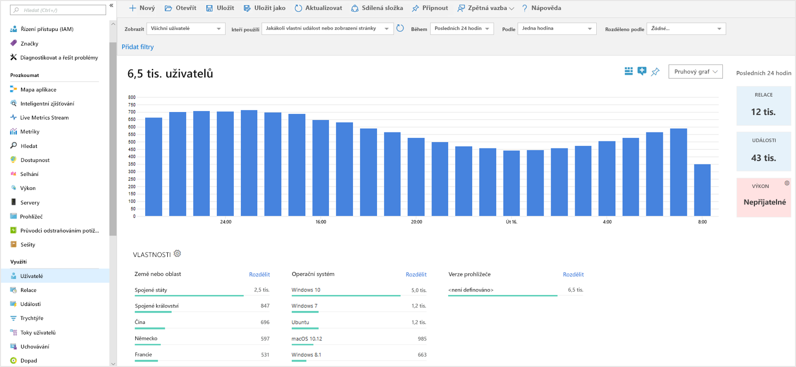
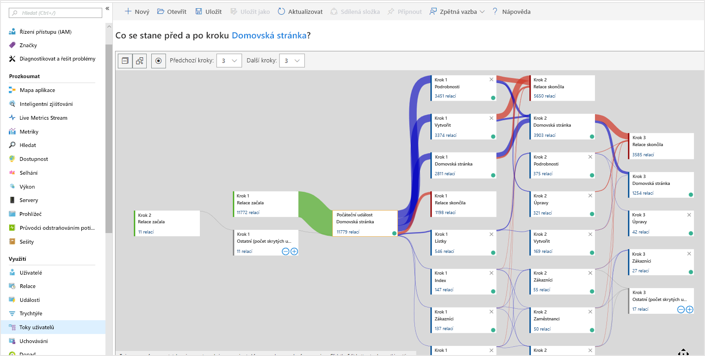

# <a name="start-monitoring-your-website"></a>Zahájení monitorování webu

Azure Monitor Application Insights umožňuje snadné monitorování webu z hlediska dostupnosti, výkonu a využití. Můžete také rychle identifikovat a diagnostikovat chyby ve vaší aplikaci a nečekat na to, až je nahlásí uživatelé. Application Insights nabízí monitorování na straně serveru i možnosti monitorování na straně klienta nebo prohlížeče.

Tento rychlý start vás provede přidáním [open source sady Application Insights JavaScript SDK](https://github.com/Microsoft/ApplicationInsights-JS), která vám umožní porozumět prostředí na straně klienta nebo prohlížeče, se kterým pracují návštěvníci vašeho webu.

## <a name="prerequisites"></a>Požadavky

K provedení kroků v tomto kurzu Rychlý start je potřeba:

- Mít předplatné Azure.

Pokud ještě nemáte předplatné Azure, vytvořte si [bezplatný účet](https://azure.microsoft.com/free/) před tím, než začnete.

## <a name="sign-in-to-the-azure-portal"></a>Přihlášení k webu Azure Portal

Přihlaste se k webu [Azure Portal](https://portal.azure.com/).

## <a name="enable-application-insights"></a>Povolení Application Insights

Application Insights může shromažďovat telemetrická data ze všech aplikací připojených k internetu a spuštěných místně nebo v cloudu. Pokud chcete tato data začít zobrazovat, použijte následující kroky.

1. Vyberte **Vytvořit prostředek** > **Nástroje pro správu** > **Application Insights**.

   Zobrazí se konfigurační pole. K vyplnění vstupních polí použijte následující tabulku.

    | Nastavení        | Hodnota           | Popis  |
   | ------------- |:-------------|:-----|
   | **Název**      | Globálně jedinečná hodnota | Název identifikující aplikaci, kterou monitorujete |
   | **Typ aplikace** | Obecná aplikace | Typ aplikace, kterou monitorujete |
   | **Skupina prostředků**     | myResourceGroup      | Název pro novou skupinu prostředků, která bude hostovat data App Insights |
   | **Umístění** | USA – východ | Vyberte umístění ve vaší blízkosti nebo v blízkosti místa, kde se vaše aplikace hostuje. |

2. Klikněte na možnost **Vytvořit**.

## <a name="create-an-html-file"></a>Vytvoření souboru HTML

1. Na místním počítači vytvořte soubor ``hello_world.html``. Pro účely tohoto příkladu se soubor umístí do kořenového adresáře jednotky C: ``C:\hello_world.html``.
2. Do souboru ``hello_world.html`` zkopírujte následující skript:

    ```html
    <!DOCTYPE html>
    <html>
    <head>
    <title>Azure Monitor Application Insights</title>
    </head>
    <body>
    <h1>Azure Monitor Application Insights Hello World!</h1>
    <p>You can use the Application Insights JavaScript SDK to perform client/browser-side monitoring of your website. To learn about more advanced JavaScript SDK configurations visit the <a href="https://github.com/Microsoft/ApplicationInsights-JS/blob/master/API-reference.md" title="API Reference">API reference</a>.</p>
    </body>
    </html>
    ```

## <a name="configure-app-insights-sdk"></a>Konfigurace sady App Insights SDK

1. Vyberte **Přehled** > **Základy** a zkopírujte **instrumentační klíč** vaší aplikace.

   

2. Do souboru ``hello_world.html`` přidejte před ukončovací značku ``</head>`` následující skript:

   ```javascript
      <script type="text/javascript">
        var appInsights=window.appInsights||function(a){
            function b(a){c[a]=function(){var b=arguments;c.queue.push(function(){c[a].apply(c,b)})}}var c={config:a},d=document,e=window;setTimeout(function(){var b=d.createElement("script");b.src=a.url||"https://az416426.vo.msecnd.net/scripts/a/ai.0.js",d.getElementsByTagName("script")[0].parentNode.appendChild(b)});try{c.cookie=d.cookie}catch(a){}c.queue=[];for(var f=["Event","Exception","Metric","PageView","Trace","Dependency"];f.length;)b("track"+f.pop());if(b("setAuthenticatedUserContext"),b("clearAuthenticatedUserContext"),b("startTrackEvent"),b("stopTrackEvent"),b("startTrackPage"),b("stopTrackPage"),b("flush"),!a.disableExceptionTracking){f="onerror",b("_"+f);var g=e[f];e[f]=function(a,b,d,e,h){var i=g&&g(a,b,d,e,h);return!0!==i&&c["_"+f](a,b,d,e,h),i}}return c
        }({
            instrumentationKey: "xxxxxxxx-xxxx-xxxx-xxxx-xxxxxxxx"
        });
        
        window.appInsights=appInsights,appInsights.queue&&0===appInsights.queue.length&&appInsights.trackPageView();
</script>
   ```

3. Upravte soubor ``hello_world.html`` a přidejte svůj instrumentační klíč.

4. Otevřete soubor ``hello_world.html`` v místní relaci prohlížeče. Tím se vytvoří jedno zobrazení stránky. Prohlížeč můžete aktualizovat a vygenerovat tak více testovacích zobrazení stránky.

## <a name="start-monitoring-in-the-azure-portal"></a>Zahájení monitorování na webu Azure Portal

1. Teď můžete znovu otevřít stránku **Přehled** služby Application Insights na webu Azure Portal, kde jste získali svůj instrumentační klíč, a zobrazit podrobné informace o aktuálně spuštěné aplikaci. Čtyři výchozí grafy na stránce Přehled mají nastavený obor na data aplikace na straně serveru. Vzhledem k tomu, že instrumentujeme interakce se sadou JavaScript SDK na straně klienta nebo prohlížeče, toto konkrétní zobrazení nás nezajímá, pokud nemáme nainstalovanou také sadu SDK na straně serveru.

2. Klikněte na  **Analýza**.  Otevře se okno **Analýza** s bohatým dotazovacím jazykem pro analýzu všech dat shromážděných službou Application Insights. Pokud chcete zobrazit data související s požadavky prohlížeče na straně klienta, spusťte následující dotaz:

    ```kusto
    // average pageView duration by name
    let timeGrain=1s;
    let dataset=pageViews
    // additional filters can be applied here
    | where timestamp > ago(15m)
    | where client_Type == "Browser" ;
    // calculate average pageView duration for all pageViews
    dataset
    | summarize avg(duration) by bin(timestamp, timeGrain)
    | extend pageView='Overall'
    // render result in a chart
    | render timechart
    ```

   

3. Vraťte se na stránku **Přehled**. Klikněte na **Prohlížeč** pod nadpisem **Prozkoumat** a pak vyberte **Výkon**. Tady najdete metriky související s výkonem vašeho webu. Najdete tu také odpovídající zobrazení pro analýzu selhání a výjimek na vašem webu. Kliknutím na **Ukázky** můžete přejít k podrobnostem o jednotlivých transakcích. Tady můžete získat přístup k prostředí s [podrobnostmi o celé transakci](../azure-monitor/app/transaction-diagnostics.md).

   

4. Pokud chcete začít zkoumat [nástroje pro analýzu chování uživatelů](app-insights-usage-overview.md), v hlavní nabídce Application Insights pod nadpisem **Využití** vyberte [**Uživatelé**](app-insights-usage-segmentation.md). Protože testujeme z jediného počítače, zobrazí se nám data pouze pro jednoho uživatele. V případě živého webu by distribuce uživatelů mohla vypadat nějak takto:

     

5. Dalším užitečným nástrojem pro instrumentaci složitějších webů s více stránkami je nástroj [**Toky uživatelů**](app-insights-usage-flows.md). Pomocí nástroje **Toky uživatelů** můžete sledovat cesty uživatelů různými částmi vašeho webu.

  

Pokud se chcete dozvědět o pokročilejších konfiguracích monitorování webů, přečtěte si [referenční informace k rozhraní API sady JavaScript SDK](https://github.com/Microsoft/ApplicationInsights-JS/blob/master/API-reference.md).

## <a name="clean-up-resources"></a>Vyčištění prostředků

Pokud chcete pokračovat v práci s dalšími rychlými starty nebo kurzy, nevyčišťujte prostředky vytvořené v rámci tohoto rychlého startu. Pokud však pokračovat nechcete, pomocí následujících kroků odstraňte všechny prostředky vytvořené tímto rychlým startem na webu Azure Portal.

1. Na webu Azure Portal v nabídce vlevo klikněte na **Skupiny prostředků** a pak na **myResourceGroup**.
2. Na stránce skupiny prostředků klikněte na **Odstranit**, do textového pole zadejte **myResourceGroup** a pak klikněte na **Odstranit**.

## <a name="next-steps"></a>Další postup

> [!div class="nextstepaction"]
> [Vyhledání a diagnostika potíží s výkonem](https://docs.microsoft.com/azure/application-insights/app-insights-analytics)
