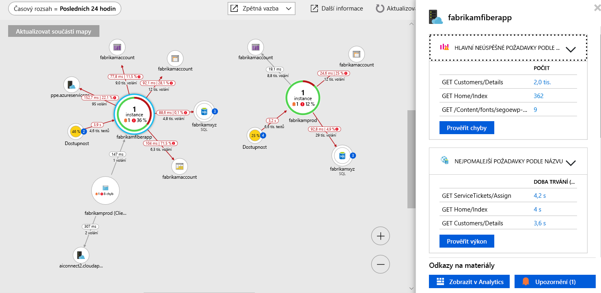

# <a name="collect-distributed-traces-from-go-preview"></a>Shromažďovat distribuované trasování z Go (Preview)

Application Insights teď podporuje distribuované trasování z aplikací Go díky integraci se sadou [OpenCensus](https://opencensus.io) a naše nové [místní předávání](./opencensus-local-forwarder.md). Tento článek vás provede procesem nastavení OpenCensus for Go a získávají se vaše data trasování do Application Insights.

## <a name="prerequisites"></a>Požadavky

- Potřebujete předplatné Azure.
- Go je třeba nainstalovat, tento článek používá verze 1.11 [přejít Stáhnout](https://golang.org/dl/).
- Postupujte podle pokynů k instalaci [místní předávání jako služba Windows](./opencensus-local-forwarder.md#windows-service).

Pokud ještě nemáte předplatné Azure, vytvořte si [bezplatný účet](https://azure.microsoft.com/free/) před tím, než začnete.

## <a name="sign-in-to-the-azure-portal"></a>Přihlášení k webu Azure Portal

Přihlaste se k webu [Azure Portal](https://portal.azure.com/).

## <a name="create-application-insights-resource"></a>Vytvořit prostředek Application Insights

Nejprve je nutné vytvořit prostředek Application Insights, která bude generovat instrumentačním klíčem (Instrumentační klíč). Ikey pak slouží ke konfiguraci místního serveru pro předávání k odesílání distribuované trasování z aplikace OpenCensus instrumentována pro Application Insights.   

1. Vyberte **vytvořit prostředek** > **vývojářské nástroje** > **Application Insights**.

   

   Zobrazí se konfigurační pole. K vyplnění vstupních polí použijte následující tabulku.

    | Nastavení        | Hodnota           | Popis  |
   | ------------- |:-------------|:-----|
   | **Název**      | Globálně jedinečná hodnota | Název identifikující aplikaci, kterou monitorujete |
   | **Typ aplikace** | Obecné | Typ aplikace, kterou monitorujete |
   | **Skupina prostředků**     | myResourceGroup      | Název pro novou skupinu prostředků, která bude hostovat data App Insights |
   | **Umístění** | USA – východ | Vyberte umístění ve vaší blízkosti nebo v blízkosti místa, kde se vaše aplikace hostuje. |

2. Klikněte na možnost **Vytvořit**.

## <a name="configure-local-forwarder"></a>Nakonfigurovat místní server pro předávání

1. Vyberte **Přehled** > **Základy** a zkopírujte **instrumentační klíč** vaší aplikace.

   

2. Upravit vaše `LocalForwarder.config` a přidejte svůj Instrumentační klíč. Pokud jste postupovali podle pokynů [předpoklad](./opencensus-local-forwarder.md#windows-service) soubor se nachází v `C:\LF-WindowsServiceHost`

    ```xml
      <OpenCensusToApplicationInsights>
        <!--
          Instrumentation key to track telemetry to.
          -->
        <InstrumentationKey>{enter-instrumentation-key}</InstrumentationKey>
      </OpenCensusToApplicationInsights>
    
      <!-- Describes aspects of processing Application Insights telemetry-->
      <ApplicationInsights>
        <LiveMetricsStreamInstrumentationKey>{enter-instrumentation-key}</LiveMetricsStreamInstrumentationKey>
      </ApplicationInsights>
    </LocalForwarderConfiguration>
    ```

3. Restartování aplikace **místní předávání** služby.

## <a name="opencensus-go-packages"></a>Balíčky OpenCensus Go

1. Instalace balíčků otevřete sčítání přejít z příkazového řádku:

    ```go
    go get -u go.opencensus.io
    go get -u contrib.go.opencensus.io/exporter/ocagent
    ```

2. Přidejte následující kód do souboru .go a pak sestavit a spustit. (V tomto příkladu je odvozen z oficiální OpenCensus pokyny k přidání kódu, která usnadňuje integraci s místním předávání)

     ```go
        // Copyright 2018, OpenCensus Authors
        //
        // Licensed under the Apache License, Version 2.0 (the "License");
        // you may not use this file except in compliance with the License.
        // You may obtain a copy of the License at
        //
        //     http://www.apache.org/licenses/LICENSE-2.0
        //
        // Unless required by applicable law or agreed to in writing, software
        // distributed under the License is distributed on an "AS IS" BASIS,
        // WITHOUT WARRANTIES OR CONDITIONS OF ANY KIND, either express or implied.
        // See the License for the specific language governing permissions and
        // limitations under the License.
        package main
        
        import (
        
            "bytes"
            "fmt"
            "log"
            "net/http"
            os "os"
            
            ocagent "contrib.go.opencensus.io/exporter/ocagent"
            "go.opencensus.io/plugin/ochttp"
            "go.opencensus.io/plugin/ochttp/propagation/tracecontext"
            "go.opencensus.io/trace"
        
        )
        
        func main() {
            // Register stats and trace exporters to export the collected data.
            serviceName := os.Getenv("SERVICE_NAME")
            if len(serviceName) == 0 {
                serviceName = "go-app"
            }
            fmt.Printf(serviceName)
            agentEndpoint := os.Getenv("OCAGENT_TRACE_EXPORTER_ENDPOINT")

            if len(agentEndpoint) == 0 {
                agentEndpoint = fmt.Sprintf("%s:%d", ocagent.DefaultAgentHost, ocagent.DefaultAgentPort)
            }
        
            fmt.Printf(agentEndpoint)
            exporter, err := ocagent.NewExporter(ocagent.WithInsecure(), ocagent.WithServiceName(serviceName), ocagent.WithAddress(agentEndpoint))
        
            if err != nil {
                log.Printf("Failed to create the agent exporter: %v", err)
            }
        
            trace.RegisterExporter(exporter)
        
            trace.ApplyConfig(trace.Config{DefaultSampler: trace.AlwaysSample()})
        
            client := &http.Client{Transport: &ochttp.Transport{Propagation: &tracecontext.HTTPFormat{}}}
        
            http.HandleFunc("/", func(w http.ResponseWriter, req *http.Request) {
                fmt.Fprintf(w, "hello world")
        
                var jsonStr = []byte(`[ { "url": "http://blank.org", "arguments": [] } ]`)
                r, _ := http.NewRequest("POST", "http://blank.org", bytes.NewBuffer(jsonStr))
                r.Header.Set("Content-Type", "application/json")
        
                // Propagate the trace header info in the outgoing requests.
                r = r.WithContext(req.Context())
                resp, err := client.Do(r)
                if err != nil {
                    log.Println(err)
                } else {
                    // TODO: handle response
                    resp.Body.Close()
                }
            })
        
            http.HandleFunc("/call_blank", func(w http.ResponseWriter, req *http.Request) {
                fmt.Fprintf(w, "hello world")
        
                r, _ := http.NewRequest("GET", "http://blank.org", nil)

                // Propagate the trace header info in the outgoing requests.
                r = r.WithContext(req.Context())
                resp, err := client.Do(r)
        
                if err != nil {
                    log.Println(err)
                } else {
                    // TODO: handle response
                    resp.Body.Close()
                }        
            })
        
            log.Fatal(http.ListenAndServe(":50030", &ochttp.Handler{Propagation: &tracecontext.HTTPFormat{}}))
        
        }
     ```

3. Jakmile je spuštění jednoduché aplikace v jazyce go přejděte do `http://localhost:50030`. Každá aktualizace v prohlížeči vygeneruje textu "hello world" doplněny odpovídající značky span data, která převezme místní server pro předávání.

4. Zkontrolujte, že **místní předávání** sbírá kontrola trasování `LocalForwarder.config` souboru. Pokud jste postupovali podle kroků v [předpoklad](https://docs.microsoft.com/azure/application-insights/local-forwarder#windows-service), bude nacházet v `C:\LF-WindowsServiceHost`.

    Na obrázku níže souboru protokolu vidíte, že před spuštěním druhý skriptu, které jsme přidali Exportér `OpenCensus input BatchesReceived` je 0. Jakmile jsme začali používat aktualizovaný skript `BatchesReceived` zvýšena stejný počet hodnot, které jsme zadali:
    
    

## <a name="start-monitoring-in-the-azure-portal"></a>Zahájení monitorování na webu Azure Portal

1. Teď můžete znovu otevřít Application Insights **přehled** stránky na webu Azure Portal, chcete-li zobrazit podrobné informace o aktuálně spuštěné aplikaci. Vyberte **Live Stream metrik**.

   

2. Pokud znovu spustíte druhou aplikaci Go a spustit aktualizaci prohlížeče pro `http://localhost:50030`, zobrazí se živá data trasování, jako je e-mailu ve službě Application Insights ze služby předávání místní.

   

3. Přejděte zpět **přehled** stránku a vybrat **Mapa aplikace** pro vizuální rozložení vztahů závislosti a časování volání mezi komponentami vaší aplikace.

    

    Protože jsme byly trasování pouze jedno volání metody, není jako zajímavé Mapa aplikace. Ale můžete škálovat mapu aplikace k vizualizaci mnohem více distribuované aplikace:

   

4. Vyberte **zkoumání výkonu** provádět podrobnou analýzu výkonu a určení původní příčiny snížení výkonu.

    

5. Výběr **ukázky** a potom kliknutím na některé z ukázek, které se zobrazují v pravém podokně se spustí prostředí podrobnosti transakce začátku do konce. Když naše ukázková aplikace se pouze zobrazí jednu událost, složitější aplikaci umožní prozkoumat začátku do konce transakcí na úrovni jednotlivých událostí zásobníku volání.

     

## <a name="opencensus-trace-for-go"></a>Trasování OpenCensus for Go

Jsme probrali pouze základní informace o integraci OpenCensus for Go s místní server pro předávání a Application Insights. [Oficiální informace o používání OpenCensus Go](https://godoc.org/go.opencensus.io) zahrnuje pokročilejší témata.

## <a name="next-steps"></a>Další postup

* [Mapa aplikace](./app-insights-app-map.md)
* [Sledování výkonu začátku do konce](./app-insights-tutorial-performance.md)
