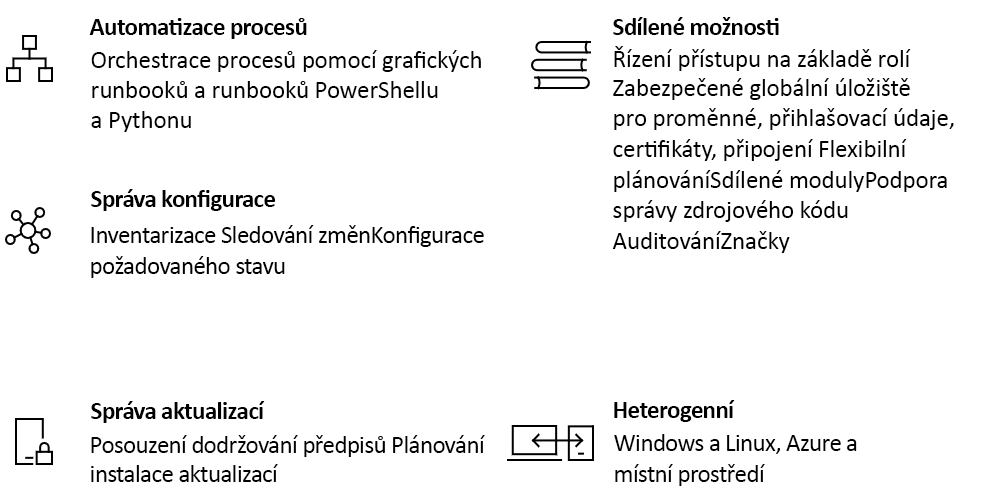

# Seznámení s Azure Automation

Azure Automation nabízí cloudovou službu pro automatizaci a konfiguraci, která poskytuje konzistentní správu napříč Azure i prostředími mimo Azure. Skládá se z automatizace procesů, správy aktualizací a funkcí konfigurace. Azure Automation poskytuje úplnou kontrolu v průběhu nasazení, provozu i vyřazení úloh a prostředků z provozu.
Tento článek poskytuje stručný přehled Azure Automation a odpovědi na některé běžné dotazy. Další informace o různých možnostech najdete na odkazech uvedených v tomto přehledu.

## Možnosti Azure Automation

### Automatizace procesů

Azure Automation poskytuje možnost automatizovat časté a časově náročné úlohy správy cloudu, které jsou náchylné k chybám. Tato automatizace vám umožní věnovat víc času práci, která vytváří přidanou hodnotu. Díky menšímu množství chyb a vyšší efektivitě vám také pomůže snížit provozní náklady. Služby Azure můžete integrovat s dalšími veřejnými systémy nezbytnými k nasazování, konfiguraci a správě vašich ucelených procesů. Tato služba umožňuje [vytvářet runbooky](automation-runbook-types.md) v grafickém prostředí, v PowerShellu nebo Pythonu. S použitím hybridního pracovního procesu runbooku můžete sjednotit správu díky orchestraci napříč místními prostředími. [Webhooky](automation-webhooks.md) poskytují způsob, jak plnit požadavky a zajistit průběžné doručování a provoz díky aktivaci automatizace z ITSM, DevOps a monitorovacích systémů.

### Správa konfigurace

[Konfigurace požadovaného stavu](automation-dsc-overview.md) Azure Automation je cloudové řešení pro PowerShell DSC, které poskytuje služby nezbytné pro podniková prostředí. Svoje prostředky DSC můžete spravovat v Azure Automation a konfigurace můžete používat na virtuálních nebo fyzických počítačích ze serveru vyžádaných replikací s DSC v cloudu Azure. Poskytuje bohaté sestavy, které informují o důležitých událostech, například když se uzly odchylují od svých přiřazených konfigurací. Můžete snadno a spolehlivě monitorovat a automaticky aktualizovat konfigurace počítačů fyzických i virtuálních, s Windows i s Linuxem, v cloudu i místně.

Můžete získat inventář prostředků na hostovi a tím i přehled o nainstalovaných aplikací a dalších položkách konfigurace. Dostupné bohaté možnosti generování sestav a vyhledávaní vám umožní rychle najít podrobné informace, abyste porozuměli nejrůznějším konfiguracím v rámci operačního systému. Můžete sledovat změny napříč službami, procesy démon, softwarem, registry a soubory a díky tomu rychle identifikovat pravděpodobnou příčinu problémů. Kromě toho může DSC pomoct s diagnostikou a upozorněním v případě, že ve vašem prostředí dojde k nežádoucím změnám.

### Správa aktualizací

Pomocí Azure Automation můžete aktualizovat systémy Windows i Linux napříč hybridními prostředími. Získáte přehled o kompatibilitě aktualizací mezi Azure, místním prostředím a jinými cloudy. Můžete vytvářet plánovaná nasazení a orchestrovat instalaci aktualizací v rámci definovaného časového období údržby. Pokud by se na počítač některé aktualizace instalovat neměly, můžete takové aktualizace vyloučit z nasazení.

### Sdílené prostředky

Azure Automation se skládá ze sady sdílených prostředků, které usnadňují automatizaci a konfiguraci prostředí ve velkém měřítku.

* **[Plány](automation-schedules.md)** – Slouží ve službě k aktivování automatizace v předdefinované časy.
* **[Moduly](automation-integration-modules.md)**  – moduly slouží ke správě Azure a dalšími systémy. Importovat do účtu Automation pro Microsoftu, třetích stran, komunity, nebo vlastní definované rutiny a DSC prostředky.
* **[Galerie modulů](automation-runbook-gallery.md)**  – nativní integrace se v galerii prostředí PowerShell pro zobrazení sady runbook a importujte je do účtu Automation.
* **[Balíčky Python 2](python-packages.md)**  -přidat Python 2 balíčky do vašeho účtu automation pro použití ve vašich sadách runbook Python.
* **[Přihlašovací údaje](automation-credentials.md)** – Zabezpečeně uchovávají citlivé údaje, které můžou za běhu používat runbooky a konfigurace.
* **[Připojení](automation-connections.md)** – Při připojování k systémům ukládejte páry název-hodnota s informacemi obsahujícími běžné údaje v prostředcích připojení. Připojení pro použití za běhu v runboocích a konfiguracích definuje autor modulu.
* **[Certifikáty](automation-certificates.md)** – Ukládejte je a zpřístupněte je za běhu, aby se daly použít k ověřování a zabezpečení nasazených prostředků.
* **[Proměnné](automation-variables.md)** – Poskytují způsob uložení obsahu, který se může používat napříč runbooky a konfiguracemi. Hodnoty můžete změnit, aniž byste museli měnit runbooky a konfigurace, které na ně odkazují.

### Integrace správy zdrojového kódu

Azure Automation obsahuje schopnost [integrace se správou zdrojového kódu](source-control-integration.md) který propaguje konfiguraci jako kód, ve kterém runbooky a konfigurace mohla být zařazena do systému správy zdrojového kódu.

### Řízení přístupu na základě rolí

Azure Automation podporuje roli řízení přístupu na základě řízení přístupu k účtu Automation a její prostředky, další informace o konfiguraci RBAC na účtu Automation, runbooků a úlohy, naleznete v tématu [řízení přístupu na základě rolí pro Azure Automatizace](automation-role-based-access-control.md).

### Windows a Linux

Služba Azure Automation je navržená pro fungování v hybridním cloudovém prostředí i ve Windows a Linuxu. Zajišťuje konzistentní automatizaci a konfiguraci nasazených úloh a operačního systému, na kterém běží.

### Galerie komunity

V [Galerii služby Automation](automation-runbook-gallery.md) najdete runbooky a moduly, pomocí kterých můžete rychle začít integrovat a vytvářet vlastní procesy z Galerie prostředí PowerShell a Centra skriptů Microsoft.

## Běžné scénáře pro službu Automation

Azure Automation spravuje životní cyklus vaší infrastruktury i aplikací. Přeneste do systému znalosti o způsobu, jakým organizace doručuje a udržuje úlohy. Tvořte v běžných jazycích jako PowerShell, konfigurace požadovaného stavu, Python a grafické runbooky. Získejte kompletní inventář nasazených prostředků pro účely cílení, generování sestav a dodržování předpisů. Identifikujte změny, které můžou způsobit chybnou konfiguraci, a zlepšete provozní dodržování předpisů.

* **Sestavování a nasazování prostředků** – Nasazujte virtuální počítače napříč hybridním prostředím pomocí runbooků a šablon Azure Resource Manageru. Zajistěte integraci do vývojových nástrojů, jako je Jenkins a Azure DevOps.
* **Konfigurace virtuálních počítačů** – Vyhodnocujte a konfigurujte počítače s Windows a Linuxem s využitím požadované konfigurace pro infrastrukturu a aplikaci.
* **Monitorování** – Identifikujte na počítačích změny, které způsobují problémy, a opravte je nebo je eskalujte do systémů pro správu.
* **Ochrana** – Když se vyvolá výstraha zabezpečení, virtuální počítač se umístí do karantény. Nastavte požadavky na hostovi.
* **Správné řízení** – Nastavte pro týmy řízení přístupu na základě role. Obnovte nevyužité prostředky.

## Ceny služby Automation

Ceny služby Azure Automation najdete na stránce s [cenami](https://azure.microsoft.com/pricing/details/automation/).

## Další postup

> [!div class="nextstepaction"]
> [Vytvoření účtu Automation](automation-quickstart-create-account.md)

