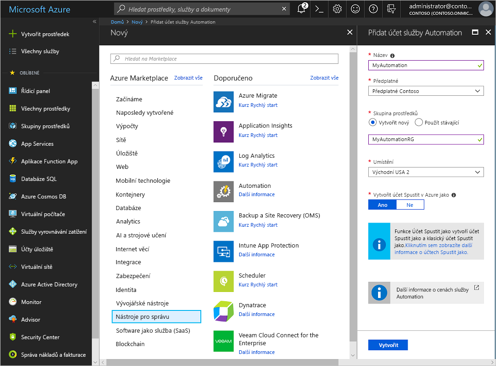
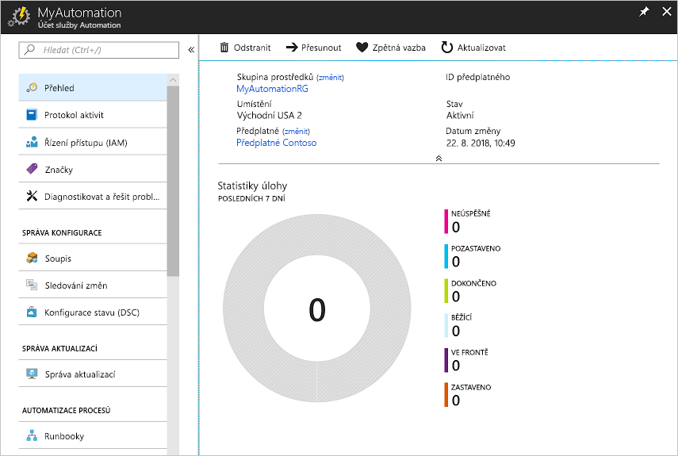
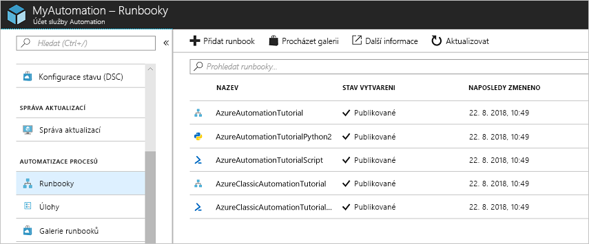
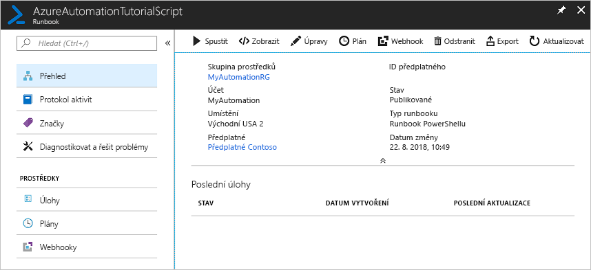
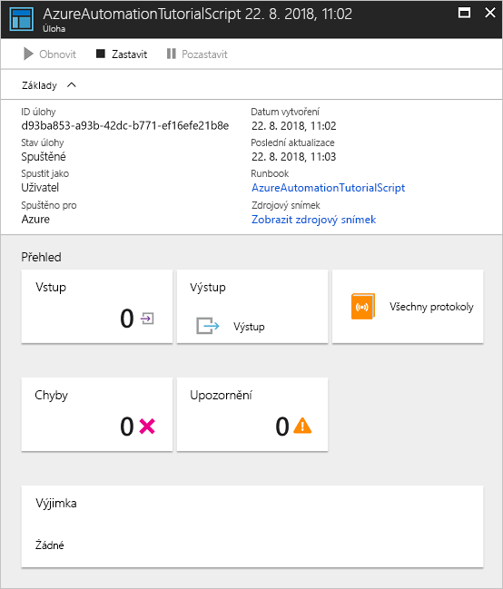

# Vytvoření účtu Azure Automation

Účet Azure Automation můžete vytvořit prostřednictvím Azure pomocí Azure Portal, což je uživatelské rozhraní založené na prohlížeči, které umožňuje přístup k několika prostředkům. Jeden účet Automation může spravovat prostředky ve všech oblastech a předplatných pro daného tenanta. 

Tento rychlý Start vás provede vytvořením účtu Automation a spuštěním Runbooku v účtu. Pokud ještě nemáte předplatné Azure, vytvořte si [bezplatný účet Azure](https://azure.microsoft.com/free/?WT.mc_id=A261C142F) před tím, než začnete.

## Přihlášení k Azure

[Přihlaste se k Azure](https://portal.azure.com).

## Vytvoření účtu Automation

1. Vyberte název svého účtu Azure. Názvy účtů Automation jsou jedinečné pro jednotlivé oblasti a skupiny prostředků. Názvy účtů Automation, které byly odstraněny, nemusí být okamžitě k dispozici.

    > [!NOTE]
    > Po zadání v uživatelském rozhraní už název účtu nemůžete změnit. 

2. Klikněte na tlačítko **vytvořit prostředek** v levém horním rohu Azure Portal.

3. Vyberte **& nástroje pro správu**a pak vyberte **Automation**.

4. Zadejte informace o účtu, včetně vybraného názvu účtu. U možnosti **Vytvořit účet Spustit v Azure jako** zvolte **Ano**, aby se automaticky povolily artefakty, které zjednoduší ověřování do Azure. Po dokončení informací kliknutím na **vytvořit** spusťte nasazení účtu Automation.

      

    > [!NOTE]
    > Aktualizovaný seznam umístění, do kterých můžete nasadit účet Automation, najdete v tématu [Dostupné produkty v jednotlivých oblastech](https://azure.microsoft.com/global-infrastructure/services/?products=automation&regions=all).

5. Po dokončení nasazení klikněte na **všechny služby**.

6. Vyberte **účty Automation** a potom vyberte účet Automation, který jste vytvořili.

    

## Spuštění runbooku

Spusťte některý z runbooků pro tento kurz.

1. V části **Automatizace procesu**klikněte na **Runbooky** . Zobrazí se seznam runbooků. Ve výchozím nastavení jsou v účtu povoleny různé Runbooky kurzů.

    

1. Vyberte runbook **AzureAutomationTutorialScript**. Tato akce otevře stránku s přehledem runbooku.

    

1. Klikněte na **Spustit**, na stránce Spustit Runbook klikněte na **OK** a spusťte runbook.

    

1. Jakmile se stav úlohy `Running` zobrazí, klikněte na **výstup** nebo **všechny protokoly** a zobrazte výstup úlohy Runbooku. V případě tohoto cvičného runbooku je výstupem seznam vašich prostředků Azure.

## Další kroky

V rámci tohoto rychlého startu jste nasadili účet Automation, spustili úlohu runbooku a zobrazili výsledky úlohy. Další informace o službě Azure Automation najdete v rychlém startu k vytvoření prvního runbooku.

> [!div class="nextstepaction"]
> [Rychlý Start pro automatizaci – vytvoření sady Runbook Azure Automation](./automation-quickstart-create-runbook.md)

