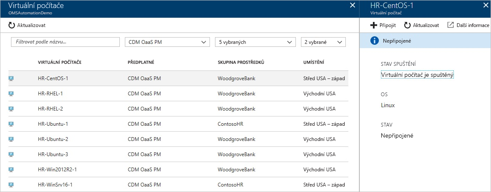
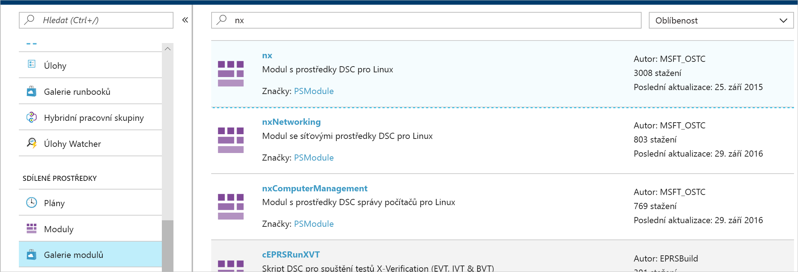
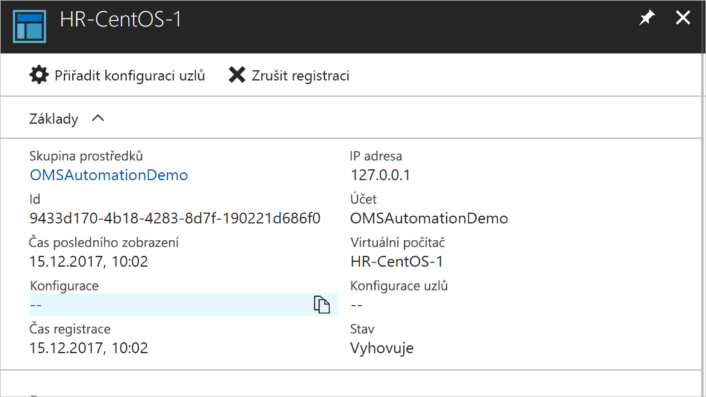
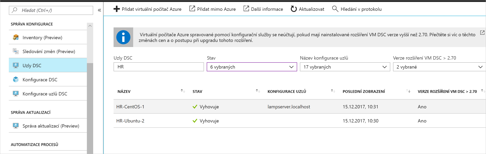

# <a name="configure-a-vm-with-desired-state-configuration"></a>Konfigurace virtuálního počítače s požadovanou konfigurací stavu

Povolením konfigurace stavu Azure Automation můžete spravovat a monitorovat konfigurace serverů s Windows a Linux pomocí konfigurace požadovaného stavu (DSC). Konfigurace, které se posunou od požadované konfigurace, se dají identifikovat nebo automaticky opravit. Tento rychlý Start prochází postup povolením virtuálního počítače se systémem Linux a nasazení zásobníku LAMP pomocí konfigurace stavu Azure Automation.

## <a name="prerequisites"></a>Požadavky

Co budete potřebovat k dokončení tohoto rychlého startu:

* Předplatné Azure. Pokud nemáte předplatné Azure, [Vytvořte si bezplatný účet](https://azure.microsoft.com/free/).
* Účet Azure Automation. Pokyny k vytvoření účtu Azure Automation Spustit jako najdete v tématu [Účet Spustit jako pro Azure](./manage-runas-account.md).
* Azure Resource Manager virtuální počítač (ne Classic) se spuštěným Red Hat Enterprise Linux, CentOS nebo Oracle Linux. Pokyny k vytvoření virtuálního počítače najdete v tématu [Vytvoření prvního virtuálního počítače s Linuxem na webu Azure Portal](../virtual-machines/linux/quick-create-portal.md).

## <a name="sign-in-to-azure"></a>Přihlášení k Azure
Přihlaste se k Azure na adrese https://portal.azure.com .

## <a name="enable-a-virtual-machine"></a>Povolit virtuální počítač

Existuje mnoho různých metod, jak povolit funkci Konfigurace počítače pro stav. V tomto rychlém startu se dozvíte, jak povolit funkci pro virtuální počítač pomocí účtu Automation. Další informace o různých metodách, jak povolit počítače pro konfiguraci stavu, najdete v tématu [Povolení počítačů pro správu pomocí konfigurace stavu Azure Automation](./automation-dsc-onboarding.md).

1. V levém podokně webu Azure Portal vyberte **Účty Automation**. Pokud není zobrazený v levém podokně, klikněte na **všechny služby** a vyhledejte ve výsledném zobrazení.
1. V seznamu vyberte účet Automation.
1. V levém podokně účtu Automation vyberte **Konfigurace stavu (DSC)**.
2. Kliknutím na **Přidat** otevřete stránku pro výběr virtuálního počítače.
3. Vyhledejte virtuální počítač, pro který chcete povolit DSC. K vyhledání konkrétního virtuálního počítače můžete použít vyhledávací pole a možnosti filtru.
4. Klikněte na virtuální počítač a pak klikněte na **připojit** .
5. Vyberte vhodné nastavení DSC pro tento virtuální počítač. Pokud jste již propravili konfiguraci, můžete ji zadat jako `Node Configuration Name` . Pokud chcete řídit chování konfigurace počítače, můžete nastavit [režim konfigurace](/powershell/scripting/dsc/managing-nodes/metaConfig).
6. Klikněte na **OK**. I když je rozšíření DSC nasazené do virtuálního počítače, stav se zobrazí jako `Connecting` .



## <a name="import-modules"></a>Import modulů

Moduly obsahují prostředky DSC a mnoho najdete v [Galerie prostředí PowerShell](https://www.powershellgallery.com). Všechny prostředky, které se používají ve vašich konfiguracích, musí být před kompilací naimportovány do účtu Automation. Pro účely tohoto kurzu se vyžaduje modul **nx**.

1. V levém podokně účtu Automation v části **sdílené prostředky** vyberte **Galerie modulů** .
1. Vyhledejte modul, který chcete importovat, zadáním části jeho názvu: `nx` .
1. Klikněte na modul, který chcete naimportovat.
1. Klikněte na **importovat**.



## <a name="import-the-configuration"></a>Import konfigurace

Tento rychlý start využívá konfiguraci DSC, která na počítači konfiguruje Apache HTTP Server, MySQL a PHP. Viz [Konfigurace DSC](/powershell/scripting/dsc/configurations/configurations).

V textovém editoru zadejte následující příkaz a uložte ho místně jako **AMPServer.ps1**.

```powershell-interactive
configuration LAMPServer {
   Import-DSCResource -module "nx"

   Node localhost {

        $requiredPackages = @("httpd","mod_ssl","php","php-mysql","mariadb","mariadb-server")
        $enabledServices = @("httpd","mariadb")

        #Ensure packages are installed
        ForEach ($package in $requiredPackages){
            nxPackage $Package{
                Ensure = "Present"
                Name = $Package
                PackageManager = "yum"
            }
        }

        #Ensure daemons are enabled
        ForEach ($service in $enabledServices){
            nxService $service{
                Enabled = $true
                Name = $service
                Controller = "SystemD"
                State = "running"
            }
        }
   }
}
```

Import konfigurace:

1. V levém podokně účtu Automation vyberte **Konfigurace stavu (DSC)** a pak klikněte na kartu **Konfigurace**.
2. Klikněte na **+ Přidat**.
3. Vyberte konfigurační soubor, který jste uložili v předchozím kroku.
4. Klikněte na **OK**.

## <a name="compile-a-configuration"></a>Kompilace konfigurace

Než bude možné přiřadit uzel, je nutné nejprve zkompilovat konfiguraci DSC do konfigurace uzlu (dokument MOF). Kompilace ověří konfiguraci a umožňuje zadat hodnoty parametrů. Další informace o kompilaci konfigurace najdete v tématu [kompilace konfigurací v konfiguraci stavu](automation-dsc-compile.md).

1. V levém podokně účtu Automation vyberte **Konfigurace stavu (DSC)** a pak klikněte na kartu **Konfigurace** .
1. Vyberte konfiguraci `LAMPServer` .
1. Z možností nabídky vyberte **kompilovat** a potom klikněte na **Ano**.
1. V zobrazení konfigurace se zobrazí nová úloha kompilace zařazená do fronty. Až se úloha úspěšně dokončí, budete připraveni přejít k dalšímu kroku. Pokud dojde k nějakým chybám, můžete kliknutím na úlohu kompilace zobrazit podrobnosti.

## <a name="assign-a-node-configuration"></a>Přiřazení konfigurace uzlu

Můžete přiřadit konfiguraci zkompilovaného uzlu uzlu DSC. Přiřazení aplikuje konfiguraci na počítač a monitoruje nebo automaticky opravuje případné posuny od této konfigurace.

1. V levém podokně účtu Automation vyberte **Konfigurace stavu (DSC)** a pak klikněte na kartu **uzly** .
1. Vyberte uzel, ke kterému chcete přiřadit konfiguraci.
1. Klikněte na **Přiřadit konfiguraci uzlu**
1. Vyberte konfiguraci uzlu `LAMPServer.localhost` a klikněte na **OK**. Konfigurace stavu nyní přiřadí zkompilované konfigurace k uzlu a stav uzlu se změní na `Pending` . Při další periodické kontrole uzel načte konfiguraci, použije ji a stav sestav. Může trvat až 30 minut, než uzel načte konfiguraci v závislosti na nastavení uzlu. 
1. Pokud chcete vynutit okamžitou kontrolu, můžete spustit následující příkaz místně na virtuálním počítači s Linuxem:`sudo /opt/microsoft/dsc/Scripts/PerformRequiredConfigurationChecks.py`



## <a name="view-node-status"></a>Zobrazit stav uzlu

Stav všech uzlů spravovaných konfigurací stavu můžete zobrazit ve svém účtu Automation. Informace se zobrazí, když vyberete možnost **Konfigurace stavu (DSC)** a kliknete na kartu **uzly** . Zobrazení můžete filtrovat podle stavu, konfigurace uzlu nebo hledání názvu.



## <a name="next-steps"></a>Další kroky

V tomto rychlém startu jste povolili virtuální počítač Linux pro konfiguraci stavu, vytvořili konfiguraci pro sadu LAMP a nasadili konfiguraci do virtuálního počítače. Pokud chcete zjistit, jak můžete použít konfiguraci stavu Azure Automation k povolení průběžného nasazování, přejděte k článku:

> [!div class="nextstepaction"]
> [Nastavení průběžného nasazování s využitím Chocolatey](./automation-dsc-cd-chocolatey.md)
