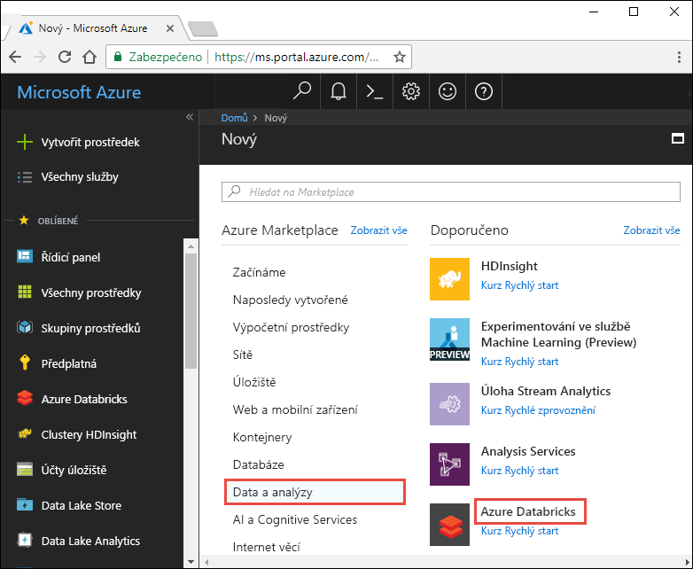
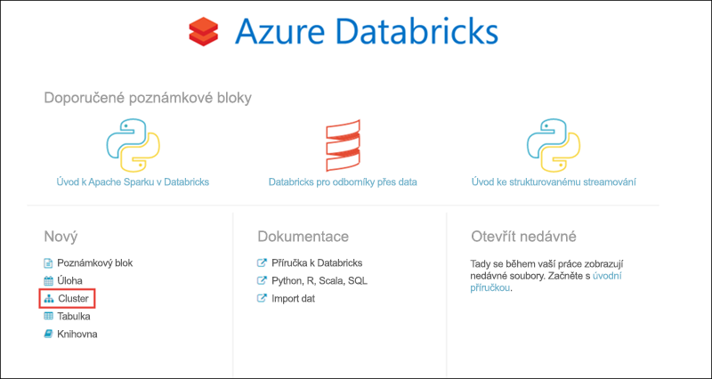
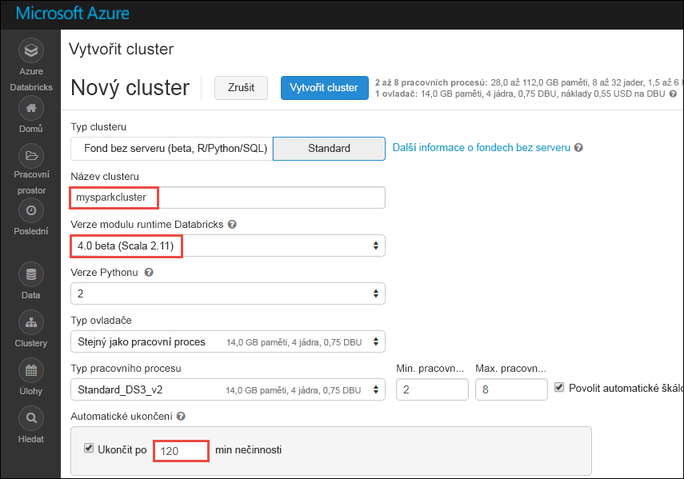
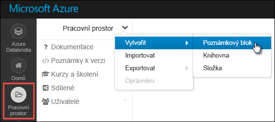
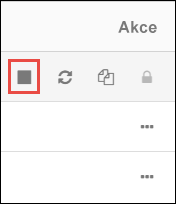

# Kurz: Analýza mínění na streamovaných datech pomocí Azure Databricks

V tomto kurzu se dozvíte, jak spustit analýzu mínění na streamovaných datech téměř v reálném čase pomocí Azure Databricks. Pomocí služby Azure Event Hubs nastavíte systém pro příjem dat. Pomocí konektoru služby Event Hubs pro Spark budete přijímat zprávy ze služby Event Hubs do Azure Databricks. Nakonec pomocí rozhraní API služeb Microsoft Cognitive Services spustíte analýzu mínění na těchto streamovaných datech.

Na konci tohoto kurzu budete streamovat tweety z Twitteru, které obsahují výraz Azure, a na těchto tweetech spustíte analýzu mínění.

Následující obrázek ukazuje běh aplikace:

Tento kurz se zabývá následujícími úkony:

> [!div class="checklist"]
> * Vytvoření pracovního prostoru Azure Databricks
> * Vytvoření clusteru Spark v Azure Databricks
> * Vytvoření twitterové aplikace pro přístup ke streamovaným datům
> * Vytvoření poznámkových bloků v Azure Databricks
> * Připojení knihoven pro službu Event Hubs a rozhraní Twitter API
> * Vytvoření účtu služeb Microsoft Cognitive Services a načtení přístupového klíče
> * Odeslání tweetů do služby Event Hubs
> * Čtení tweetů ze služby Event Hubs
> * Spuštění analýzy mínění na tweetech

Pokud ještě nemáte předplatné Azure, [vytvořte si bezplatný účet](https://azure.microsoft.com/free/) před tím, než začnete.

## Požadavky

Než začnete s tímto kurzem, ujistěte se, že splňujete následující požadavky:
- Obor názvů služby Azure Event Hubs.
- Centrum událostí v rámci tohoto oboru názvů.
- Připojovací řetězec pro přístup k oboru názvů služby Event Hubs. Připojovací řetězec by měl mít formát podobný tomuto: `Endpoint=sb://<namespace>.servicebus.windows.net/;SharedAccessKeyName=<key name>;SharedAccessKey=<key value>`.
- Název zásady sdíleného přístupu a klíč zásady pro službu Event Hubs.

Tyto požadavky můžete splnit dokončením kroků v článku [Vytvoření oboru názvů služby Azure Event Hubs a centra událostí](../event-hubs/event-hubs-create.md).

## Přihlášení k portálu Azure Portal

Přihlaste se k webu [Azure Portal](https://portal.azure.com/).

## Vytvoření pracovního prostoru Azure Databricks

V této části vytvoříte pomocí portálu Azure pracovní prostor služby Azure Databricks.

1. Na webu Azure Portal vyberte **Vytvořit prostředek** > **Data a analýzy** > **Azure Databricks**.

    

3. V části **Služba Azure Databricks** zadejte hodnoty pro vytvoření pracovního prostoru Databricks.

    

    Zadejte následující hodnoty:

    |Vlastnost  |Popis  |
    |---------|---------|
    |**Název pracovního prostoru**     | Zadejte název pracovního prostoru Databricks.        |
    |**Předplatné**     | Z rozevíracího seznamu vyberte své předplatné Azure.        |
    |**Skupina prostředků**     | Určete, jestli chcete vytvořit novou skupinu prostředků, nebo použít existující. Skupina prostředků je kontejner, který obsahuje související prostředky pro řešení Azure. Další informace naleznete v tématu [Přehled skupin prostředků v Azure](../azure-resource-manager/resource-group-overview.md). |
    |**Umístění**     | Vyberte **Východní USA 2**. Další dostupné oblasti najdete v tématu [Dostupné služby Azure podle oblastí](https://azure.microsoft.com/regions/services/).        |
    |**Cenová úroveň**     |  Zvolte úroveň **Standard** nebo **Premium**. Další informace o těchto úrovních najdete na [stránce s cenami za Databricks](https://azure.microsoft.com/pricing/details/databricks/).       |

    Vyberte **Připnout na řídicí panel** a potom vyberte **Vytvořit**.

4. Vytvoření účtu trvá několik minut. Během vytváření účtu se na pravé straně portálu zobrazí dlaždice **Odesílání nasazení pro Azure Databricks**. Možná se budete muset posunout do pravé části řídicího panelu, aby se dlaždice zobrazila. V horní části obrazovky se také zobrazí indikátor průběhu. Průběh můžete sledovat v obou oblastech.

    

## Vytvoření clusteru Spark ve službě Databricks

1. Na webu Azure Portal přejděte do pracovního prostoru Databricks, který jste vytvořili, a vyberte **Spustit pracovní prostor**.

2. Budete přesměrováni na portál Azure Databricks. Na portálu vyberte **Cluster**.

    

3. Na stránce **New cluster** (Nový cluster) zadejte hodnoty pro vytvoření clusteru.

    

    Přijměte všechny výchozí hodnoty kromě následujících:

    * Zadejte název clusteru.
    * Pro účely tohoto článku vytvořte cluster s modulem runtime verze **4.0 (beta)**.
    * Nezapomeňte zaškrtnout políčko **Terminate after ____ minutes of inactivity** (Ukončit po ____ minutách neaktivity). Zadejte dobu (v minutách), po které se má ukončit činnost clusteru, pokud se cluster nepoužívá.

    Vyberte **Vytvořit cluster**. Po spuštění clusteru můžete ke clusteru připojit poznámkové bloky a spouštět úlohy Spark.

## Vytvoření aplikace Twitter

Pro příjem streamovaných tweetů je potřeba vytvořit aplikaci na Twitteru. Postupujte podle pokynů k vytvoření aplikace Twitter a poznamenejte si hodnoty, které potřebujete k dokončení tohoto kurzu.

1. Ve webovém prohlížeči přejděte na stránku [Twitter Application Management](https://apps.twitter.com/) (Správa aplikací Twitter) a vyberte **Create New App** (Vytvořit novou aplikaci).

    

2. Na stránce **Create an application** (Vytvoření aplikace) zadejte podrobnosti o nové aplikaci a pak vyberte **Create your Twitter application** (Vytvořit aplikaci Twitter).

    

3. Na stránce aplikace vyberte kartu **Keys and Access Tokens** (Klíče a přístupové tokeny) a zkopírujte hodnoty **Consumer Key** (Uživatelský klíč) a **Consumer Secret** (Uživatelský tajný klíč). Kromě toho vyberte **Create my access token** (Vytvořit přístupový token) a vygenerujte přístupové tokeny. Zkopírujte hodnoty **Access Token** (Přístupový token) a **Access Token Secret** (Tajný klíč přístupového tokenu).

    

Uložte hodnoty, které jste načetli pro aplikaci Twitter. Tyto hodnoty budete potřebovat v pozdější části kurzu.

## Připojení knihoven ke clusteru Spark

V tomto kurzu k odesílání tweetů do služby Event Hubs použijete rozhraní Twitter API. Použijete také [konektor služby Event Hubs pro Apache Spark](https://github.com/Azure/azure-event-hubs-spark) ke čtení a zápisu dat do služby Azure Event Hubs. Pokud chcete tato rozhraní API použít v rámci svého clusteru, přidejte je jako knihovny do Azure Databricks a pak je přidružte ke svému clusteru Spark. Následující pokyny ukazují, jak přidat knihovnu do složky **Sdílené** ve vašem pracovním prostoru.

1.  V pracovním prostoru Azure Databricks vyberte **Pracovní prostor** a pak klikněte pravým tlačítkem na **Sdílené**. V místní nabídce vyberte **Vytvořit** > **Knihovna**.

    

2. Na stránce Nová knihovna jako **Zdroj** vyberte **Souřadnice Maven**. V části **Souřadnice** zadejte souřadnice balíčku, který chcete přidat. Tady jsou souřadnice Maven pro knihovny použité v tomto kurzu:

    * Konektor služby Event Hubs pro Spark – `com.microsoft.azure:azure-eventhubs-spark_2.11:2.3.1`
    * Rozhraní Twitter API – `org.twitter4j:twitter4j-core:4.0.6`

    

3. Vyberte **Vytvořit knihovnu**.

4. Vyberte složku, do které jste knihovnu přidali, a pak vyberte název knihovny.

    

5. Na stránce knihovny vyberte cluster, ve kterém chcete knihovnu použít. Po úspěšném přidružení knihovny ke clusteru se stav okamžitě změní na **Připojeno**.

    

6. Zopakujte tyto kroky pro balíček Twitteru `twitter4j-core:4.0.6`.

## Získání přístupového klíče služeb Cognitive Services

V tomto kurzu spustíte analýzu mínění na streamu tweetů téměř v reálném čase pomocí [rozhraní API Analýzy textu služeb Microsoft Cognitive Services](../cognitive-services/text-analytics/overview.md). Před použitím těchto rozhraní API je potřeba vytvořit v Azure účet služeb Microsoft Cognitive Services a načíst přístupový klíč pro použití s rozhraními API pro analýzu textu.

1. Přihlaste se k webu [Azure Portal](https://portal.azure.com/).

2. Vyberte **+ Vytvořit prostředek**.

3. V části Azure Marketplace vyberte **AI a Cognitive Services** > **Rozhraní API pro analýzu textu**.

    

4. V dialogovém okně **Vytvořit** zadejte následující hodnoty:

    

    - Zadejte název účtu služeb Cognitive Services.
    - Vyberte předplatné Azure, ve kterém se účet vytvoří.
    - Vyberte umístění Azure.
    - Vyberte cenovou úroveň služby. Další informace o cenách služeb Cognitive Services najdete na [stránce s cenami](https://azure.microsoft.com/pricing/details/cognitive-services/).
    - Určete, jestli chcete vytvořit novou skupinu prostředků, nebo vybrat existující.

    Vyberte **Vytvořit**.

5. Po vytvoření účtu na kartě **Přehled** vyberte **Zobrazit přístupové klíče**.

    

    Zkopírujte také část adresy URL koncového bodu, jak je znázorněno na snímku obrazovky. Tuto adresu URL budete potřebovat v další části kurzu.

6. V části **Správa klíčů** vyberte ikonu kopírování vedle klíče, který chcete použít.

    

7. Uložte hodnoty adresy URL koncového bodu a přístupového klíče, které jste v tomto kroku načetli. Budete je potřebovat později v tomto kurzu.

## Vytvoření poznámkových bloků v Databricks

V této části vytvoříte v pracovním prostoru Databricks dva poznámkové bloky s následujícími názvy:

- **SendTweetsToEventHub** –Poznámkový blob producenta, který použijete k získání tweetů z Twitteru a jejich streamování do služby Event Hubs.
- **AnalyzeTweetsFromEventHub** – Poznámkový blok konzumenta, který použijete ke čtení tweetů ze služby Event Hubs a spuštění analýzy mínění.

1. V levém podokně vyberte **Pracovní prostor**. V rozevíracím seznamu **Pracovní prostor** vyberte **Vytvořit** a pak vyberte **Poznámkový blok**.

    

2. V dialogovém okně **Vytvořit poznámkový blok** zadejte název **SendTweetsToEventHub**, vyberte jazyk **Scala** a vyberte cluster Spark, který jste vytvořili dříve.

    

    Vyberte **Vytvořit**.

3. Zopakováním těchto kroků vytvořte i poznámkový blok **AnalyzeTweetsFromEventHub**.

## Odeslání tweetů do služby Event Hubs

Do poznámkového bloku **SendTweetsToEventHub** vložte následující kód a nahraďte zástupné hodnoty hodnotami pro váš obor názvů služby Event Hubs a aplikaci Twitter, kterou jste vytvořili dříve. Tento poznámkový blok v reálném čase streamuje tweety s klíčovým slovem Azure do služby Event Hubs.

    import java.util._
    import scala.collection.JavaConverters._
    import com.microsoft.azure.eventhubs._
    import java.util.concurrent._

    val namespaceName = "<EVENT HUBS NAMESPACE>"
    val eventHubName = "<EVENT HUB NAME>"
    val sasKeyName = "<POLICY NAME>"
    val sasKey = "<POLICY KEY>"
    val connStr = new ConnectionStringBuilder()
                .setNamespaceName(namespaceName)
                .setEventHubName(eventHubName)
                .setSasKeyName(sasKeyName)
                .setSasKey(sasKey)

    val pool = Executors.newFixedThreadPool(1)
    val eventHubClient = EventHubClient.create(connStr.toString(), pool)

    def sendEvent(message: String) = {
      val messageData = EventData.create(message.getBytes("UTF-8"))
      eventHubClient.get().send(messageData)
      System.out.println("Sent event: " + message + "\n")
    }

    import twitter4j._
    import twitter4j.TwitterFactory
    import twitter4j.Twitter
    import twitter4j.conf.ConfigurationBuilder

    // Twitter configuration!
    // Replace values below with yours

    val twitterConsumerKey = "<CONSUMER KEY>"
    val twitterConsumerSecret = "<CONSUMER SECRET>"
    val twitterOauthAccessToken = "<ACCESS TOKEN>"
    val twitterOauthTokenSecret = "<TOKEN SECRET>"

    val cb = new ConfigurationBuilder()
      cb.setDebugEnabled(true)
      .setOAuthConsumerKey(twitterConsumerKey)
      .setOAuthConsumerSecret(twitterConsumerSecret)
      .setOAuthAccessToken(twitterOauthAccessToken)
      .setOAuthAccessTokenSecret(twitterOauthTokenSecret)

    val twitterFactory = new TwitterFactory(cb.build())
    val twitter = twitterFactory.getInstance()

    // Getting tweets with keyword "Azure" and sending them to the Event Hub in realtime!

    val query = new Query(" #Azure ")
    query.setCount(100)
    query.lang("en")
    var finished = false
    while (!finished) {
      val result = twitter.search(query)
      val statuses = result.getTweets()
      var lowestStatusId = Long.MaxValue
      for (status <- statuses.asScala) {
        if(!status.isRetweet()){
          sendEvent(status.getText())
        }
        lowestStatusId = Math.min(status.getId(), lowestStatusId)
        Thread.sleep(2000)
      }
      query.setMaxId(lowestStatusId - 1)
    }

    // Closing connection to the Event Hub
    eventHubClient.get().close()

Pokud chcete poznámkový blok spustit, stiskněte **SHIFT + ENTER**. Zobrazí se výstup jako v následujícím fragmentu kódu. Každá událost ve výstupu představuje tweet, který se ingestuje do služby Event Hubs.

    Sent event: @Microsoft and @Esri launch Geospatial AI on Azure https://t.co/VmLUCiPm6q via @geoworldmedia #geoai #azure #gis #ArtificialIntelligence

    Sent event: Public preview of Java on App Service, built-in support for Tomcat and OpenJDK
    https://t.co/7vs7cKtvah
    #cloudcomputing #Azure

    Sent event: 4 Killer #Azure Features for #Data #Performance https://t.co/kpIb7hFO2j by @RedPixie

    Sent event: Migrate your databases to a fully managed service with Azure SQL Database Managed Instance | #Azure | #Cloud https://t.co/sJHXN4trDk

    Sent event: Top 10 Tricks to #Save Money with #Azure Virtual Machines https://t.co/F2wshBXdoz #Cloud

    ...
    ...

## Čtení tweetů ze služby Event Hubs

Do poznámkového bloku **AnalyzeTweetsFromEventHub** vložte následující kód a nahraďte zástupné hodnoty hodnotami pro vaši službu Azure Event Hubs, kterou jste vytvořili dříve. Tento poznámkový blok čte tweety, které jste předtím streamovali do služby Event Hubs pomocí poznámkového bloku **SendTweetsToEventHub**.

    import org.apache.spark.eventhubs._

    // Build connection string with the above information
    val connectionString = ConnectionStringBuilder("<EVENT HUBS CONNECTION STRING>")
      .setEventHubName("<EVENT HUB NAME>")
      .build

    val customEventhubParameters =
      EventHubsConf(connectionString)
      .setMaxEventsPerTrigger(5)

    val incomingStream = spark.readStream.format("eventhubs").options(customEventhubParameters.toMap).load()

    incomingStream.printSchema

    // Sending the incoming stream into the console.
    // Data comes in batches!
    incomingStream.writeStream.outputMode("append").format("console").option("truncate", false).start().awaitTermination()

Zobrazí se následující výstup:

    root
     |-- body: binary (nullable = true)
     |-- offset: long (nullable = true)
     |-- seqNumber: long (nullable = true)
     |-- enqueuedTime: long (nullable = true)
     |-- publisher: string (nullable = true)
     |-- partitionKey: string (nullable = true)

    -------------------------------------------
    Batch: 0
    -------------------------------------------
    +------+------+--------------+---------------+---------+------------+
    |body  |offset|sequenceNumber|enqueuedTime   |publisher|partitionKey|
    +------+------+--------------+---------------+---------+------------+
    |[50 75 62 6C 69 63 20 70 72 65 76 69 65 77 20 6F 66 20 4A 61 76 61 20 6F 6E 20 41 70 70 20 53 65 72 76 69 63 65 2C 20 62 75 69 6C 74 2D 69 6E 20 73 75 70 70 6F 72 74 20 66 6F 72 20 54 6F 6D 63 61 74 20 61 6E 64 20 4F 70 65 6E 4A 44 4B 0A 68 74 74 70 73 3A 2F 2F 74 2E 63 6F 2F 37 76 73 37 63 4B 74 76 61 68 20 0A 23 63 6C 6F 75 64 63 6F 6D 70 75 74 69 6E 67 20 23 41 7A 75 72 65]                              |0     |0             |2018-03-09 05:49:08.86 |null     |null        |
    |[4D 69 67 72 61 74 65 20 79 6F 75 72 20 64 61 74 61 62 61 73 65 73 20 74 6F 20 61 20 66 75 6C 6C 79 20 6D 61 6E 61 67 65 64 20 73 65 72 76 69 63 65 20 77 69 74 68 20 41 7A 75 72 65 20 53 51 4C 20 44 61 74 61 62 61 73 65 20 4D 61 6E 61 67 65 64 20 49 6E 73 74 61 6E 63 65 20 7C 20 23 41 7A 75 72 65 20 7C 20 23 43 6C 6F 75 64 20 68 74 74 70 73 3A 2F 2F 74 2E 63 6F 2F 73 4A 48 58 4E 34 74 72 44 6B]            |168   |1             |2018-03-09 05:49:24.752|null     |null        |
    +------+------+--------------+---------------+---------+------------+

    -------------------------------------------
    Batch: 1
    -------------------------------------------
    ...
    ...

Vzhledem k tomu, že se výstup zobrazuje v binárním režimu, pomocí následujícího fragmentu kódu ho převeďte na řetězec.

    import org.apache.spark.sql.types._
    import org.apache.spark.sql.functions._

    // Event Hub message format is JSON and contains "body" field
    // Body is binary, so we cast it to string to see the actual content of the message
    val messages =
      incomingStream
      .withColumn("Offset", $"offset".cast(LongType))
      .withColumn("Time (readable)", $"enqueuedTime".cast(TimestampType))
      .withColumn("Timestamp", $"enqueuedTime".cast(LongType))
      .withColumn("Body", $"body".cast(StringType))
      .select("Offset", "Time (readable)", "Timestamp", "Body")

    messages.printSchema

    messages.writeStream.outputMode("append").format("console").option("truncate", false).start().awaitTermination()

Výstup teď vypadá podobně jako následující fragment kódu:

    root
     |-- Offset: long (nullable = true)
     |-- Time (readable): timestamp (nullable = true)
     |-- Timestamp: long (nullable = true)
     |-- Body: string (nullable = true)

    -------------------------------------------
    Batch: 0
    -------------------------------------------
    +------+-----------------+----------+-------+
    |Offset|Time (readable)  |Timestamp |Body
    +------+-----------------+----------+-------+
    |0     |2018-03-09 05:49:08.86 |1520574548|Public preview of Java on App Service, built-in support for Tomcat and OpenJDK
    https://t.co/7vs7cKtvah
    #cloudcomputing #Azure          |
    |168   |2018-03-09 05:49:24.752|1520574564|Migrate your databases to a fully managed service with Azure SQL Database Managed Instance | #Azure | #Cloud https://t.co/sJHXN4trDk    |
    |0     |2018-03-09 05:49:02.936|1520574542|@Microsoft and @Esri launch Geospatial AI on Azure https://t.co/VmLUCiPm6q via @geoworldmedia #geoai #azure #gis #ArtificialIntelligence|
    |176   |2018-03-09 05:49:20.801|1520574560|4 Killer #Azure Features for #Data #Performance https://t.co/kpIb7hFO2j by @RedPixie                                                    |
    +------+-----------------+----------+-------+
    -------------------------------------------
    Batch: 1
    -------------------------------------------
    ...
    ...

Právě jste téměř v reálném čase streamovali data ze služby Azure Event Hubs do Azure Databricks pomocí konektoru služby Event Hubs pro Apache Spark. Další informace o použití konektoru služby Event Hubs pro Spark najdete v [dokumentaci ke konektorům](https://github.com/Azure/azure-event-hubs-spark/tree/master/docs).

## Spuštění analýzy mínění na tweetech

V této části spustíte analýzu mínění na tweetech přijatých pomocí rozhraní Twitter API. Fragmenty kódu v této části přidáte do stejného poznámkového bloku **AnalyzeTweetsFromEventHub**.

Začněte tím, že do poznámkového bloku přidáte novou buňku kódu a vložíte do ní níže uvedený fragment kódu. Tento fragment kódu definuje datové typy pro práci s rozhraními API pro analýzu jazyka a mínění.

    import java.io._
    import java.net._
    import java.util._

    class Document(var id: String, var text: String, var language: String = "", var sentiment: Double = 0.0) extends Serializable

    class Documents(var documents: List[Document] = new ArrayList[Document]()) extends Serializable {

        def add(id: String, text: String, language: String = "") {
            documents.add (new Document(id, text, language))
        }
        def add(doc: Document) {
            documents.add (doc)
        }
    }

Přidejte novou buňku kódu a vložte do ní níže uvedený fragment kódu. Tento fragment kódu se vyžaduje k parsování řetězců JSON.

    class CC[T] extends Serializable { def unapply(a:Any):Option[T] = Some(a.asInstanceOf[T]) }
    object M extends CC[scala.collection.immutable.Map[String, Any]]
    object L extends CC[scala.collection.immutable.List[Any]]
    object S extends CC[String]
    object D extends CC[Double]

Přidejte novou buňku kódu a vložte do ní níže uvedený fragment kódu. Tento fragment kódu definuje objekt, který obsahuje funkce pro volání rozhraní API pro analýzu textu za účelem spuštění detekce jazyka a analýzy mínění. Nezapomeňte nahradit zástupné hodnoty `<PROVIDE ACCESS KEY HERE>` (Přístupový klíč) a `<PROVIDE HOST HERE>` (Hostitel) hodnotami, které jste načetli pro svůj účet služeb Cognitive Services.

    import javax.net.ssl.HttpsURLConnection
    import com.google.gson.Gson
    import com.google.gson.GsonBuilder
    import com.google.gson.JsonObject
    import com.google.gson.JsonParser
    import scala.util.parsing.json._

    object SentimentDetector extends Serializable {

      // Cognitive Services API connection settings
      val accessKey = "<PROVIDE ACCESS KEY HERE>"
      val host = "<PROVIDE HOST HERE>"
      val languagesPath = "/text/analytics/v2.0/languages"
      val sentimentPath = "/text/analytics/v2.0/sentiment"
      val languagesUrl = new URL(host+languagesPath)
      val sentimenUrl = new URL(host+sentimentPath)

      def getConnection(path: URL): HttpsURLConnection = {
        val connection = path.openConnection().asInstanceOf[HttpsURLConnection]
        connection.setRequestMethod("POST")
        connection.setRequestProperty("Content-Type", "text/json")
        connection.setRequestProperty("Ocp-Apim-Subscription-Key", accessKey)
        connection.setDoOutput(true)
        return connection
      }

      def prettify (json_text: String): String = {
        val parser = new JsonParser()
        val json = parser.parse(json_text).getAsJsonObject()
        val gson = new GsonBuilder().setPrettyPrinting().create()
        return gson.toJson(json)
      }

      // Handles the call to Cognitive Services API.
      // Expects Documents as parameters and the address of the API to call.
      // Returns an instance of Documents in response.
      def processUsingApi(inputDocs: Documents, path: URL): String = {
        val docText = new Gson().toJson(inputDocs)
        val encoded_text = docText.getBytes("UTF-8")
        val connection = getConnection(path)
        val wr = new DataOutputStream(connection.getOutputStream())
        wr.write(encoded_text, 0, encoded_text.length)
        wr.flush()
        wr.close()

        val response = new StringBuilder()
        val in = new BufferedReader(new InputStreamReader(connection.getInputStream()))
        var line = in.readLine()
        while (line != null) {
            response.append(line)
            line = in.readLine()
        }
        in.close()
        return response.toString()
      }

      // Calls the language API for specified documents.
      // Returns a documents with language field set.
      def getLanguage (inputDocs: Documents): Documents = {
        try {
          val response = processUsingApi(inputDocs, languagesUrl)
          // In case we need to log the json response somewhere
          val niceResponse = prettify(response)
          val docs = new Documents()
          val result = for {
                // Deserializing the JSON response from the API into Scala types
                Some(M(map)) <- scala.collection.immutable.List(JSON.parseFull(niceResponse))
                L(documents) = map("documents")
                M(document) <- documents
                S(id) = document("id")
                L(detectedLanguages) = document("detectedLanguages")
                M(detectedLanguage) <- detectedLanguages
                S(language) = detectedLanguage("iso6391Name")
          } yield {
                docs.add(new Document(id = id, text = id, language = language))
          }
          return docs
        } catch {
              case e: Exception => return new Documents()
        }
      }

      // Calls the sentiment API for specified documents. Needs a language field to be set for each of them.
      // Returns documents with sentiment field set, taking a value in the range from 0 to 1.
      def getSentiment (inputDocs: Documents): Documents = {
        try {
          val response = processUsingApi(inputDocs, sentimenUrl)
          val niceResponse = prettify(response)
          val docs = new Documents()
          val result = for {
                // Deserializing the JSON response from the API into Scala types
                Some(M(map)) <- scala.collection.immutable.List(JSON.parseFull(niceResponse))
                L(documents) = map("documents")
                M(document) <- documents
                S(id) = document("id")
                D(sentiment) = document("score")
          } yield {
                docs.add(new Document(id = id, text = id, sentiment = sentiment))
          }
          return docs
        } catch {
            case e: Exception => return new Documents()
        }
      }
    }

    // User Defined Function for processing content of messages to return their sentiment.
    val toSentiment = udf((textContent: String) => {
      val inputDocs = new Documents()
      inputDocs.add (textContent, textContent)
      val docsWithLanguage = SentimentDetector.getLanguage(inputDocs)
      val docsWithSentiment = SentimentDetector.getSentiment(docsWithLanguage)
      if (docsWithLanguage.documents.isEmpty) {
        // Placeholder value to display when unable to perform sentiment request for text in unknown language
        (-1).toDouble
      } else {
        docsWithSentiment.documents.get(0).sentiment.toDouble
      }
    })

Přidejte poslední buňku kódu pro přípravu datového rámce s obsahem tweetu a mínění přidruženého k danému tweetu.

    // Prepare a dataframe with Content and Sentiment columns
    val streamingDataFrame = incomingStream.selectExpr("cast (body as string) AS Content").withColumn("Sentiment", toSentiment($"Content"))

    // Display the streaming data with the sentiment
    streamingDataFrame.writeStream.outputMode("append").format("console").option("truncate", false).start().awaitTermination()

Zobrazený výstup by měl vypadat přibližně jako následující fragment kódu:

    -------------------------------------------
    Batch: 0
    -------------------------------------------
    +--------------------------------+------------------+
    |Content                         |Sentiment         |
    +--------------------------------+------------------+
    |Public preview of Java on App Service, built-in support for Tomcat and OpenJDK
    https://t.co/7vs7cKtvah   #cloudcomputing #Azure          |0.7761918306350708|
    |Migrate your databases to a fully managed service with Azure SQL Database Managed Instance | #Azure | #Cloud https://t.co/sJHXN4trDk    |0.8558163642883301|
    |@Microsoft and @Esri launch Geospatial AI on Azure https://t.co/VmLUCiPm6q via @geoworldmedia #geoai #azure #gis #ArtificialIntelligence|0.5               |
    |4 Killer #Azure Features for #Data #Performance https://t.co/kpIb7hFO2j by @RedPixie                                                    |0.5               |
    +--------------------------------+------------------+

Hodnota ve sloupci **Sentiment** (Mínění) blížící se **1** značí skvělé zkušenosti s Azure. Hodnota blížící se **0** značí, že se uživatel při práci s Microsoft Azure setkal s problémy.

A to je vše! Pomocí Azure Databricks jste úspěšně streamovali data do služby Azure Event Hubs, streamovaná data jste použili pomocí konektoru služby Event Hubs a pak jste na streamovaných datech spustili analýzu mínění – téměř v reálném čase.

## Vyčištění prostředků

Po dokončení tohoto kurzu můžete cluster ukončit. Pokud to chcete udělat, v levém podokně v pracovním prostoru Azure Databricks vyberte **Clusters** (Clustery). U clusteru, který chcete ukončit, přesuňte kurzor na tři tečky pod sloupcem **Actions** (Akce) a vyberte ikonu **Terminate** (Ukončit).

Pokud cluster neukončíte ručně, zastaví se automaticky za předpokladu, že jste při vytváření clusteru zaškrtli políčko **Ukončit po __ minutách nečinnosti**. V takovém případě se cluster automaticky zastaví, pokud byl po zadanou dobu neaktivní.

## Další kroky
V tomto kurzu jste zjistili, jak pomocí Azure Databricks streamovat data do služby Azure Event Hubs a pak streamovaná data v reálném čase číst ze služby Event Hubs. Naučili jste se tyto postupy:
> [!div class="checklist"]
> * Vytvoření pracovního prostoru Azure Databricks
> * Vytvoření clusteru Spark v Azure Databricks
> * Vytvoření twitterové aplikace pro přístup ke streamovaným datům
> * Vytvoření poznámkových bloků v Azure Databricks
> * Přidání a připojení knihoven pro službu Event Hubs a rozhraní Twitter API
> * Vytvoření účtu služeb Microsoft Cognitive Services a načtení přístupového klíče
> * Odeslání tweetů do služby Event Hubs
> * Čtení tweetů ze služby Event Hubs
> * Spuštění analýzy mínění na tweetech

Pokračujte k dalšímu kurzu, kde se dozvíte, jak pomocí Azure Databricks provádět úlohy strojového učení.

> [!div class="nextstepaction"]
>[Strojové učení s využitím Azure Databricks](https://docs.azuredatabricks.net/spark/latest/mllib/decision-trees.html)
