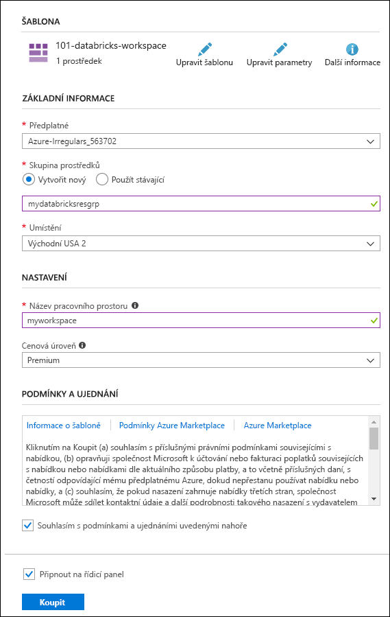
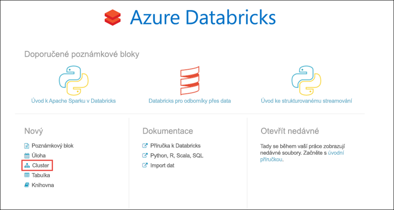

# <a name="quickstart-run-a-spark-job-on-azure-databricks-using-the-azure-resource-manager-template"></a>Rychlý start: Spuštění úlohy Spark v Azure Databricks pomocí šablony Azure Resource Manageru

V tomto rychlém startu použijete šablonu Azure Resource Manager k vytvoření pracovního prostoru Azure Databricks s Apache Sparkm clusterem. Úlohu spustíte v clusteru a pomocí vlastních grafů můžete vytvořit sestavy v reálném čase z bezplatného nebo placeného využití na základě demografických údajů.

## <a name="prerequisites"></a>Požadavky

- Předplatné Azure – [Vytvořte si ho zdarma](https://azure.microsoft.com/free/) .

## <a name="sign-in-to-the-azure-portal"></a>Přihlášení k webu Azure Portal

Přihlaste se k webu [Azure Portal](https://portal.azure.com).

> [!Note]
> Tento kurz se nedá provést pomocí **předplatného Azure free zkušební verze**.
> Pokud máte bezplatný účet, přejděte na svůj profil a změňte si předplatné na **průběžné platby**. Další informace najdete na stránce [bezplatného účtu Azure](https://azure.microsoft.com/free/). Pak [odeberte limit útraty](https://docs.microsoft.com/azure/billing/billing-spending-limit#why-you-might-want-to-remove-the-spending-limit)a [požádejte o zvýšení kvóty](https://docs.microsoft.com/azure/azure-portal/supportability/resource-manager-core-quotas-request) pro vCPU ve vaší oblasti. Když vytváříte pracovní prostor Azure Databricks, můžete vybrat cenovou úroveň **DBU (Premium-14-days)** a poskytnout tak přístup k pracovnímu prostoru zdarma Premium Azure Databricks DBU po dobu 14 dnů.

## <a name="create-an-azure-databricks-workspace"></a>Vytvoření pracovního prostoru Azure Databricks

V této části pomocí šablony Azure Resource Manageru vytvoříte pracovní prostor Azure Databricks.

1. Kliknutím na následující obrázek otevřete šablonu na portálu Azure Portal.

   [](https://portal.azure.com/#create/Microsoft.Template/uri/https%3A%2F%2Fraw.githubusercontent.com%2FAzure%2Fazure-quickstart-templates%2Fmaster%2F101-databricks-workspace%2Fazuredeploy.json)

2. Zadejte požadované hodnoty pro vytvoření pracovního prostoru Azure Databricks.

   

   Zadejte následující hodnoty:

   |Vlastnost  |Popis  |
   |---------|---------|
   |**Předplatné**     | Z rozevíracího seznamu vyberte své předplatné Azure.        |
   |**Skupina prostředků**     | Určete, jestli chcete vytvořit novou skupinu prostředků, nebo použít existující. Skupina prostředků je kontejner, který obsahuje související prostředky pro řešení Azure. Další informace naleznete v tématu [Přehled skupin prostředků v Azure](../azure-resource-manager/management/overview.md). |
   |**Umístění**     | Vyberte **USA – východ 2**. Další dostupné oblasti najdete v tématu [Dostupné služby Azure podle oblastí](https://azure.microsoft.com/regions/services/).        |
   |**Název pracovního prostoru**     | Zadejte název pracovního prostoru Databricks.        |
   |**Cenová úroveň**     |  Zvolte úroveň **Standard** nebo **Premium**. Další informace o těchto úrovních najdete na [stránce s cenami za Databricks](https://azure.microsoft.com/pricing/details/databricks/).       |

3. Vyberte **Souhlasím s podmínkami a ujednáními uvedenými nahoře**, vyberte **Připnout na řídicí panel** a potom klikněte na **Koupit**.

4. Vytvoření pracovního prostoru trvá několik minut. Během vytváření pracovního prostoru se na pravé straně portálu zobrazí dlaždice **Odesílání nasazení pro Azure Databricks**. Možná se budete muset posunout do pravé části řídicího panelu, aby se dlaždice zobrazila. V horní části obrazovky se také zobrazí indikátor průběhu. Průběh můžete sledovat v obou oblastech.

   

   V případě selhání nasazení pracovního prostoru je pracovní prostor stále vytvořen ve stavu selhání. Odstraňte neúspěšný pracovní prostor a vytvořte nový pracovní prostor, který vyřeší chyby nasazení. Při odstranění neúspěšného pracovního prostoru se odstraní také spravovaná skupina prostředků a všechny úspěšně nasazené prostředky.

## <a name="create-a-spark-cluster-in-databricks"></a>Vytvoření clusteru Spark ve službě Databricks

1. Na webu Azure Portal přejděte do pracovního prostoru Databricks, který jste vytvořili, a klikněte na **Spustit pracovní prostor**.

2. Budete přesměrováni na portál Azure Databricks. Na portálu klikněte na **Cluster**.

   

3. Na stránce **New cluster** (Nový cluster) zadejte hodnoty pro vytvoření clusteru.

   

   Přijměte všechny výchozí hodnoty kromě následujících:

   * Zadejte název clusteru.
   * Pro účely tohoto článku vytvořte cluster s modulem runtime verze **4.0**.
   * Ujistěte se, že jste zaškrtli políčko **ukončit po \_ \_ minutách nečinnosti** . Zadejte dobu (v minutách), po které se má ukončit činnost clusteru, pokud se cluster nepoužívá.

   Vyberte **Vytvořit cluster**. Po spuštění clusteru můžete ke clusteru připojit poznámkové bloky a spouštět úlohy Spark.

Další informace o vytváření clusterů najdete v tématu [Vytvoření clusteru Spark v Azure Databricks](/azure/databricks/clusters/create).

## <a name="run-a-spark-sql-job"></a>Spuštění úlohy Spark SQL

Než se pustíte do této části, je potřeba nejprve splnit následující požadavky:

* [Vytvořte účet úložiště objektů blob v Azure](../storage/common/storage-account-create.md).
* Stáhněte si ukázkový soubor JSON [z GitHubu](https://github.com/Azure/usql/blob/master/Examples/Samples/Data/json/radiowebsite/small_radio_json.json).
* Nahrajte ukázkový soubor JSON do účtu úložiště objektů blob v Azure, který jste vytvořili. Soubory můžete nahrát pomocí [Průzkumníka služby Microsoft Azure Storage](../vs-azure-tools-storage-manage-with-storage-explorer.md).

Provedením následujících úloh vytvořte ve službě Databricks poznámkový blok, nakonfigurujte ho na čtení dat z účtu služby Azure Blob Storage a potom na těchto datech spusťte úlohu Spark SQL.

1. V levém podokně klikněte na **Workspace** (Pracovní prostor). V rozevíracím seznamu **Workspace** (Pracovní prostor), klikněte na **Create** (Vytvořit) a potom klikněte na **Notebook** (Poznámkový blok).

   

2. V dialogovém okně **Create Notebook** (Vytvořit poznámkový blok) zadejte název, vyberte jazyk **Scala** a vyberte cluster Spark, který jste předtím vytvořili.

   

   Klikněte na **Vytvořit**.

3. V tomto kroku přidružte účet Azure Storage ke clusteru Databricks Spark. Toto přidružení můžete provést dvěma způsoby. Můžete připojit účet Azure Storage k systému souborů Databricks (DBFS) nebo k účtu Azure Storage přistupovat přímo z vytvářené aplikace.

   > [!IMPORTANT]
   >V tomto článku se používá přístup využívající **připojení úložiště k systému souborů DBFS**. Tento přístup zajistí, že se připojené úložiště přidruží k samotnému systému souborů clusteru. Přidružené úložiště tak budou moci využívat i všechny aplikace přistupující ke clusteru. Přístup využívající přímý přístup je omezený na aplikaci, ze které přístup nakonfigurujete.
   >
   > Pokud chcete použít přístup využívající připojení, musíte vytvořit cluster Spark s modulem runtime Databricks verze **4.0**, který jste zvolili v tomto článku.

   V následujícím fragmentu kódu nahraďte `{YOUR CONTAINER NAME}` (Název vašeho kontejneru), `{YOUR STORAGE ACCOUNT NAME}` (Název vašeho účtu úložiště) a `{YOUR STORAGE ACCOUNT ACCESS KEY}` (Přístupový klíč vašeho účtu úložiště) odpovídajícími hodnotami pro váš účet Azure Storage. Vložte fragment kódu do prázdné buňky v poznámkovém bloku a stisknutím kláves SHIFT + ENTER buňku kódu spusťte.

   * **Připojení účtu úložiště k systému souborů DBFS (doporučeno)**. V tomto fragmentu kódu se cesta k účtu Azure Storage připojí k cestě `/mnt/mypath`. Proto ve všech budoucích výskytech při přistupování k účtu Azure Storage už nemusíte zadávat úplnou cestu. Můžete použít jenom `/mnt/mypath`.

          dbutils.fs.mount(
            source = "wasbs://{YOUR CONTAINER NAME}@{YOUR STORAGE ACCOUNT NAME}.blob.core.windows.net/",
            mountPoint = "/mnt/mypath",
            extraConfigs = Map("fs.azure.account.key.{YOUR STORAGE ACCOUNT NAME}.blob.core.windows.net" -> "{YOUR STORAGE ACCOUNT ACCESS KEY}"))

   * **Přímý přístup k účtu úložišti**

          spark.conf.set("fs.azure.account.key.{YOUR STORAGE ACCOUNT NAME}.blob.core.windows.net", "{YOUR STORAGE ACCOUNT ACCESS KEY}")

     Informace o tom, jak načíst přístupové klíče účtu úložiště, najdete v tématu [Správa přístupových](../storage/common/storage-account-keys-manage.md)klíčů účtu úložiště.

   > [!NOTE]
   > V Azure Databricks můžete také použít službu Azure Data Lake Store s clusterem Spark. Pokyny najdete v článku [Použití služby Data Lake Store ve službě Azure Databricks](/azure/databricks/data/data-sources/azure/azure-datalake-gen2).

4. Spuštěním příkazu SQL vytvořte dočasnou tabulku pomocí dat z ukázkového datového souboru JSON **small_radio_json.json**. V následujícím fragmentu kódu nahraďte zástupné hodnoty názvem vašeho kontejneru a názvem účtu úložiště. Vložte fragment kódu do buňky kódu v poznámkovém bloku a stiskněte klávesy SHIFT + ENTER. V tomto fragmentu kódu `path` označuje umístění ukázkového souboru JSON, který jste nahráli do účtu služby Azure Storage.

   ```sql
   %sql
   DROP TABLE IF EXISTS radio_sample_data;
   CREATE TABLE radio_sample_data
   USING json
   OPTIONS (
    path "/mnt/mypath/small_radio_json.json"
   )
   ```

   Po úspěšném dokončení příkazu získáte všechna data ze souboru JSON ve formátu tabulky v clusteru Databricks.

   Magický příkaz jazyka `%sql` umožňuje spustit z poznámkového bloku kód SQL, i když je poznámkový blok jiného typu. Další informace najdete v článku [Kombinování jazyků v poznámkovém bloku](/azure/databricks/notebooks/index).

5. Podívejme se na snímek ukázkových dat JSON, abyste lépe pochopili dotaz, který spouštíte. Vložte do buňky kódu následující fragment kódu a stiskněte klávesy **SHIFT + ENTER**.

   ```sql
   %sql
   SELECT * from radio_sample_data
   ```

6. Zobrazí se tabulkový výstup jako na následujícím snímku obrazovky (zobrazí se jenom některé sloupce):

   

   Kromě dalších podrobností vzorová data zachycují pohlaví posluchačů rádiového kanálu (název sloupce, **pohlaví**) a zda je jejich předplatné bezplatné nebo placené (název sloupce, **úroveň**).

7. Teď vytvoříte vizuální reprezentaci těchto dat, která bude znázorňovat, kolik uživatelů obou pohlaví má bezplatné účty a kolik je platících předplatitelů. Ve spodní části tabulkového výstupu klikněte na ikonu **Bar chart** (Pruhový graf) ikonu a potom na **Plot Options** (Možnosti grafu).

   

8. V části **Customize Plot** (Přizpůsobit graf) přetáhněte hodnoty, jak ukazuje snímek obrazovky.

   

   * V poli **Keys** (Klíče) nastavte hodnotu **gender** (Pohlaví).
   * V poli **Seskupení sérií** nastavte hodnotu **level** (Úroveň).
   * V poli **Values** (Hodnoty) nastavte hodnotu **level** (Úroveň).
   * V poli **Aggregation** (Agregace) vyberte možnost **COUNT** (Počet).

   Klikněte na **Použít**.

9. Výstup bude obsahovat vizuální reprezentaci znázorněnou na následujícím snímku obrazovky:

   

## <a name="clean-up-resources"></a>Vyčištění prostředků

Po dokončení tohoto článku můžete cluster ukončit. Pokud to chcete udělat, v levém podokně v pracovním prostoru Azure Databricks vyberte **Clusters** (Clustery). U clusteru, který chcete ukončit, přesuňte kurzor na tři tečky pod sloupcem **Actions** (Akce) a vyberte ikonu **Terminate** (Ukončit).


Pokud cluster neukončíte ručně, zastaví se automaticky, a to za předpokladu, že jste při vytváření clusteru zaškrtli políčko **ukončit po \_ \_ minutách nečinnosti** . V takovém případě se cluster automaticky zastaví, pokud byl po stanovenou dobu neaktivní.

## <a name="next-steps"></a>Další kroky

V tomto článku jste v Azure Databricks vytvořili cluster Spark a spustili úlohu Spark pomocí dat ve službě Azure Storage. Můžete si také projít článek [Zdroje dat Spark](/azure/databricks/data/data-sources/index) a zjistit, jak do Azure Databricks importovat data z jiných zdrojů dat. Můžete si také prohlédnout šablonu Resource Manageru pro [Vytvoření pracovního prostoru Azure Databricks s vlastní adresou virtuální sítě](https://github.com/Azure/azure-quickstart-templates/tree/master/101-databricks-workspace-with-custom-vnet-address). Informace o syntaxi a vlastnostech JSON pro použití v šabloně najdete v referenčních informacích k šabloně [Microsoft. datacihly/pracovní prostory](/azure/templates/microsoft.databricks/workspaces) .

V dalším článku se dozvíte, jak pomocí Azure Databricks provést operaci ETL (extrakce, transformace a načítání dat).

> [!div class="nextstepaction"]
> [Extrakce, transformace a načítání dat pomocí Azure Databricks](databricks-extract-load-sql-data-warehouse.md)
