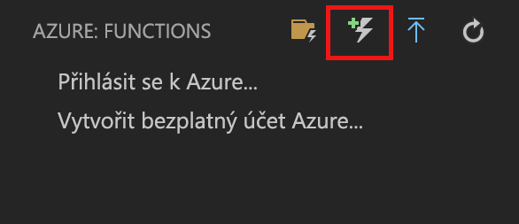

# <a name="create-your-first-durable-function-in-javascript"></a>Vytvoření první funkce trvalý v jazyce JavaScript

*Odolná služba Functions* je rozšířením [Azure Functions](../functions-overview.md) , který umožňuje zapisovat stavové funkce v prostředí bez serveru. Rozšíření spravuje stav, kontrolní body a restartuje za vás.

V tomto článku se dozvíte, jak použít rozšíření Visual Studio Code Azure Functions místně vytvořit a otestovat funkci "hello world" trvalý.  Tato funkce bude orchestrovat a zřetězit volání dalších funkcí. Kód funkce potom publikujete do Azure.

## <a name="prerequisites"></a>Požadavky

Pro absolvování tohoto kurzu potřebujete:

* Nainstalujte [Visual Studio Code](https://code.visualstudio.com/download).

* Přesvědčte se, že máte [nejnovější nástroje Azure Functions](../functions-develop-vs.md#check-your-tools-version).

* Na počítači s Windows zkontrolujte, máte [emulátoru úložiště Azure](../../storage/common/storage-use-emulator.md) nainstalovaná a spuštěná. Na počítači Mac nebo Linux musíte použít účet skutečné úložiště Azure.

* Ujistěte se, že máte verze 8.0 nebo novější verzi [Node.js](https://nodejs.org/) nainstalované.

[!INCLUDE [quickstarts-free-trial-note](../../../includes/quickstarts-free-trial-note.md)]

[!INCLUDE [functions-install-vs-code-extension](../../../includes/functions-install-vs-code-extension.md)]

[!INCLUDE [functions-create-function-app-vs-code](../../../includes/functions-create-function-app-vs-code.md)]

## <a name="create-a-starter-function"></a>Vytvoření funkce Starter

1. Z oblasti **Azure: Functions** zvolte ikonu Vytvořit funkci.

    

1. Vyberte složku s vaším projektem aplikace funkcí a vyberte šablonu funkce **Trigger HTTP**.

    

1. Jako název funkce zadejte `HttpStart`, stiskněte klávesu Enter a pak vyberte **Anonymní** ověřování.

    

    Funkce ve vybraném jazyce se vytvoří pomocí šablony funkce aktivované protokolem HTTP.

    

1. Nahraďte index.js s pod JavaScript:

    ```javascript
    const df = require("durable-functions");
    
    module.exports = async function (context, req) {
        const client = df.getClient(context);
        const instanceId = await client.startNew(req.params.functionName, undefined, req.body);
    
        context.log(`Started orchestration with ID = '${instanceId}'.`);
    
        return client.createCheckStatusResponse(context.bindingData.req, instanceId);
    };
    ```

1. Nahraďte function.json se následující JSON:

    ```JSON
    {
      "bindings": [
        {
          "authLevel": "anonymous",
          "name": "req",
          "type": "httpTrigger",
          "direction": "in",
          "route": "orchestrators/{functionName}",
          "methods": ["post"]
        },
        {
          "name": "$return",
          "type": "http",
          "direction": "out"
        },
        {
          "name": "starter",
          "type": "orchestrationClient",
          "direction": "in"
        }
      ],
      "disabled": false
    }
    ```

Nyní jsme vytvořili vstupní bod do naší trvalé funkce. Přidejme orchestrátor.

## <a name="create-an-orchestrator-function"></a>Vytvoření funkce Orchestrátoru

1. Z oblasti **Azure: Functions** zvolte ikonu Vytvořit funkci.

    

1. Vyberte složku s vaším projektem aplikace funkcí a vyberte šablonu funkce **Trigger HTTP**. Vzhledem k tomu, že budete nahrazuje tento kód, nebude vadit samotné aktivační událost.

    

1. Jako název funkce zadejte `OrchestratorFunction`, stiskněte klávesu Enter a pak vyberte **Anonymní** ověřování.

    

1. Nahraďte index.js s pod JavaScript:

    [!code-json[Main](~/samples-durable-functions/samples/javascript/E1_HelloSequence/index.js)]

1. Nahraďte function.json se následující JSON:

    [!code-json[Main](~/samples-durable-functions/samples/javascript/E1_HelloSequence/function.json)]

Přidali jsme orchestrator ke koordinaci aktivit funkce. Přidejme nyní odkazovaná aktivita funkce.

## <a name="create-an-activity-function"></a>Vytvoření funkce aktivity

1. Z oblasti **Azure: Functions** zvolte ikonu Vytvořit funkci.

    

1. Vyberte složku s vaším projektem aplikace funkcí a vyberte šablonu funkce **Trigger HTTP**. Vzhledem k tomu, že budete nahrazuje tento kód, nebude vadit samotné aktivační událost.

    

1. Jako název funkce zadejte `SayHello`, stiskněte klávesu Enter a pak vyberte **Anonymní** ověřování.

    

1. Nahraďte index.js s pod JavaScript:

    [!code-javascript[Main](~/samples-durable-functions/samples/javascript/E1_SayHello/index.js)]

1. Nahraďte function.json se následující JSON:

    [!code-json[Main](~/samples-durable-functions/samples/csx/E1_SayHello/function.json)]

Teď jsme přidali všechny součásti, které jsou nutné ke spuštění našich Orchestrace a funkce společné aktivity řetězce.

## <a name="test-the-function-locally"></a>Místní testování funkce

Nástroje Azure Functions Core umožňují spouštět projekt Azure Functions na místním počítači pro vývoj. K instalaci těchto nástrojů budete vyzváni při prvním spuštění funkce z Visual Studio Code.  

1. Nainstalujte balíček npm durable functions spuštěním `npm install durable-functions` v kořenovém adresáři aplikace function app.

1. Na počítači s Windows spusťte emulátor úložiště Azure a ujistěte se, že **AzureWebJobsStorage** vlastnost local.settings.json je nastavena na `UseDevelopmentStorage=true`. Na počítači Mac nebo Linux, je nutné nastavit **AzureWebJobsStorage** vlastnost připojovacího řetězce pro existující účet úložiště Azure. Dále v tomto článku vytvoříte účet úložiště.

1. Pokud chcete funkci otestovat, nastavte zarážku v kódu funkce a stiskněte klávesu F5, abyste spustili projekt aplikace funkcí. Výstup z nástrojů Tools se zobrazí na panelu **Terminál**. Pokud je toto vaše první přihlášení pomocí Durable Functions, instalaci rozšíření Durable Functions a sestavení může trvat několik sekund.

1. Na panelu **Terminál** zkopírujte adresu URL koncového bodu vaší funkce aktivované protokolem HTTP.

    

1. Vložte adresu URL pro požadavek HTTP do panelu Adresa prohlížeče a zobrazit stav vaší Orchestrace.

1. Pokud chcete ladění zastavit, stiskněte Shift + F1.

Po ověření správného fungování funkce na místním počítači je na čase publikovat projekt do Azure.

[!INCLUDE [functions-create-function-app-vs-code](../../../includes/functions-sign-in-vs-code.md)]

[!INCLUDE [functions-publish-project-vscode](../../../includes/functions-publish-project-vscode.md)]

## <a name="test-your-function-in-azure"></a>Testování funkce v Azure

1. Zkopírujte adresu URL triggeru HTTP z panelu **Výstup**. Adresa URL, která volá funkci aktivovanou protokolem HTTP, by měla být v následujícím formátu:

        http://<functionappname>.azurewebsites.net/api/<functionname>

1. Vložte tuto novou adresu URL pro požadavek HTTP do panelu Adresa prohlížeče. Měli byste obdržet stejnou odpověď stav jako před při použití publikované aplikace.

## <a name="next-steps"></a>Další postup

Používáte Visual Studio Code k vytvoření a publikování aplikace odolné funkce jazyka JavaScript.

> [!div class="nextstepaction"]
> [Další informace o běžných vzorech trvalý – funkce](durable-functions-overview.md)