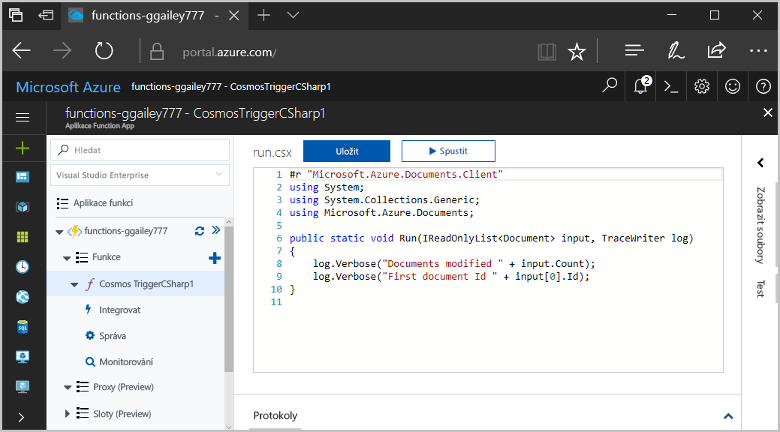
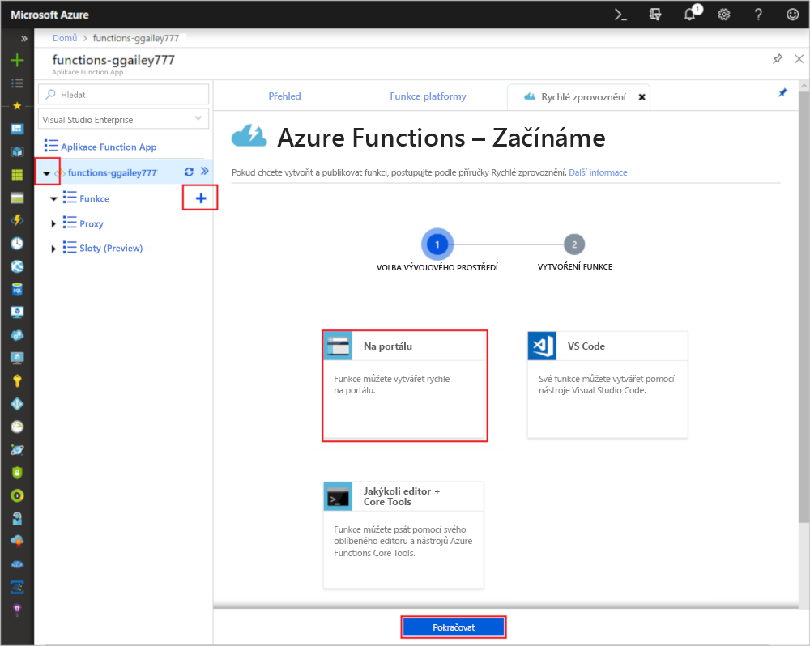
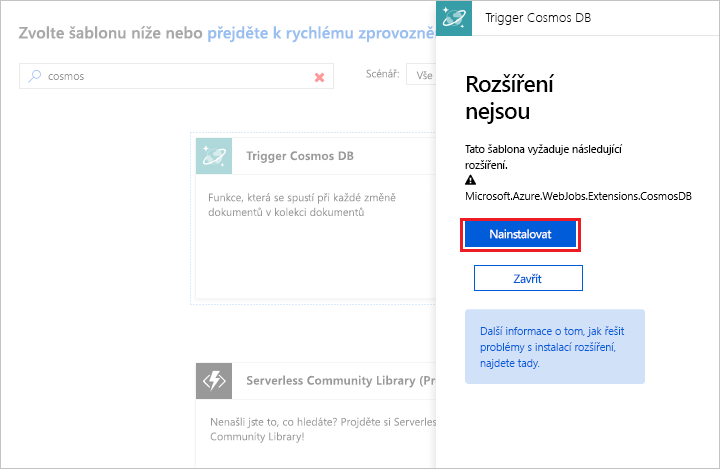
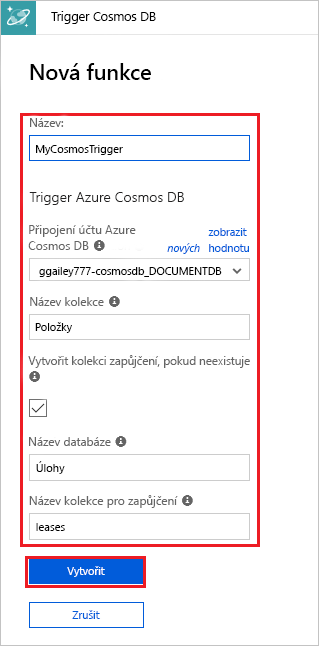
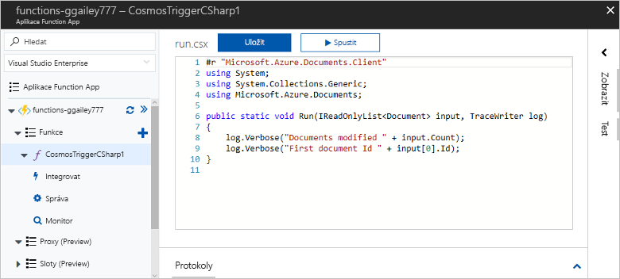
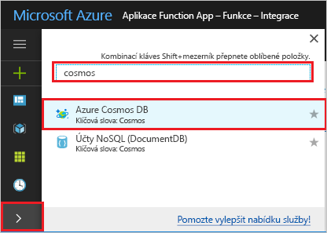
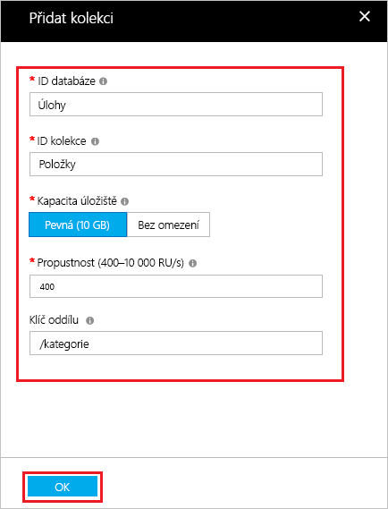
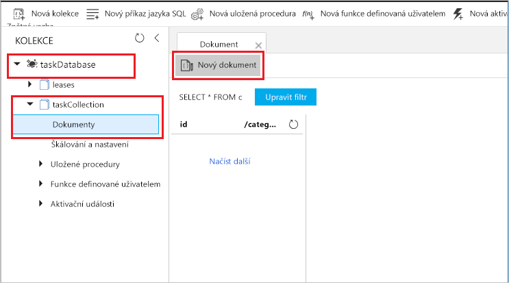
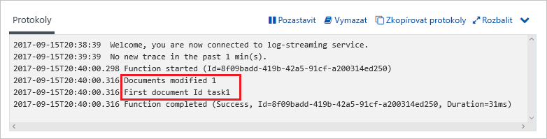

# Vytvoření funkce aktivované službou Azure Cosmos DB

Zjistěte, jak vytvořit funkci aktivovanou při přidání nebo změně dat ve službě Azure Cosmos DB. Další informace o službě Azure Cosmos DB najdete v tématu [Azure Cosmos DB: Databázové výpočetní prostředí bez serveru využívající Azure Functions](..\cosmos-db\serverless-computing-database.md).

## Požadavky

Pro absolvování tohoto kurzu potřebujete:

+ Pokud ještě nemáte předplatné Azure, vytvořte si [bezplatný účet](https://azure.microsoft.com/free/?WT.mc_id=A261C142F) před tím, než začnete.

> [!NOTE]
> [!INCLUDE [SQL API support only](../../includes/functions-cosmosdb-sqlapi-note.md)]

## Vytvoření účtu služby Azure Cosmos DB

Před vytvořením triggeru potřebujete účet služby Azure Cosmos DB, který používá rozhraní SQL API.

[!INCLUDE [cosmos-db-create-dbaccount](../../includes/cosmos-db-create-dbaccount.md)]

## Vytvoření aplikace Azure Function App

[!INCLUDE [Create function app Azure portal](../../includes/functions-create-function-app-portal.md)]

Dál vytvoříte v nové aplikaci Function App funkci.

## Vytvoření triggeru služby Azure Cosmos DB

1. Rozbalte aplikaci Function App a klikněte na tlačítko **+** vedle položky **Funkce**. Pokud jde o první funkci ve vaší aplikaci Function App, vyberte **Na portálu** a potom **Pokračovat**. V opačném případě přejděte ke třetímu kroku.

   

1. Zvolte **Další šablony** a potom **Dokončit a zobrazit šablony**.

    

1. Do vyhledávacího pole zadejte `cosmos` a zvolte šablonu **Trigger Azure Cosmos DB**.

1. Pokud se zobrazí výzva, výběrem možnosti **Instalovat** nainstalujte do aplikace funkcí rozšíření Azure Storage a případné závislosti. Po úspěšném dokončení instalace vyberte **Pokračovat**.

    

1. Nakonfigurujte novou aktivační událost s nastaveními uvedenými v tabulce pod obrázkem.

    

    | Nastavení      | Navrhovaná hodnota  | Popis                                |
    | ------------ | ---------------- | ------------------------------------------ |
    | **Název** | Výchozí | Použijte výchozí název funkce navrhovaný šablonou.|
    | **Připojení účtu Azure Cosmos DB** | Nové nastavení | Vyberte **Nové**, vyberte **Předplatné** a **Databázový účet**, které jste předtím vytvořili, a zvolte **Vybrat**. Vytvoří se nastavení aplikace pro připojení k vašemu účtu. Toto nastavení vazba použije k připojení k databázi. |
    | **Název kolekce** | Items | Název kolekce, která se má monitorovat. |
    | **Vytvořit kolekci zapůjčení, pokud neexistuje** | Zaškrtnuté | Kolekce ještě neexistuje, takže ji vytvořte. |
    | **Název databáze** | Úlohy | Název databáze s kolekcí, která se má monitorovat. |

1. Kliknutím na **Vytvořit** vytvořte funkci aktivovanou službou Azure Cosmos DB. Po vytvoření funkce se zobrazí kód funkce založené na šabloně.  

    

    Tato šablona funkce zapíše do protokolů počet dokumentů a ID prvního dokumentu.

Potom se připojíte ke svému účtu služby Azure Cosmos DB a vytvoříte v databázi `Tasks` kolekci `Items`.

## Vytvoření kolekce Items (Položky)

1. Na nové kartě prohlížeče otevřete druhou instanci webu [Azure Portal](https://portal.azure.com).

1. Na levé straně portálu rozbalte pruh ikon, do vyhledávacího pole zadejte `cosmos` a vyberte **Azure Cosmos DB**.

    

1. Zvolte váš účet služby Azure Cosmos DB a vyberte **Průzkumník dat**. 

1. V části **Kolekce** zvolte **taskDatabase** a vyberte **Nová kolekce**.

    

1. V části **Přidat kolekci** použijte nastavení uvedená v tabulce pod obrázkem. 

    

    | Nastavení|Navrhovaná hodnota|Popis |
    | ---|---|--- |
    | **ID databáze** | Úlohy |Název nové databáze. Musí se shodovat s názvem definovaným ve vazbě vaší funkce. |
    | **ID kolekce** | Items | Název nové kolekce. Musí se shodovat s názvem definovaným ve vazbě vaší funkce.  |
    | **Kapacita úložiště** | Pevná (10 GB)|Použijte výchozí hodnotu. Tato hodnota je kapacita úložiště databáze. |
    | **Propustnost** |400 RU| Použijte výchozí hodnotu. Pokud budete chtít snížit latenci, můžete propustnost později navýšit. |
    | **[Klíč oddílu](../cosmos-db/partition-data.md#best-practices-when-choosing-a-partition-key)** | /kategorie|Klíč oddílu, který rovnoměrně distribuuje data do jednotlivých oddílů. Výběr správného klíče oddílu je důležitý pro vytvoření výkonné kolekce. | 

1. Kliknutím na **OK** vytvořte kolekci Items. Vytvoření kolekce může chvíli trvat.

Jakmile bude existovat kolekce definovaná ve vazbě funkce, můžete funkci otestovat přidáním dokumentů do této nové kolekce.

## Testování funkce

1. V Průzkumníku dat rozbalte novou kolekci **taskCollection**, zvolte **Dokumenty** a vyberte **Nový dokument**.

    

1. Nahraďte obsah nového dokumentu následujícím obsahem a pak zvolte **Uložit**.

        {
            "id": "task1",
            "category": "general",
            "description": "some task"
        }

1. Přepněte na první kartu prohlížeče, která obsahuje vaši funkci na portálu. Rozbalte protokoly funkce a ověřte, že nový dokument aktivoval funkci. Všimněte si, že se do protokolů zapsala hodnota ID dokumentu `task1`. 

    

1. (Volitelné) Vraťte se ke svému dokumentu, proveďte nějakou změnu a klikněte na **Aktualizovat**. Pak přejděte zpět do protokolů funkce a ověřte, že aktualizace také aktivovala funkci.

## Vyčištění prostředků

[!INCLUDE [Next steps note](../../includes/functions-quickstart-cleanup.md)]

## Další kroky

Vytvořili jste funkci, která se spouští při přidání nebo úpravě dokumentu ve službě Azure Cosmos DB.

[!INCLUDE [Next steps note](../../includes/functions-quickstart-next-steps.md)]

Další informace o funkcích aktivovaných službou Azure Cosmos DB najdete v tématu [Vazby Azure Cosmos DB ve službě Azure Functions](functions-bindings-cosmosdb.md).
