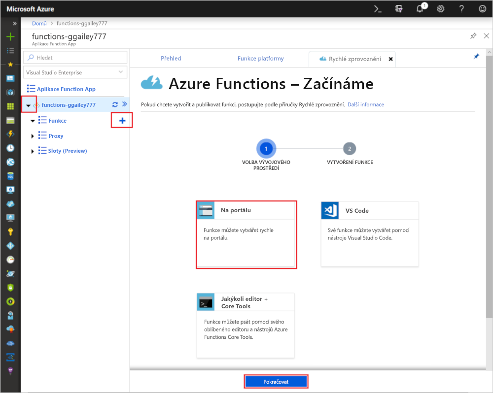
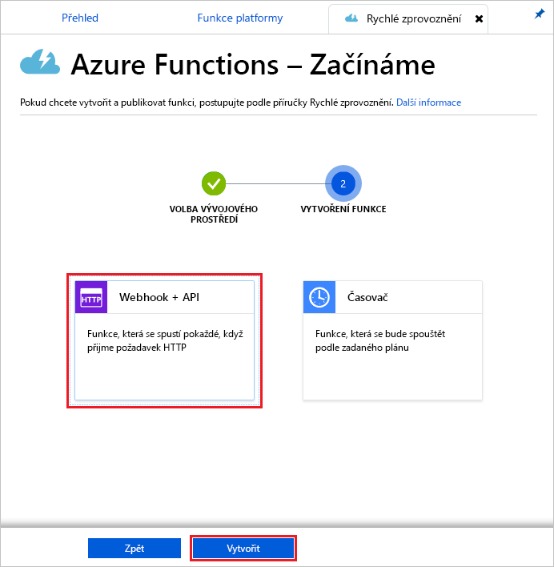

# Vytvoření první funkce na webu Azure Portal

Funkce Azure umožňuje spouštět kód v prostředí bez serveru, aniž byste museli nejprve vytvořit virtuální počítač (VM) nebo publikovat webovou aplikaci. V tomto článku se dozvíte, jak pomocí funkce Azure vytvořit funkci HTTP "hello world" aktivovanou na webu Azure Portal.

[!INCLUDE [quickstarts-free-trial-note](../../includes/quickstarts-free-trial-note.md)]

Pokud jste vývojář c#, [zvažte vytvoření první funkce v Sadě Visual Studio 2019](functions-create-your-first-function-visual-studio.md) namísto na portálu. 

## Přihlášení k Azure

Přihlaste se k webu [Azure Portal](https://portal.azure.com) pomocí svého účtu Azure.

## Vytvoření Function App

K hostování provádění funkcí musíte mít aplikaci Function App. Aplikace funkce umožňuje seskupit funkce jako logická jednotka pro snadnější správu, nasazení, škálování a sdílení prostředků.

[!INCLUDE [Create function app Azure portal](../../includes/functions-create-function-app-portal.md)]

Dále vytvořte funkci v nové aplikaci funkce.

## Vytvoření funkce aktivované protokolem HTTP

1. Rozbalte novou aplikaci **+** funkcí, vyberte tlačítko vedle **položky Funkce**, zvolte **In-portal**a pak vyberte **Pokračovat**.

    

1. Zvolte **WebHook + API**a pak vyberte **Vytvořit**.

    

   Na základě šablony funkce aktivované protokolem HTTP pro určitý jazyk se vytvoří funkce.

Novou funkci můžete spustit odesláním požadavku HTTP.

## Testování funkce

1. V nové funkci vyberte v pravém horním rohu **adresu URL funkce</> Získat.** 

1. V dialogovém okně **Získat adresu URL funkce** vyberte v rozevíracím seznamu výchozí **(funkční klávesu)** a pak vyberte **Kopírovat**. 

    

1. Vložte adresu URL funkce do panelu Adresa vašeho prohlížeče. Přidejte hodnotu `&name=<your_name>` řetězce dotazu na konec této adresy URL a stisknutím klávesy Enter spusťte požadavek. 

    Následující příklad ukazuje odpověď v prohlížeči:

    

    Adresa URL požadavku obsahuje klíč, který je ve výchozím nastavení nezbytný pro přístup k funkci přes protokol HTTP.

1. Při spuštění funkce se do protokolů zaznamenávají informace o trasování. Chcete-li zobrazit výstup trasování z předchozího spuštění, vraťte se do funkce na portálu a vyberte šipku v dolní části obrazovky rozbalte **protokoly**.

   

## Vyčištění prostředků

[!INCLUDE [Clean-up resources](../../includes/functions-quickstart-cleanup.md)]

## Další kroky

[!INCLUDE [Next steps note](../../includes/functions-quickstart-next-steps.md)]

