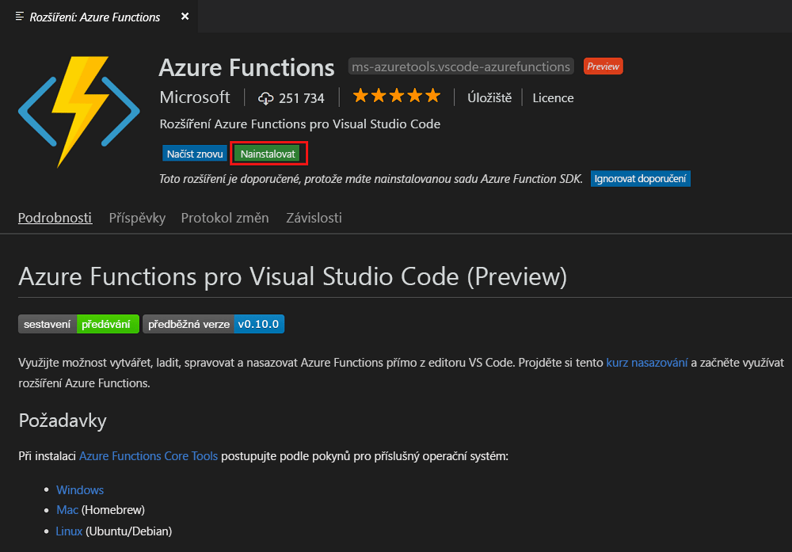
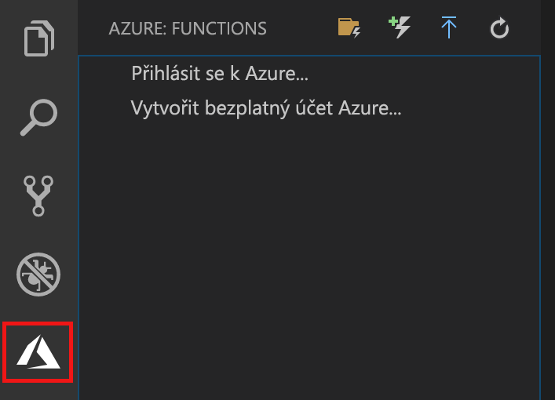
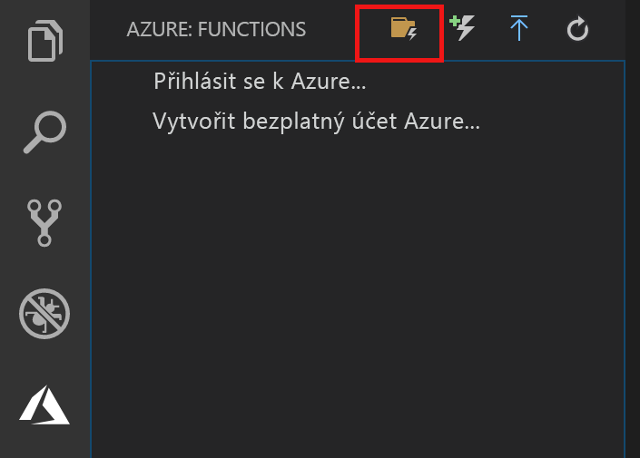
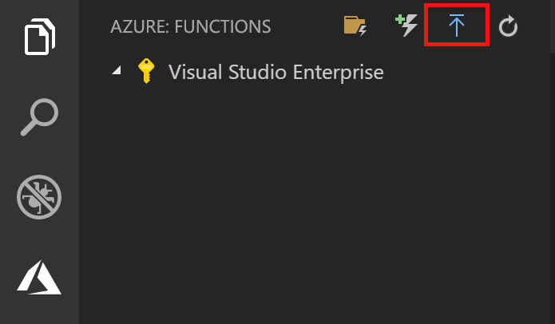
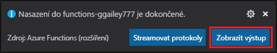
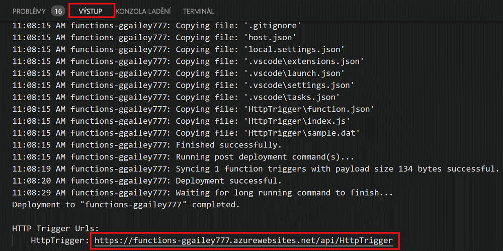

# Vytvoření první funkce pomocí Visual Studio Code

Služba Azure Functions umožňuje spuštění kódu v prostředí [bez serveru](https://azure.microsoft.com/solutions/serverless/), aniž byste nejdřív museli vytvořit virtuální počítač nebo publikovat webovou aplikaci.

V tomto článku se dozvíte, jak použít [rozšíření Azure Functions pro Visual Studio Code] k vytvoření a otestování funkce „hello world“ v místním počítači pomocí Microsoft Visual Studio Code. Kód funkce potom publikujete do Azure z Visual Studio Code.

Rozšíření nyní podporuje funkce C#, JavaScript a Java. Kroky v tomto článku se mohou lišit podle vašeho výběru jazyka pro váš projekt Azure Functions. Rozšíření je v současné době ve verzi Preview. Další informace najdete na stránce rozšíření [Rozšíření Azure Functions pro Visual Studio Code].

## Požadavky

K provedení kroků v tomto kurzu Rychlý start je potřeba:

* Nainstalujte [Visual Studio Code](https://code.visualstudio.com/) na jedné z [podporovaných platforem](https://code.visualstudio.com/docs/supporting/requirements#_platforms). Tento článek byl vytvořený a testovaný na zařízení se systémem macOS (High Sierra).

* Nainstalujte verzi 2.x [nástrojů Azure Functions Core](functions-run-local.md#v2), která je stále ve verzi Preview.

* Nainstalujte konkrétní požadavky pro vámi zvolený jazyk:

    | Jazyk | Linka |
    | -------- | --------- |
    | **C#** | [C# pro Visual Studio Code](https://marketplace.visualstudio.com/items?itemName=ms-vscode.csharp) [Nástroje .NET Core CLI](https://docs.microsoft.com/dotnet/core/tools/?tabs=netcore2x)*   |
    | **Java** | [Ladicí program pro Javu](https://marketplace.visualstudio.com/items?itemName=vscjava.vscode-java-debug) [Java 8](https://aka.ms/azure-jdks) [Maven 3+](https://maven.apache.org/) |
    | **JavaScript** | [Node 8.0+](https://nodejs.org/)  |

    \* Také vyžadují nástroje Core.

[!INCLUDE [quickstarts-free-trial-note](../../includes/quickstarts-free-trial-note.md)]

## Instalace rozšíření Azure Functions

Rozšíření Azure Functions slouží k vytváření, testování a nasazování funkcí do Azure.

1. Ve Visual Studio Code otevřete **Rozšíření** a vyhledejte `azure functions`, nebo [otevřete tento odkaz ve Visual Studio Code](vscode:extension/ms-azuretools.vscode-azurefunctions).

1. Vyberte **Nainstalovat** a nainstalujte rozšíření do Visual Studio Code. 

    

1. Restartujte Visual Studio Code a vyberte ikonu Azure na panelu aktivit. Měla by se na postranním panelu zobrazit oblast Azure Functions.

    

## Vytvoření projektu Azure Functions

Šablona projektu Azure Functions ve Visual Studio Code vytvoří projekt, který jde publikovat do aplikace funkcí v Azure. Aplikace funkcí umožňuje seskupit funkce jako logickou jednotku pro snadnější správu, nasazování a sdílení prostředků.

1. Ve Visual Studio Code vyberte logo Azure, aby se zobrazila oblast **Azure: Functions**, pak vyberte ikonu Vytvořit nový projekt.

    

1. Vyberte umístění pro pracovní prostor vašeho projektu a zvolte **Vybrat**.

    > [!NOTE]
    > Tento článek je navržený k dokončení mimo pracovní prostor. V tomto případě nevybírejte složku projektu, která je součástí pracovního prostoru.

1. Vyberte jazyk pro váš projekt aplikace funkcí. V tomto článku se používá jazyk JavaScript.
    

1. Po zobrazení výzvy zvolte **Přidat do pracovního prostoru**.

Visual Studio Code vytvoří projekt aplikace funkcí v novém pracovním prostoru. Tento projekt obsahuje konfigurační soubory [host.json](functions-host-json.md) a [local.settings.json](functions-run-local.md#local-settings-file) a navíc všechny soubory projektu pro konkrétní jazyk. Získáte také nové úložiště Git ve složce projektu.

## Vytvoření funkce aktivované protokolem HTTP

1. Z oblasti **Azure: Functions** zvolte ikonu Vytvořit funkci.

    

1. Vyberte složku s vaším projektem aplikace funkcí a vyberte šablonu funkce **Trigger HTTP**.

    

1. Jako název funkce zadejte `HTTPTrigger`, stiskněte klávesu Enter a pak vyberte **Anonymní** ověřování.

    

    Funkce ve vybraném jazyce se vytvoří pomocí šablony funkce aktivované protokolem HTTP.

    

Můžete přidat vstupní a výstupní vazbu k funkci tak, že upravíte soubor function.json. Další informace najdete v tématu o [koncepcích triggerů a vazeb Azure Functions](functions-triggers-bindings.md).

Teď máte vytvořený projekt funkcí a funkci aktivovanou protokolem HTTP, takže ji můžete otestovat na místním počítači.

## Místní testování funkce

Nástroje Azure Functions Core umožňují spouštět projekt Azure Functions na místním počítači pro vývoj. K instalaci těchto nástrojů budete vyzváni při prvním spuštění funkce z Visual Studio Code.  

1. Pokud chcete funkci otestovat, nastavte zarážku v kódu funkce a stiskněte klávesu F5, abyste spustili projekt aplikace funkcí. Výstup z nástrojů Tools se zobrazí na panelu **Terminál**.

1. Na panelu **Terminál** zkopírujte adresu URL koncového bodu vaší funkce aktivované protokolem HTTP.

    

1. Vložte adresu URL pro požadavek HTTP do panelu adresy prohlížeče. K této adrese URL připojte řetězec dotazu `?name=<yourname>` a proveďte požadavek. Spuštění se při dosažení zarážky pozastaví.

    

1. Pokud pokračujete v provádění, dále je uvedená ukázka odezvy na požadavek GET v prohlížeči:

    

1. Pokud chcete ladění zastavit, stiskněte Shift + F1.

Po ověření správného fungování funkce na místním počítači je na čase publikovat projekt do Azure.

## Přihlášení k Azure

Než můžete aplikaci publikovat, musíte se přihlásit do Azure.

1. V oblasti **Azure: Functions** zvolte **Přihlásit se k Azure**. Pokud ještě žádný nemáte, můžete si **vytvořit bezplatný účet Azure**.

    

1. Po zobrazení výzvy vyberte **Kopírovat a otevřít**, nebo zkopírujte zobrazený kód a otevřete <https://aka.ms/devicelogin> v prohlížeči.

1. Na stránce **Přihlášení zařízení** vložte zkopírovaný kód, ověřte přihlášení pro Visual Studio Code a pak vyberte **Pokračovat**.  

1. Dokončete přihlášení pomocí přihlašovacích údajů vašeho účtu Azure. Po úspěšném přihlášení můžete prohlížeč zavřít.

## Publikování projektu do Azure

Visual Studio Code umožňuje publikovat projekt funkcí přímo do Azure. Během postupu vytvoříte aplikaci funkcí a související prostředky ve vašem předplatném Azure. Aplikace funkcí poskytuje kontext spuštění pro vaše funkce. Projekt se zabalí a nasadí do nové aplikace funkcí ve vašem předplatném Azure. 

Tento článek předpokládá, že vytváříte novou aplikaci funkcí. Publikování do existující aplikace funkcí přepíše obsah této aplikace v Azure.

1. V oblasti **Azure: Functions** vyberte ikonu Nasadit do Function App.

    

1. Zvolte složku projektu, která je vaším aktuálním pracovním prostorem.

1. Pokud máte víc předplatných, vyberte to, které má hostovat vaši aplikaci funkcí, a pak zvolte **+ Vytvořit novou aplikaci funkcí**.

1. Zadejte globálně jedinečný název, který identifikuje vaši aplikaci funkcí, a stiskněte klávesu Enter. Platné znaky pro název aplikace funkcí jsou `a-z`, `0-9` a `-`.

1. Zvolte **+ Vytvořit novou skupinu prostředků**, zadejte název skupiny prostředků, například `myResourceGroup`, a stiskněte klávesu Enter. Můžete také použít existující skupinu prostředků.

1. Zvolte **+ Vytvořit nový účet úložiště**, zadejte globálně jedinečný název pro nový účet úložiště používaný vaší aplikací funkcí a potom stiskněte klávesu Enter. Názvy účtů úložiště musí mít délku 3 až 24 znaků a můžou obsahovat jenom číslice a malá písmena. Můžete taky použít existující účet.

1. Zvolte umístění v [oblasti](https://azure.microsoft.com/regions/) ve své blízkosti nebo v blízkosti jiných služeb, které vaše funkce využívají.

    Vytvoření aplikace funkcí se zahájí po zvolení umístění. Po vytvoření aplikace funkcí a použití balíčku nasazení se zobrazí oznámení.

1. V oznámení vyberte **Zobrazit výstup**, abyste zobrazili výsledky vytvoření a nasazení, včetně prostředků Azure, které jste vytvořili.

    

1. Poznamenejte si adresu URL nové aplikace funkcí v Azure. Použijete ji k otestování funkce po publikování projektu do Azure.

    

1. Zpátky v oblasti **Azure: Functions** uvidíte, že nová aplikace funkcí se zobrazí pod vaším předplatným. Rozbalením tohoto uzlu se zobrazí funkce v aplikaci funkcí, stejně jako nastavení aplikace a proxy servery funkcí.

    

    Z uzlu aplikace funkcí klikněte se stisknutou klávesou Ctrl (klikněte pravým tlačítkem), abyste zvolili provádění z nabídky různých úloh správy a konfigurace pro aplikaci funkcí v Azure. Můžete také zvolit zobrazení aplikace funkcí na webu Azure Portal.

## Testování funkce v Azure

1. Zkopírujte adresu URL triggeru HTTP z panelu **Výstup**. Stejně jako dříve nezapomeňte k této adrese URL připojit řetězec dotazu `?name=<yourname>` a provést požadavek.

    Adresa URL, která volá funkci aktivovanou protokolem HTTP, by měla být v následujícím formátu:

        http://<functionappname>.azurewebsites.net/api/<functionname>?name=<yourname> 

1. Vložte tuto novou adresu URL pro požadavek HTTP do panelu Adresa prohlížeče. Následuje ukázka odezvy na vzdálený požadavek GET vrácené funkcí v prohlížeči: 

    

## Další kroky

Pomocí Visual Studio Code jste vytvořili aplikaci funkcí s jednoduchou funkcí aktivovanou protokolem HTTP. Další informace o vývoji funkcí v určitém jazyce naleznete v referenčních příručkách jazyka pro [JavaScript](functions-reference-node.md), [.NET](functions-dotnet-class-library.md) nebo [Javu](functions-reference-java.md).

Dál se můžete chtít dozvědět další informace o místním testování a ladění z okna Terminál nebo příkazového řádku pomocí nástrojů Azure Functions Core.

> [!div class="nextstepaction"]
> [Kódování a testování místně](functions-run-local.md)

[Azure Functions Core Tools]: functions-run-local.md
[Rozšíření Azure Functions pro Visual Studio Code]: https://marketplace.visualstudio.com/items?itemName=ms-azuretools.vscode-azurefunctions
