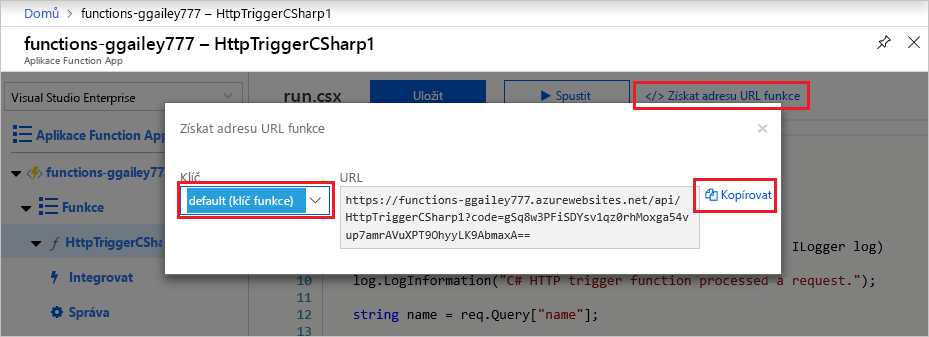
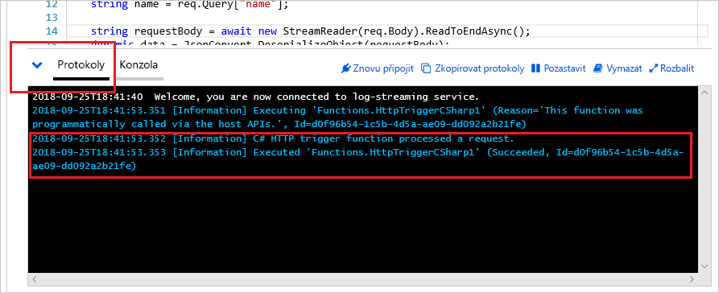

# Vytvoření první funkce na webu Azure Portal

Azure Functions umožňuje spuštění kódu v prostředí bez serveru, aniž by bylo nutné nejprve vytvořit virtuální počítač nebo publikovat webovou aplikaci. V tomto článku se naučíte, jak pomocí Azure Functions vytvořit funkci triggeru HTTP "Hello World" v Azure Portal.

[!INCLUDE [functions-in-portal-editing-note](../../includes/functions-in-portal-editing-note.md)] 

Místo toho doporučujeme [vyvíjet funkce místně](functions-develop-local.md) a publikovat je do aplikace Function App v Azure.  
Pomocí jednoho z následujících odkazů můžete začít se zvoleným místním vývojovým prostředím a jazykem:

| Visual Studio Code | Terminál/příkazový řádek | Visual Studio |
| --- | --- | --- |
|  &bull;&nbsp;[Začínáme s C #](./create-first-function-vs-code-csharp.md) &bull;&nbsp;[Začínáme s jazykem Java](./create-first-function-vs-code-java.md) &bull;&nbsp;[Začínáme s JavaScriptem](./create-first-function-vs-code-node.md) &bull;&nbsp;[Začínáme s PowerShellem](./create-first-function-vs-code-powershell.md) &bull;&nbsp;[Začínáme s Pythonem](./create-first-function-vs-code-python.md) |&bull;&nbsp;[Začínáme s C #](./create-first-function-cli-csharp.md) &bull;&nbsp;[Začínáme s jazykem Java](./create-first-function-cli-java.md) &bull;&nbsp;[Začínáme s JavaScriptem](./create-first-function-cli-node.md) &bull;&nbsp;[Začínáme s PowerShellem](./create-first-function-cli-powershell.md) &bull;&nbsp;[Začínáme s Pythonem](./create-first-function-cli-python.md) | [Začínáme s C #](functions-create-your-first-function-visual-studio.md) |

[!INCLUDE [quickstarts-free-trial-note](../../includes/quickstarts-free-trial-note.md)]

## Přihlášení k Azure

Přihlaste se k webu [Azure Portal](https://portal.azure.com) pomocí svého účtu Azure.

## Vytvoření aplikace funkcí

K hostování provádění funkcí musíte mít aplikaci Function App. Aplikace Function App umožňuje seskupit funkce jako logickou jednotku pro snadnější správu, nasazování, škálování a sdílení prostředků.

[!INCLUDE [Create function app Azure portal](../../includes/functions-create-function-app-portal.md)]

Dále vytvořte funkci v nové aplikaci Function App.

## Vytvoření funkce triggeru HTTP

1. V levé nabídce okna **Functions (funkce** ) vyberte **funkce** a pak v horní nabídce vyberte **Přidat** . 
 
1. V **novém okně funkce** vyberte **Trigger http**.

    

1. V okně **Nová funkce** přijměte výchozí název **nové funkce** nebo zadejte nový název. 

1. V rozevíracím seznamu **úroveň autorizace** zvolte **anonymní** a pak vyberte **vytvořit funkci**.

    Azure vytvoří funkci triggeru HTTP. Novou funkci můžete spustit odesláním požadavku HTTP.

## Testování funkce

1. V nové funkci triggeru HTTP v nabídce vlevo vyberte **Code + test** a potom v horní nabídce vyberte **získat adresu URL funkce** .

    

1. V dialogovém okně **získat adresu URL funkce** vyberte v rozevíracím seznamu možnost **výchozí** a potom vyberte ikonu **Kopírovat do schránky** . 

    

1. Vložte adresu URL funkce do panelu Adresa vašeho prohlížeče. Na `?name=<your_name>` konec této adresy URL přidejte hodnotu řetězce dotazu a stisknutím klávesy ENTER spusťte požadavek. 

    Následující příklad ukazuje odpověď v prohlížeči:

    

    Pokud adresa URL žádosti obsahovala [přístupový klíč](functions-bindings-http-webhook-trigger.md#authorization-keys) ( `?code=...` ), znamená to, že při vytváření funkce namísto úrovně **anonymního** přístupu zvolíte **funkci** . V takovém případě byste měli místo toho připojit `&name=<your_name>` .

1. Při spuštění funkce se do protokolů zaznamenávají informace o trasování. Chcete-li zobrazit výstup trasování, vraťte se na stránku **Code + test** na portálu a rozbalte šipku **protokoly** v dolní části stránky.

   

## Vyčištění prostředků

[!INCLUDE [Clean-up resources](../../includes/functions-quickstart-cleanup.md)]

## Další kroky

[!INCLUDE [Next steps note](../../includes/functions-quickstart-next-steps.md)]
