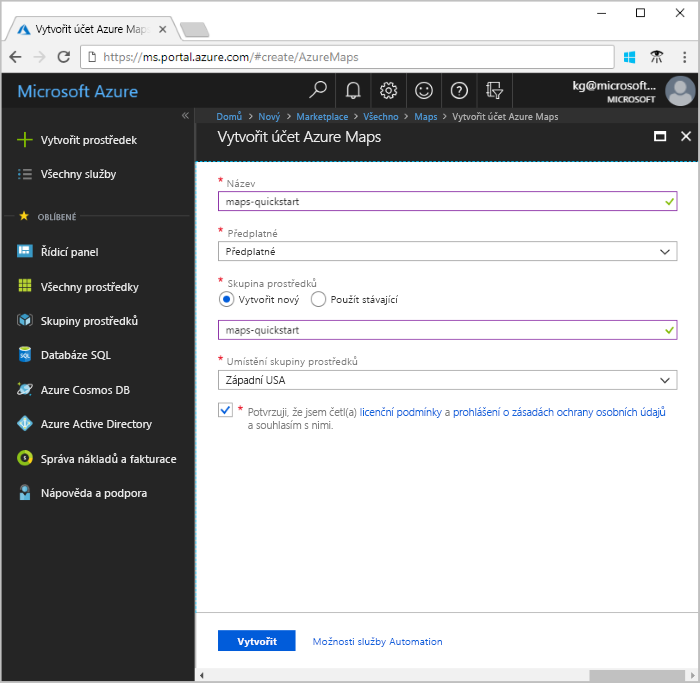
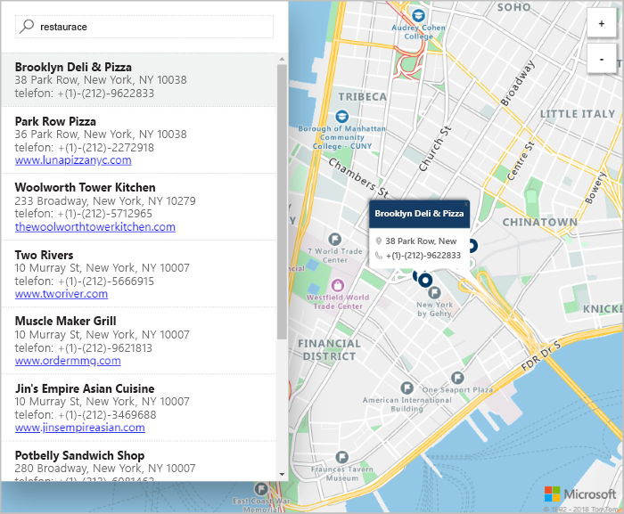

# Spuštění interaktivního hledání v mapách s využitím Azure Maps

Tento článek ukazuje možnosti Azure Maps pro vytvoření mapy, která uživatelům nabídne interaktivní hledání. Provede vás základními kroky k vytvoření vlastního účtu Maps a získání klíče účtu pro použití v ukázkové webové aplikaci.

Pokud ještě nemáte předplatné Azure, vytvořte si [bezplatný účet](https://azure.microsoft.com/free/?WT.mc_id=A261C142F) před tím, než začnete.

## Přihlášení k portálu Azure Portal

Přihlaste se k webu [Azure Portal](https://portal.azure.com/).

## Vytvoření účtu a získání klíče

1. V levém horním rohu webu [Azure Portal](https://portal.azure.com) klikněte na **Vytvořit prostředek**.
2. Do pole *Hledat na Marketplace* zadejte **Maps**.
3. Ve *výsledcích* vyberte **Maps**. Klikněte na tlačítko **Vytvořit**, které se zobrazí pod mapou.
4. Na stránce **Vytvořit účet Maps** zadejte následující hodnoty:
    - *Název* vašeho nového účtu.
    - *Předplatné*, které chcete pro tento účet použít.
    - *Skupinu prostředků* pro tento účet. Můžete zvolit možnost *Vytvořit novou* nebo *Použít existující* skupinu prostředků.
    - Vyberte *Umístění skupiny prostředků*.
    - Přečtěte si *Licenční podmínky* a *Prohlášení o zásadách ochrany osobních údajů* a zaškrtnutím příslušného políčka podmínky přijměte.
    - Nakonec klikněte na tlačítko **Vytvořit**.

    

5. Po úspěšném vytvoření účtu ho otevřete a v nabídce účtu vyhledejte část Nastavení. Kliknutím na **Klíče** zobrazte primární a sekundární klíč pro váš účet Azure Maps. Zkopírujte do místní schránky hodnotu **primárního klíče** pro použití v následující části.

## Stažení aplikace

1. Stáhněte nebo zkopírujte obsah souboru [interactiveSearch.html](https://github.com/Azure-Samples/azure-maps-samples/blob/master/src/interactiveSearch.html).
2. Uložte obsah tohoto souboru místně jako **AzureMapDemo.html** a otevřete ho v textovém editoru.
3. Vyhledejte řetězec `<insert-key>` a nahraďte ho hodnotou **primárního klíče**, kterou jste získali v předchozí části.

## Spuštění aplikace

1. V libovolném prohlížeči otevřete soubor **AzureMapDemo.html**.
2. Prohlédněte si zobrazenou mapu města Los Angeles. Mapu můžete přiblížit nebo oddálit a ta pak v závislosti na úrovni přiblížení vykreslí více nebo méně informací. 
3. Změňte výchozí střed mapy. V souboru **AzureMapDemo.html** vyhledejte proměnnou **center**. Nahraďte hodnotu páru zeměpisné délky a šířky pro tuto proměnnou novými hodnotami **[-74.0060, 40.7128]**. Uložte soubor a aktualizujte prohlížeč.
4. Vyzkoušejte interaktivní hledání. Ve vyhledávacím poli v levém horním rohu ukázkové webové aplikace vyhledejte **restaurants** (restaurace).
5. Najeďte myší na seznam adres a umístění, který se zobrazí pod vyhledávacím polem, a všimněte si, jak u odpovídajícího špendlíku na mapě vyskočí informace o tomto umístění. Z důvodu zajištění ochrany soukromých podniků jsou zobrazené fiktivní názvy a adresy.

    

## Vyčištění prostředků

Další kurzy obsahují podrobný popis použití a konfigurace Maps s vaším účtem. Pokud chcete pokračovat k těmto kurzům, neprovádějte čištění prostředků vytvořených v rámci tohoto rychlého startu. Pokud pokračovat nechcete, pomocí následujícího postupu odstraňte všechny prostředky vytvořené tímto rychlým startem.

1. Zavřete prohlížeč se spuštěnou webovou aplikací **AzureMapDemo.html**.
2. V nabídce vlevo na webu Azure Portal klikněte na **Všechny prostředky** a vyberte svůj účet Maps. V horní části okna **Všechny prostředky** klikněte na **Odstranit**.

## Další kroky

V tomto rychlém startu jste vytvořili účet Maps a spustili jste ukázkovou aplikaci. V následujícím kurzu se dozvíte, jak vytvořit vlastní aplikaci s využitím rozhraní Maps API.

> [!div class="nextstepaction"]
> [Hledání bodů zájmu s využitím Maps](./tutorial-search-location.md)

Další příklady kódu a prostředí pro interaktivní psaní kódu najdete v níže uvedených příručkách s návody.

> [!div class="nextstepaction"]
> [Postup při hledání adresy pomocí rozhraní REST API služeb Azure Maps](./how-to-search-for-address.md)

> [!div class="nextstepaction"]
> [Používání ovládacího prvku Mapa služeb Azure Maps ](./how-to-use-map-control.md)
