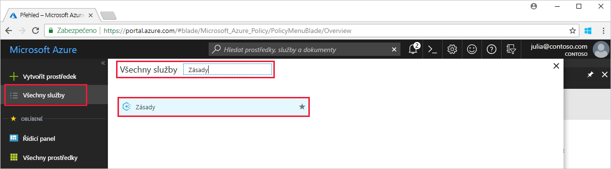
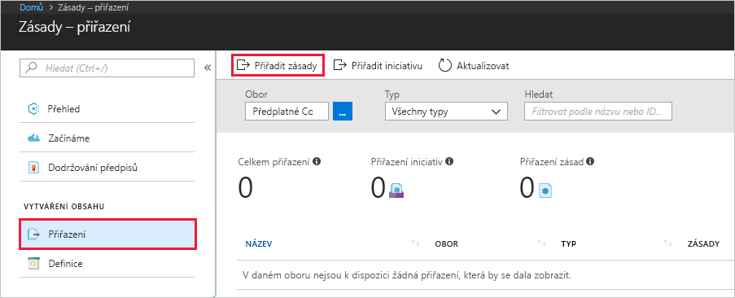
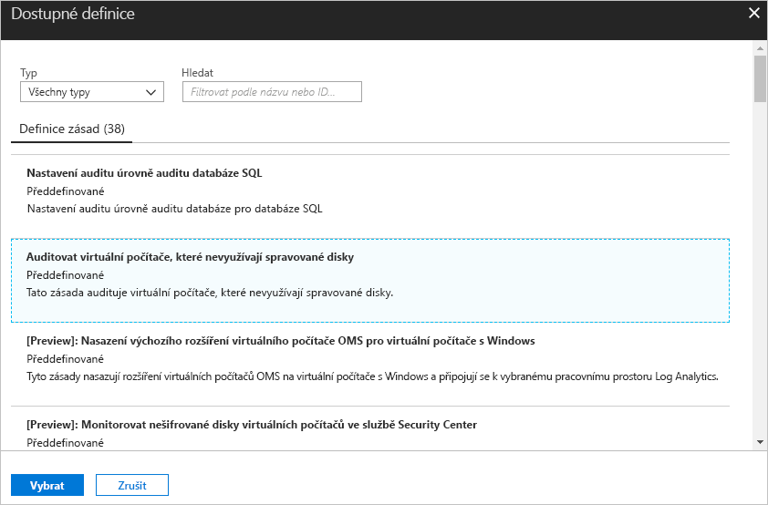
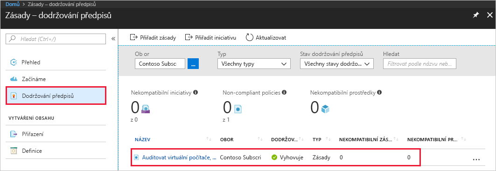
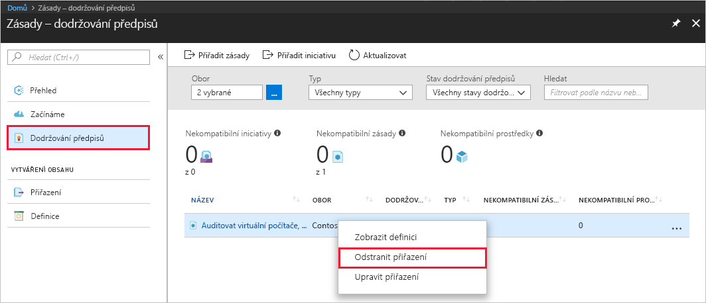

# Vytvoření přiřazení zásady pro identifikaci prostředků, které nedodržují předpisy, v prostředí Azure

Prvním krokem k porozumění dodržování předpisů v Azure je zjištění stavu vašich prostředků. Tento rychlý start vás provede procesem vytvoření přiřazení zásady pro identifikaci virtuálních počítačů, které nepoužívají spravované disky.

Na konci tohoto procesu úspěšně identifikujete virtuální počítače, které nepoužívají spravované disky. *Neodpovídají* přiřazení zásad.

Pokud ještě nemáte předplatné Azure, vytvořte si [bezplatný účet](https://azure.microsoft.com/free/) před tím, než začnete.

## Vytvoření přiřazení zásady

V tomto rychlém startu vytvoříte přiřazení zásad a přiřadíte definici zásady pro *audit virtuálních počítačů bez spravovaných disků*.

1. Spusťte službu Azure Policy na webu Azure Portal tak, že kliknete na **Všechny služby** a pak vyhledáte a vyberete **Zásady**.

   

2. Na levé straně stránky služby Azure Policy vyberte **Přiřazení**. Přiřazení je zásada, která byla přiřazena, aby proběhla v rámci zadaného oboru.
3. V horní části stránky **Zásady – Přiřazení** vyberte **Přiřadit zásadu**.

   

4. Na stránce **Přiřadit zásadu** vyberte **Obor** tak, že kliknete na tři tečky a vyberete předplatné (povinné) a skupinu prostředků (volitelné). Obor určuje, pro které prostředky nebo skupiny prostředků se toto přiřazení zásady bude vynucovat.  Pak v dolní části stránky **Obor** klikněte na **Vybrat**.

   V tomto příkladu se používá **předplatné Contoso**. Vaše předplatné se bude lišit.

5. Pokud chcete vyloučit jednu nebo několik skupin prostředků (pokud jste určili pouze obor předplatného) nebo konkrétní prostředky ve skupině prostředků (u obou oborů), můžete nakonfigurovat **Vyloučení** z přiřazení zásady. Zatím ho ponechte prázdné.

6. Výběrem tří teček **Definice zásady** otevřete seznam dostupných definic. Služba Azure Policy obsahuje již integrované definice zásad, které můžete použít. K dispozici je řada předdefinovaných definic zásad, například:

   - Vynucovat použití značky a její hodnoty
   - Použít značku a její hodnotu
   - Vyžadovat SQL Server verze 12.0

    Úplný seznam všech dostupných předdefinovaných zásad najdete v tématu [Šablony zásad](json-samples.md).

7. Prohledejte seznam definic zásad a najděte definici *Audit virtuálních počítačů, které nepoužívají spravované disky*. Klikněte na tuto zásadu a potom na **Vybrat**.

   

8. Do pole **Název přiřazení** se automaticky vyplní název vybrané zásady, který však můžete změnit. Pro účely tohoto příkladu ponechte *Audit virtuálních počítačů, které nepoužívají spravované disky*. Volitelně můžete přidat také **Popis**. Popis obsahuje podrobnosti o tomto přiřazení zásady.

9. Klikněte na **Přiřadit**.

Nyní jste připraveni identifikovat prostředky, které nedodržují předpisy, abyste porozuměli stavu dodržování předpisů ve vašem prostředí.

## Identifikace prostředků, které nedodržují předpisy

Na levé straně stránky vyberte **Dodržování předpisů** a vyhledejte přiřazení zásady **Audit virtuálních počítačů, které nepoužívají spravované disky**, které jste vytvořili.

Pokud nějaké stávající prostředky nedodržují předpisy tohoto nového přiřazení, zobrazí se na kartě **Nekompatibilní prostředky**.

Pokud se napříč stávajícími prostředky vyhodnotí nějaká podmínka a zjistí hodnotu True, takové prostředky se označí jako nekompatibilní s příslušnou zásadou. Následující tabulka ukazuje, jak různé účinky zásad pracují s vyhodnocením podmínek pro zjištění výsledného stavu dodržování předpisů. Přestože se logika vyhodnocení na webu Azure Portal nezobrazuje, výsledné stavy dodržování předpisů se zobrazují. Výsledný stav je buď kompatibilní, nebo nekompatibilní.

| **Stav prostředku** | **Účinek** | **Vyhodnocení zásad** | **Stav dodržování předpisů** |
| --- | --- | --- | --- |
| Existuje | Deny, Audit, Append\*, DeployIfNotExist\*, AuditIfNotExist\* | True | Nevyhovující předpisům |
| Existuje | Deny, Audit, Append\*, DeployIfNotExist\*, AuditIfNotExist\* | False | Odpovídající |
| Nová | Audit, AuditIfNotExist\* | True | Nevyhovující předpisům |
| Nová | Audit, AuditIfNotExist\* | False | Odpovídající |

\* Účinky Append, DeployIfNotExist a AuditIfNotExist vyžadují, aby byl příkaz IF nastaven na TRUE. Tyto účinky také vyžadují, aby existovala podmínka, která musí nabývat hodnoty FALSE, aby byla zásada vyhodnocena jako Nevyhovující předpisům. Pokud má hodnotu TRUE, aktivuje podmínka IF vyhodnocení podmínky existence pro související prostředky.

## Vyčištění prostředků

Další příručky v této kolekci vycházejí z tohoto rychlého startu. Pokud chcete pokračovat v práci s dalšími kurzy, neprovádějte čištění prostředků vytvořených v rámci tohoto rychlého startu. Pokud pokračovat nechcete, pomocí následujících kroků odstraňte všechny prostředky vytvořené tímto rychlým startem na portálu Azure Portal.

1. Na levé straně stránky služby Azure Policy vyberte **Dodržování předpisů** (nebo **Přiřazení**) a vyhledejte přiřazení zásady **Audit virtuálních počítačů, které nepoužívají spravované disky**, které jste vytvořili.

2. Klikněte pravým tlačítkem na přiřazení zásady **Audit virtuálních počítačů, které nepoužívají spravované disky** a vyberte **Odstranit přiřazení**.

   

## Další kroky

V tomto rychlém startu jste přiřadili definici zásady k oboru prostředků a vyhodnotili jste její sestavu dodržování předpisů. Definice zásady zajišťuje, že všechny prostředky v příslušném oboru jsou kompatibilní, a určuje ty, které nejsou.

Další informace o přiřazování zásad pro zajištění, aby **budoucí** vytvořené prostředky dodržovaly předpisy, najdete v tomto kurzu:

> [!div class="nextstepaction"]
> [Vytváření a správa zásad](create-manage-policy.md)