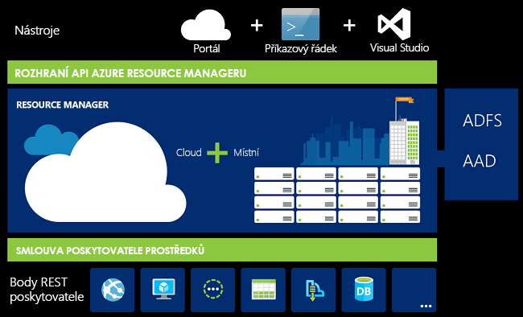
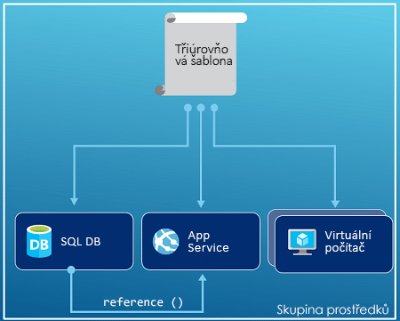
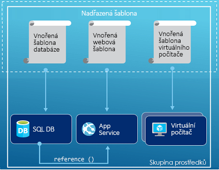
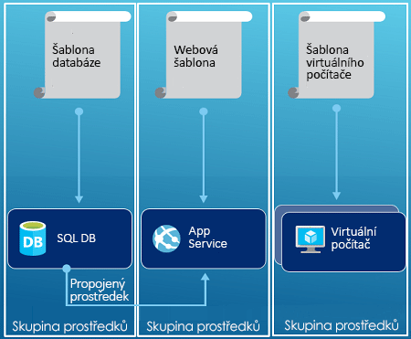

# <a name="azure-resource-manager-overview"></a>Přehled Azure Resource Manageru

Azure Resource Manager je nasazení a Správa služby pro Azure. Poskytuje konzistentní vrstvu správy, která umožňuje vytvářet, aktualizovat a odstraňovat prostředky ve vašem předplatném Azure. Auditování a označování funkce můžete použít jeho řízení přístupu k zabezpečení a uspořádání prostředků po nasazení.

Když je provést akce na portálu, Powershellu, rozhraní příkazového řádku Azure, rozhraní REST API nebo klientské sady SDK, rozhraní API Azure Resource Manageru zpracovává vaši žádost. Protože všechny požadavky jsou zpracovány prostřednictvím stejného rozhraní API, uvidíte konzistentní výsledky a funkce v různých nástrojích.

Následující obrázek znázorňuje způsob, jakým tyto nástroje interagují se rozhraní API Azure Resource Manageru. Rozhraní API předává požadavky do služby Resource Manageru, která je ověřuje a autorizuje. Resource Manager následně směruje požadavky na příslušnou službu.



## <a name="terminology"></a>Terminologie

Pokud s Azure Resource Managerem začínáte, existuje několik termínů, které možná neznáte.

* **prostředek** - Spravovatelná položka, která je k dispozici prostřednictvím služby Azure. Virtuální počítače, účty úložiště, webové aplikace, databáze a virtuální sítě jsou příklady zdrojů.
* **skupina prostředků** – Kontejner, který obsahuje související prostředky pro řešení Azure. Skupina prostředků obsahuje prostředky, které chcete spravovat jako skupinu. Můžete rozhodnout, jak přidělit prostředky skupiny prostředků, které jsou založené na co je nejvhodnější pro vaši organizaci. Viz [Skupiny prostředků](#resource-groups).
* **Poskytovatel prostředků** -služba poskytující prostředky Azure. Například běžné poskytovatele prostředků je **Microsoft.Compute**, který poskytuje prostředek virtuálních počítačů. **Microsoft.Storage** je jiné běžné poskytovatele prostředků. Viz [Poskytovatelé prostředků](#resource-providers).
* **Šablony Resource Manageru** – soubor A jazyka JavaScript Object Notation (JSON), který definuje jeden nebo více prostředků k nasazení do skupiny prostředků nebo předplatného. Šablony lze použít k nasazení prostředků konzistentně a opakovaně. Viz [Nasazení šablon](#template-deployment).
* **deklarativní syntaxe** – Syntaxe, která umožňuje prohlásit „Toto mám v úmyslu vytvořit“, aniž by k tomu bylo nutné psát sekvence programových příkazů. Šablona Resource Manageru je příkladem deklarativní syntaxe. V souboru definujete vlastnosti pro infrastrukturu k nasazení do Azure.

## <a name="the-benefits-of-using-resource-manager"></a>Výhody použití Resource Manageru

Resource Manager poskytuje několik výhod:

* Můžete všechny prostředky pro vaše řešení nasadit, spravovat a monitorovat jako skupinu a nemusíte je zpracovávat jednotlivě.
* Můžete svoje řešení opakovaně nasadit v průběhu životního cyklu a mít přitom jistotu, že se prostředky nasadí konzistentně.
* Infrastrukturu můžete spravovat pomocí deklarativních šablon místo skriptů.
* Můžete definovat závislosti mezi prostředky, takže se nasadí ve správném pořadí.
* Můžete využít řízení přístupu pro všechny služby ve vaší skupině prostředků, protože do platformy pro správu je nativně integrováno řízení přístupu na základě role (RBAC).
* Můžete označit prostředky pomocí značek a logicky tak uspořádat všechny prostředky ve svém předplatném.
* Můžete zpřehlednit fakturaci svojí organizace zobrazením nákladů na skupinu prostředků, které sdílejí stejnou značku.

## <a name="guidance"></a>Doprovodné materiály
Následující návrhy vám pomohou při práci s vašimi řešeními plně využít výhod Resource Manageru.

* K definování a nasazení infrastruktury využijte deklarativní syntaxi v šablonách Resource Manageru, nikoli imperativní příkazy.
* V šabloně definujte všechny kroky nasazení a konfigurace. K nastavení svého řešení byste neměli využívat žádné ruční kroky.
* Ke správě vašich prostředků využijte imperativní příkazy, například pro spuštění nebo zastavení aplikace nebo počítače.
* Prostředky se stejným životním cyklem uspořádejte do skupiny prostředků. K ostatnímu uspořádání prostředků využijte značky.

Pokyny k tomu, jak můžou podniky používat Resource Manager k efektivní správě předplatných, najdete v části [Základní kostra Azure Enterprise – zásady správného řízení pro předplatná](/azure/architecture/cloud-adoption-guide/subscription-governance?toc=%2fazure%2fazure-resource-manager%2ftoc.json).

Doporučení k vytváření šablon Resource Manageru, najdete v tématu [osvědčené postupy pro šablony Azure Resource Manageru](template-best-practices.md).

## <a name="resource-groups"></a>Skupiny prostředků
Při definování skupin prostředků byste měli vzít v úvahu některé důležité faktory:

* Všechny prostředky ve skupině by měly sdílet stejný životní cyklus. Nasazujete, aktualizujete a odstraňujete je společně. Pokud některý z prostředků, například databázový server, musí mít jiný cyklus nasazení, měl by být v jiné skupině prostředků.
* Každý prostředek může být jenom v jedné skupině prostředků.
* Prostředky je možné do skupiny prostředků kdykoli přidat nebo naopak odebrat.
* Prostředky je možné přesouvat mezi skupinami. Další informace najdete v tématu, které se zabývá [přesunutím prostředků do nové skupiny prostředků nebo předplatného](resource-group-move-resources.md).
* Skupina prostředků může obsahovat prostředky, které se nacházejí v různých oblastech.
* Skupinu prostředků lze využít k určení rozsahu řízení přístupu pro akce správy.
* Prostředek může interagovat s prostředky v dalších skupinách prostředků. Tato interakce je běžná v případě, že spolu tyto dva prostředky souvisejí, ale nesdílejí stejný životní cyklus (například webové aplikace, které se připojují k databázi).

Při vytváření skupiny prostředků pro ni musíte zadat umístění. Asi vás zajímá, proč skupina prostředků potřebuje umístění. A proč vůbec záleží na umístění skupiny prostředků, pokud prostředky mohou mít jiná umístění než skupina prostředků. Skupina prostředků ukládá metadata o prostředcích. Při zadávání umístění skupiny prostředků tedy určujete, kde se tato metadata ukládají. Z důvodu dodržování předpisů může být nutné zajistit, aby se data ukládala v určité oblasti.

## <a name="resource-providers"></a>Poskytovatelé prostředků

Každý poskytovatel prostředků nabízí sadu prostředků a operací pro práci s těmito prostředky. Pokud například chcete ukládat klíče a tajné klíče, využijete poskytovatele prostředků **Microsoft.KeyVault**. Tento poskytovatel prostředků nabízí typ prostředků nazvaný **trezory** pro vytvoření trezoru klíčů.

Název typu prostředku má formát: **{poskytovatel prostředku}/{typ prostředku}**. Typ prostředku pro trezor klíčů je **Microsoft.KeyVault/vaults**.

Než začnete nasazovat prostředky, měli byste získat přehled o dostupných poskytovatelích prostředků. Znalost názvů poskytovatelů prostředků a samotných prostředků vám umožní definovat prostředky, které chcete nasadit do Azure. Také je potřeba vědět platná umístění a verze rozhraní API pro každý typ prostředku. Další informace najdete v tématu [Zprostředkovatelé a typy prostředků](resource-manager-supported-services.md).

Všechny operace nabízené poskytovatelů prostředků najdete v článku [rozhraní Azure REST API](/rest/api/azure/).

## <a name="template-deployment"></a>Nasazení šablon

Pomocí Resource Manageru můžete vytvořit šablonu (ve formátu JSON), která definuje infrastrukturu a konfiguraci vašeho řešení Azure. Pomocí šablony můžete řešení opakovaně nasadit v průběhu životního cyklu a mít přitom jistotu, že se prostředky nasadí konzistentně.

Další informace o formátu šablony a způsobu jejího sestavení najdete v tématu [Princip struktury a syntaxe šablon Azure Resource Manageru](resource-group-authoring-templates.md). Syntaxi JSON pro typy prostředků najdete v tématu [Definování prostředků v šablonách Azure Resource Manageru](/azure/templates/).

Resource Manager zpracovává šablonu stejně jako ostatní požadavky. Parsuje šablonu a převede její syntaxi na operace rozhraní REST API pro příslušné poskytovatele prostředků. Když například Resource Manager obdrží šablonu s následující definicí prostředku:

```json
"resources": [
  {
    "apiVersion": "2016-01-01",
    "type": "Microsoft.Storage/storageAccounts",
    "name": "mystorageaccount",
    "location": "westus",
    "sku": {
      "name": "Standard_LRS"
    },
    "kind": "Storage",
    "properties": {
    }
  }
]
```

Převede definici na následující operaci rozhraní REST API, která se odešle do poskytovatele prostředků Microsoft.Storage:

```HTTP
PUT
https://management.azure.com/subscriptions/{subscriptionId}/resourceGroups/{resourceGroupName}/providers/Microsoft.Storage/storageAccounts/mystorageaccount?api-version=2016-01-01
REQUEST BODY
{
  "location": "westus",
  "properties": {
  }
  "sku": {
    "name": "Standard_LRS"
  },
  "kind": "Storage"
}
```

Záleží pouze na vás, jak definujete šablony a skupiny prostředků a jak chcete spravovat své řešení. Například můžete nasadit svou třívrstvou aplikaci prostřednictvím jediné šablony do jedné skupiny prostředků.



Není však nutné definovat celou infrastrukturu v jediné šabloně. Často má smysl rozdělit požadavky nasazení do několika cílených šablon, které jsou zaměřené na konkrétní účel. Tyto šablony můžete snadno opakovaně použít pro různá řešení. Chcete-li nasadit konkrétní řešení, vytvoříte hlavní šablonu, která propojí všechny požadované šablony. Následující obrázek znázorňuje způsob nasazení třívrstvého řešení prostřednictvím nadřazené šablony, která obsahuje tři vnořené šablony.



Pokud si představíte, že vaše vrstvy mají tři samostatné životní cykly, můžete tyto tři vrstvy nasadit do samostatných skupin prostředků. Všimněte si, že prostředky mohou být stále propojené s prostředky v jiných skupinách prostředků.



Informace o vnořených šablonách najdete v tématu [Použití propojených šablon s Azure Resource Managerem](resource-group-linked-templates.md).

Azure Resource Manager analyzuje závislosti a zajistí, že se prostředky vytvoří ve správném pořadí. Pokud jeden prostředek závisí na hodnotě z jiného prostředku (například virtuální počítač potřebuje účet úložiště pro disky), nastavíte závislost. Další informace najdete v tématu [Definování závislostí v šablonách Azure Resource Manageru](resource-group-define-dependencies.md).

Šablony můžete také využít pro aktualizace infrastruktury. Můžete například ke svému řešení přidat prostředek a konfigurační pravidla pro prostředky, které jsou už nasazené. Pokud šablona definuje prostředek, který již existuje, Resource Manager aktualizuje stávající prostředek místo vytvoření nového.

Resource Manager poskytuje rozšíření pro scénáře, kdy potřebujete další operace, jako je například instalace konkrétního softwaru, který není zahrnutý v původní instalaci. Pokud již využíváte službu pro správu konfigurace, jako je DSC, Chef nebo Puppet, můžete tuto službu s pomocí rozšíření používat i nadále. Informace o rozšířeních virtuálních počítačů najdete v tématu [Funkce a rozšíření virtuálních počítačů](../virtual-machines/windows/extensions-features.md?toc=%2fazure%2fvirtual-machines%2fwindows%2ftoc.json).

Když vytvoříte řešení z portálu, bude toto řešení automaticky zahrnovat šablonu nasazení. Šablonu nemusíte vytvářet od začátku, protože můžete začít se šablonou pro své řešení a upravit ji tak, aby vyhovovala vašim konkrétním potřebám. Ukázku najdete v tématu [rychlý start: Vytvoření a nasazení šablon Azure Resource Manageru pomocí webu Azure portal](./resource-manager-quickstart-create-templates-use-the-portal.md). Šablonu pro stávající skupinu prostředků můžete také získat tak, že vyexportujete aktuální stav této skupiny prostředků nebo zobrazíte šablonu použitou pro konkrétní nasazení. Zobrazení [vyexportované šablony](resource-manager-export-template.md) vám pomůže blíže se seznámit se syntaxí šablony.

Šablona se také stane součástí zdrojového kódu vaší aplikace. Můžete ji vrátit se změnami do vašeho úložiště zdrojového kódu a aktualizovat ji podle toho, jak se bude vaše aplikace vyvíjet. K úpravě šablony můžete použít Visual Studio.

Po definování šablony jste připraveni k nasazení prostředků do Azure. Nasazení prostředků najdete v tématu:

* [Nasazení prostředků pomocí šablon Resource Manageru a Azure PowerShellu](resource-group-template-deploy.md)
* [Nasazení prostředků pomocí šablon Resource Manageru a rozhraní příkazového řádku Azure](resource-group-template-deploy-cli.md)
* [Nasazení prostředků pomocí šablon Resource Manageru a webu Azure Portal](resource-group-template-deploy-portal.md)
* [Nasazení prostředků pomocí šablon Resource Manageru a jeho rozhraní REST API](resource-group-template-deploy-rest.md)

## <a name="safe-deployment-practices"></a>Postupy bezpečného nasazení

Při nasazení komplexní služby pro Azure, můžete potřebovat k nasazení služby do několika oblastí a zkontrolujte jeho stav, než budete pokračovat k dalšímu kroku. Použijte [Azure Deployment Manager](deployment-manager-overview.md) ke koordinaci postupného zavedení služby. Postupným zavedením služby, můžete najít potenciální problémy dříve, než bude nasazena do všech oblastí. Pokud nepotřebujete tato opatření, lepší volbou jsou operace nasazení v předchozím oddílu.

Deployment Manager je momentálně ve verzi Private Preview.

[!INCLUDE [arm-tutorials-quickstarts](../../includes/resource-manager-tutorials-quickstarts.md)]

## <a name="next-steps"></a>Další postup

V tomto článku jste se dozvěděli, jak Azure Resource Manager využívat k nasazení, správě a řízení přístupu k prostředkům v Azure. V dalším článku se dozvíte, jak vytvořit první šablonu Azure Resource Manageru.

> [!div class="nextstepaction"]
> [Rychlé zprovoznění: Vytvoření a nasazení šablon Azure Resource Manageru pomocí webu Azure portal](./resource-manager-quickstart-create-templates-use-the-portal.md)
