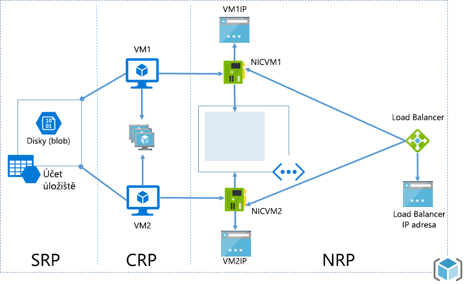
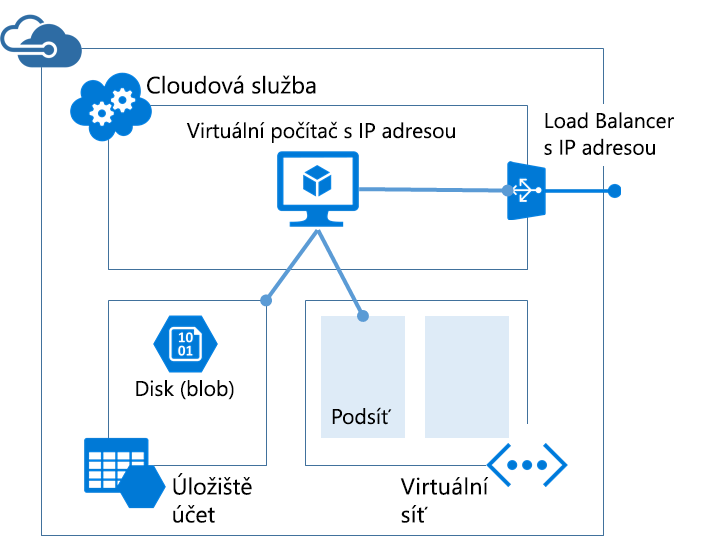

# <a name="azure-resource-manager-vs-classic-deployment-understand-deployment-models-and-the-state-of-your-resources"></a>Nasazení Azure Resource Manager vs. Classic: Vysvětlení modelů nasazení a stavu prostředků
Tento článek vysvětluje model nasazení Azure Resource Manager a model nasazení Classic. Modely Resource Manager a Classic představují dva různé způsoby nasazení a správy vašich řešení Azure. Práce s nimi probíhá prostřednictvím dvou různých sad rozhraní API a nasazené prostředky můžou obsahovat důležité rozdíly. Tyto dva modely nejsou navzájem kompatibilní. Tento článek popisuje rozdíly mezi nimi.

V zájmu zjednodušení nasazení a správy prostředků Microsoft doporučuje používat pro všechny nové prostředky model Resource Manager. Pokud je to možné, Microsoft doporučuje znovu nasadit existující prostředky prostřednictvím Resource Manageru.

Pokud jste s Resource Managerem ještě nepracovali, můžete si nejdřív projít terminologii definovanou v článku [Přehled Azure Resource Manageru](resource-group-overview.md).

## <a name="history-of-the-deployment-models"></a>Historie modelů nasazení
Platforma Azure původně poskytovala jenom model nasazení Classic. V tomto modelu existoval každý prostředek odděleně a nebyl dostupný žádný způsob, jak související prostředky seskupit. Bylo tak potřeba ručně sledovat, které prostředky tvoří vaše řešení nebo aplikaci, a spravovat je pomocí koordinovaného přístupu. K nasazení řešení jste buď museli vytvořit každý prostředek zvlášť prostřednictvím webu Portal, nebo vytvořit skript, který nasadil všechny prostředky ve správném pořadí. Pokud jste chtěli řešení odstranit, museli jste odstranit každý prostředek zvlášť. U souvisejících prostředků jste nemohli snadno uplatnit a aktualizovat zásady řízení přístupu. Navíc nebylo možné používat u prostředků značky tvořené výrazy, které by vám pomohly prostředky monitorovat a usnadnily vám správu fakturace.

V roce 2014 platforma Azure představila model Resource Manager, který přinesl koncept skupiny prostředků. Skupina prostředků je kontejner pro prostředky, které sdílejí společný životní cyklus. Model nasazení Resource Manager poskytuje několik výhod:

* Všechny služby pro vaše řešení můžete nasadit, spravovat a monitorovat jako skupinu a nemusíte je zpracovávat jednotlivě.
* Můžete řešení opakovaně nasadit v průběhu životního cyklu a mít při tom jistotu, že se prostředky nasadí konzistentně.
* U všech prostředků ve skupině prostředků taky můžete použít řízení přístupu a tyto zásady se potom automaticky použijí vždy, když do skupiny prostředků přibudou nové prostředky.
* Můžete označit prostředky pomocí značek a logicky tak uspořádat všechny prostředky ve svém předplatném.
* K definování infrastruktury řešení můžete použít formát JSON (JavaScript Object Notation). Soubor JSON se označuje jako šablona Resource Manageru.
* Můžete definovat závislosti mezi prostředky, takže se nasadí ve správném pořadí.

Při přidání Resource Manageru došlo ke zpětnému přidání všech prostředků do výchozích skupin prostředků. Pokud teď vytvoříte prostředek pomocí nasazení Classic, prostředek se automaticky vytvoří ve výchozí skupině prostředků pro danou službu, i když jste tuto skupinu prostředků nespecifikovali při nasazení. Pouhé zařazení do skupiny prostředků ale neznamená, že došlo k převedení daného prostředku na model Resource Manager.

## <a name="understand-support-for-the-models"></a>Vysvětlení podpory modelů
Je potřeba vzít v úvahu tři scénáře:

1. Služba Cloud Services nepodporuje model nasazení Resource Manager.
2. Virtuální počítače, účty úložiště a virtuální sítě podporují jak model nasazení Classic, tak model Resource Manager.
3. Všechny ostatní služby Azure podporují model Resource Manager.

U virtuálních počítačů, účtů úložiště a virtuálních sítí platí, že pokud se prostředek vytvořil pomocí modelu nasazení Classic, je potřeba ho nadále používat prostřednictvím operací modelu Classic. Pokud se virtuální počítač, účet úložiště nebo virtuální síť vytvořily pomocí modelu nasazení Resource Manager, je potřeba dál používat operace modelu Resource Manager. Toto rozlišování může působit nejasnosti, pokud vaše předplatné obsahuje kombinaci prostředků vytvořených pomocí modelů nasazení Resource Manager a Classic. Tato kombinace prostředků může vést k neočekávaným výsledkům, protože prostředky nepodporují stejné operace.

V některých případech může příkaz Resource Manageru načíst informace o prostředku vytvořeném pomocí modelu Classic nebo může provést úlohu správy, jako je přesun prostředku modelu Classic do jiné skupiny prostředků. Tyto případy by ale neměly vzbuzovat mylný dojem, že daný typ podporuje operace Resource Manageru. Můžeme třeba předpokládat, že máte skupinu prostředků, která obsahuje virtuální počítač vytvořený pomocí modelu nasazení Classic. Spustíte následující příkaz prostředí PowerShell Resource Manageru:

```powershell
Get-AzureRmResource -ResourceGroupName ExampleGroup -ResourceType Microsoft.ClassicCompute/virtualMachines
```

Vrátí se virtuální počítač:

```powershell
Name              : ExampleClassicVM
ResourceId        : /subscriptions/{guid}/resourceGroups/ExampleGroup/providers/Microsoft.ClassicCompute/virtualMachines/ExampleClassicVM
ResourceName      : ExampleClassicVM
ResourceType      : Microsoft.ClassicCompute/virtualMachines
ResourceGroupName : ExampleGroup
Location          : westus
SubscriptionId    : {guid}
```

Rutina Resource Manageru **Get-AzureRmVM** ale vrátí jenom virtuální počítače nasazené prostřednictvím Resource Manageru. Následující příkaz nevrátí virtuální počítač vytvořený prostřednictvím nasazení Classic.

```powershell
Get-AzureRmVM -ResourceGroupName ExampleGroup
```

Značky jsou podporované jenom u prostředků vytvořených pomocí Resource Manageru. Značky se nedají používat u prostředků modelu Classic.

## <a name="changes-for-compute-network-and-storage"></a>Změny kapacity výpočetních prostředků, sítě a úložiště
Následující diagram znázorňuje výpočetní prostředky, prostředky sítě a úložiště nasazené prostřednictvím Resource Manageru.



Všimněte si následujících vztahů mezi prostředky:

* Všechny prostředky existují v rámci skupiny prostředků.
* Virtuální počítač využívá k ukládání svých disků do úložiště objektů blob konkrétní účet úložiště definovaný v poskytovateli prostředků služby Storage (povinné).
* Virtuální počítač odkazuje na konkrétní síťový adaptér definovaný v poskytovateli síťových prostředků (povinné) a skupinu dostupnosti definovanou v poskytovateli výpočetních prostředků (volitelné).
* Síťový adaptér odkazuje na přiřazenou IP adresu virtuálního počítače (povinné), podsíť virtuální sítě pro daný virtuální počítač (povinné) a skupinu zabezpečení sítě (volitelné).
* Podsíť virtuální sítě odkazuje na skupinu zabezpečení sítě (volitelné).
* Instance nástroje pro vyrovnávání zatížení odkazuje na back-endový fond IP adres zahrnující síťový adaptér virtuálního počítače (volitelné) a na veřejnou nebo privátní IP adresu nástroje pro vyrovnávání zatížení (volitelné).

Toto jsou jednotlivé komponenty a jejich vztahy v případě modelu nasazení Classic:



Řešení Classic pro hostování virtuálního počítače zahrnuje tyto součásti:

* Povinná cloudová služba, která funguje jako kontejner pro hostování virtuálních počítačů (výpočetní prostředky). Virtuální počítače se automaticky poskytují se síťovou kartou (síťovým adaptérem) a IP adresou přiřazenou z Azure. Kromě toho cloudová služba obsahuje instanci externího nástroje pro vyrovnávání zatížení, veřejnou IP adresu a výchozí koncové body, což umožňuje datový provoz ze vzdálené plochy a vzdáleného prostředí PowerShell u virtuálních počítačů s Windows a datový provoz SSH (Secure Shell) u virtuálních počítačů s Linuxem.
* Povinný účet úložiště pro uložení virtuálních pevných disků pro virtuální počítač včetně operačního systému, dočasných a dodatečných datových disků (prostředky úložiště).
* Volitelná virtuální síť fungující jako další kontejner, ve které můžete vytvořit strukturu podsítí a určit podsíť, ve které se nachází daný virtuální počítač (síťové prostředky).

Následující tabulka popisuje změny v interakci poskytovatelů výpočetních prostředků, síťových prostředků a prostředků úložiště:

| Položka | Classic | Resource Manager |
| --- | --- | --- |
| Cloudová služba pro službu Virtual Machines |Cloudová služba byla kontejnerem pro uložení virtuálních počítačů, která vyžadovala dostupnost z platformy a vyrovnávání zatížení. |Cloudová služba už není objektem vyžadovaným pro vytvoření virtuálního počítače pomocí nového modelu. |
| Virtuální sítě |Virtuální síť je pro virtuální počítač volitelná. Pokud existuje, nedá se nasadit pomocí Resource Manageru. |Virtuální počítač vyžaduje virtuální síť nasazenou pomocí Resource Manageru. |
| Účty úložiště |Virtuální počítač vyžaduje účet úložiště pro uložení virtuálních pevných disků pro operační systém, dočasné soubory a další data. |Virtuální počítač vyžaduje účet úložiště pro uložení disků do úložiště objektů blob. |
| Skupiny dostupnosti |Dostupnost pro platformu byla označovaná konfigurací stejného parametru „AvailabilitySetName“ ve službě Virtual Machines. Maximální počet domén selhání byl 2. |Skupina dostupnosti je prostředek vystavený poskytovatelem Microsoft.Compute. Služby Virtual Machines, které vyžadují vysokou dostupnost, musejí být součástí skupiny dostupnosti. Maximální počet domén selhání je teď 3. |
| Skupiny vztahů |Skupiny vztahů byly nezbytné k vytváření služeb Virtual Network. Se zavedením regionálních služeb Virtual Network přestaly být nutné. |Abychom to zjednodušili, koncept skupin vztahů neexistuje v rozhraních API, které se vystavují prostřednictvím správce Azure Resource Manager. |
| Vyrovnávání zatížení |Vytvoření cloudové služby nabízí implicitní nástroj pro vyrovnávání zatížení nasazených služeb Virtual Machines. |Nástroj pro vyrovnávání zatížení je prostředek vystavený poskytovatelem Microsoft.Network. Primární síťové rozhraní služeb Virtual Machines, které potřebuje vyrovnávání zatížení, musí odkazovat na nástroj pro vyrovnávání zatížení. Nástroje pro vyrovnávání zatížení můžou být interní nebo externí. Instance nástroje pro vyrovnávání zatížení odkazuje na back-endový fond IP adres zahrnující síťový adaptér virtuálního počítače (volitelné) a na veřejnou nebo privátní IP adresu nástroje pro vyrovnávání zatížení (volitelné). |
| Virtuální IP adresa |Po přidání virtuálního počítače do cloudové služby získají služby Cloud Services výchozí VIP (virtuální IP adresu). Virtuální IP adresa je adresa přidružená k implicitnímu nástroji pro vyrovnávání zatížení. |Veřejná IP adresa je prostředek vystavený poskytovatelem Microsoft.Network. Veřejná IP adresa může být statická (vyhrazená) nebo dynamická. Dynamické veřejné IP adresy můžete přiřadit ke službě Load Balancer. Veřejné IP adresy můžete zabezpečit pomocí skupin zabezpečení. |
| Vyhrazená IP adresa |IP adresu můžete v Azure vyhradit a přidružit ji ke cloudové službě, abyste zajistili, že IP adresa zůstane dynamická. |Veřejnou IP adresu můžete vytvořit ve statickém režimu a bude nabízet stejné funkce jako vyhrazená IP adresa. |
| Veřejná IP adresa (PIP) na virtuální počítač |Veřejné IP adresy se dají k virtuálnímu počítači přiřadit i přímo. |Veřejná IP adresa je prostředek vystavený poskytovatelem Microsoft.Network. Veřejná IP adresa může být statická (vyhrazená) nebo dynamická. |
| Koncové body |Vstupní koncové body je třeba konfigurovat na virtuálním počítači, aby se pro určité porty staly otevřeným připojením. Jeden z běžných režimů připojení k virtuálním počítačům se provádí nastavením vstupní koncových bodů. |Příchozí pravidla NAT můžete konfigurovat na nástrojích pro vyrovnávání zatížení, abyste dosáhli stejné možnosti povolování koncových bodů na konkrétních portech za účelem připojení k virtuálním počítačům. |
| Název DNS |Cloudová služba by získala implicitní, globálně jedinečný název DNS. Například: `mycoffeeshop.cloudapp.net`. |Názvy DNS jsou volitelné parametry, které můžete nastavit na prostředku veřejné IP adresy. Plně kvalifikovaný název je v následujícím formátu – `<domainlabel>.<region>.cloudapp.azure.com`. |
| Síťová rozhraní |Primární a sekundární síťové rozhraní a jeho vlastnosti byly definované jako síťová konfigurace virtuálního počítače. |Síťové rozhraní je prostředek vystavený poskytovatelem Microsoft.Network. Životní cyklus síťového rozhraní není vázaný na virtuální počítač. Odkazuje na přiřazenou IP adresu virtuálního počítače (povinné), podsíť virtuální sítě pro daný virtuální počítač (povinné) a skupinu zabezpečení sítě (volitelné). |

Informace o připojení virtuálních sítí z různých modelů nasazení najdete v článku [Připojení virtuálních sítí z různých modelů nasazení na portálu](../vpn-gateway/vpn-gateway-connect-different-deployment-models-portal.md).

## <a name="migrate-from-classic-to-resource-manager"></a>Migrace z modelu Classic na Resource Manager
Pokud jste připravení provést migraci prostředků z modelu nasazení Classic na model nasazení Resource Manager, přečtěte si tyto články:

1. [Podrobné technické informace o platformou podporované migraci z modelu Classic na Azure Resource Manager](../virtual-machines/windows/migration-classic-resource-manager-deep-dive.md)
2. [Platformou podporovaná migrace prostředků IaaS z nasazení Classic do Azure Resource Manageru](../virtual-machines/windows/migration-classic-resource-manager-overview.md)
3. [Migrace prostředků IaaS z modelu Classic na Azure Resource Manager pomocí Azure PowerShellu](../virtual-machines/windows/migration-classic-resource-manager-ps.md)
4. [Migrace prostředků IaaS z modelu Classic na Azure Resource Manager pomocí rozhraní příkazového řádku Azure](../virtual-machines/virtual-machines-linux-cli-migration-classic-resource-manager.md)

## <a name="frequently-asked-questions"></a>Nejčastější dotazy
**Můžu pomocí Resource Manageru vytvořit virtuální počítač k nasazení do virtuální sítě vytvořené pomocí nasazení Classic?**

Tato konfigurace není podporovaná. Resource Manager se nedá použít k nasazení virtuálního počítače do virtuální sítě vytvořené pomocí modelu nasazení Classic.

**Můžu pomocí Resource Manageru vytvořit virtuální počítač z uživatelské image vytvořené pomocí modelu nasazení Classic?**

Tato konfigurace není podporovaná. Můžete ale zkopírovat soubory virtuálního pevného disku z účtu úložiště vytvořeného pomocí modelu nasazení Classic a přidat je do nového účtu vytvořeného pomocí Resource Manageru.

**Jaký bude dopad na kvótu pro moje předplatné?**

Kvóty pro virtuální počítače, virtuální sítě a účty úložiště vytvořené pomocí Azure Resource Manageru jsou oddělené od ostatních kvót. Každé předplatné získá vlastní kvóty pro vytvoření prostředků pomocí nových rozhraní API. Další informace o dodatečných kvótách najdete [tady](../azure-subscription-service-limits.md).

**Můžu prostřednictvím rozhraní API Azure Resource Manageru dál používat své automatizované skripty pro zřizování virtuálních počítačů, virtuálních sítí a účtů úložiště?**

Všechny vámi vytvořené automatizace a skripty budou fungovat v existujících virtuálních počítačích a virtuálních sítích vytvořených v režimu Azure Service Management. Skripty je ale potřeba aktualizovat, aby používaly nové schéma pro vytváření stejných prostředků prostřednictvím režimu Resource Manager.

**Kde najdu příklady šablon Azure Resource Manageru?**

Ucelenou sadu úvodních šablon najdete v [Rychlém úvodu do šablon Azure Resource Manageru](https://azure.microsoft.com/documentation/templates/).

## <a name="next-steps"></a>Další kroky
* Pokud chcete získat podrobný návod k vytvoření šablony, která definuje virtuální počítač, účet úložiště a virtuální síť, přečtěte si článek [Názorný průvodce šablonou Resource Manageru](resource-manager-template-walkthrough.md).
* Informace o příkazech pro nasazení šablony najdete v článku [Nasazení aplikace pomocí šablony Azure Resource Manageru](resource-group-template-deploy.md).

