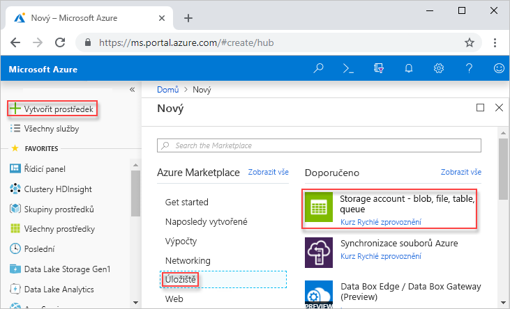
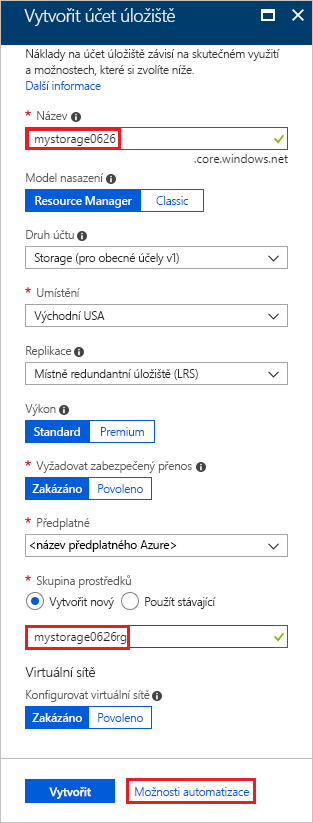
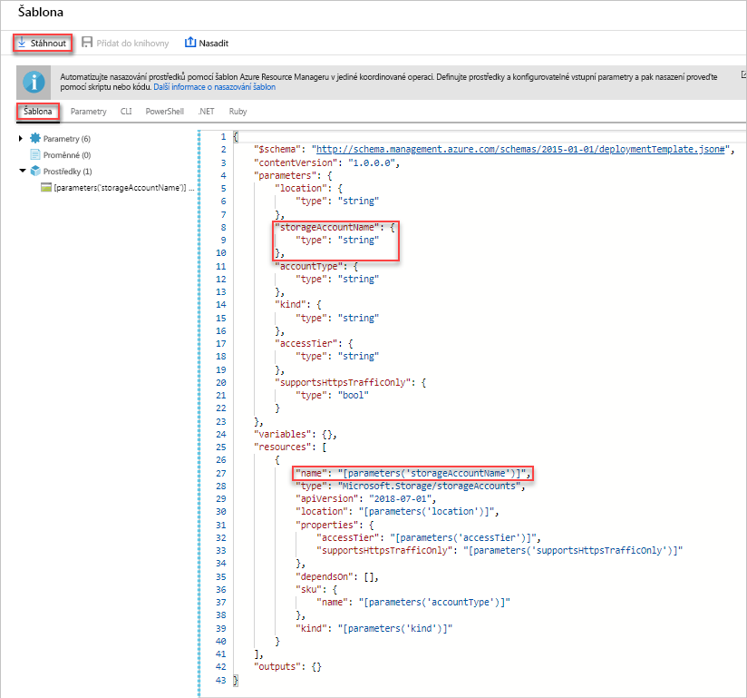
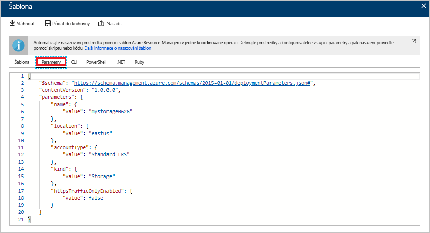
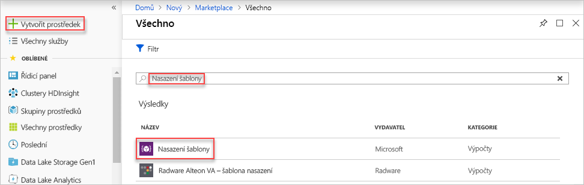
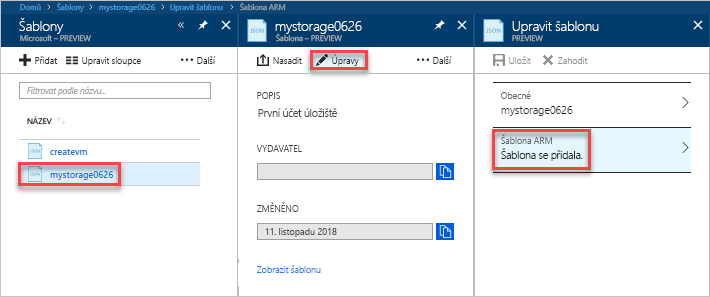
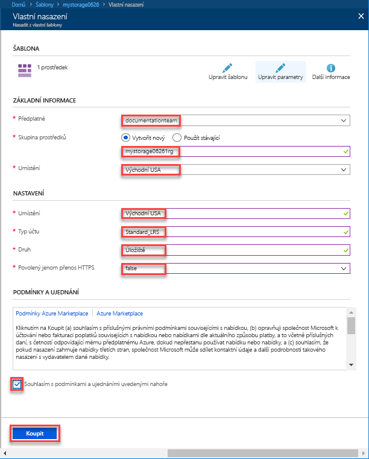
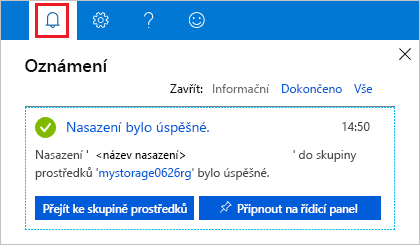
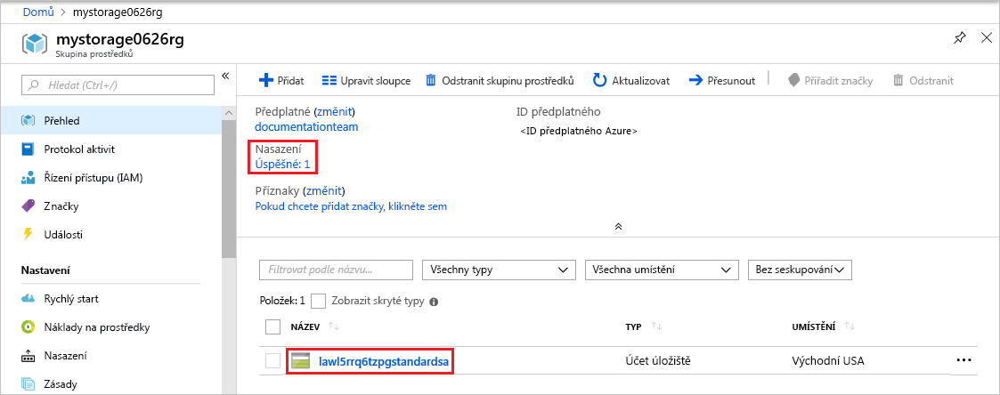

# <a name="quickstart-create-and-deploy-azure-resource-manager-templates-by-using-the-azure-portal"></a>Rychlý start: Vytvoření a nasazení šablony Azure Resource Manageru pomocí portálu Azure Portal

Přečtěte si, jak si můžete na portálu Azure Portal vygenerovat první šablonu Azure Resource Manageru a jak ji můžete na portálu upravit a nasadit.

Šablony Resource Manageru jsou soubory JSON, které definují, jaké prostředky je pro řešení potřeba nasadit. Pokud chcete vytvořit šablonu, nemusíte vždy začínat od začátku. V tomto kurzu se naučíte, jak šablonu vygenerovat na portálu Azure Portal. Šablonu si pak můžete přizpůsobit a nasadit ji.

Podle pokynů v tomto kurzu vytvoříte účet služby Azure Storage. Stejným postupem můžete vytvořit i další prostředky Azure.

Pokud ještě nemáte předplatné Azure, [vytvořte si bezplatný účet](https://azure.microsoft.com/free/) před tím, než začnete.

## <a name="generate-a-template-using-the-portal"></a>Vygenerování šablony na portálu

V této části vytvoříte účet úložiště pomocí portálu Azure Portal. Než nasadíte účet úložiště, máte možnost prozkoumat šablonu, kterou portál vygeneroval podle vaší konfigurace. Šablonu pak můžete uložit, abyste ji mohli v budoucnu znovu použít.

1. Přihlaste se k webu [Azure Portal](https://portal.azure.com).
2. Vyberte **Vytvořit prostředek** > **Storage** > **Účet úložiště – objekt blob, soubor, tabulka, fronta**.

    
3. Zadejte následující informace. V dalším kroku nezapomeňte vybrat **Automatické možnosti** místo **Vytvořit**, abyste se mohli na šablonu podívat, než se nasadí.

    - **Název**: Zadejte jedinečný název účtu úložiště. Na snímku obrazovky má účet název *mystorage0626*.
    - **Skupina prostředků**: Vytvořte novou skupinu prostředků Azure s požadovaným názvem. Na snímku obrazovky má skupina prostředků název *mystorage0626rg*.

    Pro zbývající vlastnosti můžete použít výchozí hodnoty.

    

    > [!NOTE]
    > Některé exportované šablony vyžadují před nasazením nějaké úpravy.

4. Dole na obrazovce vyberte **Automatické možnosti**. Na portálu se šablona zobrazí na kartě **Šablona**:

    

    Šablona se zobrazí v hlavním podokně. Jedná se o soubor JSON se čtyřmi elementy nejvyšší úrovně. Další informace najdete v článku, který se zabývá [strukturou a syntaxí šablon Azure Resource Manageru](./resource-group-authoring-templates.md).

    V elementu **Parameter** je definováno pět parametrů. Pokud se během nasazení chcete podívat na hodnoty, vyberte kartu **Parametry**.

    

    Tyto hodnoty jste nakonfigurovali v předchozí části. Pomocí šablony a souborů parametrů můžete vytvořit účet služby Azure Storage.

5. Nad kartami se nachází tři položky nabídky:

    - **Stáhnout**: Stáhne šablonu a soubor parametrů na místní počítač.
    - **Přidat do knihovny**: Přidá šablonu do knihovny, aby ji bylo možné v budoucnu znovu použít.
    - **Nasadit**: Nasadí účet Azure Storage do Azure.

    V tomto kurzu použijete možnost **Přidat do knihovny**.

6. Vyberte **Přidat do knihovny**.
7. Zadejte **Název** a **Popis** a potom vyberte **Uložit**.

> [!NOTE]
> Funkce knihovny šablon je ve verzi Preview. Většina lidí si šablony ukládá na místní počítač nebo do veřejného úložiště, například do Githubu.  

## <a name="edit-and-deploy-the-template"></a>Úprava a nasazení šablony

V této části otevřete uloženou šablonu z knihovny šablon, upravíte ji na portálu a potom ji nasadíte. Pokud chcete upravit složitější šablonu, zvažte použití editoru [Visual Studio Code](./resource-manager-quickstart-create-templates-use-visual-studio-code.md), který poskytuje více funkcí úprav.

Azure vyžaduje, aby každá služba Azure měla jedinečný název. Pokud zadáte název účtu úložiště, který už existuje, nasazení selže. Pokud se chcete tomuto problému vyhnout, můžete vygenerovat jedinečný název účtu úložiště zavoláním funkce šablony uniquestring().

1. Na portálu Azure Portal vyberte v nabídce nalevo **Všechny služby**, do pole filtru zadejte **šablona** a vyberte **Šablona (PREVIEW)**.

    
2. Vyberte šablonu, kterou jste uložili v poslední části. Na snímku obrazovky má šablona název *mystorage0626*.
3. Vyberte **Upravit** a potom **Šablona se přidala**.

    

4. Přidejte element **variables** a potom přidejte jednu proměnnou, jak je znázorněno na následujícím obrázku:

    ```json
    "variables": {
        "storageAccountName": "[concat(uniquestring(resourceGroup().id), 'standardsa')]"
    },
    ```
    

    Jsou zde použity dvě funkce: *concat()* a *uniqueString()*. Funkce uniqueString() je užitečná při vytvoření jedinečného názvu prostředku.

5. Odeberte parametr **name** zvýrazněný na předchozím snímku obrazovky.
6. Aktualizujte element name prostředku **Microsoft.Storage/storageAccounts** tak, aby se místo parametru použila nově definovaná proměnná:

    ```json
    "name": "[variables('storageAccountName')]",
    ```

    Výsledná šablona by měla vypadat takto:

    ```json
    {
        "$schema": "https://schema.management.azure.com/schemas/2015-01-01/deploymentTemplate.json#",
        "contentVersion": "1.0.0.0",
        "parameters": {
            "location": {
                "type": "string"
            },
            "accountType": {
                "type": "string"
            },
            "kind": {
                "type": "string"
            },
            "httpsTrafficOnlyEnabled": {
                "type": "bool"
            }
        },
        "variables": {
            "storageAccountName": "[concat(uniquestring(resourceGroup().id), 'standardsa')]"
        },
        "resources": [
            {
                "apiVersion": "2018-02-01",
                "name": "[variables('storageAccountName')]",
                "location": "[parameters('location')]",
                "type": "Microsoft.Storage/storageAccounts",
                "sku": {
                    "name": "[parameters('accountType')]"
                },
                "kind": "[parameters('kind')]",
                "properties": {
                    "supportsHttpsTrafficOnly": "[parameters('httpsTrafficOnlyEnabled')]",
                    "encryption": {
                        "services": {
                            "blob": {
                                "enabled": true
                            },
                            "file": {
                                "enabled": true
                            }
                        },
                        "keySource": "Microsoft.Storage"
                    }
                },
                "dependsOn": []
            }
        ]
    }
    ```
7. Vyberte **OK** a potom výběrem **Uložit** změny uložte.
8. Vyberte **Nasadit**.
9. Zadejte následující hodnoty:

    - **Předplatné:** Vyberte své předplatné Azure.
    - **Skupina prostředků**: Zadejte jedinečný název skupiny prostředků.
    - **Umístění:**: Vyberte umístění pro skupinu prostředků.
    - **Umístění:**: Vyberte umístění pro účet úložiště.  Můžete použít stejné umístění jako u skupiny prostředků.
    - **Typ účtu**: V tomto rychlém startu zadejte **Standard_LRS**.
    - **Druh**: V tomto rychlém startu zadejte **Storage**.
    - **Povolen pouze přenos HTTPS**:  V tomto rychlém startu vyberte **false**.
    - **Souhlasím s podmínkami a ujednáními uvedenými nahoře**: Toto políčko zaškrtněte.

    Tady je snímek obrazovky s ukázkovým nasazením:

    

10. Vyberte **Koupit**.
11. Stav nasazení zobrazíte tak, že nahoře na obrazovce vyberete ikonu zvonku (oznámení).

    

12. V podokně oznámení vyberte **Přejít ke skupině prostředků**. Zobrazí se podobná obrazovka:

    

    Jak vidíte, nasazení proběhlo úspěšně a skupina prostředků obsahuje pouze jeden účet úložiště. Název účtu úložiště je jedinečný řetězec vygenerovaný šablonou. Další informace o používání účtů úložiště Azure najdete v tématu [Rychlý start: Nahrávání, stahování a výpis objektů blob pomocí webu Azure Portal](../storage/blobs/storage-quickstart-blobs-portal.md).

## <a name="clean-up-resources"></a>Vyčištění prostředků

Pokud už nasazené prostředky Azure nepotřebujete, vyčistěte je odstraněním skupiny prostředků.

1. Na portálu Azure Portal vyberte v nabídce nalevo **Skupina prostředků**.
2. Do pole **Filtrovat podle názvu** zadejte název skupiny prostředků.
3. Vyberte název skupiny prostředků.  Ve skupině prostředků byste měli vidět účet úložiště.
4. V nabídce nahoře vyberte **Odstranit skupinu prostředků**.

## <a name="next-steps"></a>Další kroky

V tomto kurzu jste naučili, jak vygenerovat šablonu na portálu Azure Portal a jak ji pomocí tohoto portálu nasadit. Šablona použitá v tomto rychlém startu představuje jednoduchou šablonu s jedním prostředkem Azure. Pokud je šablona složitá, je snazší šablonu vytvořit v nástroji Visual Studio Code nebo v sadě Visual Studio. V dalším rychlém startu se také dozvíte, jak nasazovat šablony pomocí Azure PowerShellu a rozhraní příkazového řádku Azure (Azure CLI).

> [!div class="nextstepaction"]
> [Vytváření šablon v nástroji Visual Studio](./resource-manager-quickstart-create-templates-use-visual-studio-code.md)
