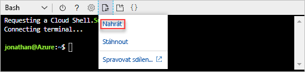
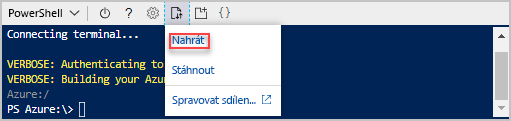

# <a name="quickstart-create-azure-resource-manager-templates-by-using-visual-studio-code"></a>Rychlý start: Vytváření šablon Azure Resource Manageru pomocí Visual Studio Code

[!INCLUDE [updated-for-az](../../includes/updated-for-az.md)]

Zjistěte, jak pomocí Visual Studio Code a rozšíření Nástroje Azure Resource Manageru vytvářet a upravovat šablony Azure Resource Manageru. Šablony Resource Manageru můžete v nástroji Visual Studio Code vytvářet i bez tohoto rozšíření, poskytuje však možnosti automatického dokončování, které vývoj šablon zjednodušují. Abyste porozuměli konceptům spojeným s nasazením a správou řešení Azure, podívejte se na téma [Přehled Azure Resource Manageru](resource-group-overview.md).

Pokud ještě nemáte předplatné Azure, [vytvořte si bezplatný účet](https://azure.microsoft.com/free/) před tím, než začnete.

[!INCLUDE [updated-for-az](../../includes/updated-for-az.md)]

## <a name="prerequisites"></a>Požadavky

K dokončení tohoto článku potřebujete:

- [Visual Studio Code](https://code.visualstudio.com/).
- Rozšíření Nástroje Resource Manageru. Instalaci provedete následujícím postupem:

    1. Otevřete Visual Studio Code.
    2. Stisknutím **CTRL+SHIFT+X** otevřete podokno Rozšíření.
    3. Vyhledejte **Nástroje Azure Resource Manageru** a vyberte **Nainstalovat**.
    4. Instalaci rozšíření dokončíte výběrem **Znovu načíst**.

## <a name="open-a-quickstart-template"></a>Otevření šablony pro rychlý start

Šablonu nemusíte vytvářet od začátku, ale můžete místo toho otevřít některou [šablonu pro rychlý start Azure](https://azure.microsoft.com/resources/templates/). Šablony pro rychlý start Azure slouží jako úložiště šablon Resource Manageru.

Šablona, kterou jsme použili v tomto rychlém startu, se nazývá [Create a standard storage account](https://azure.microsoft.com/resources/templates/101-storage-account-create/) (Vytvoření standardního účtu úložiště). Šablona definuje prostředek účtu služby Azure Storage.

1. V nástroji Visual Studio Code vyberte **File** (Soubor) >**Open File** (Otevřít soubor).
2. Do pole **File name** (Název souboru) vložte následující adresu URL:

    ```url
    https://raw.githubusercontent.com/Azure/azure-quickstart-templates/master/101-storage-account-create/azuredeploy.json
    ```
3. Výběrem **Open** (Otevřít) soubor otevřete.
4. Vyberte **File** (Soubor) >**Save As** (Uložit jako) a soubor uložte jako **azuredeploy.json** na místní počítač.

## <a name="edit-the-template"></a>Úprava šablony

Pokud chcete vyzkoušet, jak upravit šablonu pomocí Visual Studio Code, přidejte jeden další prvek do `outputs` části zobrazíte identifikátor URI úložiště.

1. Přidejte do exportované šablony jeden další výstup:

    ```json
    "storageUri": {
      "type": "string",
      "value": "[reference(variables('storageAccountName')).primaryEndpoints.blob]"
    }
    ```

    Až to bude mít, bude část výstupů vypadat takto:

    ```json
    "outputs": {
      "storageAccountName": {
        "type": "string",
        "value": "[variables('storageAccountName')]"
      },
      "storageUri": {
        "type": "string",
        "value": "[reference(variables('storageAccountName')).primaryEndpoints.blob]"
      }
    }
    ```

    Pokud jste zkopírovali a vložili kód ve Visual Studio Code, zkuste znovu zadat element **value**, abyste si vyzkoušeli možnosti IntelliSense v rozšíření Nástroje Resource Manageru.

    

2. Soubor uložte tak, že vyberete **File** (Soubor) >**Save** (Uložit).

## <a name="deploy-the-template"></a>Nasazení šablony

Šablony můžete nasadit mnoha způsoby.  V tomto rychlém startu použijete Azure Cloud Shell. Cloud shell je webová aplikace, která nevyžaduje žádnou konfiguraci. Podporuje rozhraní příkazového řádku Azure a Azure Powershellu.

1. Přihlaste se do služby [Azure Cloud Shell](https://shell.azure.com).

    
2. Vyberte upřednostňované prostředí tak, že vyberete buď **PowerShell** nebo **Bash** v levém horním rohu. Pokud chcete použít rozhraní příkazového řádku, musíte otevřít relaci Bash. Ke spuštění prostředí Azure PowerShell, budete muset otevřít relaci prostředí PowerShell. Chcete-li přepnout mezi Bash a PowerShell, vyberte šipku dolů. Viz předchozí snímek obrazovky. Po přepnutí se vyžaduje restartování prostředí.
3. Vyberte **Nahrát nebo stáhnout soubory** a potom vyberte **Nahrát**.

    # <a name="clitabcli"></a>[Rozhraní příkazového řádku](#tab/CLI)

    
   
    # <a name="powershelltabpowershell"></a>[PowerShell](#tab/PowerShell)
    
    
    
    ---

    Vyberte soubor, který jste uložili v předchozí části. Výchozí název je **azuredeploy.json**. Soubor šablony musí být přístupné z prostředí.

    Volitelně můžete **ls** příkazu a **cat** příkaz k ověření úspěšného nahrání souboru. 

    # <a name="clitabcli"></a>[Rozhraní příkazového řádku](#tab/CLI)

    
   
    # <a name="powershelltabpowershell"></a>[PowerShell](#tab/PowerShell)
    
    
    
    ---
4. Ve službě Cloud Shell spusťte následující příkazy. Výběrem odpovídající karty zobrazíte kód PowerShellu nebo kód rozhraní příkazového řádku.

    # <a name="clitabcli"></a>[Rozhraní příkazového řádku](#tab/CLI)
    ```azurecli
    echo "Enter the Resource Group name:" &&
    read resourceGroupName &&
    echo "Enter the location (i.e. centralus):" &&
    read location &&
    az group create --name $resourceGroupName --location $location &&
    az group deployment create --resource-group $resourceGroupName --template-file "azuredeploy.json"
    ```
   
    # <a name="powershelltabpowershell"></a>[PowerShell](#tab/PowerShell)
    
    ```azurepowershell
    $resourceGroupName = Read-Host -Prompt "Enter the Resource Group name"
    $location = Read-Host -Prompt "Enter the location (i.e. centralus)"
    
    New-AzResourceGroup -Name $resourceGroupName -Location $location
    New-AzResourceGroupDeployment -ResourceGroupName $resourceGroupName -TemplateFile "azuredeploy.json"
    ```
    
    ---

    Pokud jste soubor uložili s jiným názvem než **azuredeploy.json**, aktualizujte název souboru šablony.

    Následující snímek obrazovky ukazuje ukázkové nasazení:

    # <a name="clitabcli"></a>[Rozhraní příkazového řádku](#tab/CLI)

    
   
    # <a name="powershelltabpowershell"></a>[PowerShell](#tab/PowerShell)
    
    
    
    ---

    Na snímku obrazovky je zvýrazněný název účtu úložiště a adresa URL úložiště v části outputs (Výstupy). Název účtu úložiště budete potřebovat v dalším kroku.

5. Spuštěním následujícího příkazu rozhraní příkazového řádku nebo PowerShellu zobrazíte nově vytvořený účet úložiště:

    # <a name="clitabcli"></a>[Rozhraní příkazového řádku](#tab/CLI)
    ```azurecli
    echo "Enter the Resource Group name:" &&
    read resourceGroupName &&
    echo "Enter the Storage Account name:" &&
    read storageAccountName &&
    az storage account show --resource-group $resourceGroupName --name $storageAccountName
    ```
   
    # <a name="powershelltabpowershell"></a>[PowerShell](#tab/PowerShell)
    
    ```azurepowershell
    $resourceGroupName = Read-Host -Prompt "Enter the Resource Group name"
    $storageAccountName = Read-Host -Prompt "Enter the Storage Account name"
    Get-AzStorageAccount -ResourceGroupName $resourceGroupName -Name $storageAccountName
    ```
    
    ---

Další informace o používání účtů služby Azure storage najdete v tématu [rychlý start: Nahrávání, stahování a výpis objektů BLOB pomocí webu Azure portal](../storage/blobs/storage-quickstart-blobs-portal.md).

## <a name="clean-up-resources"></a>Vyčištění prostředků

Pokud už nasazené prostředky Azure nepotřebujete, vyčistěte je odstraněním skupiny prostředků.

1. Na portálu Azure Portal vyberte v nabídce nalevo **Skupina prostředků**.
2. Do pole **Filtrovat podle názvu** zadejte název skupiny prostředků.
3. Vyberte název skupiny prostředků.  Ve skupině prostředků uvidíte celkem šest prostředků.
4. V nabídce nahoře vyberte **Odstranit skupinu prostředků**.

## <a name="next-steps"></a>Další postup

Hlavním cílem tohoto rychlého zprovoznění byla úprava existující šablony z šablon Azure pro rychlý start pomocí editoru Visual Studio Code. Také jste zjistili, jak chcete nasadit šablonu pomocí Powershellu nebo rozhraní příkazového řádku ze služby Azure Cloud shell. Šablony Azure pro rychlý start možná nenabízí vše, co potřebujete. V dalším kurzu se dozvíte, jak v referenčních informacích k šablonám vyhledat potřebné informace, abyste mohli vytvořit šifrovaný účet služby Azure Storage.

> [!div class="nextstepaction"]
> [Vytvoření šifrovaného účtu úložiště](./resource-manager-tutorial-create-encrypted-storage-accounts.md)
