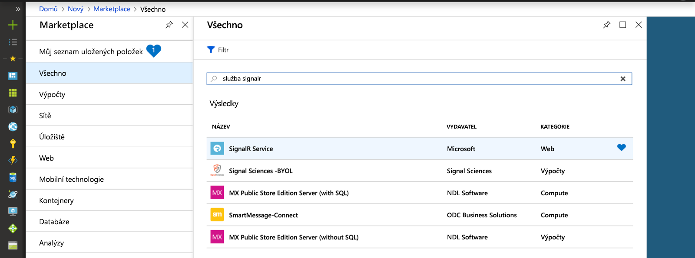
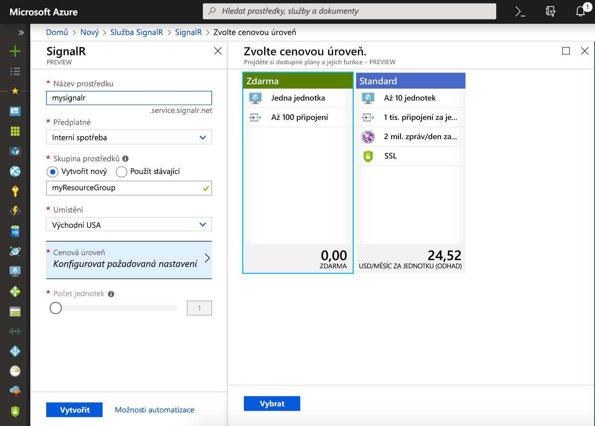

## Vytvoření instance služby Azure SignalR Service

Vaše aplikace se připojí k instanci služby SignalR Service v Azure.

1. Vyberte tlačítko Nový v levém horním rohu portálu Azure Portal. Do vyhledávacího pole na obrazovce Nový zadejte *SignalR Service* a stiskněte klávesu Enter.

    

1. Ve výsledcích hledání vyberte **SignalR Service** a pak vyberte **Vytvořit**.

1. Zadejte následující nastavení.

    | Nastavení      | Navrhovaná hodnota  | Popis                                        |
    | ------------ |  ------- | -------------------------------------------------- |
    | **Název prostředku** | Globálně jedinečný název | Název, který identifikuje novou instanci služby SignalR Service. Platné znaky jsou `a-z`, `0-9` a `-`.  | 
    | **Předplatné** | Vaše předplatné | Předplatné, ve kterém se nová instance služby SignalR Service vytvoří. | 
    | **[Skupina prostředků](../../azure-resource-manager/resource-group-overview.md)** |  myResourceGroup | Název nové skupiny prostředků, ve které se má instance služby SignalR Service vytvořit. | 
    | **Umístění** | USA – západ | Zvolte [oblast](https://azure.microsoft.com/regions/) ve vaší blízkosti. |
    | **Cenová úroveň** | Free | Vyzkoušejte si službu Azure SignalR Service zdarma. |
    | **Počet jednotek** |  Neuvedeno | Počet jednotek určuje, kolik připojení může instance služby SignalR Service přijmout. To lze nakonfigurovat jen na úrovni Standard. |

    

1. Pokud chcete začít nasazovat instanci služby SignalR Service, vyberte **Vytvořit**.
