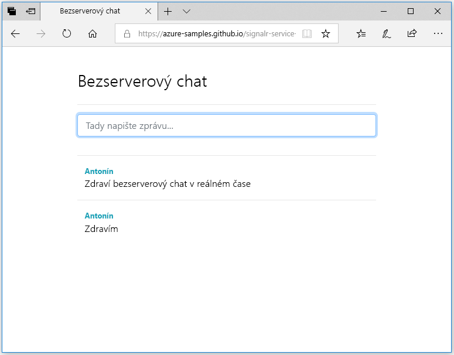

## Spuštění webové aplikace

1. Abychom vám to usnadnili, je v GitHubu hostovaná ukázková jednostránková webová aplikace. Otevřete prohlížeč na adrese [https://azure-samples.github.io/signalr-service-quickstart-serverless-chat/demo/chat/](https://azure-samples.github.io/signalr-service-quickstart-serverless-chat/demo/chat/).

    > [!NOTE]
    > Zdroj souboru HTML se nachází v umístění [/docs/demo/chat/index.html](https://github.com/Azure-Samples/signalr-service-quickstart-serverless-chat/blob/master/docs/demo/chat/index.html).

1. Když se zobrazí výzva k zadání základní adresy URL aplikace funkcí, zadejte *http://localhost:7071*.

1. Při zobrazení výzvy zadejte uživatelské jméno.

1. Webová aplikace volá funkci *GetSignalRInfo* v aplikaci funkcí, aby načetla informace o připojení ke službě Azure SignalR Service. Po dokončení připojení se zobrazí vstupní pole zprávy chatu.

1. Zadejte zprávu a stiskněte klávesu Enter. Aplikace odešle zprávu funkci *SendMessage* v aplikaci funkcí Azure, která pak pomocí výstupní vazby služby SignalR odešle zprávu všem připojeným klientům. Pokud všechno funguje správně, měla by se tato zpráva v aplikaci zobrazit.

    

1. Otevřete další instanci webové aplikace v jiném okně prohlížeče. Uvidíte, že všechny odeslané zprávy se zobrazují ve všech instancích aplikace.