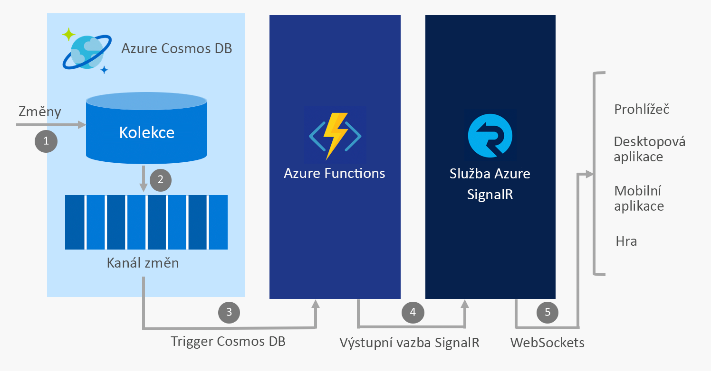

# Sestavení aplikací v reálném čase pomocí Azure Functions a služby Azure SignalR

Vzhledem k tomu, že služba Azure SignalR a Azure Functions jsou obě plně spravované a vysoce škálovatelné funkce, které vám umožňují soustředit se místo spravování infrastruktury na sestavování aplikací, je běžné obě tyto služby používat společně, abyste v bezserverovém prostředí získali komunikaci v reálném čase.

## Integrace komunikace v reálném čase do služeb Azure

Služba Azure Functions vám umožňuje psát kód v [několika jazycích](../azure-functions/supported-languages.md), mezi které patří JavaScript, C# a Java, která se aktivuje, kdykoli dojde v cloudu k události. Příklady těchto událostí:

* HTTP a webhookové požadavky
* Pravidelné časovače
* Události ze služeb Azure jako jsou:
    - Event Grid
    - Event Hubs
    - Service Bus
    - Kanál změn Cosmos DB
    - Azure Storage – objekty blob a fronty
    - Konektory Logic Apps jako například Salesforce a SQL Server

Použitím služby Azure Functions k integraci těchto událostí do služby Azure SignalR získáte možnost oznámit tisícům klientů, že došlo k události.

Mezi běžné scénáře bezserverového zasílání zpráv v reálném čase, které můžete implementovat s Azure Functions a službou SignalR, patří:

* Vizualizace telemetrie zařízení IoT na řídicím panelu nebo mapě v reálném čase
* Aktualizace dat v aplikaci po aktualizaci dokumentů v Cosmos DB
* Odeslání oznámení v aplikaci po vytvoření nových příkazů v Salesforce

## Vazby služby SignalR pro Azure Functions

Vazby služby SignalR pro Azure Functions umožňují aplikaci Azure Functions publikovat zprávy klientům připojeným ke službě SignalR. Klienti se k této službě mohou připojit pomocí klientské sady SDK pro SignalR, která je k dispozici v jazycích .NET, JavaScript a Java (další jazyky brzy přibudou).

### Ukázkový scénář

Příklad, jak vazby služby SignalR používají Azure Functions k integraci se službami Azure Cosmos DB a SignalR, aby se v reálném čase odesílaly zprávy, když se v kanálu změn Cosmos DB objeví nová událost.

1. V kolekci Cosmos DB dojde ke změně.
2. Událost změny se rozšíří do kanálu změn Cosmos DB.
3. Událost změny pomocí triggeru služby Cosmos DB aktivuje službu Azure Functions.
4. Výstupní vazba služby SignalR publikuje do služby SignalR zprávu.
5. Služba SignalR publikuje zprávu do všech připojených klientů.

### Ověřování a uživatelé

Služba SignalR vám umožňuje vysílat zprávy do všech klientů nebo jenom do podmnožiny klientů, jako například těch, které patří jedinému uživateli. Vazby služby SignalR pro Azure Functions je možné kombinovat s ověřováním služby App Service, aby ověřovala uživatele s poskytovateli, jako je Azure Active Directory, Facebook nebo Twitter. Těmto ověřeným uživatelům můžete zasílat zprávy přímo.

## Další kroky

V tomto článku jste získali přehled o použití Azure Functions se službou SignalR, abyste mohli povolit širokou škálu scénářů týkajících se bezserverového zasílání zpráv v reálném čase. Pokud chcete zjistit víc, postupujte podle jednoho z těchto rychlých startů.

* [Rychlý start do bezserverové služby Azure SignalR v jazyce C#](signalr-quickstart-azure-functions-csharp.md)
* [Rychlý start do bezserverové služby Azure SignalR v jazyce JavaScript](signalr-quickstart-azure-functions-javascript.md)

