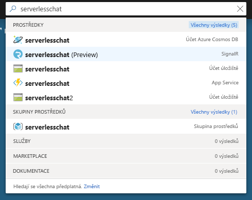
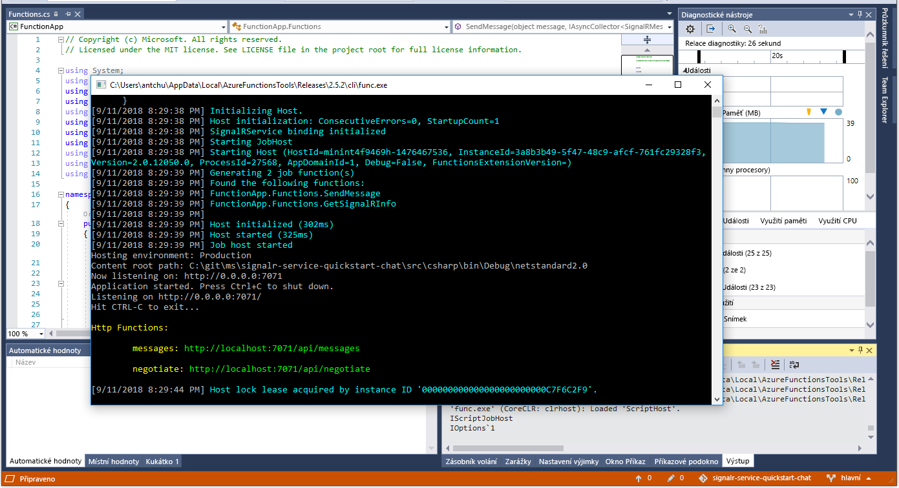

# Rychlý start: Vytvoření chatovací místnosti pomocí Azure Functions a služby SignalR v jazyce C#

Služba Azure SignalR umožňuje snadné přidávání funkcí do aplikací v reálném čase. Řešení Azure Functions představuje bezserverovou platformu, která umožňuje spouštět kód, aniž byste museli spravovat nějakou infrastrukturu. V tomto rychlém startu se dozvíte, jak pomocí služby SignalR a Functions sestavíte bezserverovou aplikaci pro chat v reálném čase.

## Požadavky

Pokud ještě nemáte nainstalovanou sadu Visual Studio 2017, můžete stáhnout a použít **bezplatnou verzi** [Visual Studio 2017 Community Edition](https://www.visualstudio.com/downloads/). Nezapomeňte při instalaci sady Visual Studio povolit možnost **Azure Development**.

[!INCLUDE [quickstarts-free-trial-note](../../includes/quickstarts-free-trial-note.md)]

## Přihlášení k Azure

Přihlaste se k webu Azure Portal na adrese <https://portal.azure.com/> pomocí svého účtu Azure.

[!INCLUDE [Create instance](includes/signalr-quickstart-create-instance.md)]

[!INCLUDE [Clone application](includes/signalr-quickstart-clone-application.md)]

## Konfigurace a spuštění aplikace Azure Functions

1. Spusťte Visual Studio a otevřete řešení ve složce *chat\src\csharp* naklonovaného úložiště.

1. V prohlížeči, ve kterém máte otevřený Azure Portal, si ověřte, že se úspěšně vytvořila instance služby SignalR, kterou jste nasadili dříve. Vyhledejte její název pomocí vyhledávacího pole v horní části stránky portálu. Instanci vyberte a otevřete.

    

1. Výběrem možnosti **Klíče** zobrazte připojovací řetězce instance služby SignalR.

1. Vyberte a zkopírujte primární připojovací řetězec.

1. Přejděte zpět do sady Visual Studio a v Průzkumníkovi řešení přejmenujte *local.settings.sample.json* na *local.settings.json*.

1. V souboru **local.settings.json** vložte připojovací řetězec do hodnoty nastavení **AzureSignalRConnectionString**. Uložte soubor.

1. Otevřete **Functions.cs**. Tato aplikace funkcí zahrnuje dvě funkce aktivované protokolem HTTP:

    - **GetSignalRInfo**: Používá vstupní vazbu *SignalRConnectionInfo* ke generování a vracení informací o platném připojení.
    - **SendMessage**: Přijímá zprávy chatu v textu žádosti a používá výstupní vazbu *SignalR* k vysílání zpráv všem připojeným klientským aplikacím.

1. V nabídce **Ladit** vyberte **Spustit ladění** a spusťte aplikaci.

    

[!INCLUDE [Run web application](includes/signalr-quickstart-run-web-application.md)]

[!INCLUDE [Cleanup](includes/signalr-quickstart-cleanup.md)]

## Další kroky

V tomto rychlém startu jste vytvořili a spustili bezserverovou aplikaci v reálném čase přes VS Code. Dále můžete získat více informací o postupu nasazení Azure Functions přes VS Code.

> [!div class="nextstepaction"]
> [Nasazení Azure Functions přes VS Code](https://code.visualstudio.com/tutorials/functions-extension/getting-started)