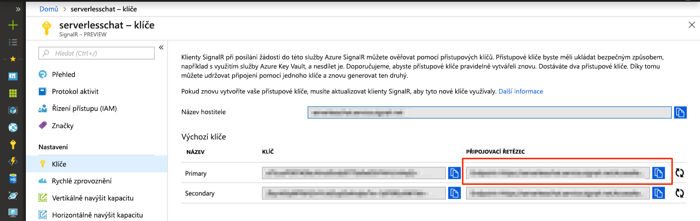

# <a name="quickstart-create-a-chat-room-with-azure-functions-and-signalr-service-using-javascript"></a>Rychlý start: Vytvoření chatovací místnosti s Azure Functions a služby SignalR pomocí jazyka JavaScript

Služba Azure SignalR umožňuje snadné přidávání funkcí do aplikací v reálném čase. Řešení Azure Functions představuje bezserverovou platformu, která umožňuje spouštět kód, aniž byste museli spravovat nějakou infrastrukturu. V tomto rychlém startu se dozvíte, jak pomocí služby SignalR a Functions sestavíte bezserverovou aplikaci pro chat v reálném čase.

## <a name="prerequisites"></a>Požadavky

Toto Rychlé zprovoznění je možné spustit v systémech macOS, Windows nebo Linux.

Budete potřebovat nainstalovaný editor kódu, jako je třeba [Visual Studio Code](https://code.visualstudio.com/).

Nainstalujte si [nástroje Azure Functions Core Tools verze 2](https://github.com/Azure/azure-functions-core-tools#installing), abyste mohli aplikace funkcí Azure spouštět místně.

K instalaci rozšíření vyžadují v současnosti nástroje Azure Functions Core Tools nainstalovanou sadu [.NET Core SDK](https://www.microsoft.com/net/download). K sestavování aplikací funkcí Azure v JavaScriptu však není potřeba žádná znalost architektury .NET.

[!INCLUDE [quickstarts-free-trial-note](../../includes/quickstarts-free-trial-note.md)]

## <a name="log-in-to-azure"></a>Přihlášení k Azure

Přihlaste se k webu Azure Portal na adrese <https://portal.azure.com/> pomocí svého účtu Azure.

[!INCLUDE [Create instance](includes/signalr-quickstart-create-instance.md)]

[!INCLUDE [Clone application](includes/signalr-quickstart-clone-application.md)]

## <a name="configure-and-run-the-azure-function-app"></a>Konfigurace a spuštění aplikace Azure Functions

1. V prohlížeči, ve kterém máte otevřený Azure Portal, si ověřte, že se úspěšně vytvořila instance služby SignalR Service, kterou jste nasadili dříve. Vyhledejte její název pomocí vyhledávacího pole v horní části stránky portálu. Instanci vyberte a otevřete.

    

1. Výběrem možnosti **Klíče** zobrazte připojovací řetězce instance služby SignalR.

1. Vyberte a zkopírujte primární připojovací řetězec.

    

1. V editoru kódu otevřete složku *chat/src/javascript* v klonovaném úložišti.

1. Přejmenujte soubor *local.settings.sample.json* na *local.settings.json*.

1. V souboru **local.settings.json** vložte připojovací řetězec do hodnoty nastavení **AzureSignalRConnectionString**. Uložte soubor.

1. Funkce JavaScriptu jsou uspořádané do složek. V každé složce jsou dva soubory. Soubor *function.json* definuje vazby, které se používají ve funkci, a soubor *index.js* je tělo funkce. Tato aplikace funkcí zahrnuje dvě funkce aktivované protokolem HTTP:

    - **negotiate** – používá vstupní vazbu *SignalRConnectionInfo* ke generování a vracení informací o platném připojení.
    - **messages** – přijímá zprávy chatu v textu požadavku a používá výstupní vazbu *SignalR* k vysílání zpráv všem připojeným klientským aplikacím.

1. V terminálu zkontrolujte, že jste ve složce *chat/src/javascript*. Pomocí nástrojů Azure Functions Core Tools nainstalujte rozšíření, která jsou potřebná ke spuštění aplikace.

    ```bash
    func extensions install
    ```

1. Aplikace funkcí spusťte.

    ```bash
    func start
    ```

    

[!INCLUDE [Run web application](includes/signalr-quickstart-run-web-application.md)]

[!INCLUDE [Cleanup](includes/signalr-quickstart-cleanup.md)]

## <a name="next-steps"></a>Další postup

V tomto Rychlém zprovoznění jste vytvořili a spustili bezserverovou aplikaci v reálném čase v sadě Visual Studio. Dále se dozvíte více o tom, jak vyvíjet a nasazovat Azure Functions pomocí sady Visual Studio.

> [!div class="nextstepaction"]
> [Vývoj Azure Functions pomocí sady Visual Studio](../azure-functions/functions-develop-vs.md)