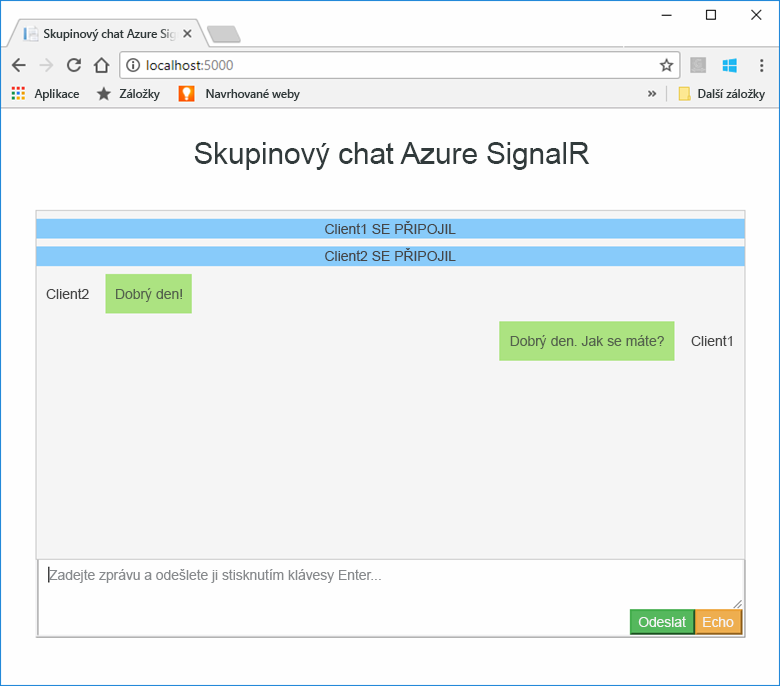
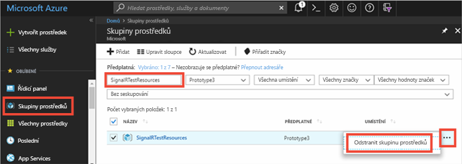

# <a name="quickstart-create-a-chat-room-with-signalr-service"></a>Rychlý start: Vytvoření chatovací místnosti s využitím služby SignalR

Služba Microsoft Azure SignalR je momentálně ve verzi [Public Preview](https://azure.microsoft.com/support/legal/preview-supplemental-terms/).

Azure SignalR je služba Azure, která vývojářům pomáhá snadno vytvářet webové aplikace s funkcemi v reálném čase. Tato služba je založená na knihovně [SignalR pro ASP.NET Core 2.0](https://docs.microsoft.com/aspnet/core/signalr/introduction).

V tomto článku se dozvíte, jak začít se službou Azure SignalR. V tomto rychlém startu vytvoříte chatovací aplikaci s využitím webové aplikace ASP.NET Core MVC. Tato aplikace naváže připojení k vašemu prostředku služby Azure SignalR a umožní tak aktualizace obsahu v reálném čase. Webovou aplikaci budete hostovat místně a propojíte ji s několika klienty v prohlížeči. Každý klient bude moct nabízet aktualizace obsahu do všech ostatních klientů. 


K dokončení kroků v tomto rychlém startu můžete použít jakýkoli editor kódu. Skvělou volbou je však editor [Visual Studio Code](https://code.visualstudio.com/), který je dostupný pro platformy Windows, macOS a Linux.

Kód pro tento kurz je k dispozici ke stažení v [úložišti GitHub AzureSignalR-samples](https://github.com/aspnet/AzureSignalR-samples/tree/master/samples/ChatRoom).  K vytvoření prostředků Azure použitých v tomto rychlém startu můžete použít také [Skript pro vytvoření služby SignalR](scripts/signalr-cli-create-service.md).



[!INCLUDE [quickstarts-free-trial-note](../../includes/quickstarts-free-trial-note.md)]


## <a name="prerequisites"></a>Požadavky

* Nainstalujte sadu [.NET Core SDK](https://www.microsoft.com/net/download/windows).
* Stáhněte nebo naklonujte úložiště GitHub [AzureSignalR-sample](https://github.com/aspnet/AzureSignalR-samples). 

## <a name="create-an-azure-signalr-resource"></a>Vytvořené prostředku služby Azure SignalR

[!INCLUDE [azure-signalr-create](../../includes/signalr-create.md)]

## <a name="create-an-aspnet-core-web-app"></a>Vytvoření webové aplikace ASP.NET Core

V této části pomocí [rozhraní příkazového řádku .NET Core](https://docs.microsoft.com/dotnet/core/tools/) vytvoříte nový projekt webové aplikace ASP.NET Core MVC. Výhodou použití rozhraní .NET Core CLI místo sady Visual Studio je jeho dostupnost na platformách Windows, Linux i macOS. 

1. Vytvořte novou složku pro váš projekt. V tomto rychlém startu se používá složka *E:\Testing\chattest*.

2. V nové složce spuštěním následujícího příkazu vytvořte nový projekt webové aplikace ASP.NET Core MVC:

        dotnet new mvc


## <a name="add-secret-manager-to-the-project"></a>Přidání nástroje Secret Manager do projektu

V této části do svého projektu přidáte [nástroj Secret Manager](https://docs.microsoft.com/aspnet/core/security/app-secrets). Nástroj Secret Manager ukládá citlivá data související s vývojem mimo strom vašeho projektu. Tento přístup pomáhá zabránit náhodnému sdílení tajných kódů aplikace ve zdrojovém kódu.

1. Otevřete soubor *.csproj*. Přidejte element `DotNetCliToolReference` zahrnující *Microsoft.Extensions.SecretManager.Tools*. Přidejte také element `UserSecretsId`, jak je znázorněno níže, a uložte soubor.

    *chattest.csproj:*

    ```xml
    <Project Sdk="Microsoft.NET.Sdk.Web">
    <PropertyGroup>
        <TargetFramework>netcoreapp2.0</TargetFramework>
        <UserSecretsId>SignalRChatRoomEx</UserSecretsId>
    </PropertyGroup>
    <ItemGroup>
        <PackageReference Include="Microsoft.AspNetCore.All" Version="2.0.0" />
    </ItemGroup>
    <ItemGroup>
        <DotNetCliToolReference Include="Microsoft.VisualStudio.Web.CodeGeneration.Tools" Version="2.0.0" />
        <DotNetCliToolReference Include="Microsoft.Extensions.SecretManager.Tools" Version="2.0.0" />
    </ItemGroup>
    </Project>    
    ```

## <a name="add-azure-signalr-to-the-web-app"></a>Přidání služby Azure SignalR do webové aplikace

1. Přidejte odkaz na balíček `Microsoft.Azure.SignalR` spuštěním následujícího příkazu:

        dotnet add package Microsoft.Azure.SignalR -v 1.0.0-*

2. Spuštěním následujícího příkazu obnovte balíčky pro váš projekt.

        dotnet restore

3. Do nástroje Secret Manager přidejte tajný kód *Azure:SignalR:ConnectionString*. 

    Tento tajný kód bude obsahovat připojovací řetězec pro přístup k vašemu prostředku služby SignalR. *Azure:SignalR:ConnectionString* je výchozí konfigurační klíč, který služba SignalR hledá za účelem navázání připojení. Nahraďte hodnotu v následujícím příkazu připojovacím řetězcem pro váš prostředek služby SignalR.

    Tento příkaz se musí spustit ve stejném adresáři jako soubor *.csproj*.

    ```
    dotnet user-secrets set Azure:SignalR:ConnectionString "Endpoint=<Your endpoint>;AccessKey=<Your access key>;"    
    ```

    Nástroj Secret Manager se použije pouze k testování webové aplikace, zatímco je hostovaná v místním prostředí. V některém dalším kurzu nasadíte webovou chatovací aplikaci do Azure. Po nasazení webové aplikace do Azure použijete místo nástroje Secret Manager k uložení připojovacího řetězce nastavení aplikace.

    K tomuto tajnému klíči se přistupuje pomocí konfiguračního rozhraní API. Dvojtečka (:) v názvu konfigurace funguje s konfiguračním rozhraním API na všech podporovaných platformách, viz [Konfigurace podle prostředí](https://docs.microsoft.com/aspnet/core/fundamentals/configuration/index?tabs=basicconfiguration&view=aspnetcore-2.0#configuration-by-environment). 


4. Otevřete soubor *Startup.cs* a aktualizujte metodu `ConfigureServices` tak, aby používala službu Azure SignalR, a to zavoláním metody `services.AddSignalR().AddAzureSignalR()`:

    ```csharp
    public void ConfigureServices(IServiceCollection services)
    {
        services.AddMvc();
        services.AddSignalR().AddAzureSignalR();
    }
    ```

    Vzhledem k tomu, že do metody `AddAzureSignalR()` nepředáváte žádný parametr, použije tento kód jako připojovací řetězec prostředku služby SignalR výchozí konfigurační klíč *Azure:SignalR:ConnectionString*.

5. V souboru *Startup.cs* aktualizujte také metodu `Configure` nahrazením volání metody `app.UseStaticFiles()` následujícím kódem a uložte soubor.

    ```csharp
    app.UseFileServer();
    app.UseAzureSignalR(routes =>
    {
        routes.MapHub<Chat>("/chat");
    });
    ```            

### <a name="add-a-hub-class"></a>Přidání třídy centra

Ve službě SignalR představuje centrum základní komponentu, která zveřejňuje sadu metod, které je možné volat z klienta. V této části nadefinujete třídu centra se dvěma metodami: 

* `Broadcast`: Tato metoda rozešle zprávu do všech klientů.
* `Echo`: Tato metoda odešle zprávu zpět volajícímu.

Obě metody používají rozhraní `Clients`, které poskytuje sada SDK služby SignalR pro ASP.NET Core. Toto rozhraní poskytuje přístup ke všem připojeným klientům a umožňuje nabízení obsahu do vašich klientů.

1. Do adresáře vašeho projektu přidejte novou složku *Hub*. Do nové složky přidejte nový soubor s kódem centra *Chat.cs*.

2. Do souboru *Chat.cs* přidejte následující kód, který definuje třídu centra, a uložte soubor. 

    Pokud jste použili jiný název projektu než *chattest*, aktualizujte obor názvů pro tuto třídu.

    ```csharp
    using Microsoft.AspNetCore.SignalR;

    namespace chattest
    {

        public class Chat : Hub
        {
            public void BroadcastMessage(string name, string message)
            {
                Clients.All.SendAsync("broadcastMessage", name, message);
            }

            public void Echo(string name, string message)
            {
                Clients.Client(Context.ConnectionId).SendAsync("echo", name, message + " (echo from server)");
            }
        }
    }
    ```

### <a name="add-the-web-app-client-interface"></a>Přidání klientského rozhraní webové aplikace

Uživatelské rozhraní pro klienty této aplikace chatovací místnosti se bude skládat z kódu HTML a JavaScriptu v souboru *index.html* v adresáři *wwwroot*.

Zkopírujte soubor *index.html* a složky *css* a *scripts* ze složky *wwwroot* v [úložišti ukázek](https://github.com/aspnet/AzureSignalR-samples/tree/master/samples/ChatRoom/wwwroot) do složky *wwwroot* vašeho projektu.

Hlavní kód souboru *index.html*: 

```javascript
var connection = new signalR.HubConnectionBuilder()
                            .withUrl('/chat')
                            .build();
bindConnectionMessage(connection);
connection.start()
    .then(function () {
        onConnected(connection);
    })
    .catch(function (error) {
        console.error(error.message);
    });
```    

Kód v souboru *index.html* zavoláním metody `HubConnectionBuilder.build()` vytvoří připojení HTTP k prostředku služby Azure SignalR.

Pokud je připojení úspěšné, předá se do metody `bindConnectionMessage`, která přidá obslužné rutiny událostí pro příchozí nabídky obsahu do klienta. 

`HubConnection.start()` naváže komunikaci s centrem. Po navázání komunikace `onConnected()` přidá obslužné rutiny událostí tlačítek. Tyto obslužné rutiny prostřednictvím připojení umožní tomuto klientovi nabízet aktualizace obsahu do všech připojených klientů.

## <a name="add-a-development-runtime-profile"></a>Přidání profilu vývojového modulu runtime

V této části přidáte vývojové běhové prostředí pro ASP.NET Core. Další informace o běhovém prostředí pro ASP.NET Core najdete v tématu [Práce s několika prostředími v ASP.NET Core](https://docs.microsoft.com/aspnet/core/fundamentals/environments).

1. Vytvořte v projektu novou složku *Properties*.

2. Přidejte do složky nový soubor *launchSettings.json* s následujícím obsahem a uložte ho.

    ```json
    {
        "profiles" : 
        {
            "ChatRoom": 
            {
                "commandName": "Project",
                "launchBrowser": true,
                "environmentVariables": 
                {
                    "ASPNETCORE_ENVIRONMENT": "Development"
                },
                "applicationUrl": "http://localhost:5000/"
            }
        }
    }
    ```


## <a name="build-and-run-the-app-locally"></a>Sestavení a místní spuštění aplikace

1. Pokud chcete aplikaci sestavit pomocí .NET Core CLI, spusťte v příkazovém prostředí následující příkaz:

        dotnet build

2. Po úspěšném dokončení sestavení spuštěním následujícího příkazu místně spusťte webovou aplikaci:

        dotnet run

    Aplikace bude hostovaná místně na portu 5000, jak je nakonfigurováno ve vašem profilu vývojového modulu runtime:

        E:\Testing\chattest>dotnet run
        Hosting environment: Development
        Content root path: E:\Testing\chattest
        Now listening on: http://localhost:5000
        Application started. Press Ctrl+C to shut down.    

3. Otevřete dvě okna prohlížeče a v obou přejděte na adresu `http://localhost:5000`. Zobrazí se výzva k zadání vašeho jména. Zadejte jména obou klientů a otestujte nabízení obsahu zpráv mezi oběma klienty pomocí tlačítka **Send** (Odeslat).

    


## <a name="clean-up-resources"></a>Vyčištění prostředků

Pokud budete pokračovat k dalšímu kurzu, můžete prostředky vytvořené v tomto rychlém startu zachovat pro pozdější použití.

V opačném případě, pokud jste už s ukázkovou aplikací v tomto rychlém startu skončili, můžete prostředky Azure vytvořené v tomto rychlém startu odstranit, abyste se vyhnuli poplatkům. 

> [!IMPORTANT]
> Odstranění skupiny prostředků je nevratné a skupina prostředků včetně všech v ní obsažených prostředků bude trvale odstraněna. Ujistěte se, že nechtěně neodstraníte nesprávnou skupinu prostředků nebo prostředky. Pokud jste vytvořili prostředky pro hostování této ukázky ve stávající skupině prostředků obsahující prostředky, které chcete zachovat, můžete místo odstranění skupiny prostředků odstranit jednotlivé prostředky z jejich odpovídajících oken.
> 
> 

Přihlaste se na web [Azure Portal ](https://portal.azure.com) a klikněte na **Skupiny prostředků**.

Do textového pole **Filtrovat podle názvu** zadejte název vaší skupiny prostředků. V pokynech v tomto rychlém startu se používala skupina prostředků *SignalRTestResources*. Ve výsledcích hledání klikněte na **...** u vaší skupiny prostředků a pak na **Odstranit skupinu prostředků**.

   



Zobrazí se výzva k potvrzení odstranění skupiny prostředků. Potvrďte odstranění zadáním názvu vaší skupiny prostředků a klikněte na **Odstranit**.
   
Po chvíli bude skupina prostředků včetně všech obsažených prostředků odstraněná.


## <a name="next-steps"></a>Další kroky

V tomto rychlém startu jste vytvořili nový prostředek služby Azure SignalR a společně s webovou aplikací ASP.NET Core jste ho použili k nabízení aktualizací obsahu v reálném čase do několika připojených klientů. Další informace o použití služby Azure SignalR najdete v následujícím kurzu, který demonstruje ověřování.

> [!div class="nextstepaction"]
> [Ověřování pomocí služby Azure SignalR](./signalr-authenticate-oauth.md)


