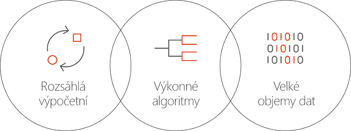

# Co je Batch AI v Azure?
Batch AI je spravovaná služba, která umožňuje odborníkům přes data a výzkumným pracovníkům v oblasti AI trénovat modely AI a další modely strojového učení na clusterech virtuálních počítačů Azure, včetně virtuálních počítačů s podporou GPU. Popíšete požadavky svojí úlohy, umístění vstupů a výstupů a o zbytek se postará služba Batch AI.  
 
## Proč Batch AI? 
Vývoj výkonných algoritmů AI je iterativní proces náročný na výpočetní výkon. Odborníci přes data a výzkumní pracovníci v oblasti AI pracují s čím dál většími datovými sadami. Vyvíjejí modely s více vrstvami a provádějí to s větším množstvím experimentování s návrhem sítě s ohledem na hyperparametrické ladění. Aby byl tento přístup efektivní, vyžaduje se několik CPU nebo GPU na model, paralelní spouštění experimentů a sdílené úložiště pro trénovací data, protokoly a výstupy modelů.   
 

Odborníci přes data a výzkumní pracovníci v oblasti AI jsou odborníky ve svém oboru, přesto jim však může stát v cestě správa infrastruktury ve velkém měřítku. Vývoj AI ve velkém měřítku vyžaduje řadu úloh na úrovni infrastruktury: zřizování clusterů virtuálních počítačů, instalace softwaru a kontejnerů, řazení práce do fronty, určování priority a plánování úloh, zpracování selhání, distribuce dat, sdílení výsledků, škálování prostředků za účelem správy nákladů a integrace s nástroji a pracovními postupy. O tyto úlohy se stará služba Batch AI. 
 
## Co je Batch AI? 

Batch AI poskytuje správu prostředků a plánování úloh specializované na trénování a testování AI. Mezi klíčové funkce patří: 

* Spouštění dlouhotrvajících dávkových úloh, iterativní experimentování a interaktivní trénování 
* Automatické nebo ruční škálování clusterů virtuálních počítačů využívajících GPU nebo CPU 
* Konfigurace komunikace protokolu SSH mezi virtuálními počítači a pro zajištění vzdáleného přístupu 
* Podpora jakéhokoli rozhraní hloubkového nebo strojového učení s optimalizovanou konfigurací pro oblíbené sady nástrojů, jako jsou [Microsoft Cognitive Toolkit](https://github.com/Microsoft/CNTK) (CNTK), [TensorFlow](https://www.tensorflow.org/) a [Chainer](https://chainer.org/) 
* Fronta úloh na základě priority umožňující sdílení clusterů a využití virtuálních počítačů s nízkou prioritou a rezervací Azure  
* Flexibilní možnosti úložiště, včetně služby Soubory Azure a spravovaného serveru systému souborů NFS 
* Připojování vzdálených sdílených složek k virtuálnímu počítači a volitelné kontejnery 
* Poskytování stavu úlohy a restartování v případě selhání virtuálních počítačů 
* Přístup k protokolům výstupu, výstupům stdout a stderr a modelům, včetně jejich streamování ze služby Azure Storage 
* [Rozhraní příkazového řádku](/cli/azure) (CLI) Azure, sady SDK pro [Python](https://github.com/Azure/azure-sdk-for-python), jazyk [C#](https://www.nuget.org/packages/Microsoft.Azure.Management.BatchAI/1.0.0-preview) a Javu, monitorování na webu Azure Portal a integrace s nástroji Microsoft AI 

Sada SDK služby Batch AI podporuje psaní skriptů nebo aplikací pro správu trénovacích kanálů a integraci s nástroji. Sada SDK v současné době poskytuje podporu Pythonu, jazyka C#, Javy a rozhraní REST API.  
 

Batch AI pro operace roviny řízení (vytváření, výpis, získávání, odstraňování) využívá Azure Resource Manager. K ověřování a řízení přístupu na základě role se používá Azure Active Directory.  
 
## Používání služby Batch AI 

Při používání služby Batch AI definujete a spravujete *clustery* a *úlohy*. 

 
**Clustery** popisují vaše požadavky na výpočetní výkon: 
* Oblast Azure, ve které chcete cluster spustit 
* Řada a velikost virtuálního počítače, který se má použít – například virtuální počítač NC24, který obsahuje 4 GPU NVIDIA K80 
* Počet virtuálních počítačů nebo jejich minimální a maximální počet pro účely automatického škálování 
* Image virtuálního počítače – například Ubuntu 16.04 LTS nebo [virtuální počítač Microsoftu pro hloubkové učení](https://azuremarketplace.microsoft.com/marketplace/apps/microsoft-ads.dsvm-deep-learning)
* Případné vzdálené svazky sdílených složek, které se mají připojit – například ze služby Soubory Azure nebo serveru systému souborů NFS spravovaného službou Batch AI 
* Uživatelské jméno a klíč SSH nebo heslo, které se mají na virtuálních počítačích nakonfigurovat pro umožnění interaktivního přihlášení za účelem ladění  
 

**Úlohy** popisují: 
* Cluster a oblast, které se mají použít 
* Počet virtuálních počítačů pro úlohu 
* Vstupní a výstupní adresáře, které se předají do úlohy při spuštění. K tomu se obvykle používá sdílený systém souborů připojený při nastavování clusteru 
* Volitelný kontejner pro spuštění vašeho softwaru nebo instalačního skriptu 
* Konfigurace specifická pro rozhraní AI nebo příkazový řádek s parametry pro spuštění úlohy 
 

Začněte používat službu Batch AI pomocí [Azure CLI](/cli/azure) a konfiguračních souborů pro clustery a úlohy. Pomocí tohoto přístupu můžete podle potřeby rychle vytvořit cluster, spouštět úlohy a experimentovat s návrhem sítě nebo hyperparametry.  
 

Batch AI usnadňuje paralelní práci s několika GPU. Pokud se úlohy potřebují škálovat na více GPU, služba Batch AI mezi příslušnými virtuálními počítači nastaví zabezpečené síťové připojení. Pokud použijete InfiniBand, služba Batch AI nakonfiguruje ovladače a spustí MPI napříč uzly úlohy.  

## Správa dat
Batch AI poskytuje flexibilní možnosti pro trénovací skripty, data a výstupy:
  
* **Místní disk** můžete použít pro počáteční experimentování a menší datové sady. V tomto scénáři se můžete chtít připojit k virtuálnímu počítači přes SSH za účelem úprav skriptů a čtení protokolů. 

* **Soubory Azure** můžete použít ke sdílení trénovacích dat mezi několika úlohami a k ukládání protokolů výstupů a modelů v jednom umístění. 

* Můžete nastavit **server systému souborů NFS** pro zajištění podpory většího množství dat a virtuálních počítačů pro účely trénování. Batch AI může server systému souborů NFS nastavit za vás jako speciální typ clusteru s disky zálohovanými ve službě Azure Storage. 
 
* **Paralelní systém souborů** zajišťuje další škálovatelnost dat a paralelní trénování. Přestože služba Batch AI nespravuje paralelní systémy souborů, jsou k dispozici šablony nasazení pro Lustre, Gluster a BeeGFS.  

## Další kroky

* Začněte vytvářet svou první trénovací úlohu Batch AI pomocí [Azure CLI](quickstart-cli.md) nebo [Pythonu](quickstart-python.md).
* Prohlédněte si různá rozhraní v ukázkových [návodech k trénování](https://github.com/Azure/BatchAI).

