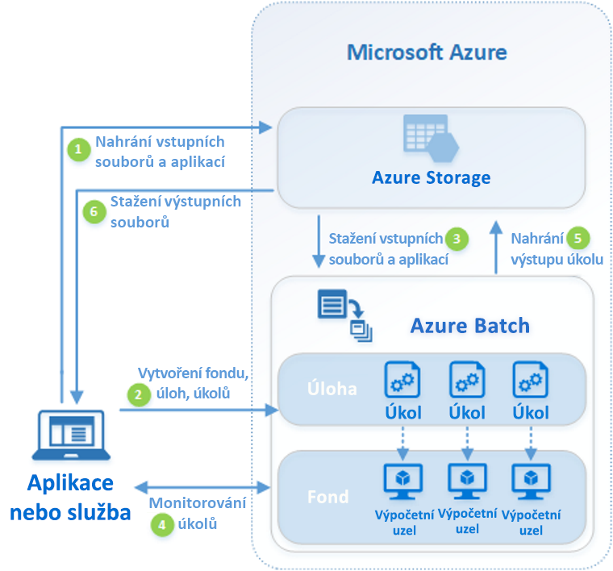

# Co je Azure Batch?

Azure Batch umožňuje efektivně spouštět v Azure rozsáhlé paralelní dávkové úlohy a úlohy vysokovýkonného výpočetního prostředí (HPC). Azure Batch vytvoří a spravuje fond výpočetních uzlů (virtuálních počítačů), nainstaluje aplikace, které chcete spouštět, a naplánuje spouštění úloh v uzlech. Není k dispozici žádný cluster ani software plánovače úloh pro instalaci, správu nebo škálování. Místo toho ke konfiguraci, správě a monitorování úloh použijete [rozhraní API a nástroje služby Batch](batch-apis-tools.md), skripty příkazového řádku nebo web Azure Portal.

Vývojáři můžou službu Batch používat jako službu platformy k sestavování aplikací SaaS nebo klientských aplikací, které vyžadují provádění ve velkém měřítku. Můžete například vytvořit službu s dávkou pro spuštění simulace rizik Monte Carlo pro společnost finanční služby nebo služby pro zpracování mnoha imagí.

Za používání služby Batch se neúčtují žádné další poplatky. Platíte jenom za spotřebované základní prostředky, jako jsou virtuální počítače, úložiště a sítě.

Porovnání mezi službou Batch a dalšími možnostmi řešení HPC v Azure najdete v tématu [vysoce výkonné výpočty (HPC) v Azure](/azure/architecture/topics/high-performance-computing/).

## Spouštění paralelních úloh

Služba Batch pracuje s vnitřně paralelními aplikacemi úlohami (také známé jako „jednoduše paralelně zpracovatelné“). Vnitřně Paralelní úlohy mají aplikace, které můžou běžet nezávisle, přičemž každá instance dokončuje část práce. Když aplikace běží, můžou získat přístup k některým běžným datům, ale nekomunikují s ostatními instancemi aplikace. Vnitřně paralelní úlohy proto můžou běžet ve velkém měřítku, které závisí na množství výpočetních prostředků dostupných pro souběžné spouštění aplikací.

Některé příklady vnitřně paralelních úloh, které můžete použít ve službě Batch:

- Modelování finančních rizik pomocí simulací Monte Carlo
- Vykreslování vizuálních efektů a 3D obrázků
- Analýza a zpracování obrázků
- Překódování médií
- Genetická sekvenční analýza
- Optické rozpoznávání znaků (OCR)
- Příjem dat, zpracování a operace extrakce, transformace a načítání (ETL)
- Provádění testů softwaru

Službu Batch můžete také využít ke [spouštění úzce vázaných úloh](batch-mpi.md), kde aplikace, které spouštíte, potřebují vzájemně komunikovat, nikoli nezávisle na provozu. Vysoce provázané aplikace běžně používají rozhraní API MPI (Message Passing Interface). Ve službě Batch můžete spouštět vysoce provázané úlohy s využitím rozhraní [Microsoft MPI](/message-passing-interface/microsoft-mpi) nebo Intel MPI. Velikosti virtuálních počítačů specializované pro [vysokovýkonné výpočetní prostředí (HPC)](../virtual-machines/sizes-hpc.md) a [GPU](../virtual-machines/sizes-gpu.md) umožňují zvýšit výkon aplikací.

Některé příklady vysoce propojených úloh:

- Analýza konečných prvků
- Dynamika tekutin
- Trénování AI ve více uzlech

Řada vysoce propojených úloh může při použití služby Batch běžet paralelně. Můžete třeba provést několik simulací kapaliny proudící potrubím při různých šířkách potrubí.

## Další možnosti služby Batch

Služba Azure Batch nabízí také funkce vyšší úrovně pro specifické úlohy:

- Batch podporuje [úlohy vykreslování](batch-rendering-service.md) ve větším měřítku v nástrojích, jako jsou Autodesk Maya, 3ds Max, Arnold a V-Ray. 
- Uživatelé jazyka R si můžou nainstalovat [balíček doAzureParallel jazyka R](https://github.com/Azure/doAzureParallel), který umožňuje snadné horizontální navýšení kapacity provádění algoritmů jazyka R ve fondech Batch.

Úlohy služby Batch můžete také spouštět v rámci rozsáhlejšího pracovního postupu transformace dat v Azure spravovaného nástroji, jako je [Azure Data Factory](../data-factory/transform-data-using-dotnet-custom-activity.md).

## Jak to funguje

Běžný scénář využití služby Batch zahrnuje horizontální navýšení kapacity vnitřně paralelních úloh, jako je vykreslování obrázků ve 3D scénách, ve fondu výpočetních uzlů. Tento fond může být vaší "farmou vykreslování", která poskytuje desítky, stovky nebo dokonce tisíce jader pro vaši úlohu vykreslování.

Následující diagram znázorňuje kroky v běžném pracovním postupu služby Batch s klientskou aplikací nebo hostovanou službou, která službu Batch používá ke spouštění paralelních úloh.

|Krok  |Description  |
|---------|---------|
|1. nahrání **vstupních souborů** a **aplikací** pro zpracování těchto souborů na účet Azure Storage.     |Vstupní soubory mohou být jakákoli data, která vaše aplikace zpracuje, třeba data finančního modelování nebo videosoubory k převodu. Soubory aplikací můžou zahrnovat skripty nebo aplikace zpracovávající data, třeba převaděč médií.|
|2. na účtu Batch vytvořte **fond** výpočetních uzlů služby Batch, **úlohu** pro spuštění úlohy ve fondu a **úkoly** v úloze.     | [Výpočetní uzly](nodes-and-pools.md) jsou virtuální počítače, které spouštějí vaše [úkoly](jobs-and-tasks.md). Zadejte vlastnosti fondu, jako je počet a velikost uzlů, image virtuálního počítače s Windows nebo Linux, a aplikaci, která se má nainstalovat, když se uzly připojí k fondu. Spravujte náklady a velikost fondu pomocí [virtuálních počítačů s nízkou prioritou](batch-low-pri-vms.md) nebo pomocí [automatického škálování](batch-automatic-scaling.md) počtu uzlů při změně zatížení.   Když do úlohy přidáte úkoly, služba Batch automaticky naplánuje úkoly k provedení ve výpočetních uzlech ve fondu. Každý úkol používá aplikaci, kterou jste nahráli, ke zpracování vstupních souborů. |
|3. stažení **vstupních souborů** a **aplikací** do dávky     |Před spuštěním každého úkolu může aplikace Stáhnout vstupní data, která zpracuje, do přiřazeného uzlu. Pokud ještě není aplikace v daných uzlech fondu nainstalovaná, může se stáhnout v této fázi. Po dokončení stahování ze služby Azure Storage se v přiřazeném uzlu spustí příslušný úkol.|
|4. monitorování **provádění úlohy**     |Když se úkoly spouštějí, můžete ve službě Batch zadat dotaz na monitorování postupu úloh a jejich úkolů. Vaše klientská aplikace nebo služba komunikuje se službou Batch přes HTTPS. Vzhledem k tomu, že můžete monitorovat tisíce úloh spuštěných v tisících výpočetních uzlů, ujistěte se, že [se služby Batch dotazujete efektivně](batch-efficient-list-queries.md).|
|5. odeslání **výstupu úlohy**     |Úkoly mohou po dokončení nahrát data svých výsledků do služby Azure Storage. Soubory můžete také načíst přímo ze systému souborů na výpočetním uzlu.|
|6. stažení **výstupních souborů**     |Když funkce monitorování zjistí, že jsou úkoly ve vaší úloze dokončené, klientská aplikace nebo služba může stáhnout výstupní data k dalšímu zpracování.|

Mějte na paměti, že výše popsaný pracovní postup je pouze jedním ze způsobů, jak používat dávku a existuje mnoho dalších funkcí a možností. Například můžete v každém výpočetním uzlu [paralelně provádět několik úkolů](batch-parallel-node-tasks.md). Nebo můžete použít [úkoly přípravy a dokončení úlohy](batch-job-prep-release.md) k přípravě uzlů pro vaše úlohy a pak je vyčistit později.

Přehled funkcí, jako jsou fondy, uzly, úlohy a úkoly, najdete v tématu [pracovní postupy a prostředky služby Batch](batch-service-workflow-features.md) . Prohlédněte si také nejnovější [aktualizace služby Batch](https://azure.microsoft.com/updates/?product=batch).

## Další kroky

Začněte pracovat se službou Azure Batch pomocí jedné z těchto šablon Rychlý start:
- [Spuštění první úlohy služby Batch s využitím Azure CLI](quick-create-cli.md)
- [Spuštění první úlohy služby Batch pomocí webu Azure Portal](quick-create-portal.md)
- [Spuštění první úlohy služby Batch pomocí rozhraní API .NET](quick-run-dotnet.md)
- [Spuštění první úlohy služby Batch pomocí rozhraní API Python](quick-run-python.md)
