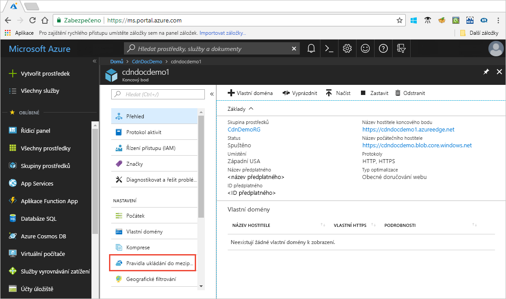

# Ovládací prvek Azure CDN s ukládáním do mezipaměti pravidla chování ukládání do mezipaměti

> [!NOTE] 
> Pravidla ukládání do mezipaměti jsou k dispozici pouze pro **Azure CDN Standard od Verizonu** a **Azure CDN Standard od Akamai** profily. Pro **Azure CDN Premium od Verizonu** profily, je nutné použít [stroj pravidel Azure CDN](cdn-rules-engine.md) v **spravovat** portálu pro podobné funkce.
 
Azure Content Delivery Network (CDN) nabízí dva způsoby, jak řídit, jak jsou vaše soubory uložené v mezipaměti: 

- Pravidla ukládání do mezipaměti: Tento článek popisuje, jak můžete síť pro doručování obsahu (CDN) pravidla ukládání do mezipaměti můžete nastavit nebo změnit výchozí chování vypršení platnosti mezipaměti globálně i pomocí vlastních podmínek, jako je například adresa URL a cesta k souboru rozšíření. Azure CDN nabízí dva typy pravidel ukládání do mezipaměti:

   - Globální pravidla ukládání do mezipaměti: Pro každý koncový bod ve vašem profilu můžete nastavit jedno globální pravidlo pro ukládání do mezipaměti, které se bude vztahovat na všechny požadavky na koncový bod. Pokud jsou HTTP hlavičky direktiv pro mezipaměť nastavené, globální pravidlo ukládání do mezipaměti je přepíše.

   - Vlastní pravidla ukládání do mezipaměti: pro každý koncový bod ve svém profilu můžete nastavit jedno nebo více vlastních pravidel ukládání do mezipaměti. Vlastní pravidla ukládání do mezipaměti se shodují s cestami a příponami souborů, zpracovávají se v daném pořadí, a pokud je nastavené globální pravidlo ukládání do mezipaměti, přepíší ho. 

- Ukládání řetězce dotazu do mezipaměti: můžete upravit způsob, jakým Azure CDN zpracovává ukládání do mezipaměti u žádostí s řetězci dotazu. Informace najdete v tématu [řízení Azure CDN pomocí řetězců dotazu chování ukládání do mezipaměti](cdn-query-string.md). Pokud soubor není možné ukládat do mezipaměti, řetězec dotazu do mezipaměti nastavení nemá žádný účinek, založené na ukládání do mezipaměti pravidla a CDN výchozí chování.

Informace o výchozí chování ukládání do mezipaměti a ukládání do mezipaměti hlavičky direktiv najdete v tématu [funguje jak ukládání do mezipaměti](cdn-how-caching-works.md). 

## Přístup k pravidla ukládání do mezipaměti Azure CDN

1. Otevřete na webu Azure portal, vyberte profil CDN a pak vyberte koncový bod.

2. V levém podokně v části Nastavení vyberte **Pravidla ukládání do mezipaměti**.

   

   Zobrazí se stránka **Pravidla ukládání do mezipaměti**.

   

## Nastavení chování ukládání do mezipaměti
Pro globální a vlastní pravidla ukládání do mezipaměti, můžete zadat následující **chování ukládání do mezipaměti** nastavení:

- **Obejít mezipaměť**: nemají ukládat do mezipaměti a ignorovat Zadaný původ hlaviček direktiv pro mezipaměť.

- **Přepsat**: Ignorovat Zadaný původ hlaviček direktiv pro mezipaměť; místo toho použijte doba zadaná mezipaměti.

- **Nastavit, pokud chybí**: dodržet Zadaný původ hlaviček direktiv pro mezipaměť, pokud existují; jinak použijte doba zadaná mezipaměti.

## Doba vypršení platnosti mezipaměti
Pro globální a vlastní pravidla ukládání do mezipaměti můžete zadat dobu vypršení platnosti mezipaměti v dny, hodiny, minuty a sekundy:

- Pro **přepsat** a **nastavit, pokud chybí** **chování ukládání do mezipaměti** nastavení, platný mezipaměti dob trvání rozsahu 0 sekund až 366 dní. Pro hodnotu 0 sekund CDN ukládá do mezipaměti obsah, ale musí znovu ověřit každý požadavek je zdrojový server.

- Pro **Nepoužívat mezipaměť** nastavení, doba uložení do mezipaměti se automaticky nastaví na 0 sekund a nedá se změnit.

## Vlastní ukládání do mezipaměti pravidla podmínky shody

Pro vlastní mezipaměti pravidla jsou k dispozici dvě shody podmínky:
 
- **Cesta**: k tomuto stavu odpovídá cestě adresy URL, s výjimkou názvu domény a podporuje zástupným znakem (\*). Například _/myfile.html_, _/Moje/slozka / *_, a _/my/images/*.jpg_. Maximální délka je 260 znaků.

- **Rozšíření**: k tomuto stavu odpovídá přípona souboru požadovaného souboru. Můžete zadat seznam přípon souborů oddělený čárkami tak, aby odpovídaly. Například _.jpg_, _.mp3_, nebo _.png_. Maximální počet rozšíření je 50 a maximální počet znaků na rozšíření je 16. 

## Pořadí zpracování globálních a vlastních pravidel
Globální a vlastní pravidla ukládání do mezipaměti se zpracovávají v následujícím pořadí:

- Globální pravidla ukládání do mezipaměti mají přednost před chování ukládání do mezipaměti CDN výchozí (nastavení hlaviček direktiv pro mezipaměť HTTP). 

- Vlastní pravidla ukládání do mezipaměti přednost před globální pravidla ukládání do mezipaměti, pokud používají. Vlastní pravidla ukládání do mezipaměti se zpracovávají v pořadí od shora dolů. To znamená pokud požadavek odpovídá obě podmínky, pravidla v dolní části seznamu přednost před pravidly v horní části seznamu. Proto byste měli umístit konkrétnější pravidla nižší v seznamu.

**Příklad**:
- Globální pravidla ukládání do mezipaměti: 
   - Chování ukládání do mezipaměti: **přepsání**
   - Doba vypršení platnosti mezipaměti: 1 den

- Vlastní ukládání do mezipaměti pravidlo #1:
   - Odpovídají podmínce: **cesta**
   - Odpovídající hodnotě:   _/home / *_
   - Chování ukládání do mezipaměti: **přepsání**
   - Doba vypršení platnosti mezipaměti: 2 dny

- Vlastní ukládání do mezipaměti pravidlo #2:
   - Odpovídají podmínce: **rozšíření**
   - Odpovídající hodnotě: _HTML_
   - Chování ukládání do mezipaměti: **nastavit, pokud chybí**
   - Doba vypršení platnosti mezipaměti: 3 dny.

Pokud jsou nastavena, žádost o  _&lt;název hostitele koncového bodu&gt;_.azureedge.net/home/index.html triggery vlastní ukládání do mezipaměti pravidlo 2 #, která je nastavena na: **nastavit, pokud chybí** a 3 dnů. Proto pokud *index.html* soubor má `Cache-Control` nebo `Expires` hlavičky protokolu HTTP jsou respektovat; jinak, pokud nejsou nastavené tyto hlavičky, soubor je uložená v mezipaměti pro 3 dny.

> [!NOTE] 
> Soubory, které jsou uložené v mezipaměti před změnou pravidlo spravovat jejich nastavení doby trvání mezipaměti původu. Pokud chcete resetovat jejich dob trvání mezipaměti, je nutné [vyprázdnění souboru](cdn-purge-endpoint.md). 
>
> Změny konfigurace Azure CDN může trvat nějakou dobu šířit přes síť: 
> - V případě profilů **Azure CDN Standard od Akamai** je šíření obvykle hotové během jedné minuty. 
> - Pro **Azure CDN Standard od Verizonu** profily, šíření obvykle hotové během 10 minut.  
>

## Další informace najdete v tématech

- [Jak funguje ukládání do mezipaměti](cdn-how-caching-works.md)
- [Kurz: Nastavení pravidel ukládání do mezipaměti Azure CDN](cdn-caching-rules-tutorial.md)
