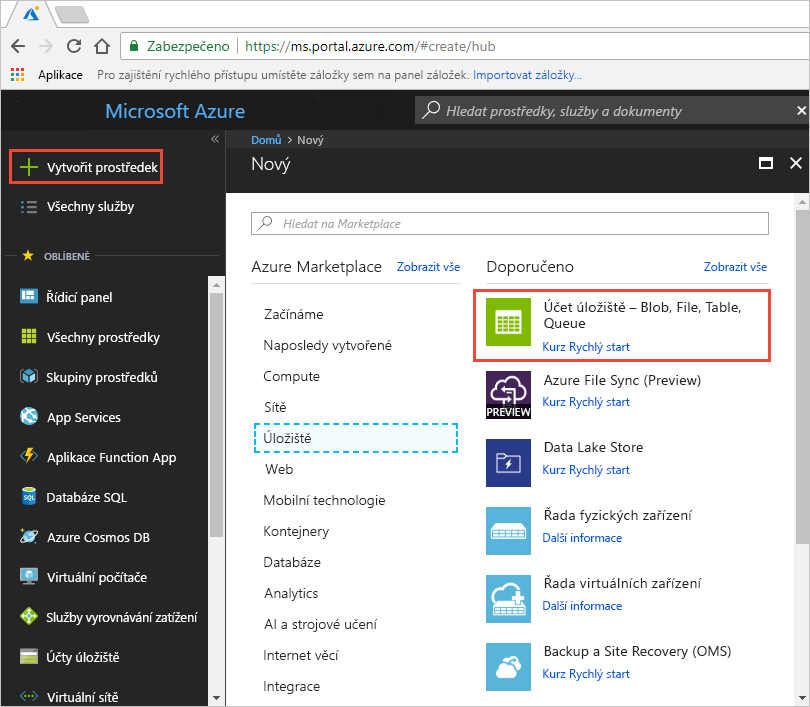
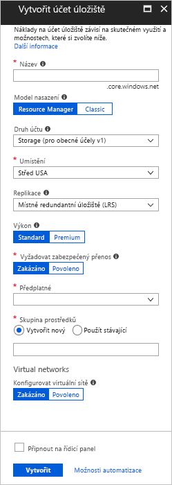
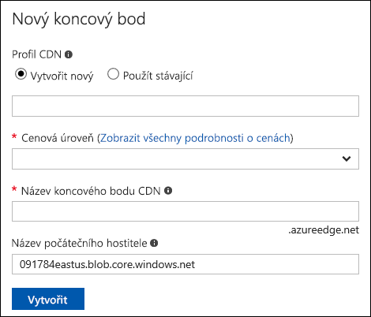
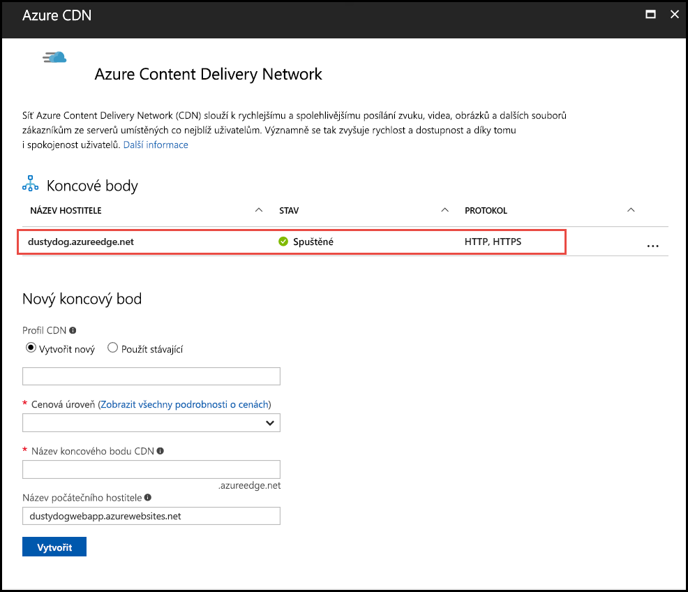
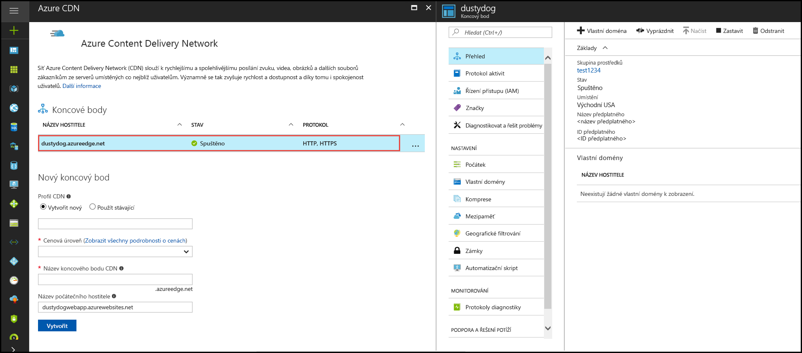

# Rychlý start: Integrace účtu služby Azure Storage s Azure CDN
V tomto rychlém startu povolíte službě [Azure Content Delivery Network (CDN)](cdn-overview.md), aby obsah ze služby Azure Storage ukládala do mezipaměti. Azure CDN nabízí vývojářům globální řešení pro doručování širokopásmového obsahu. Do mezipaměti může ukládat objekty blob a statický obsah výpočetních instancí ve fyzických uzlech v USA, Evropě, Asii, Austrálii a Jižní Americe.

[!INCLUDE [quickstarts-free-trial-note](../../includes/quickstarts-free-trial-note.md)]

## Přihlášení k portálu Azure Portal
Přihlaste se k webu [Azure Portal](https://portal.azure.com) pomocí svého účtu Azure.

## vytvořit účet úložiště
Následující postup použijte k vytvoření nového účtu úložiště pro předplatné Azure. Účet úložiště poskytuje přístup ke službám Azure Storage. Účet úložiště představuje nejvyšší úroveň oboru názvů pro přístup k jednotlivým součástem služby Azure Storage: Azure Blob Storage, Azure Queue Storage a Azure Table Storage. Další informace najdete v tématu [Seznámení se službou Microsoft Azure Storage](../storage/common/storage-introduction.md).

Pokud chcete vytvořit účet úložiště, musíte být buď správcem služby, nebo spolusprávcem přidruženého předplatného.

K vytvoření účtu úložiště můžete použít několik metod, včetně webu Azure Portal a PowerShellu. Tento rychlý úvod ukazuje, jak použít web Azure Portal.   

**Vytvoření účtu úložiště pro předplatné Azure**

1. V levém horním rohu portálu Azure Portal vyberte **Vytvořit prostředek**. 

    Otevře se podokno **Nový**.

2. Vyberte **Úložiště** a pak vyberte **Účet úložiště – objekt blob, soubor, tabulka, fronta**.
    
    

    Zobrazí se podokno **Vytvořit účet úložiště**.   

    

3. Do pole **Název** zadejte název subdomény. Tato položka může obsahovat 3 až 24 malých písmen a číslic.
   
    Tato hodnota se stane názvem hostitele v rámci identifikátoru URI, který se používá k adresování prostředků objektů blob, dotazů nebo tabulek daného předplatného. Pokud chcete adresovat prostředek kontejneru v úložišti Blob Storage, použijte identifikátor URI v následujícím formátu:
   
    http://*&lt;popisek_účtu_úložiště&gt;*.blob.core.windows.net/*&lt;kontejner&gt;*

    kde *&lt;popisek_účtu_úložiště&gt;* odkazuje na hodnotu, kterou jste zadali do pole **Název**.
   
    > [!IMPORTANT]    
    > Popisek adresy URL tvoří subdoménu identifikátoru URI účtu úložiště a musí být mezi všemi hostovanými službami v Azure jedinečný.
   
    Tato hodnota se také používá jako název účtu úložiště na portálu nebo při přístupu k tomuto účtu prostřednictvím kódu programu.
    
4. Pro zbývající nastavení použijte hodnoty uvedené v následující tabulce:

    | Nastavení  | Hodnota |
    | -------- | ----- |
    | **Model nasazení** | Použijte výchozí hodnotu. |
    | **Druh účtu** | Použijte výchozí hodnotu. |
    | **Umístění**    | V rozevíracím seznamu vyberte **Střed USA**. |
    | **Replikace** | Použijte výchozí hodnotu. |
    | **Výkon** | Použijte výchozí hodnotu. |
    | **Vyžádání bezpečného přenosu** | Použijte výchozí hodnotu. |
    | **Předplatné** | V rozevíracím seznamu vyberte předplatné Azure. |
    | **Skupina prostředků** | Vyberte **Vytvořit nový** a jako název skupiny prostředků zadejte *my-resource-group-123*. Tento název musí být globálně jedinečný. Pokud už se používá, můžete zadat jiný název nebo můžete vybrat **Použít existující** a v rozevíracím seznamu zvolit **my-resource-group-123**.  Další informace o skupinách prostředků najdete v tématu s [přehledem Azure Resource Manageru](../azure-resource-manager/resource-group-overview.md#resource-groups).| 
    | **Konfigurace virtuálních sítí** | Použijte výchozí hodnotu. |  
    
5. Vyberte **Připnout na řídicí panel** a uložte účet úložiště na řídicí panel.
    
6. Vyberte **Vytvořit**. Dokončení vytvoření účtu úložiště může trvat několik minut.

## Povolení Azure CDN pro účet úložiště

Azure CDN můžete pro účet úložiště povolit přímo z vašeho účtu úložiště. Pokud chcete pro koncový bod CDN specifikovat pokročilá nastavení konfigurace, jako je například [optimalizaci stahování velkých souborů](cdn-optimization-overview.md#large-file-download), můžete místo toho použít [rozšíření Azure CDN](cdn-create-new-endpoint.md) a vytvořit profil CDN a koncový bod.

1. Na řídicím panelu vyberte účet úložiště a pak v levém podokně vyberte **Azure CDN**. Pokud tlačítko **Azure CDN** není okamžitě vidět, můžete do **vyhledávacího** pole v levém podokně zadat CDN a vyhledat ho.
    
    Zobrazí se stránka **Azure CDN**.

    
    
2. Nový koncový bod vytvořte zadáním požadovaných informací uvedených v následující tabulce:

    | Nastavení  | Hodnota |
    | -------- | ----- |
    | **Profil CDN** | Vyberte **Vytvořit nový** a jako název profilu zadejte *my-cdn-profile-123*. Tento název musí být globálně jedinečný. Pokud se už používá, můžete zadat jiný název.  |
    | **Cenová úroveň** | V rozevíracím seznamu vyberte **Verizon úrovně Standard**. |
    | **Název koncového bodu CDN** | Jako název hostitele koncového bodu zadejte *my-endpoint-123*. Tento název musí být globálně jedinečný. Pokud se už používá, můžete zadat jiný název. Tento název se používá pro přístup k prostředkům v mezipaměti v doméně _&lt;název_koncového_bodu&gt;_.azureedge.net. Nový koncový bod CDN používá ve výchozím nastavení název hostitele vašeho účtu úložiště jako server původu.|

3. Vyberte **Vytvořit**. Koncový bod se po vytvoření zobrazí v seznamu koncových bodů.

    

## Povolení dalších funkcí CDN
Na stránce **Azure CDN** účtu úložiště vyberte v seznamu koncový bod CDN a otevřete stránku konfigurace koncového bodu CDN. Na této stránce můžete povolit další funkce CDN pro doručení, jako je například [komprese](cdn-improve-performance.md), [ukládání řetězců dotazů do mezipaměti](cdn-query-string.md) a [geografické filtrování](cdn-restrict-access-by-country.md). 
    

## Povolení SAS
Pokud chcete udělit omezený přístup k privátním kontejnerům úložiště, můžete použít funkci sdíleného přístupového podpisu (SAS) účtu Azure Storage. SAS je identifikátor URI, který uděluje omezená přístupová práva k vašim prostředkům Azure Storage bez odhalení vašeho klíče účtu. Další informace najdete v článku věnovaném [použití Azure CDN s SAS](cdn-sas-storage-support.md).

## Přístup k obsahu CDN
Pokud chcete získat přístup k obsahu v mezipaměti ve službě CDN, použijte adresu URL CDN uvedenou na portálu. Adresa objektu blob uloženého v mezipaměti má následující formát:

http://<*název_koncového_bodu*\>.azureedge.net/<*veřejný_kontejner*\>/<*název_objektu_blob*\>

> [!NOTE]
> Jakmile Azure CDN povolíte přístup k účtu úložiště, budou všechny veřejně dostupné objekty vhodné pro ukládání CDN POP do mezipaměti. Pokud upravíte objekt, který je momentálně uložený v mezipaměti v CDN, nebude nový obsah dostupný přes Azure CDN, dokud Azure CDN po uplynutí období TTL (time-to-live) pro obsah v mezipaměti neaktualizuje svůj obsah.

## Odebrání obsahu z Azure CDN
Pokud už nechcete objekt v Azure CDN ukládat do mezipaměti, můžete použít některý z následujících kroků:

* Nastavte kontejner jako privátní, nikoli veřejný. Další informace najdete v tématu [Správa anonymního přístupu pro čtení ke kontejnerům a objektům blob](../storage/blobs/storage-manage-access-to-resources.md).
* Zakažte nebo odstraňte koncový bod CDN pomocí webu Azure Portal.
* Upravte hostovanou službu tak, aby už nereagovala na žádosti tohoto objektu.

Objekt, který už je v mezipaměti v Azure CDN uložený, tam zůstane uložený, dokud neuplyne období TTL (Time-To-Live) objektu nebo dokud se koncový bod [nevyprázdní](cdn-purge-endpoint.md). Když uplyne období TTL, Azure CDN určí, jestli je koncový bod stále platný a jestli je objekt stále anonymně přístupný. Pokud tomu tak není, objekt se už v mezipaměti ukládat nebude.

## Vyčištění prostředků
V předchozích krocích jste ve skupině prostředků vytvořili profil a koncový bod CDN. Pokud chcete přejít k části [Další kroky](#next-steps) a zjistit, jak do koncového bodu přidat vlastní doménu, uložte tyto prostředky. Pokud však předpokládáte, že už tyto prostředky nebudete používat, můžete je odstranit tak, že odstraníte skupinu prostředků, abyste se vyhnuli dalším poplatkům:

1. Na webu Azure Portal v nabídce vlevo vyberte **Skupiny prostředků** a pak vyberte **my-resource-group-123**.

2. Na stránce **Skupina prostředků** vyberte **Odstranit skupinu prostředků**, do textového pole zadejte *my-resource-group-123* a pak vyberte **Odstranit**.

    Tato akce odstraní skupinu prostředků, profil a koncový bod, které jste vytvořili v rámci tohoto rychlého startu.

3. Pokud chcete účet úložiště odstranit, vyberte ho na řídicím panelu a pak v horní nabídce vyberte **Odstranit**.

## Další kroky
Pokud chcete zjistit, jak do koncového bodu CDN přidat vlastní doménu a povolit HTTPS, projděte si tento kurz:

> [!div class="nextstepaction"]
> [Kurz: Přístup k objektům blob úložiště pomocí vlastní domény Azure CDN prostřednictvím protokolu HTTPS](cdn-storage-custom-domain-https.md)

