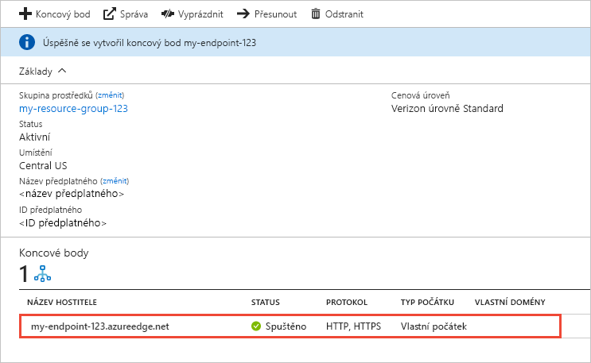

# Vytvoření koncového bodu Azure CDN
Tento článek popisuje všechna nastavení pro vytvoření [Azure Content Delivery Network (CDN)](cdn-overview.md) koncový bod v existující profil CDN. Po vytvoření profilu a koncového bodu, můžete začít doručovat obsah svým zákazníkům. Rychlý start k vytvoření profilu a koncového bodu, najdete v části [rychlý start: vytvoření koncového bodu a profilu Azure CDN](cdn-create-new-endpoint.md).

## Požadavky
Než budete moct vytvořit koncový bod CDN, musíte mít vytvořený alespoň jeden profil CDN, což může obsahovat jeden nebo více koncových bodů CDN. K uspořádání koncových bodů CDN podle internetové domény, webové aplikace nebo jiných kritérií můžete použít několik profilů. Protože ceny CDN se uplatní na úrovni profilu CDN, musíte vytvořit víc profilů CDN, pokud chcete použít kombinaci cenových úrovní Azure CDN. Vytvoření profilu CDN, najdete v tématu [vytvoření nového profilu CDN](cdn-create-new-endpoint.md#create-a-new-cdn-profile).

## Přihlášení k portálu Azure Portal
Přihlaste se k webu [Azure Portal](https://portal.azure.com) pomocí svého účtu Azure.

## Vytvoření nového koncového bodu CDN

1. Na webu [Azure Portal](https://portal.azure.com) přejděte na svůj profil CDN. Je možné, že jste si ho v předchozím kroku připnuli k řídicímu panelu. Pokud ne, najdete ho tak, že vyberete **Všechny služby** a potom vyberete **Profily CDN**. V podokně **Profily CDN** vyberte profil, ke kterému plánujete přidat koncový bod. 
   
    Otevře se podokno Profil CDN.

2. Vyberte **Koncový bod**.
   
    
   
    Zobrazí se stránka **Přidání koncového bodu**.
   
    

3. Do pole **Název** zadejte jedinečný název pro nový koncový bod CDN. Tento název se používá pro přístup k prostředkům v mezipaměti v doméně _<endpointname>_. azureedge.net.

4. Pro **typ počátku**, zvolte jednu z následujících typů původu: 
   - **Úložiště** pro Azure Storage
   - **Cloudová služba** pro Azure Cloud Services
   - **Webová aplikace** pro Azure Web Apps
   - **Vlastní počátek** pro všechny další původu veřejně přístupný webový server (hostovaného v Azure nebo jinde)

5. Pro **název počátečního hostitele**, vyberte nebo zadejte zdrojovou doménu serveru. Rozevírací seznam obsahuje všechny servery dostupné zdroje typu, který jste zadali v kroku 4. Pokud jste vybrali **vlastní původ** jako typ zdroje, zadejte doménu vlastního zdroje serveru.
    
6. Pro **cesta k počátku**, zadejte cestu k prostředkům, které chcete uložit do mezipaměti. Pokud chcete povolit ukládání do mezipaměti libovolný prostředek v doméně, kterou jste zadali v kroku 5, nechte toto nastavení prázdné.
    
7. Do pole **Hlavička počátečního hostitele** zadejte hlavičku hostitele, kterou má Azure CDN odeslat spolu s každou žádostí, nebo ponechte výchozí nastavení.
   
   > [!NOTE]
   > Některé typy původu (například Azure Storage a Web Apps) vyžadují, aby se hlavička hostitele shodovala s doménou původu. Pokud nemáte původ, který vyžaduje hlavičku hostitele odlišnou od své domény, je vhodné ponechat výchozí hodnotu.
   > 
    
8. Pro **protokol** a **port původu**, určete protokoly a porty, které používáte pro přístup k prostředkům v původu server. Je nutné vybrat alespoň jeden protokol (HTTP nebo HTTPS). Použít doménu poskytnutou systémem CDN (_<endpointname>_. azureedge.net) pro přístup k obsahu HTTPS. 
   
   > [!NOTE]
   > **Port původu** hodnota určuje jenom port použitý koncovým bodem k načtení informací ze zdrojového serveru. Koncový bod jako takový je dostupný jenom koncovým klientům na výchozích portech HTTP a HTTPS (80 a 443), a to bez ohledu na nastavení **Počáteční port**.  
   > 
   > Koncové body v profilech **Azure CDN od Akamai** pro počáteční porty neumožňují použití plného rozsahu portů. Seznam nepovolených portů původu najdete v tématu [Povolené porty původu Azure CDN společnosti Akamai](https://msdn.microsoft.com/library/mt757337.aspx).  
   > 
   > Podpora protokolu HTTPS pro vlastní domény Azure CDN nepodporuje **Azure CDN od Akamai** produktů. Další informace najdete v tématu [Konfigurace HTTPS pro vlastní doménu Azure CDN](cdn-custom-ssl.md).
    
9. Pro **optimalizovaná pro**, vyberte typ optimalizace, která nejlépe odpovídá scénář a typ obsahu, který chcete, aby se koncový bod pro doručování. Další informace najdete v tématu [optimalizovat Azure CDN pro doručování obsahu typu](cdn-optimization-overview.md).

    Podporovány jsou následující nastavení typ optimalizace podle typu profilu:
    - **Azure CDN Standard od společnosti Microsoft** profily:
       - [**Obecné doručování webu**](cdn-optimization-overview.md#general-web-delivery)

    - **Azure CDN Standard od Verizonu** a **Azure CDN Premium od Verizonu** profily:
       - [**Obecné doručování webu**](cdn-optimization-overview.md#general-web-delivery)
       - [**Akcelerace dynamického webu**](cdn-optimization-overview.md#dynamic-site-acceleration)

    - **Azure CDN Standard od Akamai** profily:
       - [**Obecné doručování webu**](cdn-optimization-overview.md#general-web-delivery)
       - [**Streamování obecných médií**](cdn-optimization-overview.md#general-media-streaming)
       - [**Streamování videa na vyžádání média**](cdn-optimization-overview.md#video-on-demand-media-streaming)
       - [**Stahování velkých souborů**](cdn-optimization-overview.md#large-file-download)
       - [**Akcelerace dynamického webu**](cdn-optimization-overview.md#dynamic-site-acceleration)

10. Pokud chcete vytvořit nový koncový bod, vyberte **Přidat**.
   
    Koncový bod se po vytvoření zobrazí v seznamu koncových bodů daného profilu.
    
    
    
    Vzhledem k tomu, že rozšíření registrace nějakou dobu trvá, koncový bod není okamžitě dostupný pro použití: 
    - Šíření profilů **Azure CDN Standard od Microsoftu** trvá většinou 10 minut. 
    - V případě profilů **Azure CDN Standard od Akamai** je šíření obvykle hotové během jedné minuty. 
    - V případě profilů **Azure CDN od Verizonu** a **Azure CDN Premium od Verizonu** je šíření obvykle hotové během 90 minut. 
   
    Pokud se pokusíte použít název domény CDN dřív, než se konfigurace koncového bodu rozšíří do serverů point-of-presence (POP), může se zobrazit stav odpovědi HTTP 404. Pokud před několika hodinami, vytvoří koncový bod a stále se zobrazuje stav odpovědi 404, naleznete v tématu [řešení potíží s Azure CDN koncové body, které vrátí stavový kód 404](cdn-troubleshoot-endpoint.md).

## Vyčištění prostředků
Pokud chcete odstranit koncový bod, pokud už je nepotřebujete, vyberte ho a pak vyberte **odstranit**. 

## Další postup
Další informace o vlastních domén, pokračujte ke kurzu pro přidání vlastní domény do koncového bodu CDN.

> [!div class="nextstepaction"]
> [Přidání vlastní domény](cdn-map-content-to-custom-domain.md)

