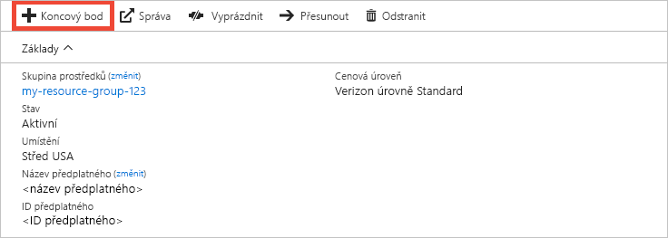
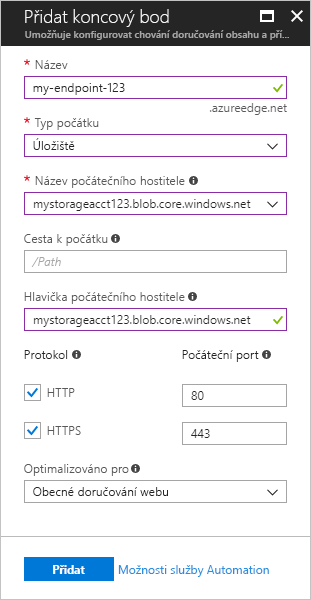

# Rychlý start: Vytvoření profilu a koncového bodu Azure CDN

V tomto rychlém startu povolíte službu Azure Content Delivery Network (CDN) vytvořením nového profilu CDN, který je kolekcí jednoho nebo více koncových bodů CDN. Po vytvoření profilu a koncového bodu můžete začít doručovat obsah svým zákazníkům.

## Předpoklady

- Účet Azure s aktivním předplatným. [Vytvořte si účet zdarma](https://azure.microsoft.com/free/?ref=microsoft.com&utm_source=microsoft.com&utm_medium=docs&utm_campaign=visualstudio).
- Účet Azure Storage s názvem *cdnstorageacct123*, který použijete pro zdroj hostitele. Pokud chcete tento požadavek dokončit, přečtěte si téma [integrace účtu Azure Storage s Azure CDN](cdn-create-a-storage-account-with-cdn.md).

## Přihlášení k webu Azure Portal

Přihlaste se k webu [Azure Portal](https://portal.azure.com) pomocí svého účtu Azure.

[!INCLUDE [cdn-create-profile](../../includes/cdn-create-profile.md)]

## Vytvoření nového koncového bodu CDN

Po vytvoření profilu CDN ho použijete k vytvoření koncového bodu.

1. Na svém řídicím panelu na webu Azure Portal vyberte profil CDN, který jste vytvořili. Pokud ho nemůžete najít, můžete buď otevřít skupinu prostředků, ve které jste ji vytvořili, nebo použít panel hledání v horní části portálu, zadat název profilu a vybrat profil z výsledků.
   
1. Na stránce profil CDN vyberte **+ koncový bod**.
   
    
   
    Otevře se podokno **Přidat koncový bod**.

3. Zadejte následující hodnoty nastavení:

    | Nastavení | Hodnota |
    | ------- | ----- |
    | **Název** | Jako název hostitele koncového bodu zadejte *CDN-Endpoint-123* . Tento název musí být globálně jedinečný v rámci Azure. Pokud se už používá, zadejte jiný název. Tento název se používá pro přístup k prostředkům v mezipaměti v doméně _&lt; koncového bodu &gt; -Name_. azureedge.NET.|
    | **Typ zdroje** | Vyberte **úložiště**. | 
    | **Název počátečního hostitele** | V rozevíracím seznamu vyberte název hostitele účtu Azure Storage, který používáte, například *cdnstorageacct123.blob.Core.Windows.NET*. |
    | **Cesta ke zdroji** | Ponechte prázdné. |
    | **Hlavička počátečního hostitele** | Ponechte výchozí hodnotu (což je název hostitele pro účet úložiště). |  
    | **Protokol** | Ponechte vybrané výchozí možnosti **HTTP** a **HTTPS**. |
    | **Počáteční port** | Ponechte výchozí hodnoty portu. | 
    | **Optimalizováno pro** | Ponechte výchozí výběr **Obecné doručování webu**. |

    

3. Pokud chcete vytvořit nový koncový bod, vyberte **Přidat**. Koncový bod se po vytvoření zobrazí v seznamu koncových bodů daného profilu.
    
   
    
   Čas potřebný ke rozšiřování koncového bodu závisí na cenové úrovni vybrané při vytváření profilu. **Standardní Akamai** se obvykle dokončuje během jedné minuty, **standardu Microsoft** během 10 minut a **Standard Verizon** a **Premium Verizon** během až 30 minut.

## Vyčištění prostředků

V předchozích krocích jste ve skupině prostředků vytvořili profil a koncový bod CDN. Pokud chcete přejít k části [Další kroky](#next-steps) a zjistit, jak do koncového bodu přidat vlastní doménu, uložte tyto prostředky. Pokud však předpokládáte, že už tyto prostředky nebudete používat, můžete je odstranit tak, že odstraníte skupinu prostředků, abyste se vyhnuli dalším poplatkům:

1. V nabídce na levé straně Azure Portal vyberte **skupiny prostředků** a pak vyberte **CDNQuickstart-RG**.

2. Na stránce **Skupina prostředků** vyberte **Odstranit skupinu prostředků**, do textového pole zadejte *CDNQuickstart-RG* a pak vyberte **Odstranit**. Tato akce odstraní skupinu prostředků, profil a koncový bod, který jste vytvořili v rámci tohoto rychlého startu.

## Další kroky

> [!div class="nextstepaction"]
> [Kurz: použití CDN k poskytování statického obsahu z webové aplikace](cdn-add-to-web-app.md)
