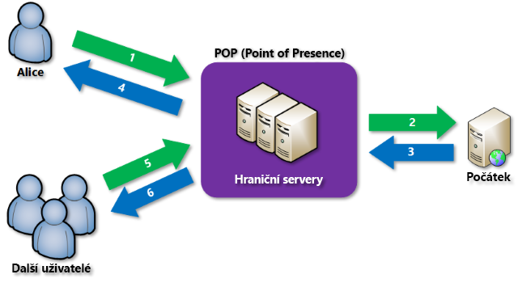

# Co je síť pro doručování obsahu v Azure?
Síť pro doručování obsahu (CDN) je distribuovaná síť serverů umožňující efektivní doručování webového obsahu uživatelům. Sítě CDN za účelem minimalizace latence uchovávají obsah uložený v mezipaměti na hraničních serverech, které jsou v lokalitách POP (Point of Presence) blízko koncovým uživatelům. 

Azure Content Delivery Network (CDN) nabízí vývojářům globální řešení pro rychlé doručování širokopásmového obsahu uživatelům díky ukládání obsahu do mezipaměti na fyzických uzlech strategicky umístěných po celém světě. Azure CDN může zrychlit také dynamický obsah, který není možné ukládat do mezipaměti, díky využití různých optimalizací sítě pomocí lokalit POP v síti CDN. Například pomocí optimalizace tras může obejít protokol BGP (Border Gateway Protocol).

Mezi výhody používání Azure CDN k doručování webových prostředků patří:

* Lepší výkon a zdokonalené uživatelské prostředí pro koncové uživatele, zejména při používání aplikací, ve kterých se k načtení obsahu vyžaduje vícenásobný přenos.
* Velké škálování pro lepší zvládání náhlého vysokého zatížení, například při uvádění produktu na trh.
* Distribuce uživatelských požadavků a poskytování obsahu přímo z hraničních serverů pro zajištění nižšího provozu ke zdrojovému serveru.

Aktuální seznam umístění uzlů CDN najdete v tématu [Lokality POP v Azure CDN](cdn-pop-locations.md).

## Jak to funguje

1. Uživatel (Alice) požaduje soubor (také označovaný jako prostředek) pomocí adresy URL se speciálním názvem domény, například _&lt;název_koncového_bodu&gt;_.azureedge.net. Tímto názvem může být název hostitele koncového bodu nebo vlastní doména. DNS přesměruje požadavek do nejvýkonnější lokality POP, což je obvykle lokalita POP, která je geograficky nejblíže uživateli.
    
2. Pokud žádné hraniční servery v lokalitě POP nemají soubor v mezipaměti, lokalita POP si soubor vyžádá ze zdrojového serveru. Zdrojovým serverem může být webová aplikace Azure, cloudová služba Azure, účet Azure Storage nebo jakýkoli veřejně přístupný webový server.
   
3. Zdrojový server vrátí soubor do hraničního serveru v lokalitě POP.
    
4. Hraniční server v lokalitě POP soubor uloží do mezipaměti a vrátí ho původnímu žadateli (Alici). Soubor zůstane uložený v mezipaměti na hraničním serveru v lokalitě POP, dokud nevyprší hodnota TTL (Time to Live) zadaná v jeho hlavičkách HTTP. Pokud zdrojový server nezadal hodnotu TTL, je výchozí hodnota TTL sedm dnů.
    
5. Další uživatelé pak můžou stejný soubor požadovat pomocí stejné adresy URL, kterou použila Alice, a můžou se také přesměrovat do stejné lokality POP.
    
6. Pokud hodnota TTL souboru nevypršela, vrátí hraniční server POP soubor přímo z mezipaměti. Tento proces má za následek rychlejší a rychleji reagující uživatelské prostředí.

## Požadavky
Pokud chcete využívat Azure CDN, musíte vlastnit alespoň jedno předplatné Azure. Musíte také vytvořit alespoň jeden profil CDN, což je kolekce koncových bodů CDN. Každý koncový bod CDN představuje konkrétní konfiguraci chování při doručování a přístupu k obsahu. K uspořádání koncových bodů CDN podle internetové domény, webové aplikace nebo jiných kritérií můžete použít několik profilů. Vzhledem k tomu, že se [ceny Azure CDN](https://azure.microsoft.com/pricing/details/cdn/) vztahují na úroveň profilu CDN, musíte v případě, že chcete využít kombinaci cenových úrovní, vytvořit několik profilů CDN.

### Omezení
Každé předplatné Azure má výchozí omezení pro následující prostředky:
 - Počet profilů CDN, které je možné vytvořit.
 - Počet koncových bodů, které je možné vytvořit v profilu CDN. 
 - Počet vlastních domén, které je možné namapovat na koncový bod.

Další informace o omezeních předplatného CDN najdete v tématu věnovaném [omezením CDN](https://docs.microsoft.com/azure/azure-subscription-service-limits#cdn-limits).
    
## Funkce Azure CDN
Azure CDN nabízí následující klíčové funkce:

- [Akcelerace dynamického webu](cdn-dynamic-site-acceleration.md)
- [Pravidla ukládání do mezipaměti CDN](cdn-caching-rules.md)
- [Podpora vlastní domény HTTPS](cdn-custom-ssl.md)
- [Protokoly diagnostiky Azure](cdn-azure-diagnostic-logs.md)
- [Komprese](cdn-improve-performance.md)
- [Geografická filtrování](cdn-restrict-access-by-country.md)

Úplný seznam funkcí, které jednotlivé produkty Azure CDN podporují, najdete v tématu [Funkce produktu Azure CDN](cdn-features.md).

## Další kroky
- Pokud chcete začít se sítí CDN, přečtěte si téma [Vytvoření profilu a koncového bodu Azure CDN](cdn-create-new-endpoint.md).
- Koncové body CDN můžete spravovat prostřednictvím webu [Microsoft Azure Portal](https://portal.azure.com) nebo pomocí [PowerShellu](cdn-manage-powershell.md).
- Přečtěte si informace o automatizaci Azure CDN s [.NET](cdn-app-dev-net.md) nebo [Node.js](cdn-app-dev-node.md).
- Pokud chcete vidět Azure CDN v akci, podívejte se na [videa k Azure CDN](https://azure.microsoft.com/resources/videos/index/?services=cdn&sort=newest).

