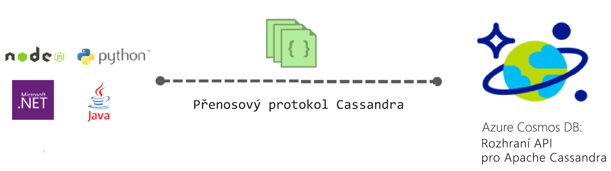
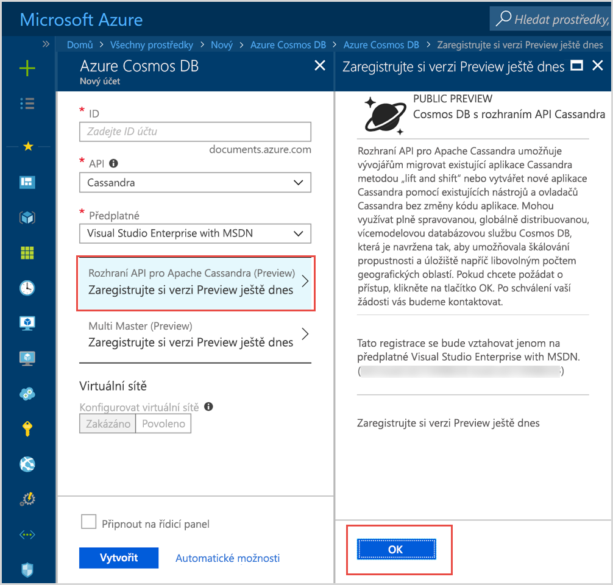

# Úvod do Azure Cosmos DB: rozhraní API pro Apache Cassandra

Azure Cosmos DB poskytuje rozhraní API Cassandra (preview) pro aplikace napsané pro Apache Cassandra, které vyžadují prémiové funkce, jako například:

* [Velikost škálovatelného úložiště a propustnost](partition-data.md)
* [Globální distribuce na klíč](distribute-data-globally.md)
* Latence v řádu milisekund na 99. percentilu.
* [Pět jasně definovaných voleb konzistence](consistency-levels.md)
* [Automatické indexování dat](http://www.vldb.org/pvldb/vol8/p1668-shukla.pdf) bez nutnosti zapojení správy schémat a indexů 
* Garantovaná vysoká dostupnost, vše je podloženo [špičkovými smlouvami SLA](https://azure.microsoft.com/support/legal/sla/cosmos-db/)

## Co je rozhraní API pro Apache Cassandra v Azure Cosmos DB?

Azure Cosmos DB je možné použít jako úložiště dat pro aplikace napsané pro [Apache Cassandra](https://cassandra.apache.org/) s použitím rozhraní API pro Apache Cassandra. To znamená, že s použitím stávajících [ovladačů licencovaných pro Apache, které jsou kompatibilní s CQLv4](https://cassandra.apache.org/doc/latest/getting_started/drivers.html?highlight=driver), teď může vaše aplikace napsaná pro databázi Cassandra komunikovat s rozhraním API Cassandra v Azure Cosmos DB. V mnoha případech se dá přepínat mezi použitím Apache Cassandra a použitím rozhraní API Cassandra v Azure Cosmos DB jednoduše změnou připojovacího řetězce. Pomocí této funkce je možné jednoduše vytvářet a spouštět databázové aplikace rozhraní API Cassandra v cloudu Azure cloud s globální distribucí v Azure Cosmos DB a [komplexní špičkovou smlouvou SLA](https://azure.microsoft.com/support/legal/sla/cosmos-db) a současně dál používat známé dovednosti a nástroje pro rozhraní API Cassandra.

Rozhraní API Cassandra umožňuje pracovat s daty uloženými v Azure Cosmos DB pomocí nástrojů založených na jazyku Cassandra Query Language (např. CQLSH) a ovladačů klienta Cassandra, které už znáte. Další informace získáte v tomto videu Microsoft Mechanics s hlavním manažerem pro engineering Kirillem Gavrylyukem.

> [!VIDEO https://www.youtube.com/embed/1Sf4McGN1AQ]
>

## Jaké jsou výhody používání rozhraní rozhraní API pro Apache Cassandra pro Azure Cosmos DB?

**Žádná správa provozu**: Jako skutečně plně spravovaná služba zajišťuje Azure Cosmos DB, že se správci rozhraní API Cassandra nemusí starat o správu a monitorování celé řady nastavení napříč operačním systémem, JVM a soubory yaml a jejich vzájemné fungování. Azure Cosmos DB sleduje propustnost, latenci, úložiště a dostupnost a konfigurovatelná upozornění. 

**Správa výkonu**: Azure Cosmos DB garantuje spolehlivost pro čtení a zápis s nízkou latencí na základě smlouvy SLA na úrovni 99. percentilu. Uživatelé můžou zajistit dobrou úroveň čtení a zápisu podloženou smlouvami SLA, aniž by se museli starat o značnou část provozní režie. Obvykle sem patří plánování komprimace, správa značek odstraněných položek, nastavení Bloomových filtrů a pomalé repliky. S Azure Cosmos DB se nemusíte starat o správu těchto problémů a můžete se soustředit na výsledky aplikací.

**Automatické indexování**: Azure Cosmos DB automaticky indexuje všechny sloupce tabulky v databázi rozhraní API Cassandra. Azure Cosmos DB nevyžaduje vytváření sekundárních indexů pro urychlení dotazů. Nabízí nízkou latenci pro čtení a zápis a současně provádění automatického konzistentního indexování. 

**Možnost využívat stávající kód a nástroje**: Azure Cosmos DB poskytuje kompatibilitu na úrovni přenosového protokolu se stávajícími sadami SDK a nástroji. Tato kompatibilita zajišťuje, že můžete použít stávající základ kódu s rozhraním API Cassandra v Azure Cosmos DB s nepatrnými změnami.

**Propustnost a pružnost úložiště**: Platforma Azure Cosmos poskytuje v oblastech pružnost se zaručenou propustností prostřednictvím jednoduchých operací portálu, PowerShellu nebo rozhraní příkazového řádku. S růstem vaší aplikace je možné Azure Cosmos DB Tables bezproblémově pružně škálovat s předvídatelným výkonem. Azure Cosmos DB podporuje tabulky rozhraní API Cassandra, které je možné škálovat na prakticky neomezené velikosti úložiště. 

**Globální distribuce a dostupnost**: Azure Cosmos DB umožňuje distribuci dat napříč oblastmi Azure, která zajišťuje pro uživatele nízkou latenci při současné dostupnosti. Azure Cosmos DB zajišťuje dostupnost 99,99 % v rámci oblasti a dostupnost čtení 99,999 % napříč oblastmi při nulové režii provozu. Služba Azure Cosmos DB je dostupná ve více než 30 [oblastech Azure](https://azure.microsoft.com/regions/services/). Další informace najdete v části [Globální distribuce dat](distribute-data-globally.md). 

**Výběr možností konzistence:** Pro dosažení optimálního poměru mezi konzistencí a výkonem si můžete u Azure Cosmos DB vybrat z pěti jasně definovaných úrovní konzistence. Úrovně konzistence jsou: silná, omezená neaktuálnost, relace, konzistentní předpona a případné. Tyto podrobné, dobře definované úrovně konzistence umožňují vývojáři zvolit vhodný poměr mezi konzistencí, dostupností a latencí. Další informace najdete v tématu popisujícím [využití úrovní konzistence pro maximalizaci dostupnosti a výkonu](consistency-levels.md). 

**Podniková úroveň**: V Azure Cosmos DB mají uživatelé k dispozici [certifikáty souladu](https://www.microsoft.com/trustcenter), které jim zajišťují bezpečné používání této platformy. Azure Cosmos DB také poskytuje šifrování v klidovém stavu a za provozu, firewall protokolu IP a protokoly auditu pro aktivity roviny řízení.  

## Zaregistrujte se 

Pokud už máte předplatné Azure, můžete se na [portálu Azure Portal](https://aka.ms/cosmosdb-cassandra-signup) zaregistrovat a připojit se k programu rozhraní API Cassandra (preview).  Pokud ještě Azure nepoužíváte, zaregistrujte si [bezplatnou zkušební verzi](https://azure.microsoft.com/free), kde získáte 12 měsíců volného přístupu k Azure Cosmos DB. Pokud chcete požádat o přístup k programu API Cassandra (preview), postupujte podle následujících pokynů.

1. Na [portálu Azure Portal](https://portal.azure.com) klikněte na **Vytvořit prostředek** > **Databáze** > **Azure Cosmos DB**. 

2. Na stránce Nový účet, vyberte v poli rozhraní API **Cassandra**. 

3. V poli **Předplatné** vyberte předplatné Azure, které chcete použít pro tento účet.

4. Klikněte na **Zaregistrujte si verzi Preview ještě dnes**.

    

3. V podokně Zaregistrujte si verzi Preview ještě dnes klikněte na **OK**. 

    Po odeslání žádosti se stav změní na **Čeká na schválení** v podokně Nový účet. 

Když žádost odešlete, počkejte na e-mailové oznámení o jejím schválení. Protože je požadavků hodně, měli byste oznámení obdržet do týdne. K dokončení žádosti není nutné vytvořit lístek podpory. Žádosti budeme vyřizovat v pořadí, v jakém je obdržíme. 

## Jak začít
Po připojení do programu preview, postupujte při vytvoření aplikace pomocí rozhraní API Cassandra podle pokynů v tématech „rychlý start“:

* [Rychlý start: Sestavení webové aplikace Cassandra pomocí Node.js a Azure Cosmos DB](create-cassandra-nodejs.md)
* [Rychlý start: Sestavení webové aplikace Cassandra pomocí Javy a Azure Cosmos DB](create-cassandra-java.md)
* [Rychlý start: Sestavení webové aplikace Cassandra pomocí .NET a Azure Cosmos DB](create-cassandra-dotnet.md)
* [Rychlý start: Sestavení webové aplikace Cassandra pomocí Pythonu a Azure Cosmos DB](create-cassandra-python.md)

## Další kroky

Informace o rozhraní API Cassandra v Azure Cosmos DB jsou integrované do souhrnné dokumentace k Azure Cosmos DB, ale tady je několik připomínek, které vám pomůžou začít:

* Při vytvoření účtu a nové aplikace pomocí ukázky Git postupujte podle pokynů v tématech [Rychlý start](create-cassandra-nodejs.md).
* Při vytvoření nové aplikace prostřednictvím kódu programu postupujte podle pokynů v [kurzu](tutorial-develop-cassandra-java.md).
* Při importu stávajících dat do Azure Cosmos DB postupujte podle [kurzu pro import dat Cassandra](cassandra-import-data.md).
* Projděte si [nejčastější dotazy](faq.md#cassandra).
